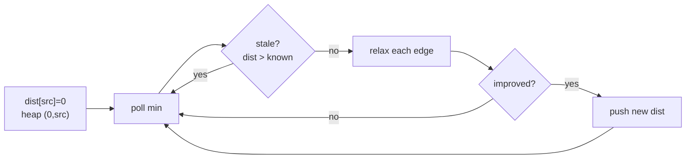

# Shortest Path

> Part of [[README|20 DSA Patterns]] • `Coding Patterns/05_Trees_Graphs` • Pattern #14

## Intent
Find minimum cost/distance in a weighted graph — Dijkstra for non-negative weights (greedy + min-heap), Bellman-Ford for negative weights (detects negative cycles), BFS for unit weights only.

## Why it Matters
- **Dijkstra:** greedy + min-heap. Stale-entry skip (`if (cur.dist > dist[node]) continue`) is not optional — without it, each node is reprocessed once per heap entry instead of once.
- **Bellman-Ford:** V-1 relaxation passes over all edges. Detects negative cycles (if pass V still relaxes). Used for "k stops" problems (constrained hops).
- **BFS:** only when every edge weight = 1 (or uniform).
- Senior signal: knowing the stale-entry skip in Dijkstra, and that Bellman-Ford's V-1 passes correspond to path length (at most V-1 edges in a simple path).

## Diagram



## Problems

### 743. Network Delay Time (Medium)
> [LeetCode 743](https://leetcode.com/problems/network-delay-time/) • Tags: Depth-First Search, Breadth-First Search, Graph Theory, Heap (Priority Queue), Shortest Path, Dijkstra's Algorithm

**Problem Statement:**

You are given a network of n nodes, labeled from 1 to n. You are also given times, a list of travel times as directed edges times[i] = (ui, vi, wi), where ui is the source node, vi is the target node, and wi is the time it takes for a signal to travel from source to target. We will send a signal from a given node k. Return the minimum time it takes for all the n nodes to receive the signal. If it is impossible for all the n nodes to receive the signal, return -1. Example 1: Input: times = [[2,1,1],[2,3,1],[3,4,1]], n = 4, k = 2 Output: 2 Example 2: Input: times = [[1,2,1]], n = 2, k = 1 Output: 1 Example 3: Input: times = [[1,2,1]], n = 2, k = 2 Output: -1 Constraints: 1 1 times[i].length == 3 1 i, vi ui != vi 0 i All the pairs (ui, vi) are unique. (i.e., no multiple edges.)

**Examples:**

Example 1:
```
[[2,1,1],[2,3,1],[3,4,1]]
```

Example 2:
```
4
```

Example 3:
```
2
```

Example 4:
```
[[1,2,1]]
```

Example 5:
```
2
```

Example 6:
```
1
```

Example 7:
```
[[1,2,1]]
```

Example 8:
```
2
```

Example 9:
```
2
```
---

### 787. Cheapest Flights Within K Stops (Medium)
> [LeetCode 787](https://leetcode.com/problems/cheapest-flights-within-k-stops/) • Tags: Dynamic Programming, Depth-First Search, Breadth-First Search, Graph Theory, Heap (Priority Queue), Shortest Path

**Problem Statement:**

There are n cities connected by some number of flights. You are given an array flights where flights[i] = [fromi, toi, pricei] indicates that there is a flight from city fromi to city toi with cost pricei. You are also given three integers src, dst, and k, return the cheapest price from src to dst with at most k stops. If there is no such route, return -1. Example 1: Input: n = 4, flights = [[0,1,100],[1,2,100],[2,0,100],[1,3,600],[2,3,200]], src = 0, dst = 3, k = 1 Output: 700 Explanation: The graph is shown above. The optimal path with at most 1 stop from city 0 to 3 is marked in red and has cost 100 + 600 = 700. Note that the path through cities [0,1,2,3] is cheaper but is invalid because it uses 2 stops. Example 2: Input: n = 3, flights = [[0,1,100],[1,2,100],[0,2,500]], src = 0, dst = 2, k = 1 Output: 200 Explanation: The graph is shown above. The optimal path with at most 1 stop from city 0 to 2 is marked in red and has cost 100 + 100 = 200. Example 3: Input: n = 3, flights = [[0,1,100],[1,2,100],[0,2,500]], src = 0, dst = 2, k = 0 Output: 500 Explanation: The graph is shown above. The optimal path with no stops from city 0 to 2 is marked in red and has cost 500. Constraints: 2 0 flights[i].length == 3 0 i, toi fromi != toi 1 i 4 There will not be any multiple flights between two cities. 0 src != dst

**Examples:**

Example 1:
```
4
```

Example 2:
```
[[0,1,100],[1,2,100],[2,0,100],[1,3,600],[2,3,200]]
```

Example 3:
```
0
```

Example 4:
```
3
```

Example 5:
```
1
```

Example 6:
```
3
```

Example 7:
```
[[0,1,100],[1,2,100],[0,2,500]]
```

Example 8:
```
0
```

Example 9:
```
2
```

Example 10:
```
1
```

Example 11:
```
3
```

Example 12:
```
[[0,1,100],[1,2,100],[0,2,500]]
```

Example 13:
```
0
```

Example 14:
```
2
```

Example 15:
```
0
```
---

### 1514. Path with Maximum Probability (Medium)
> [LeetCode 1514](https://leetcode.com/problems/path-with-maximum-probability/) • Tags: Array, Graph Theory, Heap (Priority Queue), Shortest Path, Dijkstra's Algorithm

**Problem Statement:**

You are given an undirected weighted graph of n nodes (0-indexed), represented by an edge list where edges[i] = [a, b] is an undirected edge connecting the nodes a and b with a probability of success of traversing that edge succProb[i]. Given two nodes start and end, find the path with the maximum probability of success to go from start to end and return its success probability. If there is no path from start to end, return 0. Your answer will be accepted if it differs from the correct answer by at most 1e-5. Example 1: Input: n = 3, edges = [[0,1],[1,2],[0,2]], succProb = [0.5,0.5,0.2], start = 0, end = 2 Output: 0.25000 Explanation: There are two paths from start to end, one having a probability of success = 0.2 and the other has 0.5 * 0.5 = 0.25. Example 2: Input: n = 3, edges = [[0,1],[1,2],[0,2]], succProb = [0.5,0.5,0.3], start = 0, end = 2 Output: 0.30000 Example 3: Input: n = 3, edges = [[0,1]], succProb = [0.5], start = 0, end = 2 Output: 0.00000 Explanation: There is no path between 0 and 2. Constraints: 2 0 start != end 0 a != b 0 0 There is at most one edge between every two nodes.

**Examples:**

Example 1:
```
3
```

Example 2:
```
[[0,1],[1,2],[0,2]]
```

Example 3:
```
[0.5,0.5,0.2]
```

Example 4:
```
0
```

Example 5:
```
2
```

Example 6:
```
3
```

Example 7:
```
[[0,1],[1,2],[0,2]]
```

Example 8:
```
[0.5,0.5,0.3]
```

Example 9:
```
0
```

Example 10:
```
2
```

Example 11:
```
3
```

Example 12:
```
[[0,1]]
```

Example 13:
```
[0.5]
```

Example 14:
```
0
```

Example 15:
```
2
```
---


## Code / Example
```java
record Edge(int to, int w) {}
record State(int dist, int node) {}

// Dijkstra — LC 743 Network Delay Time
int[] dijkstra(int n, java.util.List<java.util.List<Edge>> g, int src) {
    var dist = new int[n];
    java.util.Arrays.fill(dist, Integer.MAX_VALUE);
    dist[src] = 0;
    var pq = new java.util.PriorityQueue<State>((a, b) -> a.dist() - b.dist());
    pq.offer(new State(0, src));
    while (!pq.isEmpty()) {
        var cur = pq.poll();
        if (cur.dist() > dist[cur.node()]) continue; // stale-entry skip
        for (var e : g.get(cur.node())) {
            int nd = cur.dist() + e.w();
            if (nd < dist[e.to()]) {
                dist[e.to()] = nd;
                pq.offer(new State(nd, e.to()));
            }
        }
    }
    return dist;
}

// Cheapest Flights Within K Stops — LC 787 (Bellman-Ford style)
int findCheapestPrice(int n, int[][] flights, int src, int dst, int k) {
    var dist = new int[n];
    java.util.Arrays.fill(dist, Integer.MAX_VALUE);
    dist[src] = 0;
    // k stops = k+1 edges = k+1 relaxation rounds
    for (int i = 0; i <= k; i++) {
        var tmp = dist.clone();
        for (int[] f : flights) {
            int u = f[0], v = f[1], w = f[2];
            if (dist[u] == Integer.MAX_VALUE) continue;
            tmp[v] = Math.min(tmp[v], dist[u] + w);
        }
        dist = tmp;
    }
    return dist[dst] == Integer.MAX_VALUE ? -1 : dist[dst];
}

// Find City With Smallest Number of Neighbors at Threshold — LC 1334
// Run Dijkstra from each city, or Floyd-Warshall O(V^3) for dense small V
int findTheCity(int n, int[][] edges, int distanceThreshold) {
    int[][] dist = new int[n][n];
    for (int i = 0; i < n; i++) {
        java.util.Arrays.fill(dist[i], Integer.MAX_VALUE);
        dist[i][i] = 0;
    }
    for (int[] e : edges) {
        dist[e[0]][e[1]] = e[2];
        dist[e[1]][e[0]] = e[2];
    }
    // Floyd-Warshall
    for (int k = 0; k < n; k++)
        for (int i = 0; i < n; i++)
            for (int j = 0; j < n; j++)
                if (dist[i][k] != Integer.MAX_VALUE && dist[k][j] != Integer.MAX_VALUE)
                    dist[i][j] = Math.min(dist[i][j], dist[i][k] + dist[k][j]);
    int best = n, ans = -1;
    for (int i = 0; i < n; i++) {
        int cnt = 0;
        for (int j = 0; j < n; j++) if (i != j && dist[i][j] <= distanceThreshold) cnt++;
        if (cnt <= best) { best = cnt; ans = i; }
    }
    return ans;
}
```

## When to Use / When NOT
- **Use:** minimum cost, network delay, cheapest flight with k stops, any "weighted shortest" phrasing; "minimum distance", "shortest path" with weights.
- **NOT:** unweighted graph (use BFS); negative weights with Dijkstra (use Bellman-Ford); all-pairs on dense small graph (use Floyd-Warshall).

## Trade-offs
| Algorithm | Time | When |
|-----------|------|------|
| Dijkstra + heap | O((V+E) log V) | weights ≥ 0 |
| Bellman-Ford | O(V·E) | negative weights, detect cycle, k-hop limit |
| BFS | O(V+E) | unweighted only |
| Floyd-Warshall | O(V³) | all-pairs, dense small V (V ≤ 400) |

## Vs Table
| Aspect | Dijkstra | Bellman-Ford | Floyd-Warshall | BFS |
|--------|----------|--------------|----------------|-----|
| Weights | non-negative | any, detects negative cycles | any | unit only |
| Solves | single source | single source | all pairs | single source, unweighted |
| Time | O((V+E) log V) | O(V·E) | O(V³) | O(V+E) |
| Pick when | standard weighted shortest | negative weights or k-hop limit | dense graph, every pair | no weights at all |

## Pitfalls
- **Dijkstra breaks with negative weights.** Switch to Bellman-Ford.
- **0-index vs 1-index** graph building is a common off-by-one.
- **Stale-entry skip** in Dijkstra is mandatory — without it, time degrades to O(E log E) with many duplicate heap entries.
- For "k stops", the edge count matters, not just cost — Bellman-Ford style relaxation per stop (k+1 rounds) is used, not Dijkstra.
- Use `long` for distances if weights are large (sum can overflow `int`).

## Interview Q&A (Senior Depth)

**Q: Why is the stale-entry skip in Dijkstra not just an optimization but a correctness requirement for time complexity?**
**A:** Without the skip, every time we find a shorter path to a node, we push a new entry to the heap. The old entry remains and will be popped later. A node can be pushed O(E) times (once per incoming edge), leading to O(E log E) heap operations instead of O((V+E) log V). The skip ensures each node is *processed* (relaxes edges) at most once.

**Q: Cheapest Flights Within K Stops (LC 787) — why Bellman-Ford and not Dijkstra?**
**A:** Dijkstra minimizes total cost but doesn't constrain the number of edges (stops). A path with lower cost might use more than k+1 edges. Bellman-Ford's round-based relaxation naturally enforces the hop limit: round i computes shortest paths with at most i edges. After k+1 rounds, we have shortest paths with ≤ k+1 edges (k stops).

**Q: When would you use Floyd-Warshall over running Dijkstra from each node?**
**A:** Floyd-Warshall O(V³) vs Dijkstra V times = O(V·E log V). For dense graphs (E ≈ V²), Floyd-Warshall is O(V³) vs O(V³ log V) — Floyd wins. For sparse graphs (E ≈ V), V×Dijkstra is O(V² log V) vs O(V³) — Dijkstra wins. Also Floyd-Warshall is simpler code and handles negative weights (no negative cycles).

**Q: Dijkstra with Fibonacci heap gives O(E + V log V) — why don't we use it?**
**A:** Fibonacci heap has large constant factors and complex implementation. Binary heap O((V+E) log V) is faster in practice for typical interview constraints (V ≤ 10^4). In interviews, binary heap is expected and accepted.

**Q: How does A* differ from Dijkstra?**
**A:** A* = Dijkstra + heuristic `h(n)` estimating distance to target. Priority = `g(n) + h(n)` (cost so far + estimated remaining). If `h` is admissible (never overestimates), A* finds optimal path faster by directing search toward target. Dijkstra is A* with `h(n) = 0`.


## Flashcards (Spaced Repetition)

#flashcard
**Q:** What is the trigger keyword for Shortest Path? :: **A:** weighted graph, Dijkstra, Bellman-Ford, Floyd-Warshall, A*, negative weights #flashcard

#flashcard
**Q:** Time/space complexity of Shortest Path? :: **A:** Dijkstra: O((V+E)log V), Bellman-Ford: O(VE), Floyd: O(V³) #flashcard

#flashcard
**Q:** When do you NOT use Shortest Path? :: **A:** unweighted (use BFS O(V+E)), all-pairs small V (Floyd), negative cycles (Bellman-Ford detect) #flashcard

#flashcard
**Q:** Core Java 25 snippet for Shortest Path? :: **A:** `PriorityQueue<int[]> pq=new PriorityQueue<>(Comparator.comparingInt(a->a[1])); pq.offer(new int[]{src,0}); while(!pq.isEmpty())...` #flashcard


## Practice Tasks (Tasks Plugin)
- [ ] Restate the intent from memory 📅 {date:YYYY-MM-DD, +1}
- [ ] Code the snippet without looking 📅 {date:YYYY-MM-DD, +3}
- [ ] Answer all Interview Q&A aloud 📅 {date:YYYY-MM-DD, +7}
- [ ] Review flashcards (Spaced Repetition) 📅 {date:YYYY-MM-DD, +1}

```tasks
not done
path includes {file.folder}
sort by due
limit 10
```

## Related
- [[05_Trees_Graphs/03 - BFS|BFS]] (unweighted shortest)
- [[05_Trees_Graphs/06 - Union Find|Union Find]] (connectivity, not distances)
- [[Java/07_DSA/Graph]] · [[Java/07_DSA/Heap]]
---
*Category: Coding Patterns/05_Trees_Graphs*
