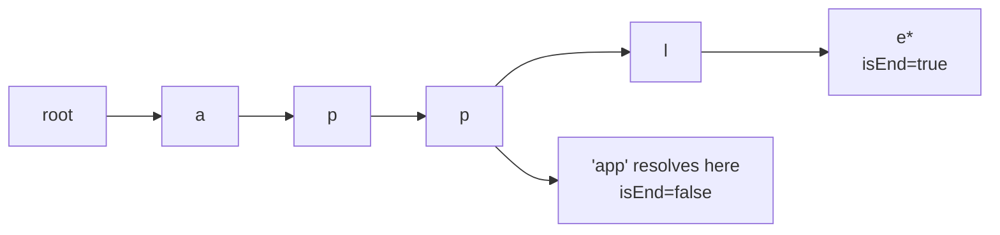

# Trie

> Part of [[README|20 DSA Patterns]] • `Coding Patterns/05_Trees_Graphs` • Pattern #18

## Intent
Prefix tree where each node represents a character and root-to-node path = prefix. Enables O(L) insert/search/prefix queries with shared prefixes — the standard for autocomplete, spell-check, and dictionary problems.

## Why it Matters
- **Structure:** `children[26]` (a-z) + `isEndOfWord`. Node is not a word; `isEnd` marks word termination.
- **Shared prefixes** = space savings vs hashmap of full words.
- **`startsWith` and `search` share one walk** — differ only in final `isEnd` check.
- **Word Search II (LC 212):** DFS on grid + Trie pruning — traverse grid, follow Trie; if prefix not in Trie, prune entire subtree. Massive speedup over hashmap.
- Senior signal: knowing when to use array vs map for children (a-z → array; Unicode/large alphabet → map), and the Trie+DFS combo for board search.

## Diagram



## Problems

### 208. Implement Trie (Prefix Tree) (Medium)
> [LeetCode 208](https://leetcode.com/problems/implement-trie-prefix-tree/) • Tags: Hash Table, String, Design, Trie

**Problem Statement:**

A trie (pronounced as "try") or prefix tree is a tree data structure used to efficiently store and retrieve keys in a dataset of strings. There are various applications of this data structure, such as autocomplete and spellchecker.

Implement the Trie class:

	Trie() Initializes the trie object.
	void insert(String word) Inserts the string word into the trie.
	boolean search(String word) Returns true if the string word is in the trie (i.e., was inserted before), and false otherwise.
	boolean startsWith(String prefix) Returns true if there is a previously inserted string word that has the prefix prefix, and false otherwise.

**Examples:**

Example 1:

Input
["Trie", "insert", "search", "search", "startsWith", "insert", "search"]
[[], ["apple"], ["apple"], ["app"], ["app"], ["app"], ["app"]]
Output
[null, null, true, false, true, null, true]

Explanation
Trie trie = new Trie();
trie.insert("apple");
trie.search("apple");   // return True
trie.search("app");     // return False
trie.startsWith("app"); // return True
trie.insert("app");
trie.search("app");     // return True

---

### 211. Design Add and Search Words Data Structure (Medium)
> [LeetCode 211](https://leetcode.com/problems/design-add-and-search-words-data-structure/) • Tags: String, Depth-First Search, Design, Trie

**Problem Statement:**

Design a data structure that supports adding new words and finding if a string matches any previously added string.

Implement the WordDictionary class:

	WordDictionary() Initializes the object.
	void addWord(word) Adds word to the data structure, it can be matched later.
	bool search(word) Returns true if there is any string in the data structure that matches word or false otherwise. word may contain dots '.' where dots can be matched with any letter.

 
Example:

Input
["WordDictionary","addWord","addWord","addWord","search","search","search","search"]
[[],["bad"],["dad"],["mad"],["pad"],["bad"],[".ad"],["b.."]]
Output
[null,null,null,null,false,true,true,true]

Explanation
WordDictionary wordDictionary = new WordDictionary();
wordDictionary.addWord("bad");
wordDictionary.addWord("dad");
wordDictionary.addWord("mad");
wordDictionary.search("pad"); // return False
wordDictionary.search("bad"); // return True
wordDictionary.search(".ad"); // return True
wordDictionary.search("b.."); // return True

---

### 212. Word Search II (Hard)
> [LeetCode 212](https://leetcode.com/problems/word-search-ii/) • Tags: Array, String, Backtracking, Trie, Matrix

**Problem Statement:**

Given an m x n board of characters and a list of strings words, return all words on the board.

Each word must be constructed from letters of sequentially adjacent cells, where adjacent cells are horizontally or vertically neighboring. The same letter cell may not be used more than once in a word.

**Examples:**

Example 1:

Input: board = [["o","a","a","n"],["e","t","a","e"],["i","h","k","r"],["i","f","l","v"]], words = ["oath","pea","eat","rain"]
Output: ["eat","oath"]

Example 2:

Input: board = [["a","b"],["c","d"]], words = ["abcb"]
Output: []

---


## Code / Example
```java
class TrieNode {
    TrieNode[] children = new TrieNode[26];
    boolean isEnd = false;
}

class Trie {
    private final TrieNode root = new TrieNode();

    void insert(String word) {
        var cur = root;
        for (char c : word.toCharArray()) {
            int i = c - 'a';
            if (cur.children[i] == null) cur.children[i] = new TrieNode();
            cur = cur.children[i];
        }
        cur.isEnd = true;
    }

    boolean search(String word) {
        var node = walk(word);
        return node != null && node.isEnd;
    }

    boolean startsWith(String prefix) {
        return walk(prefix) != null;
    }

    private TrieNode walk(String s) {
        var cur = root;
        for (char c : s.toCharArray()) {
            int i = c - 'a';
            if (cur.children[i] == null) return null;
            cur = cur.children[i];
        }
        return cur;
    }
}

// Word Search II — LC 212 (Trie + DFS pruning)
class Solution {
    TrieNode root = new TrieNode();
    int[][] dirs = {{1,0},{-1,0},{0,1},{0,-1}};
    public java.util.List<String> findWords(char[][] board, String[] words) {
        for (String w : words) insert(w);
        var res = new java.util.ArrayList<String>();
        for (int i = 0; i < board.length; i++)
            for (int j = 0; j < board[0].length; j++)
                dfs(board, i, j, root, res);
        return res;
    }
    void dfs(char[][] b, int r, int c, TrieNode node, java.util.List<String> res) {
        char ch = b[r][c];
        if (ch == '#' || node.children[ch - 'a'] == null) return;
        node = node.children[ch - 'a'];
        if (node.isEnd) { res.add(node.word); node.isEnd = false; } // avoid duplicates
        b[r][c] = '#';
        for (int[] d : dirs) {
            int nr = r + d[0], nc = c + d[1];
            if (nr >= 0 && nr < b.length && nc >= 0 && nc < b[0].length) dfs(b, nr, nc, node, res);
        }
        b[r][c] = ch;
    }
    // Add String word field to TrieNode for LC 212
}
```

## When to Use / When NOT
- **Use:** autocomplete, spell check, word games, `startsWith(prefix)` queries; dictionary with prefix search.
- **NOT:** exact lookup only (HashMap is faster, simpler); static dictionary with no prefix queries (sorted array + binary search).

## Trade-offs
| Operation | Time | Space |
|-----------|------|-------|
| insert, search, startsWith | O(L) per word length | O(total characters) |

## Vs Table
| Aspect | Trie | HashMap of Words | Sorted Array + Binary Search |
|--------|------|------------------|------------------------------|
| Insert | O(L) | O(L) hashing | O(n) shifting |
| Search exact | O(L) | O(L), fast constant | O(log n + L) |
| Prefix search | O(L + k) | not supported | lower bound, then scan |
| Space | O(total chars), shared prefixes | O(total chars), no sharing | O(total chars) |
| Pick when | autocomplete, prefix queries | exact lookup only | static dictionary |

## Pitfalls
- Use `walk` helper to share code between `search` and `startsWith`.
- `search` **must** check `isEnd`; `startsWith` **must not**.
- For non-lowercase or Unicode, use `Map<Character, TrieNode>` instead of size-26 array.
- Word Search II: mark `isEnd = false` after adding to results to avoid duplicates (or use a result set).
- Java 25: can use `record` for immutable nodes if building once, but mutable is standard for dynamic insert.

## Interview Q&A (Senior Depth)

**Q: Why does Trie + DFS prune Word Search II so effectively?**
**A:** Without Trie, DFS from each cell tries all 4^L paths. With Trie, at each step we check `node.children[ch]`. If null, the current prefix doesn't exist in *any* dictionary word — the entire subtree is dead. We prune before exploring 4 directions. For a 4x4 board with 10 words, this reduces explored paths from ~4^10 to ~10 * 4^avg_len.

**Q: Trie vs HashMap for exact string lookup — when does HashMap win?**
**A:** HashMap: O(L) hashing + O(1) average lookup, very fast constant factors. Trie: O(L) char-by-char with pointer chasing. For pure exact lookup (no prefix), HashMap wins on speed and simplicity. Trie wins when you need prefix operations or autocomplete.

**Q: How do you implement a Trie for Unicode or case-insensitive strings?**
**A:** Replace `children[26]` with `Map<Character, TrieNode>`. For case-insensitive, normalize to lowercase on insert/search (`Character.toLowerCase(c)`). Trade-off: map has higher overhead per node but handles arbitrary alphabets. For a-z only, array is faster and cache-friendly.

**Q: Compressed Trie (Radix Tree / Patricia Trie) — what's the difference?**
**A:** Standard Trie has one node per character. Compressed Trie merges linear chains (nodes with single child) into edges labeled with strings. Saves space for long words with unique prefixes (e.g., "application", "apply" → common "appl" then branch). More complex insert/search; used in routing tables (IP prefixes) and databases.

**Q: Add and Search Words (LC 211) — how to handle `.` wildcard?**
**A:** `search(word)` with `.` matching any char. Recursive: at `.`, try all 26 children; at letter, follow that child. Time: O(26^d * L) where d = number of dots. For many dots, this is expensive — but dictionary size is typically small enough.

## Related
- [[05_Trees_Graphs/01 - Binary Tree Traversal|Binary Tree Traversal]] (Trie is a tree)
- [[01_Array/03 - Sliding Window|Sliding Window]] (string problems)
- [[Java/07_DSA/Trees]]

---
*Category: Coding Patterns/05_Trees_Graphs*
