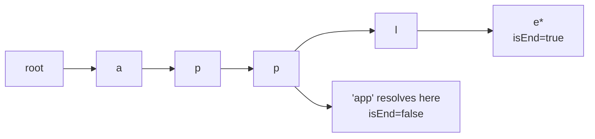

## Why it Matters

Tree where each node is a character and a root-to-node path is a prefix. Nodes hold `children[26]` (or a map) and `isEndOfWord`. Example: insert `apple` creates path `a→p→p→l→e` with end at `e`. Searching `app` walks `a→p→p` and checks if children exist; `startsWith("app")` returns true even if `isEnd` is false.

## Diagram


A node is not a word, `isEnd` is. `startsWith` and `search` share one walk and differ only in that final flag check.

## Code

```java
class TrieNode {
 TrieNode[] children = new TrieNode[26];
 boolean isEnd = false;
}

class Trie {
 private final TrieNode root = new TrieNode();

 void insert(String word) {
 var cur = root;
 for (var c : word.toCharArray()) {
 int i = c - 'a';
 if (cur.children[i] == null) cur.children[i] = new TrieNode();
 cur = cur.children[i];
 }
 cur.isEnd = true;
 }

 boolean search(String word) {
 var node = walk(word);
 return node != null && node.isEnd;
 }

 boolean startsWith(String prefix) {
 return walk(prefix) != null;
 }

 private TrieNode walk(String s) {
 var cur = root;
 for (var c : s.toCharArray()) {
 int i = c - 'a';
 if (cur.children[i] == null) return null;
 cur = cur.children[i];
 }
 return cur;
 }
}
```
Java 25 note: you can replace the array with `Map<Character,TrieNode>` with `SequencedMap` if order matters, or use `record` for immutable nodes. For interviews the array version is expected for `a-z`.

## When to use / not

- Autocomplete, spell check, word games, anything asking `startsWith(prefix)`
- Keywords: "prefix", "autocomplete", "dictionary", "search with prefix"

## Trade-offs

| operation | time | space |
|---|---|---|
| insert, search, startsWith | O(L) per word length | O(total characters) |

## Vs

| | Trie | HashMap of words | Sorted array + binary search |
|---|---|---|---|
| insert | O(L) | O(L) hashing | O(n) shifting |
| search exact | O(L) | O(L), fast constant | O(log n + L) |
| prefix search | O(L + k) | not supported | lower bound, then scan |
| space | O(total chars), shared prefixes | O(total chars), no sharing | O(total chars) |
| pick when | autocomplete, prefix queries | exact lookup only | static dictionary |

## Pitfalls

- Use `walk` helper to share code between `search` and `startsWith`.
- `search` must check `isEnd`; `startsWith` must not.
- For non-lowercase or Unicode, use a map instead of size 26.

## Interview q&a

- [208. Implement Trie](https://leetcode.com/problems/implement-trie-prefix-tree/)
- [211. Design Add and Search Words Data Structure](https://leetcode.com/problems/design-add-and-search-words-data-structure/)
- [212. Word Search II](https://leetcode.com/problems/word-search-ii/)

## Related

- [[Java/07_DSA/Trees]]

# Trie

> Part of [[README|20 DSA Patterns]], Pattern #18
