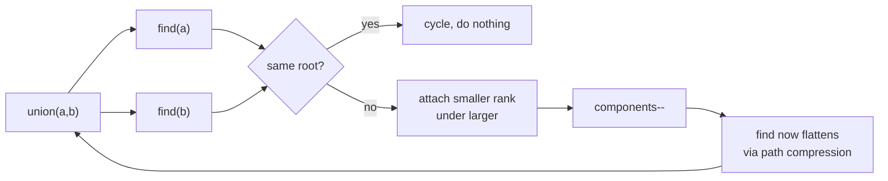

# Union Find

> Part of [[README|20 DSA Patterns]] • `Coding Patterns/05_Trees_Graphs` • Pattern #16 (beyond original 20)

## Intent
Dynamic connectivity for undirected graphs — are `a` and `b` in the same component? Two optimizations (path compression + union by rank/size) make operations ~O(α(n)) ≈ O(1). The course-named pattern the 20-pattern list omits.

## Why it Matters
- **Path compression:** `find(x)` flattens the tree by pointing each visited node directly at the root.
- **Union by rank/size:** attaches smaller tree under larger root, keeping depth logarithmic.
- **Both together** are required — either alone leaves a path that can degrade toward O(n) per find.
- **Components counter:** maintain `components` variable, decrement on successful union. O(1) component count.
- Senior signal: implementing the *pair* together, and knowing that without both, worst case is a linked-list tree with O(n) find.

## Diagram



## Problems

### 200. Number of Islands (Medium)
> [LeetCode 200](https://leetcode.com/problems/number-of-islands/) • Tags: Array, Depth-First Search, Breadth-First Search, Union-Find, Matrix

**Problem Statement:**

Given an m x n 2D binary grid grid which represents a map of '1's (land) and '0's (water), return the number of islands. An island is surrounded by water and is formed by connecting adjacent lands horizontally or vertically. You may assume all four edges of the grid are all surrounded by water. Example 1: Input: grid = [ ["1","1","1","1","0"], ["1","1","0","1","0"], ["1","1","0","0","0"], ["0","0","0","0","0"] ] Output: 1 Example 2: Input: grid = [ ["1","1","0","0","0"], ["1","1","0","0","0"], ["0","0","1","0","0"], ["0","0","0","1","1"] ] Output: 3 Constraints: m == grid.length n == grid[i].length 1 grid[i][j] is '0' or '1'.

**Examples:**

Example 1:
```
[["1","1","1","1","0"],["1","1","0","1","0"],["1","1","0","0","0"],["0","0","0","0","0"]]
```

Example 2:
```
[["1","1","0","0","0"],["1","1","0","0","0"],["0","0","1","0","0"],["0","0","0","1","1"]]
```
---

### 684. Redundant Connection (Medium)
> [LeetCode 684](https://leetcode.com/problems/redundant-connection/) • Tags: Depth-First Search, Breadth-First Search, Union-Find, Graph Theory

**Problem Statement:**

In this problem, a tree is an undirected graph that is connected and has no cycles. You are given a graph that started as a tree with n nodes labeled from 1 to n, with one additional edge added. The added edge has two different vertices chosen from 1 to n, and was not an edge that already existed. The graph is represented as an array edges of length n where edges[i] = [ai, bi] indicates that there is an edge between nodes ai and bi in the graph. Return an edge that can be removed so that the resulting graph is a tree of n nodes. If there are multiple answers, return the answer that occurs last in the input. Example 1: Input: edges = [[1,2],[1,3],[2,3]] Output: [2,3] Example 2: Input: edges = [[1,2],[2,3],[3,4],[1,4],[1,5]] Output: [1,4] Constraints: n == edges.length 3 edges[i].length == 2 1 i i ai != bi There are no repeated edges. The given graph is connected.

**Examples:**

Example 1:
```
[[1,2],[1,3],[2,3]]
```

Example 2:
```
[[1,2],[2,3],[3,4],[1,4],[1,5]]
```
---

### 959. Regions Cut By Slashes (Medium)
> [LeetCode 959](https://leetcode.com/problems/regions-cut-by-slashes/) • Tags: Array, Hash Table, Depth-First Search, Breadth-First Search, Union-Find, Matrix, Planar Graph

**Problem Statement:**

An n x n grid is composed of 1 x 1 squares where each 1 x 1 square consists of a '/', '\', or blank space ' '. These characters divide the square into contiguous regions. Given the grid grid represented as a string array, return the number of regions. Note that backslash characters are escaped, so a '\' is represented as '\\'. Example 1: Input: grid = [" /","/ "] Output: 2 Example 2: Input: grid = [" /"," "] Output: 1 Example 3: Input: grid = ["/\\","\\/"] Output: 5 Explanation: Recall that because \ characters are escaped, "\\/" refers to \/, and "/\\" refers to /\. Constraints: n == grid.length == grid[i].length 1 grid[i][j] is either '/', '\', or ' '.

**Examples:**

Example 1:
```
[" /","/ "]
```

Example 2:
```
[" /","  "]
```

Example 3:
```
["/\\","\\/"]
```
---


## Code / Example
```java
class DSU {
    int[] parent, rank;
    int components;
    
    DSU(int n) {
        parent = new int[n];
        rank = new int[n];
        components = n;
        for (int i = 0; i < n; i++) parent[i] = i;
    }
    
    // Path compression: point straight at the root
    int find(int x) {
        if (parent[x] != x) parent[x] = find(parent[x]);
        return parent[x];
    }
    
    // Union by rank; returns false = already connected (cycle!)
    boolean union(int a, int b) {
        int ra = find(a), rb = find(b);
        if (ra == rb) return false;
        if (rank[ra] < rank[rb]) parent[ra] = rb;
        else if (rank[ra] > rank[rb]) parent[rb] = ra;
        else { parent[rb] = ra; rank[ra]++; }
        components--;
        return true;
    }
}

// LC 684 Redundant Connection: first edge whose union() returns false is the answer
int[] findRedundantConnection(int[][] edges) {
    var dsu = new DSU(edges.length + 1);
    for (int[] e : edges) if (!dsu.union(e[0], e[1])) return e;
    return new int[0];
}

// LC 547 Number of Provinces: DSU on adjacency matrix
int findCircleNum(int[][] isConnected) {
    int n = isConnected.length;
    var dsu = new DSU(n);
    for (int i = 0; i < n; i++)
        for (int j = i + 1; j < n; j++)
            if (isConnected[i][j] == 1) dsu.union(i, j);
    return dsu.components;
}

// LC 721 Accounts Merge: DSU on email indices
java.util.List<java.util.List<String>> accountsMerge(java.util.List<java.util.List<String>> accounts) {
    var emailToId = new java.util.HashMap<String, Integer>();
    var emailToName = new java.util.HashMap<String, String>();
    int id = 0;
    for (var acc : accounts) {
        String name = acc.get(0);
        for (int i = 1; i < acc.size(); i++) {
            String email = acc.get(i);
            if (!emailToId.containsKey(email)) emailToId.put(email, id++);
            emailToName.put(email, name);
        }
        for (int i = 2; i < acc.size(); i++) {
            int id1 = emailToId.get(acc.get(1));
            int id2 = emailToId.get(acc.get(i));
            dsu.union(id1, id2);
        }
    }
    var idToEmails = new java.util.HashMap<Integer, java.util.List<String>>();
    for (var e : emailToId.entrySet()) {
        int root = dsu.find(e.getValue());
        idToEmails.computeIfAbsent(root, k -> new java.util.ArrayList<>()).add(e.getKey());
    }
    var res = new java.util.ArrayList<java.util.List<String>>();
    for (var e : idToEmails.entrySet()) {
        var emails = e.getValue();
        java.util.Collections.sort(emails);
        emails.add(0, emailToName.get(emails.get(0)));
        res.add(emails);
    }
    return res;
}
```

## When to Use / When NOT
- **Use:** cycle detection in undirected graphs; connected components; redundant edge; account merging; "provinces", "groups", "merge" keywords.
- **NOT:** directed graphs (use DFS coloring for cycle detection / topo sort); online queries on static graph (DFS/BFS once is simpler).

## Trade-offs
| Operation | Time | Note |
|-----------|------|------|
| find / union | O(α(n)) ≈ O(1) | inverse Ackermann with both optimizations |
| count components | O(1) | maintain counter, decrement on real union |

## Vs Table
| Aspect | Union Find | DFS/BFS for Components | DFS Coloring |
|--------|------------|------------------------|--------------|
| Graph type | undirected | undirected or directed | directed |
| Queries | online, interleaved with edge additions | offline, whole graph known | cycle detection in digraph |
| Time | O(α(n)) per query | O(V+E) per rebuild | O(V+E) |
| Pick when | edges arrive over time, connectivity asked repeatedly | one-shot component count | directed cycle / topo sort |

## Pitfalls
- **Forgetting path compression** turns it into a slow tree walk on long chains — always implement the pair together.
- **1-indexed LeetCode inputs** vs 0-indexed arrays — size `n+1` and ignore index 0.
- **Union Find is undirected-only**; directed cycle detection needs DFS coloring (white/gray/black) instead.
- For "size" instead of "rank", track `size[root]` and attach smaller size under larger — same O(α(n)) guarantee.

## Interview Q&A (Senior Depth)

**Q: Why are path compression AND union by rank both necessary? What happens with only one?**
**A:** Path compression alone: find flattens paths, but union can create deep trees if you always attach larger to smaller. Union by rank alone: tree depth is O(log n), but find doesn't flatten, so repeated finds on deep nodes cost O(log n). Together: find flattens on the way up, union keeps depth minimal → O(α(n)) amortized.

**Q: Redundant Connection (LC 684) — why does the first edge with union() returning false give the answer?**
**A:** The input is a tree (n nodes, n-1 edges) plus one extra edge. The extra edge creates exactly one cycle. Processing edges in order, the first edge whose endpoints are already connected completes the cycle — that's the redundant edge. Any later edge in the cycle would also return false, but we want the *last* in the input that causes the cycle, which is the first one that finds both ends already connected.

**Q: Accounts Merge (LC 721) — why DSU on emails instead of account indices?**
**A:** Accounts can share emails (same email appears in multiple accounts). The DSU connects *emails* that belong to the same person. Each account's emails are unioned together. After all unions, each DSU component = one person's emails. Using account indices would require O(n²) pairwise comparison to find overlaps.

**Q: How does Union Find handle the "Number of Islands II" (LC 305) dynamic addition problem?**
**A:** Start with all water (each cell is its own component, or not counted). For each addLand(r,c): mark as land, components++. Check 4 neighbors; if neighbor is land, union(cell, neighbor) — if union succeeds, components--. After each addition, components = current island count. O(k α(mn)) for k additions.

**Q: Why can't Union Find detect cycles in directed graphs?**
**A:** Union Find merges sets based on undirected connectivity. In a directed graph A→B→C→A, all three are in the same undirected component, but the *directed* cycle isn't detected by union operations. Directed cycle detection needs DFS with three colors (white/unvisited, gray/in-stack, black/done) — a back edge to a gray node = directed cycle.


## Flashcards (Spaced Repetition)

#flashcard
**Q:** What is the trigger keyword for Union Find? :: **A:** connected components, dynamic connectivity, Kruskal MST, bipartite check, cycle detection in undirected graph #flashcard

#flashcard
**Q:** Time/space complexity of Union Find? :: **A:** Time: O(α(N)) amortized per op, Space: O(N) #flashcard

#flashcard
**Q:** When do you NOT use Union Find? :: **A:** directed graph connectivity (not transitive), need path itself (not just connectivity) #flashcard

#flashcard
**Q:** Core Java 25 snippet for Union Find? :: **A:** `int[] p, r; int find(int x){ return p[x]==x?x:(p[x]=find(p[x])); } void union(int a,int b){ a=find(a); b=find(b); if(a!=b){ if(r[a]<r[b]) p[a]=b; else{ p[b]=a; if(r[a]==r[b]) r[a]++; } } }` #flashcard


## Practice Tasks (Tasks Plugin)
- [ ] Restate the intent from memory 📅 {date:YYYY-MM-DD, +1}
- [ ] Code the snippet without looking 📅 {date:YYYY-MM-DD, +3}
- [ ] Answer all Interview Q&A aloud 📅 {date:YYYY-MM-DD, +7}
- [ ] Review flashcards (Spaced Repetition) 📅 {date:YYYY-MM-DD, +1}

```tasks
not done
path includes {file.folder}
sort by due
limit 10
```

## Related
- [[05_Trees_Graphs/02 - DFS|DFS]] (directed cycles)
- [[05_Trees_Graphs/04 - Shortest Path|Shortest Path]] (weighted)
- [[Java/07_DSA/Graph]]
---
*Category: Coding Patterns/05_Trees_Graphs*
