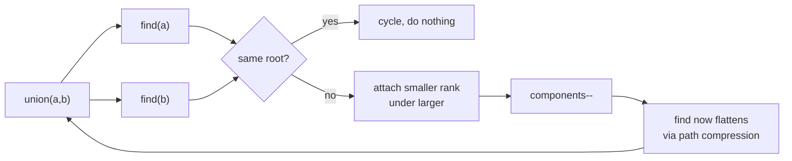

## Why it Matters

Disjoint-set union for dynamic connectivity: are `a` and `b` in the same group? Two optimizations make it ~O(1): path compression (flatten on find) and union by rank/size (small tree under big). Example: edges `[1,2],[2,3]` → `find(1)==find(3)`, components = total − successful unions.

## Diagram


Path compression and union by rank are a pair: either one alone still leaves a path that can degrade toward O(n) per find.

## Code

```java
class DSU {
 int[] parent, rank; int components;
 DSU(int n) {
 parent = new int[n]; rank = new int[n]; components = n;
 for (int i = 0; i < n; i++) parent[i] = i;
 }
 int find(int x) { // path compression: point straight at the root
 if (parent[x] != x) parent[x] = find(parent[x]);
 return parent[x];
 }
 boolean union(int a, int b) { // union by rank; false = already connected (cycle!)
 int ra = find(a), rb = find(b);
 if (ra == rb) return false;
 if (rank[ra] < rank[rb]) parent[ra] = rb;
 else if (rank[ra] > rank[rb]) parent[rb] = ra;
 else { parent[rb] = ra; rank[ra]++; }
 components--;
 return true;
 }
}
// LC 684 Redundant Connection: first edge whose union() returns false is the answer
```
Without both optimizations worst case degrades to O(n) per find (a linked-list tree). Always implement the pair together.

## When to use / not

- Cycle detection in undirected graphs, connected components, redundant edge, account merging
- Keywords: "connected", "groups", "provinces", "redundant connection", "merge accounts"

## Trade-offs

| operation | time | note |
|---|---|---|
| find / union | O(α(n)) ≈ O(1) | inverse Ackermann with both optimizations |
| count components | O(1) | maintain a counter, decrement on real union |

## Vs

| | Union find | DFS/BFS for components | DFS coloring |
|---|---|---|---|
| graph type | undirected | undirected or directed | directed |
| queries | online, interleaved with edge additions | offline, whole graph known | cycle detection in digraph |
| time | O(alpha(n)) per query | O(V+E) per rebuild | O(V+E) |
| pick when | edges arrive over time, connectivity asked repeatedly | one-shot component count | directed cycle / topo sort |

## Pitfalls

- Forgetting path compression turns it into a slow tree walk on long chains.
- 1-indexed LeetCode inputs vs 0-indexed arrays, size `n+1` and ignore index 0.
- Union Find is undirected-only; directed cycle detection needs DFS coloring instead.

## Interview q&a

- [684. Redundant Connection](https://leetcode.com/problems/redundant-connection/)
- [721. Accounts Merge](https://leetcode.com/problems/accounts-merge/)
- [547. Number of Provinces](https://leetcode.com/problems/number-of-provinces/)

## Related

- [[Java/07_DSA/Graph]]
- [[05_Trees_Graphs/02 - DFS|DFS]] (directed cycles) · [[05_Trees_Graphs/04 - Shortest Path|Shortest Path]]

# Union Find

> Part of [[README|20 DSA Patterns]], Pattern #21, beyond the original 20. The one course-named pattern ([AlgoMaster DSA](https://algomaster.io/learn/dsa/)) the 20-pattern list omits.
