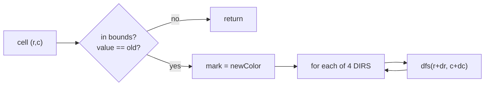

# Matrix Traversal

> Part of [[README|Coding Patterns]] • `Coding Patterns/06_Matrix` • Pattern #17

## Intent
Run DFS or BFS on a 2D grid with 4-directional (or 8-directional) moves — the standard pattern for flood fill, islands, surrounded regions, maze, and nearest cell distance.

## Why it Matters
- **Mark visited on entry** — the grid write (`grid[r][c] = newValue`) serves as both visited set and answer.
- **Bounds check before value check** — `r < 0 || r >= m || c < 0 || c >= n` must precede `grid[r][c] != old` or the array access itself throws.
- **Flood fill (LC 733):** check `old == newColor` first or infinite recursion.
- **Number of Islands (LC 200):** DFS sinks land (`'1' → '0'`) to mark visited in O(1) space.
- **Surrounded Regions (LC 130):** start from border O's, mark connected as safe; flip remaining O's to X.
- Senior signal: BFS for "nearest / min steps" (0-1 BFS for weighted grids), Union Find for offline island counting.

## Diagram



## Problems

### 54. Spiral Matrix (Medium)
> [LeetCode 54](https://leetcode.com/problems/spiral-matrix/) • Tags: Array, Matrix, Simulation

**Problem Statement:**

Given an m x n matrix, return all elements of the matrix in spiral order. Example 1: Input: matrix = [[1,2,3],[4,5,6],[7,8,9]] Output: [1,2,3,6,9,8,7,4,5] Example 2: Input: matrix = [[1,2,3,4],[5,6,7,8],[9,10,11,12]] Output: [1,2,3,4,8,12,11,10,9,5,6,7] Constraints: m == matrix.length n == matrix[i].length 1 -100

**Examples:**

Example 1:
```
[[1,2,3],[4,5,6],[7,8,9]]
```

Example 2:
```
[[1,2,3,4],[5,6,7,8],[9,10,11,12]]
```
---

### 733. Flood Fill (Easy)
> [LeetCode 733](https://leetcode.com/problems/flood-fill/) • Tags: Array, Depth-First Search, Breadth-First Search, Matrix

**Problem Statement:**

You are given an image represented by an m x n grid of integers image, where image[i][j] represents the pixel value of the image. You are also given three integers sr, sc, and color. Your task is to perform a flood fill on the image starting from the pixel image[sr][sc]. To perform a flood fill: Begin with the starting pixel and change its color to color. Perform the same process for each pixel that is directly adjacent (pixels that share a side with the original pixel, either horizontally or vertically) and shares the same color as the starting pixel. Keep repeating this process by checking neighboring pixels of the updated pixels and modifying their color if it matches the original color of the starting pixel. The process stops when there are no more adjacent pixels of the original color to update. Return the modified image after performing the flood fill. Example 1: Input: image = [[1,1,1],[1,1,0],[1,0,1]], sr = 1, sc = 1, color = 2 Output: [[2,2,2],[2,2,0],[2,0,1]] Explanation: From the center of the image with position (sr, sc) = (1, 1) (i.e., the red pixel), all pixels connected by a path of the same color as the starting pixel (i.e., the blue pixels) are colored with the new color. Note the bottom corner is not colored 2, because it is not horizontally or vertically connected to the starting pixel. Example 2: Input: image = [[0,0,0],[0,0,0]], sr = 0, sc = 0, color = 0 Output: [[0,0,0],[0,0,0]] Explanation: The starting pixel is already colored with 0, which is the same as the target color. Therefore, no changes are made to the image. Constraints: m == image.length n == image[i].length 1 0 16 0 0

**Examples:**

Example 1:
```
[[1,1,1],[1,1,0],[1,0,1]]
```

Example 2:
```
1
```

Example 3:
```
1
```

Example 4:
```
2
```

Example 5:
```
[[0,0,0],[0,0,0]]
```

Example 6:
```
0
```

Example 7:
```
0
```

Example 8:
```
0
```
---

### 200. Number of Islands (Medium)
> [LeetCode 200](https://leetcode.com/problems/number-of-islands/) • Tags: Array, Depth-First Search, Breadth-First Search, Union-Find, Matrix

**Problem Statement:**

Given an m x n 2D binary grid grid which represents a map of '1's (land) and '0's (water), return the number of islands. An island is surrounded by water and is formed by connecting adjacent lands horizontally or vertically. You may assume all four edges of the grid are all surrounded by water. Example 1: Input: grid = [ ["1","1","1","1","0"], ["1","1","0","1","0"], ["1","1","0","0","0"], ["0","0","0","0","0"] ] Output: 1 Example 2: Input: grid = [ ["1","1","0","0","0"], ["1","1","0","0","0"], ["0","0","1","0","0"], ["0","0","0","1","1"] ] Output: 3 Constraints: m == grid.length n == grid[i].length 1 grid[i][j] is '0' or '1'.

**Examples:**

Example 1:
```
[["1","1","1","1","0"],["1","1","0","1","0"],["1","1","0","0","0"],["0","0","0","0","0"]]
```

Example 2:
```
[["1","1","0","0","0"],["1","1","0","0","0"],["0","0","1","0","0"],["0","0","0","1","1"]]
```
---


## Code / Example
```java
int[][] DIRS = {{1,0},{-1,0},{0,1},{0,-1}};

// Flood Fill DFS — LC 733
int[][] floodFill(int[][] image, int sr, int sc, int newColor) {
    int old = image[sr][sc];
    if (old == newColor) return image; // critical: avoid infinite loop
    dfs(image, sr, sc, old, newColor);
    return image;
}

void dfs(int[][] img, int r, int c, int old, int nc) {
    if (r < 0 || r >= img.length || c < 0 || c >= img[0].length || img[r][c] != old) return;
    img[r][c] = nc;
    for (var d : DIRS) dfs(img, r + d[0], c + d[1], old, nc);
}

// BFS version — same DIRS, queue of int[2], mark when enqueuing
int[][] floodFillBFS(int[][] image, int sr, int sc, int newColor) {
    int old = image[sr][sc];
    if (old == newColor) return image;
    var q = new java.util.ArrayDeque<int[]>();
    q.offer(new int[]{sr, sc});
    image[sr][sc] = newColor;
    while (!q.isEmpty()) {
        var cur = q.poll();
        for (var d : DIRS) {
            int r = cur[0] + d[0], c = cur[1] + d[1];
            if (r >= 0 && r < image.length && c >= 0 && c < image[0].length && image[r][c] == old) {
                image[r][c] = newColor;
                q.offer(new int[]{r, c});
            }
        }
    }
    return image;
}

// Number of Islands — LC 200 (DFS sinks land)
int numIslands(char[][] grid) {
    if (grid.length == 0) return 0;
    int m = grid.length, n = grid[0].length, count = 0;
    for (int i = 0; i < m; i++)
        for (int j = 0; j < n; j++)
            if (grid[i][j] == '1') { dfsGrid(grid, i, j); count++; }
    return count;
}
void dfsGrid(char[][] g, int r, int c) {
    if (r < 0 || r >= g.length || c < 0 || c >= g[0].length || g[r][c] != '1') return;
    g[r][c] = '0'; // sink = mark visited
    for (var d : DIRS) dfsGrid(g, r + d[0], c + d[1]);
}

// Surrounded Regions — LC 130 (mark border-connected O's safe)
void solve(char[][] board) {
    if (board.length == 0) return;
    int m = board.length, n = board[0].length;
    // mark border O's
    for (int i = 0; i < m; i++) {
        if (board[i][0] == 'O') dfsMark(board, i, 0);
        if (board[i][n-1] == 'O') dfsMark(board, i, n-1);
    }
    for (int j = 0; j < n; j++) {
        if (board[0][j] == 'O') dfsMark(board, 0, j);
        if (board[m-1][j] == 'O') dfsMark(board, m-1, j);
    }
    // flip: O -> X, S -> O
    for (int i = 0; i < m; i++)
        for (int j = 0; j < n; j++) {
            if (board[i][j] == 'O') board[i][j] = 'X';
            else if (board[i][j] == 'S') board[i][j] = 'O';
        }
}
void dfsMark(char[][] b, int r, int c) {
    if (r < 0 || r >= b.length || c < 0 || c >= b[0].length || b[r][c] != 'O') return;
    b[r][c] = 'S'; // safe
    for (var d : DIRS) dfsMark(b, r + d[0], c + d[1]);
}
```

## When to Use / When NOT
- **Use:** flood fill, islands, surrounded regions, maze, distance to nearest cell, rotting oranges (multi-source BFS).
- **NOT:** weighted grids with varying costs (use Dijkstra / 0-1 BFS); need shortest path with weights.

## Trade-offs
| Approach | Time | Space |
|----------|------|-------|
| DFS on grid | O(m·n) | O(m·n) worst case recursion stack |
| BFS on grid | O(m·n) | O(m·n) queue |
| Union Find on grid | O(m·n α(mn)) | O(m·n) arrays |

## Vs Table
| Aspect | DFS on Grid | BFS on Grid | Union Find on Grid |
|--------|-------------|-------------|-------------------|
| Shortest path in cells | No | Yes, unweighted | No |
| Flood fill / component | Yes | Yes | Yes, union of 4-neighbors |
| Space | O(m·n) recursion worst case | O(m·n) queue | O(m·n) arrays |
| Risk | Stack overflow on large grids | Wider memory | Heavier constant factor |
| Pick when | fill, connectivity, shape | "nearest", "min steps" | offline island counting |

## Pitfalls
- **Check `old == newColor` first** or flood fill loops infinitely.
- **Bounds check before value check** to avoid index error.
- **Mark visited at enqueue time for BFS**, not dequeue — otherwise same cell enqueued multiple times.
- For large grids, DFS recursion risks stack overflow — use BFS or iterative stack.
- Java 25: `record Cell(int r, int c) {}` keeps queue typed instead of `int[]`.

## Interview Q&A (Senior Depth)

**Q: Flood Fill — why check `old == newColor` before DFS?**
**A:** If `old == newColor`, the condition `img[r][c] != old` in DFS would never be true after the first cell is colored, but wait — the first cell gets colored, then its neighbors are checked. Since they still have `old` color, they get colored, and so on. Actually, the check prevents infinite recursion because the DFS base case `img[r][c] != old` would fail *after* coloring, but the function would still return. Wait — the real issue: if `old == newColor`, the first call colors the cell, then recurses to neighbors. Neighbors have `old` color, so they get colored, etc. The base case `img[r][c] != old` stops at boundaries. So it *does* terminate but does unnecessary work. The early return is an optimization. Actually, for some implementations that don't mark before recursing, it can infinite loop. Safe pattern: check early and return.

**Q: Number of Islands — why is modifying the grid (`'1' → '0'`) acceptable for visited marking?**
**A:** The problem doesn't require preserving the input grid. It saves O(mn) space for a `visited[][]` array. In production, if the grid must be preserved, use a separate visited structure or copy the grid. The space savings (O(1) extra vs O(mn)) is significant for large grids.

**Q: Surrounded Regions (LC 130) — why start from border O's instead of scanning all O's?**
**A:** An O is "surrounded" iff it's *not* connected to the border. Starting from border O's and marking all reachable O's as "safe" (S) in one pass is O(mn). The alternative — for each interior O, DFS to check if it reaches border — is O(mn) per interior O, potentially O((mn)²). The border-first approach is the key insight.

**Q: 0-1 BFS — when do you use it on a grid?**
**A:** When edge weights are 0 or 1 (e.g., moving on free cell = 0, moving through obstacle = 1). Use deque: push 0-weight edges to front, 1-weight to back. Processes in increasing distance order. Faster than Dijkstra (O(V+E) vs O(E log V)). For general weights, use Dijkstra.


## Flashcards (Spaced Repetition)

#flashcard
**Q:** What is the trigger keyword for Matrix Traversal? :: **A:** spiral order, diagonal traversal, BFS/DFS on grid, flood fill, shortest path in grid, rotation #flashcard

#flashcard
**Q:** Time/space complexity of Matrix Traversal? :: **A:** Time: O(mn) visit each cell, Space: O(mn) visited or O(1) in-place marking #flashcard

#flashcard
**Q:** When do you NOT use Matrix Traversal? :: **A:** only need perimeter (O(m+n)), sparse grid (use coordinate compression) #flashcard

#flashcard
**Q:** Core Java 25 snippet for Matrix Traversal? :: **A:** `int[][] dirs={{0,1},{1,0},{0,-1},{-1,0}}; for(int[] d:dirs){ int nr=r+d[0], nc=c+d[1]; if(inBounds(nr,nc)) process(nr,nc); }` #flashcard


## Practice Tasks (Tasks Plugin)
- [ ] Restate the intent from memory 📅 {date:YYYY-MM-DD, +1}
- [ ] Code the snippet without looking 📅 {date:YYYY-MM-DD, +3}
- [ ] Answer all Interview Q&A aloud 📅 {date:YYYY-MM-DD, +7}
- [ ] Review flashcards (Spaced Repetition) 📅 {date:YYYY-MM-DD, +1}

```tasks
not done
path includes {file.folder}
sort by due
limit 10
```

## Related
- [[05_Trees_Graphs/02 - DFS|DFS]] (recursive grid traversal)
- [[05_Trees_Graphs/03 - BFS|BFS]] (level-order, shortest unweighted)
- [[05_Trees_Graphs/06 - Union Find|Union Find]] (offline connectivity)
- [[Java/07_DSA/Graph]]
---
*Category: Coding Patterns/06_Matrix*
