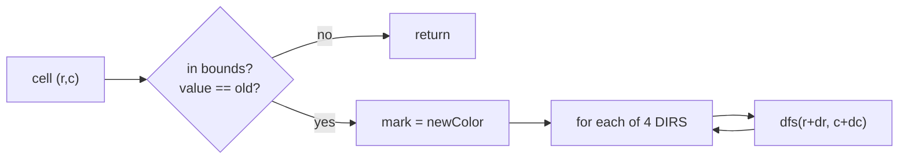

## Why it Matters

Run DFS or BFS on a 2D grid. Move in 4 directions (up, down, left, right) or 8 with diagonals. Mark visited by writing to the grid or a `visited[][]`. Example: flood fill from `(1,1)` in `[[1,1,1],[1,1,0],[1,0,1]]` with new color `2` spreads to all connected `1`s.

## Diagram


Marking on entry is both the visited set and the answer. The bounds check must precede the value check or the grid read itself throws.

## Code

```java
int[][] DIRS = {{1,0},{-1,0},{0,1},{0,-1}};

// Flood fill DFS, LC 733
int[][] floodFill(int[][] image, int sr, int sc, int newColor) {
 int old = image[sr][sc];
 if (old == newColor) return image;
 dfs(image, sr, sc, old, newColor);
 return image;
}

void dfs(int[][] img, int r, int c, int old, int nc) {
 if (r < 0 || r >= img.length || c < 0 || c >= img[0].length || img[r][c] != old) return;
 img[r][c] = nc;
 for (var d : DIRS) dfs(img, r + d[0], c + d[1], old, nc);
}

// BFS version, same DIRS, queue of int[2], mark when enqueuing
```
Record for cell in Java 25: `record Cell(int r,int c){}` keeps queue typed instead of `int[]`.

## When to use / not

- Flood fill, islands, surrounded regions, maze, distance to nearest cell

## Trade-offs

| time | space |
|---|---|
| O(rows * cols) | O(rows * cols) worst case for stack or queue |

## Vs

| | DFS on grid | BFS on grid | Union find on grid |
|---|---|---|---|
| shortest path in cells | no | yes, unweighted | no |
| flood fill / component | yes | yes | yes, union of 4-neighbors |
| space | O(rows*cols) recursion worst case | O(rows*cols) queue | O(rows*cols) arrays |
| risk | stack overflow on large grids | wider memory | heavier constant factor |
| pick when | fill, connectivity, shape questions | "nearest", "min steps" | offline island counting |

## Pitfalls

- Check `old == newColor` first or flood fill loops infinitely.
- Bounds check before value check to avoid index error.
- Mark visited at enqueue time for BFS, not dequeue.

## Interview q&a

- [733. Flood Fill](https://leetcode.com/problems/flood-fill/)
- [200. Number of Islands](https://leetcode.com/problems/number-of-islands/)
- [130. Surrounded Regions](https://leetcode.com/problems/surrounded-regions/)

## Related

- [[Java/07_DSA/Graph]]

# Matrix Traversal

> Part of [[README|20 DSA Patterns]], Pattern #16
