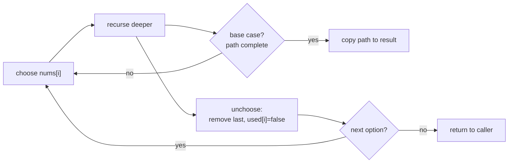

# Backtracking

> Part of [[README|20 DSA Patterns]] • `Coding Patterns/07_Backtracking_DP` • Pattern #17

## Intent
Generate all solutions by choosing, exploring, and unchoosing — the exhaustive enumeration pattern for permutations, combinations, subsets, N-Queens, and constraint satisfaction.

## Why it Matters
- **Choose → Explore → Unchoose** is the invariant. The unchoose line restores state so the next branch starts clean.
- **Pruning:** check validity *before* recursing deeper — reject early, don't build invalid paths.
- **Subsets with duplicates:** sort first, skip `i > start && nums[i] == nums[i-1]` when previous duplicate not used.
- **N-Queens:** place queen, validate row/col/diag, recurse. Bitmask optimization for O(1) validation.
- Senior signal: the copy-on-success pattern (`res.add(new ArrayList<>(path))`) — without it, all results reference the same mutating list.

## Diagram



## Problems

### 46. Permutations (Medium)
> [LeetCode 46](https://leetcode.com/problems/permutations/) • Tags: Array, Backtracking

**Problem Statement:**

Given an array nums of distinct integers, return all the possible permutations. You can return the answer in any order.

**Examples:**

Example 1:
Input: nums = [1,2,3]
Output: [[1,2,3],[1,3,2],[2,1,3],[2,3,1],[3,1,2],[3,2,1]]

Example 2:
Input: nums = [0,1]
Output: [[0,1],[1,0]]

Example 3:
Input: nums = [1]
Output: [[1]]

---

### 78. Subsets (Medium)
> [LeetCode 78](https://leetcode.com/problems/subsets/) • Tags: Array, Backtracking, Bit Manipulation

**Problem Statement:**

Given an integer array nums of unique elements, return all possible subsets (the power set).

The solution set must not contain duplicate subsets. Return the solution in any order.

**Examples:**

Example 1:

Input: nums = [1,2,3]
Output: [[],[1],[2],[1,2],[3],[1,3],[2,3],[1,2,3]]

Example 2:

Input: nums = [0]
Output: [[],[0]]

---

### 51. N-Queens (Hard)
> [LeetCode 51](https://leetcode.com/problems/n-queens/) • Tags: Array, Backtracking, Algorithm X

**Problem Statement:**

The n-queens puzzle is the problem of placing n queens on an n x n chessboard such that no two queens attack each other.

Given an integer n, return all distinct solutions to the n-queens puzzle. You may return the answer in any order.

Each solution contains a distinct board configuration of the n-queens' placement, where 'Q' and '.' both indicate a queen and an empty space, respectively.

**Examples:**

Example 1:

Input: n = 4
Output: [[".Q..","...Q","Q...","..Q."],["..Q.","Q...","...Q",".Q.."]]
Explanation: There exist two distinct solutions to the 4-queens puzzle as shown above

Example 2:

Input: n = 1
Output: [["Q"]]

---


## Code / Example
```java
// Permutations — LC 46
java.util.List<java.util.List<Integer>> permute(int[] nums) {
    var res = new java.util.ArrayList<java.util.List<Integer>>();
    backtrack(nums, new java.util.ArrayList<>(), new boolean[nums.length], res);
    return res;
}

void backtrack(int[] nums, java.util.List<Integer> path, boolean[] used,
               java.util.List<java.util.List<Integer>> res) {
    if (path.size() == nums.length) {
        res.add(new java.util.ArrayList<>(path)); // COPY on success
        return;
    }
    for (int i = 0; i < nums.length; i++) if (!used[i]) {
        used[i] = true; path.add(nums[i]);
        backtrack(nums, path, used, res);
        path.remove(path.size() - 1); used[i] = false; // UNCHOOSE
    }
}

// Subsets — LC 78
java.util.List<java.util.List<Integer>> subsets(int[] nums) {
    var res = new java.util.ArrayList<java.util.List<Integer>>();
    backtrackSubsets(nums, 0, new java.util.ArrayList<>(), res);
    return res;
}
void backtrackSubsets(int[] nums, int start, java.util.List<Integer> path,
                      java.util.List<java.util.List<Integer>> res) {
    res.add(new java.util.ArrayList<>(path)); // add current subset
    for (int i = start; i < nums.length; i++) {
        if (i > start && nums[i] == nums[i-1]) continue; // skip dups
        path.add(nums[i]);
        backtrackSubsets(nums, i + 1, path, res);
        path.remove(path.size() - 1);
    }
}

// N-Queens — LC 51 (bitmask validation)
java.util.List<java.util.List<String>> solveNQueens(int n) {
    var res = new java.util.ArrayList<java.util.List<String>>();
    char[][] board = new char[n][n];
    for (var row : board) java.util.Arrays.fill(row, '.');
    solve(board, 0, res, 0, 0, 0, n);
    return res;
}
void solve(char[][] board, int row, java.util.List<java.util.List<String>> res,
           int cols, int diag1, int diag2, int n) {
    if (row == n) {
        res.add(java.util.Arrays.stream(board).map(String::new).toList());
        return;
    }
    for (int col = 0; col < n; col++) {
        int bit = 1 << col;
        int d1 = 1 << (row + col);
        int d2 = 1 << (row - col + n - 1);
        if ((cols & bit) != 0 || (diag1 & d1) != 0 || (diag2 & d2) != 0) continue;
        board[row][col] = 'Q';
        solve(board, row + 1, res, cols | bit, diag1 | d1, diag2 | d2, n);
        board[row][col] = '.';
    }
}
```

## When to Use / When NOT
- **Use:** generate all solutions — permutations, combinations, subsets, N-Queens, Sudoku, word search, brute force with pruning.
- **NOT:** "how many ways" / "minimum cost" (use DP — memoization deduplicates); single solution (use greedy / constructive).

## Trade-offs
| Problem | Time | Space |
|---------|------|-------|
| Permutations | O(n!) | O(n) recursion + output |
| Subsets | O(2^n) | O(n) recursion + output |
| N-Queens | O(n!) worst, much less with pruning | O(n) |

## Vs Table
| Aspect | Backtracking | DP | Greedy | Bitmask Enumeration |
|--------|--------------|----|--------|---------------------|
| Returns | all solutions | count or optimum | one committed answer | all subsets of small set |
| Overlapping subproblems | irrelevant (each path distinct) | required (memoize) | irrelevant | no |
| Time | O(n!) / O(2^n) | O(n · choices) | O(n log n) | O(2^n) |
| Pick when | "generate all", "list all combinations" | "how many ways", "minimum cost" | provable local-optimal | n ≤ ~20 |

## Pitfalls
- **Copy `path` when adding to result** or you store a reference that keeps mutating.
- **Prune early:** check validity before recursing deeper.
- **Subsets with duplicates:** sort first, skip `i > start && nums[i]==nums[i-1]` when not using previous.
- **Permutations with duplicates:** sort, skip `used[i-1] == false` for duplicate.

## Interview Q&A (Senior Depth)

**Q: Subsets vs Permutations — why does subsets use `start` index but permutations use `used[]` array?**
**A:** Subsets: order doesn't matter, `{1,2}` = `{2,1}`. `start` ensures we only pick elements at or after current position, avoiding permutations of the same subset. Permutations: order matters, `[1,2]` ≠ `[2,1]`. `used[]` tracks which elements are in the current permutation, allowing any unused element at each position.

**Q: N-Queens bitmask validation — explain the three bitmasks.**
**A:** `cols`: bit i = column i occupied. `diag1` (row+col constant): bit (row+col) = \ diagonal occupied. `diag2` (row-col+n-1 constant): bit (row-col+n-1) = / diagonal occupied. All O(1) checks via bitwise AND. No arrays needed.

**Q: Word Search (LC 79) — why mark board cell as '#' instead of visited array?**
**A:** O(1) space vs O(mn) visited array. The board is modified in-place and restored on backtrack (`board[r][c] = ch`). This is the same pattern as Number of Islands sinking land. For production where board must be preserved, use visited array.

**Q: Backtracking vs DP — how do you decide which applies?**
**A:** Backtracking: "return all solutions" — each path is distinct, nothing deduplicates. DP: "how many ways" or "minimum cost" — subproblems overlap, memoization deduplicates. If you can phrase it as `f(i) = g(f(i-1), f(i-2)...)` with overlapping calls, DP. If you need the actual solutions, backtracking.

**Q: How do you handle large output sizes in backtracking (e.g., permutations of n=10 = 3.6M)?**
**A:** Interview constraints typically n ≤ 8 for permutations (40K outputs). For larger n, the problem usually asks for count (DP) or k-th permutation (mathematical). If actual generation is required, streaming/yield (Java: Iterator) avoids holding all in memory.

## Related
- [[07_Backtracking_DP/02 - Dynamic Programming|Dynamic Programming]] (backtracking + memo = DP)
- [[07_Backtracking_DP/03 - Greedy|Greedy]] (local choice vs exhaustive)
- [[05_Trees_Graphs/02 - DFS|DFS]] (backtracking is DFS with state restoration)
- [[Java/07_DSA/Array]]

---
*Category: Coding Patterns/07_Backtracking_DP*
