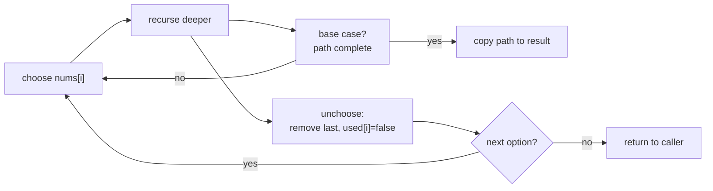

## Why it Matters

Choose, explore, unchoose. Build a path step by step; if it violates constraints, revert and try the next option. Recursion holds the path, backtracking restores state. Example: permutations of `[1,2,3]` → pick `1`, then `2`, then `3` gives `[1,2,3]`, backtrack to try `3` at second position gives `[1,3,2]`, and so on to six results.

## Diagram


The unchoose line is what makes it backtracking rather than brute-force construction: state is restored so the next branch starts clean.

## Code

```java
// Permutations - LC 46
java.util.List<java.util.List<Integer>> permute(int[] nums) {
 var res = new java.util.ArrayList<java.util.List<Integer>>();
 backtrack(nums, new java.util.ArrayList<>(), new boolean[nums.length], res);
 return res;
}

void backtrack(int[] nums, java.util.List<Integer> path, boolean[] used,
 java.util.List<java.util.List<Integer>> res) {
 if (path.size() == nums.length) { res.add(new java.util.ArrayList<>(path)); return; }
 for (var i = 0; i < nums.length; i++) if (!used[i]) {
 used[i] = true; path.add(nums[i]);
 backtrack(nums, path, used, res);
 path.remove(path.size() - 1); used[i] = false; // unchoose
 }
}
```
The last two lines are the backtrack. Leave them out and the path keeps growing wrong.

## When to use / not

- Generate all solutions: permutations, combinations, subsets, N-Queens, Sudoku, word search, brute force with pruning

## Trade-offs

| time | space |
|---|---|
| O(n!) for permutations, O(2^n) for subsets | O(n) recursion depth plus output |

## Vs

| | Backtracking | DP | Greedy | Bitmask enumeration |
|---|---|---|---|---|
| returns | all solutions | count or optimum | one committed answer | all subsets of a small set |
| overlapping subproblems | irrelevant, each path distinct | required | irrelevant | no |
| time | O(n!) / O(2^n) | O(n * choices) | O(n log n) | O(2^n) |
| pick when | "generate all", "list all combinations" | "how many ways", "minimum cost" | provable local-optimal choice | n <= ~20 |

## Pitfalls

- Copy `path` when adding to result or you store a reference that keeps mutating.
- Prune early: check validity before recursing deeper.
- For subsets with duplicates, sort first and skip `i > start && nums[i]==nums[i-1]` when not using previous.

## Interview q&a

- [46. Permutations](https://leetcode.com/problems/permutations/)
- [78. Subsets](https://leetcode.com/problems/subsets/)
- [51. N-Queens](https://leetcode.com/problems/n-queens/)

## Related

- [[Java/07_DSA/Trees]]

# Backtracking

> Part of [[README|20 DSA Patterns]] - Pattern #17
