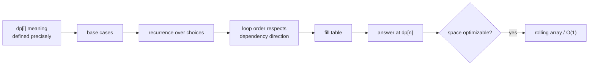

# Dynamic Programming

> Part of [[README|20 DSA Patterns]] • `Coding Patterns/07_Backtracking_DP` • Pattern #20

## Intent
When subproblems repeat and the optimum builds from smaller optima, store results instead of recomputing. Two approaches: top-down recursion + cache (memoization) or bottom-up loop over a table (tabulation).

## Why it Matters
- **Core sub-patterns:** Fibonacci, 0/1 knapsack, unbounded knapsack (coin change), LCS, LIS, subset sum.
- **Tabulation usually wins in interviews:** iterative, no stack overflow, easier to optimize to O(1) space with rolling arrays.
- **Define `dp[i]` meaning before coding** — "dp[i] = max profit up to day i" or "dp[i][j] = LCS of a[0..i) and b[0..j)". Wrong definition sinks the solution.
- **Loop order respects dependency direction:** 0/1 knapsack loops weight backward (w=W..wt[i]) to use previous row; unbounded loops forward (w=wt[i]..W) to reuse current row.
- Senior signal: space optimization from 2D → 1D → O(1) by identifying which previous states are actually needed.

## Diagram



## Problems

### 70. Climbing Stairs (Easy)
> [LeetCode 70](https://leetcode.com/problems/climbing-stairs/) • Tags: Math, Dynamic Programming, Memoization

**Problem Statement:**

You are climbing a staircase. It takes n steps to reach the top.

Each time you can either climb 1 or 2 steps. In how many distinct ways can you climb to the top?

**Examples:**

Example 1:

Input: n = 2
Output: 2
Explanation: There are two ways to climb to the top.
1. 1 step + 1 step
2. 2 steps

Example 2:

Input: n = 3
Output: 3
Explanation: There are three ways to climb to the top.
1. 1 step + 1 step + 1 step
2. 1 step + 2 steps
3. 2 steps + 1 step

---

### 322. Coin Change (Medium)
> [LeetCode 322](https://leetcode.com/problems/coin-change/) • Tags: Array, Dynamic Programming, Breadth-First Search, Knapsack Problem, Complete Knapsack

**Problem Statement:**

You are given an integer array coins representing coins of different denominations and an integer amount representing a total amount of money.

Return the fewest number of coins that you need to make up that amount. If that amount of money cannot be made up by any combination of the coins, return -1.

You may assume that you have an infinite number of each kind of coin.

**Examples:**

Example 1:

Input: coins = [1,2,5], amount = 11
Output: 3
Explanation: 11 = 5 + 5 + 1

Example 2:

Input: coins = [2], amount = 3
Output: -1

Example 3:

Input: coins = [1], amount = 0
Output: 0

---

### 1143. Longest Common Subsequence (Medium)
> [LeetCode 1143](https://leetcode.com/problems/longest-common-subsequence/) • Tags: String, Dynamic Programming, Longest Common Subsequence

**Problem Statement:**

Given two strings text1 and text2, return the length of their longest common subsequence. If there is no common subsequence, return 0.

A subsequence of a string is a new string generated from the original string with some characters (can be none) deleted without changing the relative order of the remaining characters.

	For example, "ace" is a subsequence of "abcde".

A common subsequence of two strings is a subsequence that is common to both strings.

**Examples:**

Example 1:

Input: text1 = "abcde", text2 = "ace" 
Output: 3  
Explanation: The longest common subsequence is "ace" and its length is 3.

Example 2:

Input: text1 = "abc", text2 = "abc"
Output: 3
Explanation: The longest common subsequence is "abc" and its length is 3.

Example 3:

Input: text1 = "abc", text2 = "def"
Output: 0
Explanation: There is no such common subsequence, so the result is 0.

---


## Code / Example
```java
// Climbing Stairs — LC 70 (tabulation)
int climbStairs(int n) {
    if (n <= 2) return n;
    int[] dp = new int[n + 1];
    dp[1] = 1; dp[2] = 2;
    for (int i = 3; i <= n; i++) dp[i] = dp[i-1] + dp[i-2];
    return dp[n];
}

// Coin Change — LC 322 (unbounded knapsack, min coins)
int coinChange(int[] coins, int amount) {
    int[] dp = new int[amount + 1];
    java.util.Arrays.fill(dp, amount + 1); // INF
    dp[0] = 0;
    for (int c : coins)
        for (int i = c; i <= amount; i++)
            dp[i] = Math.min(dp[i], dp[i-c] + 1);
    return dp[amount] > amount ? -1 : dp[amount];
}

// 0/1 Knapsack — space optimized to 1D
int knapsack(int[] wt, int[] val, int W) {
    int[] dp = new int[W + 1];
    for (int i = 0; i < wt.length; i++)
        for (int w = W; w >= wt[i]; w--) // backward for 0/1
            dp[w] = Math.max(dp[w], dp[w - wt[i]] + val[i]);
    return dp[W];
}

// Longest Common Subsequence — LC 1143 (2D, harder to compress)
int lcs(String a, String b) {
    int[][] dp = new int[a.length() + 1][b.length() + 1];
    for (int i = 1; i <= a.length(); i++)
        for (int j = 1; j <= b.length(); j++)
            dp[i][j] = a.charAt(i-1) == b.charAt(j-1)
                ? 1 + dp[i-1][j-1]
                : Math.max(dp[i-1][j], dp[i][j-1]);
    return dp[a.length()][b.length()];
}

// House Robber — LC 198 (rolling O(1) space)
int rob(int[] nums) {
    int prev = 0, curr = 0;
    for (int x : nums) {
        int tmp = Math.max(curr, prev + x);
        prev = curr;
        curr = tmp;
    }
    return curr;
}
```

## When to Use / When NOT
- **Use:** "maximum", "minimum", "ways to", "can you", "longest", "shortest" where choices at each step build the answer. Both overlapping subproblems and optimal substructure present.
- **NOT:** generate all solutions (use backtracking); greedy choice provably optimal (use greedy); no overlapping subproblems.

## Trade-offs
| Approach | Time | Space |
|----------|------|-------|
| Memoization (top-down) | O(n · choices) | O(n) cache + recursion stack |
| Tabulation (bottom-up) | O(n · choices) | O(n), often O(1) with rolling array |

## Vs Table
| Aspect | Memoization (Top-down) | Tabulation (Bottom-up) | Greedy |
|--------|------------------------|------------------------|--------|
| Subproblems hit | only ones reached | all states filled | none |
| Time | O(n · choices) | O(n · choices) | O(n log n) |
| Space | O(n) cache + call stack | O(n), often O(1) rolling | O(1) |
| Stack overflow | risk on deep n | no | no |
| Pick when | recursion is clearest, sparse states | dense states, want speed/space tuning | local optimum provably global |

## Pitfalls
- **Define `dp` meaning before coding:** `dp[i]` is what exactly. Wrong definition sinks the solution.
- **Base case off-by-one** is the most common bug.
- **Coin change outer loop over `coins`** gives combinations; swapped loops give permutations — know which you need.
- **0/1 knapsack weight loop must go backward** (W down to wt[i]) to use previous iteration's values. Forward uses current iteration's values → unbounded knapsack.

## Interview Q&A (Senior Depth)

**Q: 0/1 Knapsack vs Unbounded Knapsack — why does loop direction matter?**
**A:** 0/1: each item used at most once. Backward loop (W..wt[i]) ensures `dp[w - wt[i]]` comes from previous iteration (item not yet considered). Forward loop would use current iteration's updated `dp[w - wt[i]]`, allowing the same item multiple times → unbounded. The loop direction *is* the constraint enforcement.

**Q: Coin Change (LC 322) — why outer loop over coins, inner over amount?**
**A:** This order counts combinations (order of coins doesn't matter). Swapped loops (amount outer, coins inner) counts permutations (order matters). For "minimum coins", both work for the minimum value, but combination order is standard and avoids overcounting states.

**Q: LCS (LC 1143) — why is 2D harder to compress to 1D?**
**A:** `dp[i][j]` depends on `dp[i-1][j-1]`, `dp[i-1][j]`, `dp[i][j-1]`. Compressing rows: `dp[j]` depends on `prevDiag` (old `dp[j-1]`), `prevRow[j]` (old `dp[j]`), and `dp[j-1]` (current row). Requires 3 variables or careful ordering. Doable but error-prone; 2D is acceptable in interviews for LCS (n,m ≤ 1000).

**Q: House Robber (LC 198) — how did you get O(1) space?**
**A:** Recurrence: `dp[i] = max(dp[i-1], dp[i-2] + nums[i])`. Only depends on previous two states. Keep `prev = dp[i-2]`, `curr = dp[i-1]`. Update: `next = max(curr, prev + nums[i])`; shift `prev = curr; curr = next`. This is the "rolling variables" pattern — works whenever recurrence only looks back constant steps.

**Q: How do you know if a problem is DP vs Greedy?**
**A:** Try greedy first. If you find a counterexample where local optimal fails (e.g., coin change with [1,3,4] for amount 6: greedy picks 4+1+1=3 coins, optimal is 3+3=2), then it's DP. DP = backtracking + memoization. If subproblems don't overlap, it's backtracking (enumerate all). If they overlap and you need count/optimum, it's DP.

## Related
- [[07_Backtracking_DP/01 - Backtracking|Backtracking]] (DP = backtracking + memo)
- [[07_Backtracking_DP/03 - Greedy|Greedy]] (local vs global optimum)
- [[01_Array/01 - Prefix Sum|Prefix Sum]] (DP often uses prefix sums)
- [[Java/07_DSA/Array]]

---
*Category: Coding Patterns/07_Backtracking_DP*
