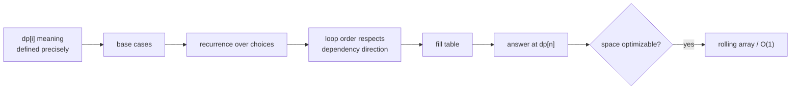

## Why it Matters

When subproblems repeat and the optimum builds from smaller optima, store results instead of recomputing. Two ways: top down recursion plus cache (memo), or bottom up loop over a table (tabulation). Example: climbing stairs `n=3` → `dp[1]=1, dp[2]=2, dp[3]=dp[1]+dp[2]=3` ways.

Core sub patterns: Fibonacci, 0/1 knapsack, unbounded knapsack (coin change), LCS, LIS, subset sum.

## Diagram


The recurrence is the solution; the table order and whether the state can be compressed follow from it, not the other way round.

## Code

```java
// Climbing stairs, LC 70 - tabulation
int climbStairs(int n) {
 if (n <= 2) return n;
 var dp = new int[n + 1];
 dp[1] = 1; dp[2] = 2;
 for (var i = 3; i <= n; i++) dp[i] = dp[i-1] + dp[i-2];
 return dp[n];
}

// Coin change, LC 322 - min coins, unbounded knapsack
int coinChange(int[] coins, int amount) {
 var dp = new int[amount + 1];
 java.util.Arrays.fill(dp, amount + 1);
 dp[0] = 0;
 for (var c : coins) for (var i = c; i <= amount; i++) dp[i] = Math.min(dp[i], dp[i-c] + 1);
 return dp[amount] > amount ? -1 : dp[amount];
}
```
Tabulation usually wins in interviews, iterative, no stack overflow, easier to optimize to O(1) space.

## When to use / not

- Keywords: "maximum", "minimum", "ways to", "can you", "longest", "shortest" where choices at each step build the answer
- Both overlapping subproblems and optimal substructure present

## Trade-offs

| approach | time | space |
|---|---|---|
| memo (top down) | O(n * choices) | O(n) cache + recursion |
| tabulation (bottom up) | O(n * choices) | O(n), often O(1) with rolling array |

## Vs

| | Memoization (top-down) | Tabulation (bottom-up) | Greedy |
|---|---|---|---|
| subproblems hit | only ones reached | all states filled | none |
| time | O(n * choices) | O(n * choices) | O(n log n) |
| space | O(n) cache + call stack | O(n), often O(1) rolling | O(1) |
| stack overflow | risk on deep n | no | no |
| pick when | recursion is clearest, sparse states | dense states, want speed/space tuning | local optimum provably global |

## Pitfalls

- Define `dp` meaning before coding: `dp[i]` is what exactly. Wrong definition sinks the solution.
- Base case off-by-one is the most common bug.
- For coin change outer loop over `coins` gives combinations; swapped loops give permutations, know which you need.

## Interview q&a

- [70. Climbing Stairs](https://leetcode.com/problems/climbing-stairs/)
- [322. Coin Change](https://leetcode.com/problems/coin-change/)
- [1143. Longest Common Subsequence](https://leetcode.com/problems/longest-common-subsequence/)

## Related

- [[Java/07_DSA/Array]]

# Dynamic Programming

> Part of [[README|20 DSA Patterns]] - Pattern #20
