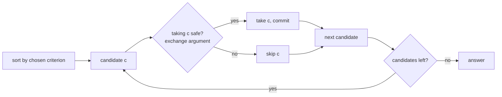

# Greedy

> Part of [[README|Coding Patterns]] • `Coding Patterns/07_Backtracking_DP` • Pattern #20

## Intent
Pick the locally best move at each step and never look back — works only when a local optimum leads to a global optimum, provable by exchange argument. The algorithm is just "sort by criterion, iterate, commit."

## Why it Matters
- **Exchange argument** is the proof: if an optimal solution differs from greedy at first decision, swapping them doesn't worsen the result.
- **Jump Game (LC 55/45):** expand reachable window greedily — at each step, take the farthest reachable.
- **Interval scheduling:** sort by end time, pick earliest finishing — leaves maximum room for remaining.
- **Huffman coding:** merge two smallest frequencies — optimal prefix code.
- Senior signal: being able to *state the exchange argument* for your greedy choice. If you can't prove why picking earliest end / farthest reach is safe, the reviewer assumes you guessed.

## Diagram



## Problems

### 455. Assign Cookies (Easy)
> [LeetCode 455](https://leetcode.com/problems/assign-cookies/) • Tags: Array, Two Pointers, Greedy, Sorting, Quicksort

**Problem Statement:**

Assume you are an awesome parent and want to give your children some cookies. But, you should give each child at most one cookie. Each child i has a greed factor g[i], which is the minimum size of a cookie that the child will be content with; and each cookie j has a size s[j]. If s[j] >= g[i], we can assign the cookie j to the child i, and the child i will be content. Your goal is to maximize the number of your content children and output the maximum number. Example 1: Input: g = [1,2,3], s = [1,1] Output: 1 Explanation: You have 3 children and 2 cookies. The greed factors of 3 children are 1, 2, 3. And even though you have 2 cookies, since their size is both 1, you could only make the child whose greed factor is 1 content. You need to output 1. Example 2: Input: g = [1,2], s = [1,2,3] Output: 2 Explanation: You have 2 children and 3 cookies. The greed factors of 2 children are 1, 2. You have 3 cookies and their sizes are big enough to gratify all of the children, You need to output 2. Constraints: 1 4 0 4 1 31 - 1 Note: This question is the same as 2410: Maximum Matching of Players With Trainers.

**Examples:**

Example 1:
```
[1,2,3]
```

Example 2:
```
[1,1]
```

Example 3:
```
[1,2]
```

Example 4:
```
[1,2,3]
```
---

### 135. Candy (Hard)
> [LeetCode 135](https://leetcode.com/problems/candy/) • Tags: Array, Greedy

**Problem Statement:**

There are n children standing in a line. Each child is assigned a rating value given in the integer array ratings. You are giving candies to these children subjected to the following requirements: Each child must have at least one candy. Children with a higher rating get more candies than their neighbors. Return the minimum number of candies you need to have to distribute the candies to the children. Example 1: Input: ratings = [1,0,2] Output: 5 Explanation: You can allocate to the first, second and third child with 2, 1, 2 candies respectively. Example 2: Input: ratings = [1,2,2] Output: 4 Explanation: You can allocate to the first, second and third child with 1, 2, 1 candies respectively. The third child gets 1 candy because it satisfies the above two conditions. Constraints: 1 4 0 4

**Examples:**

Example 1:
```
[1,0,2]
```

Example 2:
```
[1,2,2]
```
---

### 435. Non-overlapping Intervals (Medium)
> [LeetCode 435](https://leetcode.com/problems/non-overlapping-intervals/) • Tags: Array, Dynamic Programming, Greedy, Sorting

**Problem Statement:**

Given an array of intervals intervals where intervals[i] = [starti, endi], return the minimum number of intervals you need to remove to make the rest of the intervals non-overlapping. Note that intervals which only touch at a point are non-overlapping. For example, [1, 2] and [2, 3] are non-overlapping. Example 1: Input: intervals = [[1,2],[2,3],[3,4],[1,3]] Output: 1 Explanation: [1,3] can be removed and the rest of the intervals are non-overlapping. Example 2: Input: intervals = [[1,2],[1,2],[1,2]] Output: 2 Explanation: You need to remove two [1,2] to make the rest of the intervals non-overlapping. Example 3: Input: intervals = [[1,2],[2,3]] Output: 0 Explanation: You don't need to remove any of the intervals since they're already non-overlapping. Constraints: 1 5 intervals[i].length == 2 -5 * 104 i i 4

**Examples:**

Example 1:
```
[[1,2],[2,3],[3,4],[1,3]]
```

Example 2:
```
[[1,2],[1,2],[1,2]]
```

Example 3:
```
[[1,2],[2,3]]
```
---


## Code / Example
```java
// Jump Game — LC 55 (can reach end?)
boolean canJump(int[] nums) {
    int reach = 0;
    for (int i = 0; i < nums.length; i++) {
        if (i > reach) return false;
        reach = Math.max(reach, i + nums[i]);
    }
    return true;
}

// Jump Game II — LC 45 (min jumps)
int jump(int[] nums) {
    int jumps = 0, curEnd = 0, far = 0;
    for (int i = 0; i < nums.length - 1; i++) {
        far = Math.max(far, i + nums[i]);
        if (i == curEnd) { jumps++; curEnd = far; }
    }
    return jumps;
}

// Best Time to Buy and Sell Stock — LC 121
int maxProfit(int[] prices) {
    int best = 0, minPrice = prices[0];
    for (int p : prices) {
        best = Math.max(best, p - minPrice);
        minPrice = Math.min(minPrice, p);
    }
    return best;
}

// Non-overlapping Intervals (min removals) — LC 435 (greedy by end)
int eraseOverlapIntervals(int[][] intervals) {
    java.util.Arrays.sort(intervals, (a, b) -> Integer.compare(a[1], b[1]));
    int end = Integer.MIN_VALUE, removed = 0;
    for (int[] in : intervals) {
        if (in[0] >= end) end = in[1];
        else removed++;
    }
    return removed;
}
```

## When to Use / When NOT
- **Use:** interval scheduling, activity selection, jump game, Huffman coding, gas station, "minimum", "maximum", "optimal", "earliest", "farthest reachable".
- **NOT:** future consequences can invalidate local pick (use DP); need all solutions (use backtracking); "coin change" with arbitrary denominations (greedy fails on [1,3,4] for amount 6).

## Trade-offs
| Scenario | Time | Space |
|----------|------|-------|
| With sorting | O(n log n) | O(1) |
| No sort (single pass) | O(n) | O(1) |

## Vs Table
| Aspect | Greedy | DP | Divide and Conquer |
|--------|--------|----|-------------------|
| Decisions | irrevocable | revisits via recurrence | independent subproblems |
| Correctness | needs proof (exchange argument) | optimal substructure | combining solved halves |
| Time | O(n log n) sort + O(n) | O(n · choices) | O(n log n) typical |
| Pick when | local optimum implies global optimum | future choices can invalidate local pick | problem splits cleanly, no overlap |

## Pitfalls
- **Greedy fails silently** — test on a case where looking ahead would help (coin change with [1,3,4] for amount 6: greedy 4+1+1=3, optimal 3+3=2).
- **Do not backtrack in greedy** — once you pick, you commit.
- **Sort by the right criterion:** for intervals it's end time, not start. For jump game it's farthest reach.
- **Exchange argument is part of the answer** — if you can't argue why the greedy choice is safe, you don't have a solution, you have a guess.

## Interview Q&A (Senior Depth)

**Q: Jump Game II (LC 45) — why does the `curEnd` / `far` two-pointer approach give minimum jumps?**
**A:** `curEnd` marks the end of the current jump's reach. `far` tracks the farthest we can reach from any position within the current jump. When `i == curEnd`, we've exhausted all positions reachable in the current number of jumps — we *must* jump again, and the best we can do is `far`. This is the exchange argument: any solution that jumps earlier lands at or before `far`, so jumping at `curEnd` to `far` is optimal.

**Q: Non-overlapping Intervals (LC 435) — why sort by end time, not start?**
**A:** Picking the interval that finishes earliest leaves maximum room for the rest. Exchange argument: suppose optimal picks interval A ending later, greedy picks B ending earlier (B ⊂ A or disjoint). Swapping A for B never reduces the number of subsequent intervals that fit. Sorting by start time fails: picking the earliest starting interval might be long and block many short ones.

**Q: Coin change with [1,3,4] for amount 6 — why does greedy fail?**
**A:** Greedy picks 4 (largest ≤ 6), remainder 2 → 1+1 → total 3 coins. Optimal: 3+3 = 2 coins. The failure is that a larger coin (4) leaves a remainder that requires more small coins than using two medium coins (3+3). The local "largest coin" choice doesn't guarantee global minimum.

**Q: Gas Station (LC 134) — how is it greedy?**
**A:** If total gas ≥ total cost, solution exists. Track `tank` from start; if `tank < 0` at station i, restart at i+1 and reset `tank`. Proof: if you can't reach i+1 from start, no station between start and i can reach i+1 either (they all had more gas but couldn't). O(n) single pass.

**Q: How do you respond when asked "prove your greedy choice is correct"?**
**A:** State the exchange argument: "Assume optimal solution O differs from greedy G at first decision. G picks X, O picks Y. Show that swapping Y for X in O yields a solution at least as good. Therefore an optimal solution exists that matches G's first choice. By induction, G is optimal." For intervals: "O picks A ending later, G picks B ending earlier. Replace A with B — B frees up space, so any intervals after A still fit after B. The rest of O's choices remain valid."


## Flashcards (Spaced Repetition)

#flashcard
**Q:** What is the trigger keyword for Greedy? :: **A:** interval scheduling, Huffman, minimum spanning tree, jump game, gas station, assign cookies #flashcard

#flashcard
**Q:** Time/space complexity of Greedy? :: **A:** Time: O(n log n) sort + O(n) scan, Space: O(1) or O(n) #flashcard

#flashcard
**Q:** When do you NOT use Greedy? :: **A:** local optimum ≠ global (need DP/backtrack), need all solutions #flashcard

#flashcard
**Q:** Core Java 25 snippet for Greedy? :: **A:** `Arrays.sort(intervals, (a,b)->a[1]-b[1]); int end=-1, ans=0; for(int[] iv:intervals) if(iv[0]>=end){ end=iv[1]; ans++; }` #flashcard


## Practice Tasks (Tasks Plugin)
- [ ] Restate the intent from memory 📅 {date:YYYY-MM-DD, +1}
- [ ] Code the snippet without looking 📅 {date:YYYY-MM-DD, +3}
- [ ] Answer all Interview Q&A aloud 📅 {date:YYYY-MM-DD, +7}
- [ ] Review flashcards (Spaced Repetition) 📅 {date:YYYY-MM-DD, +1}

```tasks
not done
path includes {file.folder}
sort by due
limit 10
```

## Related
- [[07_Backtracking_DP/02 - Dynamic Programming|Dynamic Programming]] (greedy = DP with memo deleted + choice made permanent)
- [[04_Intervals_Search/01 - Overlapping Intervals|Overlapping Intervals]] (activity selection is greedy)
- [[05_Trees_Graphs/03 - BFS|BFS]] (level-order is greedy by distance)
- [[Java/07_DSA/Array]]
---
*Category: Coding Patterns/07_Backtracking_DP*
