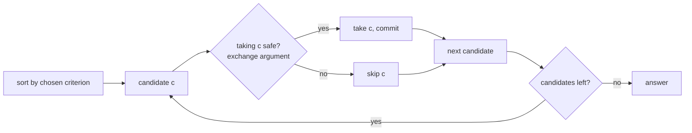

# Greedy

> Part of [[README|20 DSA Patterns]] • `Coding Patterns/07_Backtracking_DP` • Pattern #19

## Intent
Pick the locally best move at each step and never look back — works only when a local optimum leads to a global optimum, provable by exchange argument. The algorithm is just "sort by criterion, iterate, commit."

## Why it Matters
- **Exchange argument** is the proof: if an optimal solution differs from greedy at first decision, swapping them doesn't worsen the result.
- **Jump Game (LC 55/45):** expand reachable window greedily — at each step, take the farthest reachable.
- **Interval scheduling:** sort by end time, pick earliest finishing — leaves maximum room for remaining.
- **Huffman coding:** merge two smallest frequencies — optimal prefix code.
- Senior signal: being able to *state the exchange argument* for your greedy choice. If you can't prove why picking earliest end / farthest reach is safe, the reviewer assumes you guessed.

## Diagram



## Problems

### 55. Jump Game (Medium)
> [LeetCode 55](https://leetcode.com/problems/jump-game/) • Tags: Array, Dynamic Programming, Greedy

**Problem Statement:**

You are given an integer array nums. You are initially positioned at the array's first index, and each element in the array represents your maximum jump length at that position.

Return true if you can reach the last index, or false otherwise.

**Examples:**

Example 1:

Input: nums = [2,3,1,1,4]
Output: true
Explanation: Jump 1 step from index 0 to 1, then 3 steps to the last index.

Example 2:

Input: nums = [3,2,1,0,4]
Output: false
Explanation: You will always arrive at index 3 no matter what. Its maximum jump length is 0, which makes it impossible to reach the last index.

---

### 45. Jump Game II (Medium)
> [LeetCode 45](https://leetcode.com/problems/jump-game-ii/) • Tags: Array, Dynamic Programming, Greedy

**Problem Statement:**

You are given a 0-indexed array of integers nums of length n. You are initially positioned at index 0.

Each element nums[i] represents the maximum length of a forward jump from index i. In other words, if you are at index i, you can jump to any index (i + j) where:

	0 <= j <= nums[i] and
	i + j < n

Return the minimum number of jumps to reach index n - 1. The test cases are generated such that you can reach index n - 1.

**Examples:**

Example 1:

Input: nums = [2,3,1,1,4]
Output: 2
Explanation: The minimum number of jumps to reach the last index is 2. Jump 1 step from index 0 to 1, then 3 steps to the last index.

Example 2:

Input: nums = [2,3,0,1,4]
Output: 2

---

### 121. Best Time to Buy and Sell Stock (Easy)
> [LeetCode 121](https://leetcode.com/problems/best-time-to-buy-and-sell-stock/) • Tags: Array, Dynamic Programming

**Problem Statement:**

You are given an array prices where prices[i] is the price of a given stock on the i^th^ day.

You want to maximize your profit by choosing a single day to buy one stock and choosing a different day in the future to sell that stock.

Return the maximum profit you can achieve from this transaction. If you cannot achieve any profit, return 0.

**Examples:**

Example 1:

Input: prices = [7,1,5,3,6,4]
Output: 5
Explanation: Buy on day 2 (price = 1) and sell on day 5 (price = 6), profit = 6-1 = 5.
Note that buying on day 2 and selling on day 1 is not allowed because you must buy before you sell.

Example 2:

Input: prices = [7,6,4,3,1]
Output: 0
Explanation: In this case, no transactions are done and the max profit = 0.

---


## Code / Example
```java
// Jump Game — LC 55 (can reach end?)
boolean canJump(int[] nums) {
    int reach = 0;
    for (int i = 0; i < nums.length; i++) {
        if (i > reach) return false;
        reach = Math.max(reach, i + nums[i]);
    }
    return true;
}

// Jump Game II — LC 45 (min jumps)
int jump(int[] nums) {
    int jumps = 0, curEnd = 0, far = 0;
    for (int i = 0; i < nums.length - 1; i++) {
        far = Math.max(far, i + nums[i]);
        if (i == curEnd) { jumps++; curEnd = far; }
    }
    return jumps;
}

// Best Time to Buy and Sell Stock — LC 121
int maxProfit(int[] prices) {
    int best = 0, minPrice = prices[0];
    for (int p : prices) {
        best = Math.max(best, p - minPrice);
        minPrice = Math.min(minPrice, p);
    }
    return best;
}

// Non-overlapping Intervals (min removals) — LC 435 (greedy by end)
int eraseOverlapIntervals(int[][] intervals) {
    java.util.Arrays.sort(intervals, (a, b) -> Integer.compare(a[1], b[1]));
    int end = Integer.MIN_VALUE, removed = 0;
    for (int[] in : intervals) {
        if (in[0] >= end) end = in[1];
        else removed++;
    }
    return removed;
}
```

## When to Use / When NOT
- **Use:** interval scheduling, activity selection, jump game, Huffman coding, gas station, "minimum", "maximum", "optimal", "earliest", "farthest reachable".
- **NOT:** future consequences can invalidate local pick (use DP); need all solutions (use backtracking); "coin change" with arbitrary denominations (greedy fails on [1,3,4] for amount 6).

## Trade-offs
| Scenario | Time | Space |
|----------|------|-------|
| With sorting | O(n log n) | O(1) |
| No sort (single pass) | O(n) | O(1) |

## Vs Table
| Aspect | Greedy | DP | Divide and Conquer |
|--------|--------|----|-------------------|
| Decisions | irrevocable | revisits via recurrence | independent subproblems |
| Correctness | needs proof (exchange argument) | optimal substructure | combining solved halves |
| Time | O(n log n) sort + O(n) | O(n · choices) | O(n log n) typical |
| Pick when | local optimum implies global optimum | future choices can invalidate local pick | problem splits cleanly, no overlap |

## Pitfalls
- **Greedy fails silently** — test on a case where looking ahead would help (coin change with [1,3,4] for amount 6: greedy 4+1+1=3, optimal 3+3=2).
- **Do not backtrack in greedy** — once you pick, you commit.
- **Sort by the right criterion:** for intervals it's end time, not start. For jump game it's farthest reach.
- **Exchange argument is part of the answer** — if you can't argue why the greedy choice is safe, you don't have a solution, you have a guess.

## Interview Q&A (Senior Depth)

**Q: Jump Game II (LC 45) — why does the `curEnd` / `far` two-pointer approach give minimum jumps?**
**A:** `curEnd` marks the end of the current jump's reach. `far` tracks the farthest we can reach from any position within the current jump. When `i == curEnd`, we've exhausted all positions reachable in the current number of jumps — we *must* jump again, and the best we can do is `far`. This is the exchange argument: any solution that jumps earlier lands at or before `far`, so jumping at `curEnd` to `far` is optimal.

**Q: Non-overlapping Intervals (LC 435) — why sort by end time, not start?**
**A:** Picking the interval that finishes earliest leaves maximum room for the rest. Exchange argument: suppose optimal picks interval A ending later, greedy picks B ending earlier (B ⊂ A or disjoint). Swapping A for B never reduces the number of subsequent intervals that fit. Sorting by start time fails: picking the earliest starting interval might be long and block many short ones.

**Q: Coin change with [1,3,4] for amount 6 — why does greedy fail?**
**A:** Greedy picks 4 (largest ≤ 6), remainder 2 → 1+1 → total 3 coins. Optimal: 3+3 = 2 coins. The failure is that a larger coin (4) leaves a remainder that requires more small coins than using two medium coins (3+3). The local "largest coin" choice doesn't guarantee global minimum.

**Q: Gas Station (LC 134) — how is it greedy?**
**A:** If total gas ≥ total cost, solution exists. Track `tank` from start; if `tank < 0` at station i, restart at i+1 and reset `tank`. Proof: if you can't reach i+1 from start, no station between start and i can reach i+1 either (they all had more gas but couldn't). O(n) single pass.

**Q: How do you respond when asked "prove your greedy choice is correct"?**
**A:** State the exchange argument: "Assume optimal solution O differs from greedy G at first decision. G picks X, O picks Y. Show that swapping Y for X in O yields a solution at least as good. Therefore an optimal solution exists that matches G's first choice. By induction, G is optimal." For intervals: "O picks A ending later, G picks B ending earlier. Replace A with B — B frees up space, so any intervals after A still fit after B. The rest of O's choices remain valid."

## Related
- [[07_Backtracking_DP/02 - Dynamic Programming|Dynamic Programming]] (greedy = DP with memo deleted + choice made permanent)
- [[04_Intervals_Search/01 - Overlapping Intervals|Overlapping Intervals]] (activity selection is greedy)
- [[05_Trees_Graphs/03 - BFS|BFS]] (level-order is greedy by distance)
- [[Java/07_DSA/Array]]

---
*Category: Coding Patterns/07_Backtracking_DP*
