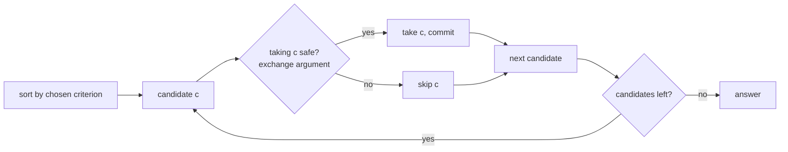

## Why it Matters

Pick the locally best move at each step and never look back. Works only when a local optimum leads to a global optimum, provable by exchange argument. Example: jump game `nums=[2,3,1,1,4]` → at `0` reach is `2`, at `1` reach extends to `4`, greedy expands reachable window each pass and reaches the end.

Fails where future consequences matter, then use DP instead.

## Diagram


Committing is the definition of greedy. The safety check, usually an exchange argument, is what separates a solution from a guess.

## Code

```java
// Jump game, LC 55 - can reach end?
boolean canJump(int[] nums) {
 int reach = 0;
 for (var i = 0; i < nums.length; i++) {
 if (i > reach) return false;
 reach = Math.max(reach, i + nums[i]);
 }
 return true;
}

// Jump game II, LC 45 - min jumps
int jump(int[] nums) {
 int jumps = 0, curEnd = 0, far = 0;
 for (var i = 0; i < nums.length - 1; i++) {
 far = Math.max(far, i + nums[i]);
 if (i == curEnd) { jumps++; curEnd = far; }
 }
 return jumps;
}

// Best time to buy and sell stock, LC 121
int maxProfit(int[] prices) {
 int best = 0, minPrice = prices[0];
 for (var p : prices) { best = Math.max(best, p - minPrice); minPrice = Math.min(minPrice, p); }
 return best;
}
```
Greedy proofs are part of the answer in interviews. If you cannot argue why picking the earliest end or farthest reach is safe, the reviewer assumes you guessed.

## When to use / not

- Interval scheduling, activity selection, jump game, Huffman coding
- Keywords: "minimum", "maximum", "optimal", "earliest", "farthest reachable"

## Trade-offs

| time | space |
|---|---|
| O(n log n) if sorting needed, otherwise O(n) | O(1) |

## Vs

| | Greedy | DP | Divide and conquer |
|---|---|---|---|
| decisions | irrevocable | revisits via recurrence | independent subproblems |
| correctness | needs proof (exchange argument) | optimal substructure | combining solved halves |
| time | O(n log n) sort + O(n) | O(n * choices) | O(n log n) typical |
| pick when | local optimum implies global optimum | future choices can invalidate a local pick | problem splits cleanly, no overlap |

Greedy is DP with the memo table deleted and the choice made permanent, it only works when nothing learned later can undo the choice.

## Pitfalls

- Greedy fails silently, test on a case where looking ahead would help (coin change with `[1,3,4]` for amount `6`).
- Do not backtrack in greedy; once you pick, you commit.
- Sort by the right criterion: for intervals it is end, not start.

## Interview q&a

- [55. Jump Game](https://leetcode.com/problems/jump-game/)
- [45. Jump Game II](https://leetcode.com/problems/jump-game-ii/)
- [121. Best Time to Buy and Sell Stock](https://leetcode.com/problems/best-time-to-buy-and-sell-stock/)

## Related

- [[Java/07_DSA/Array]]

# Greedy

> Part of [[README|20 DSA Patterns]] - Pattern #19
