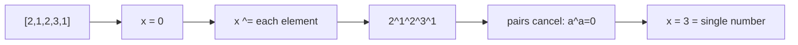

# Bit Manipulation

> Part of [[README|Coding Patterns]] • `Coding Patterns/08_Bit_Manipulation` • Pattern #21

## Intent
Work directly on binary digits with `& | ^ ~ << >>` — the O(1) space pattern for single number, power of two, bit counting, and subset enumeration via masks.

## Why it Matters
- **XOR is its own inverse:** `a ^ a = 0`, `a ^ 0 = a` → paired duplicates cancel, lone value remains.
- **`n & (n-1) == 0`** tests power of two (only one bit set).
- **`n & 1`** tests odd/even; `n >>= 1` divides by 2.
- **`n &= (n-1)`** drops lowest set bit — Hamming weight in O(popcount) instead of O(32).
- **Subsets via bitmask:** `1 << n` masks generate all `2^n` subsets without recursion.
- Senior signal: knowing `>>>` (unsigned right shift) vs `>>` (signed) in Java, and that `1 << n` overflows at n=31 for `int` (use `1L << n`).

## Diagram



## Problems

### 191. Number of 1 Bits (Easy)
> [LeetCode 191](https://leetcode.com/problems/number-of-1-bits/) • Tags: Divide and Conquer, Bit Manipulation

**Problem Statement:**

Given a positive integer n, write a function that returns the number of set bits in its binary representation (also known as the Hamming weight). Example 1: Input: n = 11 Output: 3 Explanation: The input binary string 1011 has a total of three set bits. Example 2: Input: n = 128 Output: 1 Explanation: The input binary string 10000000 has a total of one set bit. Example 3: Input: n = 2147483645 Output: 30 Explanation: The input binary string 1111111111111111111111111111101 has a total of thirty set bits. Constraints: 1 31 - 1 Follow up: If this function is called many times, how would you optimize it?

**Examples:**

Example 1:
```
11
```

Example 2:
```
128
```

Example 3:
```
2147483645
```
---

### 136. Single Number (Easy)
> [LeetCode 136](https://leetcode.com/problems/single-number/) • Tags: Array, Bit Manipulation

**Problem Statement:**

Given a non-empty array of integers nums, every element appears twice except for one. Find that single one. You must implement a solution with a linear runtime complexity and use only constant extra space. Example 1: Input: nums = [2,2,1] Output: 1 Example 2: Input: nums = [4,1,2,1,2] Output: 4 Example 3: Input: nums = [1] Output: 1 Constraints: 1 4 -3 * 104 4 Each element in the array appears twice except for one element which appears only once.

**Examples:**

Example 1:
```
[2,2,1]
```

Example 2:
```
[4,1,2,1,2]
```

Example 3:
```
[1]
```
---

### 260. Single Number III (Medium)
> [LeetCode 260](https://leetcode.com/problems/single-number-iii/) • Tags: Array, Bit Manipulation

**Problem Statement:**

Given an integer array nums, in which exactly two elements appear only once and all the other elements appear exactly twice. Find the two elements that appear only once. You can return the answer in any order. You must write an algorithm that runs in linear runtime complexity and uses only constant extra space. Example 1: Input: nums = [1,2,1,3,2,5] Output: [3,5] Explanation: [5, 3] is also a valid answer. Example 2: Input: nums = [-1,0] Output: [-1,0] Example 3: Input: nums = [0,1] Output: [1,0] Constraints: 2 4 -231 31 - 1 Each integer in nums will appear twice, only two integers will appear once.

**Examples:**

Example 1:
```
[1,2,1,3,2,5]
```

Example 2:
```
[-1,0]
```

Example 3:
```
[0,1]
```
---


## Code / Example
```java
// Single Number — LC 136 (XOR all)
int singleNumber(int[] nums) {
    int x = 0;
    for (int v : nums) x ^= v;
    return x;
}

// Power of Two — LC 231
boolean isPowerOfTwo(int n) {
    return n > 0 && (n & (n - 1)) == 0;
}

// Count 1 Bits — LC 191 (Hamming weight)
int hammingWeight(int n) {
    int c = 0;
    while (n != 0) { n &= (n - 1); c++; } // drops lowest 1 each loop
    return c;
}

// Subsets via bit mask
java.util.List<java.util.List<Integer>> subsets(int[] nums) {
    int n = nums.length;
    var res = new java.util.ArrayList<java.util.List<Integer>>();
    for (int mask = 0; mask < (1 << n); mask++) {
        var cur = new java.util.ArrayList<Integer>();
        for (int i = 0; i < n; i++) if ((mask & (1 << i)) != 0) cur.add(nums[i]);
        res.add(cur);
    }
    return res;
}

// Missing Number — LC 268 (XOR indices ^ values)
int missingNumber(int[] nums) {
    int x = 0;
    for (int i = 0; i < nums.length; i++) x ^= i ^ nums[i];
    return x ^ nums.length; // index n missing
}

// Single Number II — LC 137 (two singles need bit counting per position)
int singleNumberII(int[] nums) {
    int ones = 0, twos = 0;
    for (int x : nums) {
        ones = (ones ^ x) & ~twos;
        twos = (twos ^ x) & ~ones;
    }
    return ones;
}
```

## When to Use / When NOT
- **Use:** find unique/single number; count bits; test power of two; enumerate subsets by bit mask; toggle flags; missing number.
- **NOT:** frequency of each value (use HashMap); two single numbers (need partition by differing bit); large bit operations beyond 64-bit (use BigInteger).

## Trade-offs
| Operation | Time | Space |
|-----------|------|-------|
| Scans / bit ops | O(n) / O(1) per op | O(1) |

## Vs Table
| Aspect | XOR Accumulation | HashMap Count | Sorting |
|--------|------------------|---------------|---------|
| Find single value | O(n), O(1) | O(n), O(n) | O(n log n) |
| Two singles | insufficient, partition by differing bit first | yes | yes, adjacent compare |
| Frequency of each | no | yes | yes |
| Pick when | exactly one unpaired, bit flags, subset masks | counts or multiple uniques | only order matters |

## Pitfalls
- In Java, `>>` keeps sign, `>>>` does not. Use `>>>` for unsigned right shift.
- `1 << n` overflows at `n=31` for `int`. Use `1L << n` if needed.
- XOR finds one single; two singles need partition by differing bit (find any set bit in XOR, partition by that bit).
- `n & (n-1)` drops lowest set bit; `n | (n-1)` sets trailing zeros; `n + 1 & ~n` isolates lowest zero.

## Interview Q&A (Senior Depth)

**Q: Single Number II (LC 137) — explain the two-bit state machine (ones, twos).**
**A:** Each bit position independently tracks count mod 3. `ones` = bits seen 1 time mod 3; `twos` = bits seen 2 times mod 3. On new bit `x`: `ones = (ones ^ x) & ~twos` (toggle if not in twos); `twos = (twos ^ x) & ~ones` (toggle if not in new ones). After 3 occurrences, both clear. Final `ones` holds the single number's bits.

**Q: Two singles (LC 260) — how to partition by differing bit?**
**A:** XOR all → `xor = a ^ b` (a,b are the two singles). Find any set bit in `xor` (e.g., `diff = xor & -xor` isolates lowest set bit). This bit differs between a and b. Partition array into two groups by this bit: group 1 has a, group 2 has b. XOR each group → a and b. O(n) time, O(1) space.

**Q: Why does `n & (n-1) == 0` test power of two?**
**A:** Powers of two have exactly one bit set: `1000...0`. Subtracting 1 gives `0111...1`. AND is zero. For non-powers-of-two, at least two bits set → subtracting 1 doesn't clear the highest bit → AND non-zero. Edge case: n=0 gives true, so check `n > 0` first.

**Q: Java `>>` vs `>>>` — when does it matter?**
**A:** `>>` is arithmetic shift (sign-extends). `>>>` is logical shift (fills with zeros). For positive numbers, same. For negative: `-8 >> 1 = -4` (sign bit copied), `-8 >>> 1 = 2147483644` (zeros filled). Use `>>>` when treating int as unsigned bit pattern (e.g., hash codes, bit masks).

**Q: Subset enumeration via bitmask — when is it better than backtracking?**
**A:** Bitmask: simple iterative, no recursion, generates in natural binary order. Backtracking: allows pruning (skip branches early), generates in lexicographic order if sorted. For n ≤ 20 with no pruning, bitmask is simpler. For n > 20 or with pruning, backtracking wins.


## Flashcards (Spaced Repetition)

#flashcard
**Q:** What is the trigger keyword for Bit Manipulation? :: **A:** power of two, single number (XOR), count bits, subset enumeration, bitmask DP, Hamming distance #flashcard

#flashcard
**Q:** Time/space complexity of Bit Manipulation? :: **A:** Time: O(1) per operation, Space: O(1) #flashcard

#flashcard
**Q:** When do you NOT use Bit Manipulation? :: **A:** need arithmetic (use + - * /), readability matters (use clear logic) #flashcard

#flashcard
**Q:** Core Java 25 snippet for Bit Manipulation? :: **A:** `boolean isPowerOfTwo(int n){ return n>0 && (n&(n-1))==0; } int countBits(int n){ int c=0; while(n>0){ n&=n-1; c++; } return c; }` #flashcard


## Practice Tasks (Tasks Plugin)
- [ ] Restate the intent from memory 📅 {date:YYYY-MM-DD, +1}
- [ ] Code the snippet without looking 📅 {date:YYYY-MM-DD, +3}
- [ ] Answer all Interview Q&A aloud 📅 {date:YYYY-MM-DD, +7}
- [ ] Review flashcards (Spaced Repetition) 📅 {date:YYYY-MM-DD, +1}

```tasks
not done
path includes {file.folder}
sort by due
limit 10
```

## Related
- [[01_Array/04 - Frequency Counting|Frequency Counting]] (XOR vs HashMap for single number)
- [[07_Backtracking_DP/01 - Backtracking|Backtracking]] (subset generation alternative)
- [[Java/07_DSA/Array]]
---
*Category: Coding Patterns/08_Bit_Manipulation*
