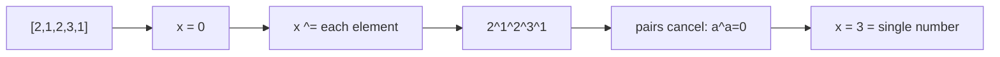

## Why it Matters

Work directly on binary digits with `& | ^ ~ << >>`. The trick in interviews is that `a ^ a = 0` and `a ^ 0 = a`, so XOR cancels duplicates. Example: `[2,1,2,3,1]` → XOR all: `2^1^2^3^1 = 3`, the single number.

Other checks: `n & (n-1) == 0` means power of two; `n & 1` tests odd; shifting generates subsets.

## Diagram


XOR is its own inverse, so paired duplicates annihilate and the lone unpaired value is what remains.

## Code

```java
// Single number, LC 136, XOR all
int singleNumber(int[] nums) {
 int x = 0;
 for (var v : nums) x ^= v;
 return x;
}

// Power of two, LC 231
boolean isPowerOfTwo(int n) {
 return n > 0 && (n & (n - 1)) == 0;
}

// Count 1 bits, LC 191
int hammingWeight(int n) {
 int c = 0;
 while (n != 0) { n &= (n - 1); c++; } // drops lowest 1 each loop
 return c;
}

// Subsets via bit mask
java.util.List<java.util.List<Integer>> subsets(int[] nums) {
 int n = nums.length;
 var res = new java.util.ArrayList<java.util.List<Integer>>();
 for (var mask = 0; mask < (1 << n); mask++) {
 var cur = new java.util.ArrayList<Integer>();
 for (var i = 0; i < n; i++) if ((mask & (1 << i)) != 0) cur.add(nums[i]);
 res.add(cur);
 }
 return res;
}
```
`n &= n-1` is the classic bit-drop idiom. Shifts generate all `2^n` subset masks without recursion.

## When to use / not

- Find the unique or single number, count bits, test power of two, enumerate subsets by bit mask, toggle flags
- Keywords: "unique", "single number", "power of two", "count bits", "xor", "bits"

## Trade-offs

| time | space |
|---|---|
| O(n) for scans, O(1) per bit operation | O(1) |

## Vs

| | XOR accumulation | Hash map count | Sorting |
|---|---|---|---|
| find the single value | O(n), O(1) | O(n), O(n) | O(n log n) |
| two singles | insufficient, partition by a differing bit first | yes | yes, adjacent compare |
| frequency of each value | no | yes | yes |
| pick when | exactly one unpaired value, bit flags, subset masks | counts or multiple uniques | only order matters |

## Pitfalls

- In Java, `>>` keeps sign, `>>>` does not. Use `>>>` for unsigned.
- `1 << n` overflows at `n=31` for int. Use `1L << n` if needed.
- XOR finds one single; two singles need partition by differing bit.

## Interview q&a

- [136. Single Number](https://leetcode.com/problems/single-number/)
- [191. Number of 1 Bits](https://leetcode.com/problems/number-of-1-bits/)
- [231. Power of Two](https://leetcode.com/problems/power-of-two/)

## Related

- [[Java/07_DSA/Array]]

# Bit Manipulation

> Part of [[README|20 DSA Patterns]], Pattern #8
