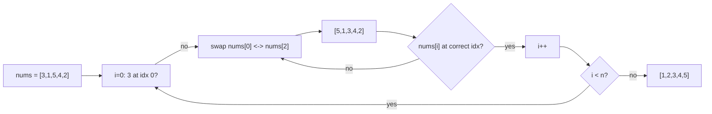

# Cyclic Sort

> Part of [[README|20 DSA Patterns]] • `Coding Patterns/09_Advanced` • Pattern #22 (Optional)
> **Trigger:** Array with elements in range `[1..n]` or `[0..n-1]` — place each element at its correct index via swaps.

## Intent

When array elements are in a known range `[1..n]`, the correct position of value `x` is index `x-1` (or `x` for 0-indexed). Swap each element to its correct position in a single pass — O(n) time, O(1) space, no extra memory.

## Why it Matters

- **Range constraint is the trigger:** `1 ≤ nums[i] ≤ n` or `0 ≤ nums[i] < n`.
- **Each element visits its correct position at most once** — total swaps ≤ n, so O(n) time despite nested `while`.
- **Missing/duplicate detection:** After sorting, scan once — `nums[i] != i+1` reveals missing/duplicate.
- Senior signal: recognizing cyclic sort applies to *any* permutation of range `[1..n]`, not just sorting — use for missing number, first missing positive, find all duplicates.

## Diagram



## Problems

### 268. Missing Number (Easy)
> [LeetCode 268](https://leetcode.com/problems/missing-number/) • Tags: Array, Hash Table, Math, Binary Search, Bit Manipulation, Sorting

**Problem Statement:**
Given an array nums containing n distinct numbers in the range [0, n], return the only number in the range that is missing from the array.

**Examples:**
- Input: nums = [3,0,1] → Output: 2
- Input: nums = [0,1] → Output: 2
- Input: nums = [9,6,4,2,3,5,7,0,1] → Output: 8
---

### 442. Find All Duplicates in an Array (Medium)
> [LeetCode 442](https://leetcode.com/problems/find-all-duplicates-in-an-array/) • Tags: Array, Hash Table

**Problem Statement:**
Given an integer array nums of length n where all the integers of nums are in the range [1, n] and each integer appears once or twice, return an array of all the integers that appears twice.

**Examples:**
- Input: nums = [4,3,2,7,8,2,3,1] → Output: [2,3]
---

### 448. Find All Numbers Disappeared in an Array (Easy)
> [LeetCode 448](https://leetcode.com/problems/find-all-numbers-disappeared-in-an-array/) • Tags: Array, Hash Table

**Problem Statement:**
Given an array nums of n integers where nums[i] is in the range [1, n], return an array of all the integers in the range [1, n] that do not appear in nums.

**Examples:**
- Input: nums = [4,3,2,7,8,2,3,1] → Output: [5,6]
---

### 645. Set Mismatch (Easy)
> [LeetCode 645](https://leetcode.com/problems/set-mismatch/) • Tags: Array, Hash Table, Bit Manipulation, Sorting

**Problem Statement:**
You have a set of integers s, which originally contains all the numbers from 1 to n. Unfortunately, due to some error, one of the numbers in s got duplicated to another number in the set, which results in repetition of one number and loss of another number. You are given an integer array nums representing the data status of this set after the error. Find the number that occurs twice and the number that is missing and return them in the form of an array.

**Examples:**
- Input: nums = [1,2,2,4] → Output: [2,3]
---

## Code / Example

```java
// Cyclic Sort template — elements in [1..n]
void cyclicSort(int[] nums) {
    int i = 0;
    while (i < nums.length) {
        int correct = nums[i] - 1; // 1-indexed values → 0-indexed position
        if (nums[i] != nums[correct]) {
            int tmp = nums[i];
            nums[i] = nums[correct];
            nums[correct] = tmp;
        } else {
            i++;
        }
    }
}

// Missing Number — LC 268 (0..n range)
int missingNumber(int[] nums) {
    int i = 0;
    while (i < nums.length) {
        int correct = nums[i]; // 0-indexed values → correct position
        if (nums[i] < nums.length && nums[i] != nums[correct]) {
            int tmp = nums[i];
            nums[i] = nums[correct];
            nums[correct] = tmp;
        } else {
            i++;
        }
    }
    for (i = 0; i < nums.length; i++)
        if (nums[i] != i) return i;
    return nums.length; // n is missing
}

// Find All Duplicates — LC 442
java.util.List<Integer> findDuplicates(int[] nums) {
    int i = 0;
    while (i < nums.length) {
        int correct = nums[i] - 1;
        if (nums[i] != nums[correct]) {
            int tmp = nums[i];
            nums[i] = nums[correct];
            nums[correct] = tmp;
        } else {
            i++;
        }
    }
    var res = new java.util.ArrayList<Integer>();
    for (i = 0; i < nums.length; i++)
        if (nums[i] != i + 1) res.add(nums[i]);
    return res;
}

// Find All Disappeared — LC 448
java.util.List<Integer> findDisappearedNumbers(int[] nums) {
    int i = 0;
    while (i < nums.length) {
        int correct = nums[i] - 1;
        if (nums[i] != nums[correct]) {
            int tmp = nums[i];
            nums[i] = nums[correct];
            nums[correct] = tmp;
        } else {
            i++;
        }
    }
    var res = new java.util.ArrayList<Integer>();
    for (i = 0; i < nums.length; i++)
        if (nums[i] != i + 1) res.add(i + 1);
    return res;
}

// Set Mismatch — LC 645 (duplicate + missing)
int[] findErrorNums(int[] nums) {
    int i = 0;
    while (i < nums.length) {
        int correct = nums[i] - 1;
        if (nums[i] != nums[correct]) {
            int tmp = nums[i];
            nums[i] = nums[correct];
            nums[correct] = tmp;
        } else {
            i++;
        }
    }
    for (i = 0; i < nums.length; i++)
        if (nums[i] != i + 1) return new int[]{nums[i], i + 1};
    return new int[0];
}
```

## When to Use / When NOT

- **Use:** array with elements in `[1..n]` or `[0..n-1]`; find missing, duplicate, first missing positive; any permutation of known range.
- **NOT:** values outside the range; need stable sort; array is read-only (cyclic sort mutates).

## Trade-offs

| Approach | Time | Space | Mutates Input |
|----------|------|-------|---------------|
| Cyclic Sort | O(n) | O(1) | Yes |
| HashSet | O(n) | O(n) | No |
| Sort + Scan | O(n log n) | O(1) or O(n) | Depends |

## Vs Table

| Aspect | Cyclic Sort | HashSet | Sort |
|--------|-------------|---------|------|
| Time | O(n) | O(n) | O(n log n) |
| Space | O(1) | O(n) | O(1) extra |
| Mutates | Yes | No | Yes |
| Pick when | range [1..n] known, O(1) space required | general duplicates, read-only | simpler code acceptable |

## Pitfalls

- **Infinite loop if `nums[i] == nums[correct]` but `i != correct`** — this happens when duplicates exist. The `else i++` handles it: we only swap when the target position has a *different* value.
- **Range check:** For `[0..n]` (LC 268), `correct = nums[i]`; for `[1..n]`, `correct = nums[i] - 1`. Get this wrong → `ArrayIndexOutOfBoundsException`.
- **Don't increment `i` after swap** — the new value at `i` needs to be checked again.
- **First Missing Positive (LC 41)** extends this: first segregate positives, then cyclic sort the positive segment.

## Interview Q&A (Senior Depth)

**Q: Why is the inner `while` still O(n) total, not O(n²)?**
A: Each swap puts at least one element in its final correct position. An element never leaves its correct position once placed. With n elements, at most n swaps total. The `while` loop condition is checked O(n) times for successful swaps + O(n) times for failed checks (when `i++`). Total = O(2n) = O(n).

**Q: Cyclic Sort vs Counting Sort — what's the difference?**
A: Cyclic sort works *in-place* on arrays where values = indices (permutation of [1..n]). Counting sort allocates a frequency array of size `maxVal`, works for any range but uses O(k) space. Cyclic sort is a specialized in-place variant for the exact permutation case.

**Q: First Missing Positive (LC 41) — how does it extend cyclic sort?**
A: LC 41 has no range guarantee. Two-pass: (1) segregate: move all `≤0` and `>n` to front (or ignore), keep only `[1..n]` in the active segment. (2) Cyclic sort the active segment. (3) Scan for first `nums[i] != i+1`. The segregation step is the key addition.

**Q: Can cyclic sort handle negative numbers?**
A: Only if you transform the range. For `[-k..k]`, add `k` to make it `[0..2k]`, cyclic sort, subtract `k` after. But this is rarely asked — usually the problem guarantees `[1..n]` or `[0..n-1]`.

**Q: Set Mismatch (LC 645) — why does the duplicate value end up at the missing index?**
A: After cyclic sort, every index `i` should have value `i+1`. The missing value `m` means index `m-1` is empty. The duplicate `d` gets placed at index `d-1` (its correct spot), but since `d` appears twice, the *second* `d` has nowhere to go — it stays at the index where `m` should be. So `nums[m-1] = d` and `m` is missing.


## Flashcards (Spaced Repetition)

#flashcard
**Q:** What is the trigger keyword for Cyclic Sort? :: **A:** find missing/duplicate in 1..n, first missing positive, find corruption, sort array with elements in range #flashcard

#flashcard
**Q:** Time/space complexity of Cyclic Sort? :: **A:** Time: O(n) each element swapped at most once, Space: O(1) in-place #flashcard

#flashcard
**Q:** When do you NOT use Cyclic Sort? :: **A:** elements not in 1..n range, need stable sort, array has large values #flashcard

#flashcard
**Q:** Core Java 25 snippet for Cyclic Sort? :: **A:** `for(int i=0;i<n;){ if(nums[i]!=i+1 && nums[i]<=n && nums[i]!=nums[nums[i]-1]) swap(nums,i,nums[i]-1); else i++; }` #flashcard


## Practice Tasks (Tasks Plugin)
- [ ] Restate the intent from memory 📅 {date:YYYY-MM-DD, +1}
- [ ] Code the snippet without looking 📅 {date:YYYY-MM-DD, +3}
- [ ] Answer all Interview Q&A aloud 📅 {date:YYYY-MM-DD, +7}
- [ ] Review flashcards (Spaced Repetition) 📅 {date:YYYY-MM-DD, +1}

```tasks
not done
path includes {file.folder}
sort by due
limit 10
```

## Related
- [[01_Array/01 - Prefix Sum|Prefix Sum]] (XOR alternative for missing number)
- [[01_Array/04 - Frequency Counting|Frequency Counting]] (HashMap alternative)
- [[08_Bit_Manipulation/01 - Bit Manipulation|Bit Manipulation]] (XOR for single missing)
---

*Category: Coding Patterns/09_Advanced • Optional Pattern #22*