# Kadane's Algorithm

> Part of [[README|20 DSA Patterns]] • `Coding Patterns/09_Advanced` • Pattern #23 (Optional)
> **Trigger:** "Maximum subarray sum" / "Maximum product subarray" / "Subarray with constraints" — 1D DP with rolling state.

## Intent

Find the maximum sum of a contiguous subarray in O(n) time, O(1) space. The insight: at each index, the best subarray ending here is either the element alone, or the element appended to the best subarray ending at the previous index. `dp[i] = max(nums[i], dp[i-1] + nums[i])`.

## Why it Matters

- **Core 1D DP pattern:** `cur = max(x, cur + x)` — rolling variable, no array needed.
- **Variants:** Maximum product subarray (track min+max due to negatives), maximum sum circular (total - min subarray), maximum sum with one deletion (two states).
- **Constraint extensions:** at most k elements, exactly k elements, non-empty subarray required.
- Senior signal: knowing *why* `cur = max(x, cur + x)` works — it's the optimal substructure: best ending at i either starts at i or extends best ending at i-1.

## Diagram

```mermaid
flowchart LR
  A["nums = [-2,1,-3,4,-1,2,1,-5,4]"] --> I["i=0: cur=-2, best=-2"]
  I --> I1["i=1: cur=max(1, -2+1)=1, best=1"]
  I1 --> I2["i=2: cur=max(-3, 1-3)=-2, best=1"]
  I2 --> I3["i=3: cur=max(4, -2+4)=4, best=4"]
  I3 --> I4["i=4: cur=max(-1, 4-1)=3, best=4"]
  I4 --> I5["i=5: cur=max(2, 3+2)=5, best=5"]
  I5 --> I6["i=6: cur=max(1, 5+1)=6, best=6 ← ANSWER"]
  I6 --> I7["i=7: cur=max(-5, 6-5)=1, best=6"]
  I7 --> I8["i=8: cur=max(4, 1+4)=5, best=6"]
```



## Problems

### 53. Maximum Subarray (Easy)
> [LeetCode 53](https://leetcode.com/problems/maximum-subarray/) • Tags: Array, Dynamic Programming, Divide and Conquer

**Problem Statement:**
Given an integer array nums, find the subarray with the largest sum, and return its sum.

**Examples:**
- Input: nums = [-2,1,-3,4,-1,2,1,-5,4] → Output: 6 (subarray [4,-1,2,1])
- Input: nums = [1] → Output: 1
- Input: nums = [5,4,-1,7,8] → Output: 23
---

### 152. Maximum Product Subarray (Medium)
> [LeetCode 152](https://leetcode.com/problems/maximum-product-subarray/) • Tags: Array, Dynamic Programming

**Problem Statement:**
Given an integer array nums, find a contiguous non-empty subarray within the array that has the largest product, and return the product.

**Examples:**
- Input: nums = [2,3,-2,4] → Output: 6 (subarray [2,3])
- Input: nums = [-2,0,-1] → Output: 0
---

### 918. Maximum Sum Circular Subarray (Medium)
> [LeetCode 918](https://leetcode.com/problems/maximum-sum-circular-subarray/) • Tags: Array, Dynamic Programming, Queue, Monotonic Queue

**Problem Statement:**
Given a circular integer array nums of length n, return the maximum possible sum of a non-empty subarray of nums. A circular array means the end of the array connects to the beginning.

**Examples:**
- Input: nums = [1,-2,3,-2] → Output: 3 (subarray [3])
- Input: nums = [5,-3,5] → Output: 10 (subarray [5,5] wrapping)
- Input: nums = [-3,-2,-3] → Output: -2
---

### 1186. Maximum Subarray Sum with One Deletion (Medium)
> [LeetCode 1186](https://leetcode.com/problems/maximum-subarray-sum-with-one-deletion/) • Tags: Array, Dynamic Programming

**Problem Statement:**
Given an array of integers, return the maximum sum for a non-empty subarray (contiguous) with at most one element deletion. In other words, you want to choose a subarray and optionally delete one element from it so that there is still at least one element left and the sum of the remaining elements is maximum.

**Examples:**
- Input: arr = [1,-2,0,3] → Output: 4 (delete -2, subarray [1,0,3])
- Input: arr = [1,-2,-2,3] → Output: 3
---

## Code / Example

```java
// Maximum Subarray — LC 53 (classic Kadane)
int maxSubArray(int[] nums) {
    int cur = nums[0], best = nums[0];
    for (int i = 1; i < nums.length; i++) {
        cur = Math.max(nums[i], cur + nums[i]);
        best = Math.max(best, cur);
    }
    return best;
}

// Maximum Product Subarray — LC 152 (track min+max)
int maxProduct(int[] nums) {
    int maxSoFar = nums[0], minSoFar = nums[0], best = nums[0];
    for (int i = 1; i < nums.length; i++) {
        int x = nums[i];
        if (x < 0) { int tmp = maxSoFar; maxSoFar = minSoFar; minSoFar = tmp; }
        maxSoFar = Math.max(x, maxSoFar * x);
        minSoFar = Math.min(x, minSoFar * x);
        best = Math.max(best, maxSoFar);
    }
    return best;
}

// Maximum Sum Circular Subarray — LC 918
int maxSubarraySumCircular(int[] nums) {
    int maxKadane = kadane(nums); // non-circular max
    int total = 0;
    for (int x : nums) total += x;
    // invert and find min subarray (non-empty)
    for (int i = 0; i < nums.length; i++) nums[i] = -nums[i];
    int minKadane = kadane(nums);
    // restore
    for (int i = 0; i < nums.length; i++) nums[i] = -nums[i];
    // circular max = total - min subarray (if not all negative)
    if (maxKadane < 0) return maxKadane; // all negative
    return Math.max(maxKadane, total + minKadane);
}
int kadane(int[] nums) {
    int cur = nums[0], best = nums[0];
    for (int i = 1; i < nums.length; i++) {
        cur = Math.max(nums[i], cur + nums[i]);
        best = Math.max(best, cur);
    }
    return best;
}

// Maximum Subarray Sum with One Deletion — LC 1186
int maximumSum(int[] arr) {
    int n = arr.length;
    int noDel = arr[0], oneDel = Integer.MIN_VALUE / 2, best = arr[0];
    for (int i = 1; i < n; i++) {
        // oneDel: either extend previous oneDel, or delete current (take previous noDel)
        oneDel = Math.max(oneDel + arr[i], noDel);
        // noDel: standard Kadane
        noDel = Math.max(arr[i], noDel + arr[i]);
        best = Math.max(best, Math.max(noDel, oneDel));
    }
    return best;
}
```

## When to Use / When NOT

- **Use:** maximum subarray sum/product; maximum circular subarray; max subarray with deletion/k-length constraint; "best contiguous segment".
- **NOT:** non-contiguous subsequence (use DP on subsequence); 2D max submatrix (use 2D Kadane / prefix sum); need the actual subarray indices (track start/end).

## Trade-offs

| Variant | Time | Space | Key Insight |
|---------|------|-------|-------------|
| Max Sum (LC 53) | O(n) | O(1) | `cur = max(x, cur + x)` |
| Max Product (LC 152) | O(n) | O(1) | Track min+max, swap on negative |
| Max Circular (LC 918) | O(n) | O(1) | `max(non-circular, total - min)` |
| One Deletion (LC 1186) | O(n) | O(1) | Two states: `noDel`, `oneDel` |

## Vs Table

| Aspect | Kadane (Sum) | Kadane (Product) | Divide & Conquer | Prefix Sum + Min |
|--------|--------------|------------------|------------------|------------------|
| Time | O(n) | O(n) | O(n log n) | O(n) |
| Space | O(1) | O(1) | O(log n) stack | O(n) |
| Handles negatives | Yes | Yes (track min) | Yes | Yes |
| Circular variant | Total - min | Complex | Possible | Possible |
| Pick when | Standard max sum | Max product | Teaching/recursion | When prefix array exists |

## Pitfalls

- **All negative array:** `cur = max(x, cur + x)` works correctly — it picks the least negative element. But circular variant needs special handling: if `maxKadane < 0`, return it (total - min would be 0, incorrectly suggesting empty subarray).
- **Product: swap min/max on negative** — multiplying by negative flips min↔max. Forgetting this is the #1 bug.
- **One Deletion: initialize `oneDel` to `-inf`** — can't delete before having at least one element. `Integer.MIN_VALUE / 2` avoids overflow when adding.
- **Empty subarray not allowed** — initialize with `nums[0]`, not 0.
- **Track indices for subarray bounds:** need `curStart` updated when `cur` resets to `x`, and `bestStart/bestEnd` when `best` updates.

## Interview Q&A (Senior Depth)

**Q: Why does `cur = max(x, cur + x)` correctly find the maximum subarray sum?**
A: Optimal substructure: the max subarray ending at index i either (1) is just `nums[i]` (starting fresh), or (2) extends the max subarray ending at i-1 by appending `nums[i]`. If the max subarray ending at i-1 has negative sum, appending `nums[i]` makes it worse than starting fresh. So we take the max of the two choices. By induction, `cur` at each step is the max sum of subarrays ending at that index.

**Q: Maximum Product Subarray — why track both min and max?**
A: A negative number times a negative minimum becomes a positive maximum. Example: `[-2, 3, -4]`. At -2: max=-2, min=-2. At 3: max=3, min=-6. At -4: negative flips them — new max = max(-4, -6 * -4) = 24. If we only tracked max, we'd miss that -6 * -4 = 24. The min tracks the "most negative" which can become max when multiplied by a negative.

**Q: Maximum Sum Circular Subarray — why `total - minSubarray`?**
A: A circular subarray is the complement of a non-circular subarray. If you remove a middle segment (min subarray), the remaining wraps around = circular subarray. Sum = total - minMiddle. But if all negative, minMiddle = total, leaving empty subarray — invalid. Hence check `maxKadane < 0`.

**Q: Maximum Subarray with One Deletion — explain the two-state DP.**
A: `noDel[i]` = max subarray ending at i with 0 deletions. `oneDel[i]` = max subarray ending at i with exactly 1 deletion.
- `noDel[i] = max(arr[i], noDel[i-1] + arr[i])` (standard Kadane)
- `oneDel[i] = max(oneDel[i-1] + arr[i], noDel[i-1])` — either extend a subarray that already deleted one, or delete `arr[i]` (take `noDel[i-1]` which has 0 deletions up to i-1).
Answer = max over all i of both states.

**Q: Can Kadane be extended to "at most k elements"?**
A: Yes — sliding window + deque (monotonic queue on prefix sums) or DP with `dp[i][k]`. For exactly k: prefix sum + `pref[i] - min(pref[i-k])`. For at most k: maintain deque of candidate minimums within window of size k.


## Flashcards (Spaced Repetition)

#flashcard
**Q:** What is the trigger keyword for Kadane's Algorithm? :: **A:** maximum subarray sum, max product subarray, best time to buy/sell stock, circular subarray #flashcard

#flashcard
**Q:** Time/space complexity of Kadane's Algorithm? :: **A:** Time: O(n) single pass, Space: O(1) #flashcard

#flashcard
**Q:** When do you NOT use Kadane's Algorithm? :: **A:** need the subarray indices (track start/end), all negative (return max element) #flashcard

#flashcard
**Q:** Core Java 25 snippet for Kadane's Algorithm? :: **A:** `int maxSoFar=nums[0], maxEndingHere=nums[0]; for(int i=1;i<n;i++){ maxEndingHere=Math.max(nums[i], maxEndingHere+nums[i]); maxSoFar=Math.max(maxSoFar, maxEndingHere); }` #flashcard


## Practice Tasks (Tasks Plugin)
- [ ] Restate the intent from memory 📅 {date:YYYY-MM-DD, +1}
- [ ] Code the snippet without looking 📅 {date:YYYY-MM-DD, +3}
- [ ] Answer all Interview Q&A aloud 📅 {date:YYYY-MM-DD, +7}
- [ ] Review flashcards (Spaced Repetition) 📅 {date:YYYY-MM-DD, +1}

```tasks
not done
path includes {file.folder}
sort by due
limit 10
```

## Related
- [[07_Backtracking_DP/02 - Dynamic Programming|Dynamic Programming]] (Kadane is 1D DP)
- [[01_Array/01 - Prefix Sum|Prefix Sum]] (circular variant uses total sum)
- [[03_Stack_Heap/01 - Monotonic Stack|Monotonic Stack]] (sliding window max for k-constraint)
---

*Category: Coding Patterns/09_Advanced • Optional Pattern #23*