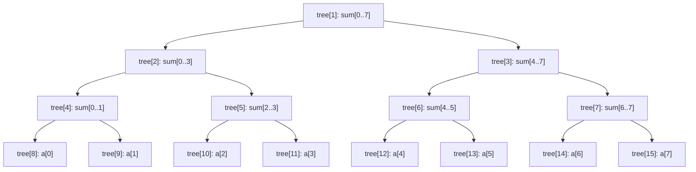

# Segment Tree

> Part of [[README|20 DSA Patterns]] • `Coding Patterns/09_Advanced` • Pattern #24 (Optional)
> **Trigger:** "Range query + point update" / "Mutable array range sum/min/max" — O(log n) per operation.

## Intent

A binary tree over an array where each node stores the aggregate (sum, min, max, gcd, etc.) of a segment. Supports range queries and point updates in O(log n). The array-based representation uses `tree[4*n]` with 1-indexed nodes: left child `2*i`, right child `2*i+1`.

## Why it Matters

- **Range query + point update** is the classic use case. Prefix sum = O(1) query but O(n) update. Segment tree = O(log n) both.
- **Associative operation required:** sum, min, max, gcd, product, bitwise OR/AND — any operation where `(a op b) op c = a op (b op c)`.
- **Lazy propagation** extends to range updates (add/set on range) + range queries.
- **Fenwick Tree (BIT)** is simpler for prefix sums; segment tree is more general (min/max, non-invertible ops).
- Senior signal: knowing the array layout (`tree[4*n]`), recursive build/query/update, and when to choose segment tree vs BIT vs Sparse Table.

## Diagram



## Problems

### 307. Range Sum Query - Mutable (Medium)
> [LeetCode 307](https://leetcode.com/problems/range-sum-query-mutable/) • Tags: Array, Design, Segment Tree

**Problem Statement:**
Given an integer array nums, handle multiple queries of the following types:
1. Update the value of an element in nums.
2. Calculate the sum of the elements of nums between indices left and right inclusive.

Implement the NumArray class:
- `NumArray(int[] nums)` Initializes the object with the integer array nums.
- `void update(int index, int val)` Updates the value of nums[index] to be val.
- `int sumRange(int left, int right)` Returns the sum of the elements of nums between indices left and right inclusive.

**Examples:**
- Input: ["NumArray","sumRange","update","sumRange"], [[[1,3,5]],[0,2],[1,2],[0,2]]
- Output: [null,9,null,8]
---

### 308. Range Sum Query 2D - Mutable (Hard)
> [LeetCode 308](https://leetcode.com/problems/range-sum-query-2d-mutable/) • Tags: Array, Design, Matrix, Binary Indexed Tree, Segment Tree

**Problem Statement:**
Given a 2D matrix matrix, handle multiple queries of the following types:
1. Update the value of a cell in matrix.
2. Calculate the sum of the elements of matrix inside the rectangle defined by its upper left corner (row1, col1) and lower right corner (row2, col2).
---

### 218. The Skyline Problem (Hard)
> [LeetCode 218](https://leetcode.com/problems/the-skyline-problem/) • Tags: Array, Divide and Conquer, Binary Indexed Tree, Segment Tree, Line Sweep, Heap (Priority Queue), Ordered Set

**Problem Statement:**
A city's skyline is the outer contour of the silhouette formed by all the buildings in that city when viewed from a distance. Given the locations and heights of all the buildings, return the skyline formed by these buildings collectively.
---

### 303. Range Sum Query - Immutable (Easy)
> [LeetCode 303](https://leetcode.com/problems/range-sum-query-immutable/) • Tags: Array, Design, Prefix Sum

**Problem Statement:**
Given an integer array nums, handle multiple queries of the following type: Calculate the sum of the elements of nums between indices left and right inclusive where left <= right. (Immutable → use Prefix Sum instead)
---

## Code / Example

```java
// Segment Tree for Range Sum + Point Update — LC 307
class NumArray {
    int[] tree;
    int n;

    public NumArray(int[] nums) {
        n = nums.length;
        tree = new int[4 * n];
        build(nums, 1, 0, n - 1);
    }

    void build(int[] nums, int node, int l, int r) {
        if (l == r) {
            tree[node] = nums[l];
            return;
        }
        int mid = (l + r) / 2;
        build(nums, node * 2, l, mid);
        build(nums, node * 2 + 1, mid + 1, r);
        tree[node] = tree[node * 2] + tree[node * 2 + 1];
    }

    public void update(int index, int val) {
        update(1, 0, n - 1, index, val);
    }

    void update(int node, int l, int r, int idx, int val) {
        if (l == r) {
            tree[node] = val;
            return;
        }
        int mid = (l + r) / 2;
        if (idx <= mid) update(node * 2, l, mid, idx, val);
        else update(node * 2 + 1, mid + 1, r, idx, val);
        tree[node] = tree[node * 2] + tree[node * 2 + 1];
    }

    public int sumRange(int left, int right) {
        return query(1, 0, n - 1, left, right);
    }

    int query(int node, int l, int r, int ql, int qr) {
        if (ql > r || qr < l) return 0; // no overlap
        if (ql <= l && r <= qr) return tree[node]; // full overlap
        int mid = (l + r) / 2;
        return query(node * 2, l, mid, ql, qr) + query(node * 2 + 1, mid + 1, r, ql, qr);
    }
}

// Generic Segment Tree (min, max, sum, gcd...)
class SegTree {
    int[] tree;
    int n;
    java.util.function.IntBinaryOperator op;
    int identity;

    SegTree(int[] arr, java.util.function.IntBinaryOperator op, int identity) {
        this.op = op;
        this.identity = identity;
        n = arr.length;
        tree = new int[4 * n];
        build(arr, 1, 0, n - 1);
    }

    void build(int[] arr, int node, int l, int r) {
        if (l == r) { tree[node] = arr[l]; return; }
        int mid = (l + r) / 2;
        build(arr, node * 2, l, mid);
        build(arr, node * 2 + 1, mid + 1, r);
        tree[node] = op.applyAsInt(tree[node * 2], tree[node * 2 + 1]);
    }

    void update(int idx, int val) { update(1, 0, n - 1, idx, val); }
    void update(int node, int l, int r, int idx, int val) {
        if (l == r) { tree[node] = val; return; }
        int mid = (l + r) / 2;
        if (idx <= mid) update(node * 2, l, mid, idx, val);
        else update(node * 2 + 1, mid + 1, r, idx, val);
        tree[node] = op.applyAsInt(tree[node * 2], tree[node * 2 + 1]);
    }

    int query(int ql, int qr) { return query(1, 0, n - 1, ql, qr); }
    int query(int node, int l, int r, int ql, int qr) {
        if (ql > r || qr < l) return identity;
        if (ql <= l && r <= qr) return tree[node];
        int mid = (l + r) / 2;
        return op.applyAsInt(
            query(node * 2, l, mid, ql, qr),
            query(node * 2 + 1, mid + 1, r, ql, qr)
        );
    }
}

// Usage examples:
var sumTree = new SegTree(nums, (a, b) -> a + b, 0);
var minTree = new SegTree(nums, Math::min, Integer.MAX_VALUE);
var maxTree = new SegTree(nums, Math::max, Integer.MIN_VALUE);
var gcdTree = new SegTree(nums, (a, b) -> {
    while (b != 0) { int t = a % b; a = b; b = t; }
    return a;
}, 0);
```

## When to Use / When NOT

- **Use:** range query + point update interleaved; range min/max/gcd; non-invertible operations; 2D segment tree (matrix).
- **NOT:** static array (use Prefix Sum / Sparse Table); prefix sum only (use Fenwick/BIT — simpler); only count queries (use BIT).

## Trade-offs

| Structure | Query | Update | Operations | Space |
|-----------|-------|--------|------------|-------|
| Segment Tree | O(log n) | O(log n) | Any associative | O(4n) |
| Fenwick (BIT) | O(log n) | O(log n) | Invertible only (sum, xor) | O(n) |
| Prefix Sum | O(1) | O(n) | Sum only | O(n) |
| Sparse Table | O(1) | N/A (static) | Idempotent (min/max/gcd) | O(n log n) |

## Vs Table

| Aspect | Segment Tree | Fenwick Tree | Sparse Table | Prefix Sum |
|--------|--------------|--------------|--------------|------------|
| Range query | Yes | Prefix only | Yes | Yes |
| Point update | Yes | Yes | No | No |
| Range update | With lazy | Complex | No | No |
| Operations | Any associative | Invertible only | Idempotent | Sum only |
| Code complexity | Medium | Low | Low | Trivial |
| Pick when | General range query+update | Prefix sum/xor | Static min/max/gcd | Static sum only |

## Pitfalls

- **Tree size `4*n`** — safe upper bound for any n. Exact bound is `2 * 2^ceil(log2(n)) - 1` but `4*n` is simpler and safe.
- **1-indexed nodes** — root = 1, left = `2*node`, right = `2*node+1`. Using 0-indexed nodes is error-prone.
- **Identity element** — for sum it's 0, for min it's `Integer.MAX_VALUE`, for max it's `Integer.MIN_VALUE`, for gcd it's 0. Wrong identity = wrong results.
- **Overlap logic:** three cases — no overlap (return identity), full overlap (return node), partial overlap (recurse both).
- **Lazy propagation** for range updates: store pending update in `lazy[node]`, push down before recursing. Required for "add v to range [l,r]" + range query.

## Interview Q&A (Senior Depth)

**Q: Why `4*n` size for the tree array?**
A: A segment tree is a full binary tree. For n leaves, the next power of 2 is `2^ceil(log2(n))`. Total nodes = `2 * 2^ceil(log2(n)) - 1`. Worst case when n = 2^k + 1, `ceil(log2(n)) = k+1`, so `2 * 2^(k+1) - 1 = 4 * 2^k - 1 < 4 * n`. `4*n` is a safe, simple upper bound.

**Q: Segment Tree vs Fenwick Tree — when do you choose which?**
A: Fenwick: only prefix queries (sum, xor, product) with point updates. Simpler code, smaller constant, O(n) space. Segment Tree: arbitrary range queries (min, max, gcd, any associative op), or when you need range updates with lazy propagation. If the operation is invertible (has inverse) and you only need prefix queries, BIT wins. Otherwise segment tree.

**Q: How does lazy propagation work for range add + range sum?**
A: Each node stores `lazy` = pending addition for its entire segment. On query/update, if `lazy[node] != 0`, apply it: `tree[node] += lazy[node] * (r-l+1)`, push to children `lazy[child] += lazy[node]`, then clear `lazy[node] = 0`. This defers work until needed. Time remains O(log n) because each level is visited at most once per operation.

**Q: Sparse Table vs Segment Tree for range min/max?**
A: Sparse Table: O(1) query, O(n log n) build, **static only** (no updates). Segment Tree: O(log n) query, O(n) build, **supports updates**. If array is static and you need many queries, Sparse Table is faster. If updates are interleaved, Segment Tree is the only choice.

**Q: 2D Segment Tree vs 2D BIT?**
A: 2D BIT: `O(log^2 n)` for prefix sum + point update. Simpler. 2D Segment Tree: `O(log^2 n)` for range query + point update. Can handle range min/max. 2D Segment Tree with lazy is complex — often 1D segment tree of 1D segment trees (tree of trees). For LeetCode 308, 2D BIT is preferred for simplicity.


## Flashcards (Spaced Repetition)

#flashcard
**Q:** What is the trigger keyword for Segment Tree? :: **A:** range query + point update, range min/max/sum, range assignment, lazy propagation #flashcard

#flashcard
**Q:** Time/space complexity of Segment Tree? :: **A:** Time: O(log n) query/update, Space: O(4n) array or O(n) nodes #flashcard

#flashcard
**Q:** When do you NOT use Segment Tree? :: **A:** static array (use prefix sum/sparse table O(1) query), only point queries (use array) #flashcard

#flashcard
**Q:** Core Java 25 snippet for Segment Tree? :: **A:** `class SegTree{ int n; long[] t; SegTree(int[] a){ n=a.length; t=new long[4*n]; build(1,0,n-1,a); } void build(int v,int tl,int tr,int[] a){ if(tl==tr) t[v]=a[tl]; else{ int tm=(tl+tr)/2; build(v*2,tl,tm,a); build(v*2+1,tm+1,tr,a); t[v]=t[v*2]+t[v*2+1]; } } }` #flashcard


## Practice Tasks (Tasks Plugin)
- [ ] Restate the intent from memory 📅 {date:YYYY-MM-DD, +1}
- [ ] Code the snippet without looking 📅 {date:YYYY-MM-DD, +3}
- [ ] Answer all Interview Q&A aloud 📅 {date:YYYY-MM-DD, +7}
- [ ] Review flashcards (Spaced Repetition) 📅 {date:YYYY-MM-DD, +1}

```tasks
not done
path includes {file.folder}
sort by due
limit 10
```

## Related
- [[01_Array/01 - Prefix Sum|Prefix Sum]] (static range sum)
- [[09_Advanced/02 - Kadane's Algorithm|Kadane's Algorithm]] (max subarray = segment tree with custom node)
- [[Java/07_DSA/Tree]] (tree structure)
---

*Category: Coding Patterns/09_Advanced • Optional Pattern #24*