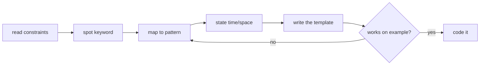

## Why it Matters

One page that maps a problem's surface signal to the pattern, data structure, and template before any code is written. The point is not memorizing solutions, it is cutting the recognition step from minutes to seconds. When the constraint reads `sorted` + `pair` the two-pointer loop should already be forming, not being rediscovered mid-problem.

The decision table is the whole note: keyword → pattern → complexity → one-line shape. Everything else is drill material.

## Diagram


Recognition before typing. A wrong pattern caught at the keyword stage costs one line; the same mistake found at the test stage costs the interview.

## When to use / not

- Use during pattern drill and as a warm-up sheet before a problem set, the decision table is fastest while patterns are still being internalized.
- Use mid-interview only as a mental checklist, never as something recited; state the complexity out loud instead.
- NOT a substitute for the per-pattern notes: the one-liner template gives the shape, not the edge cases, and the `Pitfalls` sections are where the actual bugs live.
- NOT for problems that combine two patterns (sliding window + monotonic deque, BFS + heap), the table answers one keyword at a time.

## Trade-offs

| property | this cheat sheet | full pattern notes | LeetCode-only study |
|---|---|---|---|
| coverage | all 20 patterns, one row each | one note per pattern, full depth | no pattern abstraction |
| retrieval speed | seconds, single table | slower, more context | slowest, problem-by-problem |
| transfer to unseen problems | high, keyword-to-pattern map | highest, reasoning included | low |
| maintenance | table must track new patterns | notes are independent | none |

The compression is the value and the limit: 19 rows cannot carry the failure modes a `Pitfalls` list does.

## Vs

| | This cheat sheet | Per-pattern note | Spaced-repetition cards |
|---|---|---|---|
| form | decision table + one-liners | narrative + code + pitfalls | question/answer pairs |
| best for | recognition under time pressure | learning why a pattern works | retention over weeks |
| failure mode | can be quoted without understanding | slower to recall in interview | cards drift out of context |
| pick when | 30 seconds to choose an approach | first pass on a new pattern | keeping old patterns fresh |

## Pitfalls

- Pattern numbers here are this vault's ordering, not LeetCode's or the AlgoMaster course numbering, cross-reference by name, never by number.
- The template column is a shape, not a contract: `while(l<r)` versus `while(l<=r)` is decided by the specific problem, and the table will not tell you which.
- `Two Heaps` and `Cyclic Sort` appear in the table but have no dedicated note in this vault, these rows are the only coverage they get here.
- The in-note `Vs tables` are simplified for speed; each pattern note holds the deeper comparison that includes the real edge cases.

## Interview q&a

**Q: You are given a problem and 60 seconds. Walk me through how you pick a pattern.**
I read the constraints first, not the story, and look for the keyword that constrains the data: `sorted` + `pair` → two pointers; `contiguous` + `longest` → sliding window; `k` + `largest` → heap; `shortest` or `steps` → BFS; `all combinations` → backtracking; `optimal` plus overlapping subproblems → DP. Then I state time and space out loud before coding, because if I cannot state them I have not chosen a pattern yet.

**Q: The table lists 19 patterns. How do you avoid pattern-matching yourself into the wrong solution?**
I test the chosen pattern against one concrete example before committing to code, and I watch for the contradictions: an unsorted array rules out two pointers unless I sort first and track original indices; negative edge weights rule out Dijkstra in favour of Bellman-Ford. A pattern that needs a caveat to survive the example is the wrong pattern.

**Q: DP and Backtracking both explore choices. When is which correct?**
Backtracking enumerates every solution; DP counts or optimizes over them. If the question asks "how many ways" or "the minimum cost", subproblems overlap and memoization can deduplicate them, so DP applies. If it asks "return all combinations", each path is distinct, nothing dedupes, and backtracking is the answer.

**Q: What does a cheat sheet not give you that an interviewer will still ask about?**
Edge cases and proof obligations. The table gives the loop shape; it does not say that flood fill must check `old == newColor` first, that Dijkstra needs the stale-entry skip, or that greedy needs an exchange argument. Those live in the per-pattern `Pitfalls` sections, and that is exactly where an interviewer probes.

## Related

- [[Coding Patterns/DSA-Roadmap-AlgoMaster|DSA Roadmap (AlgoMaster)]], how to schedule these patterns against a deadline
- [[Coding Patterns/01_Array/02 - Two Pointers|Two Pointers]] · [[Coding Patterns/01_Array/03 - Sliding Window|Sliding Window]]
- [[Coding Patterns/03_Stack_Heap/02 - Top K Elements|Top K Elements]] · [[Coding Patterns/07_Backtracking_DP/02 - Dynamic Programming|Dynamic Programming]]
- [[Java/07_DSA/Array]] · [[Java/07_DSA/HashMap]] · [[Java/07_DSA/Heap]]

*Category: CheatSheet*

## Practice

- [1. Two Sum](https://leetcode.com/problems/two-sum/)
- [121. Best Time To Buy And Sell Stock](https://leetcode.com/problems/best-time-to-buy-and-sell-stock/)
- [215. Kth Largest Element In An Array](https://leetcode.com/problems/kth-largest-element-in-an-array/)

---

# Coding Patterns - Cheat Sheet (all dsa Patterns)

## Pattern → When → Template (Interview Decision Table)

| # | Pattern | Signal Keywords | Data Structure | Time | One-Liner Template |
|---|---|---|---|---|---|
| 1 | Two Pointers | sorted, pair, palindrome, remove duplicates | Array/String | O(n) | `l=0,r=n-1; while(l<r){... l++ / r--}` |
| 2 | Sliding Window | subarray/substring, k, longest/shortest, distinct | Array/String + Map | O(n) | `for r: expand; while(invalid) shrink l++; update` |
| 3 | Fast & Slow (Floyd) | cycle, middle, linked list | LinkedList | O(n) | `slow=slow.next; fast=fast.next.next` |
| 4 | Merge Intervals | intervals, overlap, meeting | Sort + List | O(n log n) | Sort by start, merge if `curr.start <= prev.end` |
| 5 | Cyclic Sort | 1..n, missing, duplicate, range | Array | O(n) | `while(nums[i]!= nums[nums[i]-1]) swap` |
| 6 | In-place Reversal | reverse linked list, k-group | LinkedList | O(n) | `prev=null; cur=head; nxt=cur.next` |
| 7 | BFS (Level Order) | shortest, level, tree traversal | Queue | O(V+E) | `queue.add(root); while(!q.isEmpty()) levelSize=q.size()` |
| 8 | DFS (Tree/Graph) | path, all solutions, connected | Stack/Recursion | O(V+E) | `dfs(node){ for(child) dfs(child) }` |
| 9 | Two Heaps | median, median stream | 2× PriorityQueue | O(log n) | `maxHeap (small) + minHeap (large); balance sizes` |
| 10 | Top K | k largest/smallest/frequent | Heap / QuickSelect | O(n log k) | `minHeap size k; offer+poll` |
| 11 | Binary Search | sorted, search, rotated, lower bound | Array | O(log n) | `lo=0,hi=n-1; mid=lo+(hi-lo)/2` |
| 12 | Modified Binary Search | rotated, infinite, bitonic | Array | O(log n) | Check which half is sorted |
| 13 | Bitwise XOR | single number, missing, appears once | int | O(n) | `x^ x =0; x^0=x; a^b^a = b` |
| 14 | Backtracking | subsets, permutations, N-Queens, combinations | Recursion + choose/explore/unchoose | O(2ⁿ)/O(n!) | `pick → recurse → unpick` |
| 15 | DP - 0/1 knapsack | weight, profit, subset sum | dp[n][W] | O(nW) | `dp[i][w]=max(dp[i-1][w], dp[i-1][w-wt[i]]+val[i])` |
| 16 | DP - Unbounded | coin change, rod cutting | dp[W] | O(nW) | `dp[w]=min(dp[w], dp[w-coin]+1)` |
| 17 | DP - LCS/LPS | longest common/palindromic subsequence | dp[n][m] | O(nm) | `if(a[i]==b[j])1+dp[i+1][j+1] else max(dp[i+1][j],dp[i][j+1])` |
| 18 | Greedy | interval scheduling, jump game, activity | Sort | O(n log n) | Sort by end, pick earliest finishing |
| 19 | Union Find | connected components, cycle, islands | DSU | α(n) | `find + union by rank + path compression` |

## Vs Tables

| Comparison | A | B | Pick |
|---|---|---|---|
| Sliding Window vs Two Pointers | Contiguous subarray (variable/fixed window) | Pair from ends / sorted search | Window for substring; pointers for pair/palindrome |
| BFS vs DFS | Shortest path, level order | All paths, backtracking, topological | BFS for shortest; DFS for exhaustive |
| Heap vs Sort for Top-K | Heap O(n log k) | Sort O(n log n) | Heap when k << n |
| DP vs Greedy | Optimal substructure + overlapping, need global optimum | Local optimum → global (interval, Huffman) | Try greedy; if counterexample → DP |
| Backtracking vs DP | Enumerate all solutions | Count/optimize (memoize) | DP = backtracking + memo |
| Binary Search vs Two Pointers | Sorted search / boundary | Sorted pair / partition | BS for existence; pointers for pair |

## Java 25 One-liners per Pattern

```java
// 1. Two Pointers - two sum sorted / palindrome
boolean isPal(String s){ int l=0,r=s.length()-1; while(l<r) if(s.charAt(l++)!=s.charAt(r--)) return false; return true; }

// 2. Sliding Window - longest without repeating
int longestUnique(String s){ var set=new HashSet<Character>(); int l=0,max=0;
 for(int r=0;r<s.length();r++){ while(set.contains(s.charAt(r))) set.remove(s.charAt(l++)); set.add(s.charAt(r)); max=Math.max(max,r-l+1);} return max; }

// 3. Fast & Slow - cycle detect
boolean hasCycle(ListNode h){ var s=h,f=h; while(f!=null&&f.next!=null){s=s.next; f=f.next.next; if(s==f) return true;} return false; }

// 4. Merge Intervals
Arrays.sort(intervals, Comparator.comparingInt(a->a[0]));
var merged=new ArrayList<int[]>(); for(int[] cur: intervals){ if(merged.isEmpty()||cur[0]>merged.getLast()[1]) merged.add(cur); else merged.getLast()[1]=Math.max(merged.getLast()[1],cur[1]); }

// 7/8. BFS & DFS
void bfs(TreeNode root){ var q=new ArrayDeque<TreeNode>(); q.add(root); while(!q.isEmpty()){ var n=q.poll(); if(n.left!=null)q.add(n.left); if(n.right!=null)q.add(n.right);} }

// 9. Two Heaps - median stream
PriorityQueue<Integer> lo=new PriorityQueue<>(Comparator.reverseOrder()), hi=new PriorityQueue<>();
void add(int x){ lo.offer(x); hi.offer(lo.poll()); if(lo.size()<hi.size()) lo.offer(hi.poll()); }
double median(){ return lo.size()>hi.size()? lo.peek() : (lo.peek()+hi.peek())/2.0; }

// 10. Top K frequent - heap vs bucket O(n)
var freq=new HashMap<Integer,Integer>(); for(int x:nums) freq.merge(x,1,Integer::sum);
var pq=new PriorityQueue<Map.Entry<Integer,Integer>>(Comparator.comparingInt(Map.Entry::getValue));
for(var e: freq.entrySet()){ pq.offer(e); if(pq.size()>k) pq.poll(); }

// 11. Binary Search - lower bound
int lowerBound(int[] a,int t){ int lo=0,hi=a.length; while(lo<hi){int m=lo+(hi-lo)/2; if(a[m]<t) lo=m+1; else hi=m;} return lo; }

// 13. XOR - single number
int single(int[] a){ int x=0; for(int n:a) x^=n; return x; }

// 14. Backtracking - subsets
void subsets(int[] nums,int i,List<Integer> cur,List<List<Integer>> res){ res.add(new ArrayList<>(cur)); for(int j=i;j<nums.length;j++){cur.add(nums[j]); subsets(nums,j+1,cur,res); cur.removeLast();} }

// 15-17. DP - knapsack 1D optimized, LCS
int knapsack(int[] wt,int[] val,int W){ int[] dp=new int[W+1]; for(int i=0;i<wt.length;i++) for(int w=W;w>=wt[i];w--) dp[w]=Math.max(dp[w],dp[w-wt[i]]+val[i]); return dp[W]; }
int lcs(String a,String b){ int[][] dp=new int[a.length()+1][b.length()+1]; for(int i=1;i<=a.length();i++) for(int j=1;j<=b.length();j++) dp[i][j]= a.charAt(i-1)==b.charAt(j-1)?1+dp[i-1][j-1]:Math.max(dp[i-1][j],dp[i][j-1]); return dp[a.length()][b.length()]; }

// 19. Union-Find
class DSU{ int[] p,r; DSU(int n){p=IntStream.range(0,n).toArray(); r=new int[n];} int find(int x){return p[x]==x?x:(p[x]=find(p[x]));} void union(int a,int b){a=find(a);b=find(b); if(a==b)return; if(r[a]<r[b])p[a]=b;else if(r[a]>r[b])p[b]=a;else{p[b]=a; r[a]++;}} }

// Sliding window max - deque O(n)
int[] maxWindow(int[] a,int k){ var dq=new ArrayDeque<Integer>(); var res=new int[a.length-k+1];
 for(int i=0;i<a.length;i++){while(!dq.isEmpty()&&a[dq.peekLast()]<=a[i])dq.pollLast(); dq.addLast(i); if(dq.peekFirst()<=i-k)dq.pollFirst(); if(i>=k-1)res[i-k+1]=a[dq.peekFirst()];} return res;}
```
> **How to pick in interview:** Read constraints → spot keyword → map to pattern above → state time/space → code template. If `sorted` + `pair` → Two Pointers; `substring` → Sliding Window; `k` + `largest` → Heap; `shortest` → BFS; `all combinations` → Backtracking; `optimal + overlapping subproblems` → DP.
