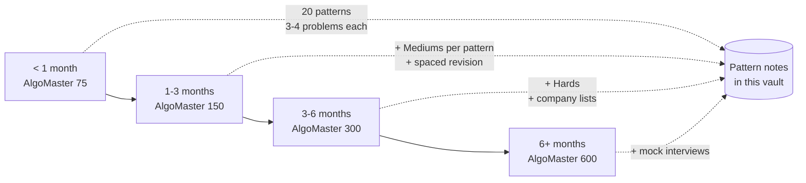

# DSA Roadmap (AlgoMaster)

> Companion to [[README|20 DSA Patterns]] (+1: [[05_Trees_Graphs/06 - Union Find|Union Find #21]]). Source: [AlgoMaster DSA course](https://algomaster.io/learn/dsa/), 75+ patterns, 600+ problems, animations per problem.

## Why it Matters
A time-boxed plan that converts a 75+ pattern catalogue into a calendar. Pattern knowledge without a schedule stalls: most candidates can recognize a sliding window, far fewer have rehearsed enough of them under time pressure to do it in an interview. The roadmap fixes the sequence and the volume so progress is measurable rather than aspirational.

It is deliberately indexed to this vault — every core pattern named in the course has a note here, so a track entry resolves to a concrete file to read, not a topic to search for.

## Diagram

Each track widens depth and difficulty; the pattern set itself stops growing after the first track, the rest is volume and pressure.

## When to Use / Not
- **Use** when starting DSA preparation with a known deadline, the tracks exist to match a date to a volume.
- **Use** the study loop inside any track: pattern first, attempt before reading the solution, log complexity, revisit weekly.
- **NOT** if the target is a specific company with a published problem list, company lists beat generic tracks from the three-month mark onward.
- **NOT** as a substitute for the pattern notes: the roadmap says what to study and when, never how a pattern works.

## Trade-offs
| Dimension | This Roadmap | Company-Tagged Lists | Breadth-First Coverage |
|-----------|--------------|----------------------|------------------------|
| Ordering | by difficulty ramp | by interview likelihood | by topic completeness |
| Motivation risk | mid-track plateau | list churn, stale tags | slow visible progress |
| Coverage gaps | possible at the long tail | concentrated on asked topics | deep early, shallow later |
| Revision | built in, weekly revisit | none | none |

A ramp trades optimality for sustainability: a company list is more efficient while it stays accurate, and less useful the moment hiring shifts.

## Vs
| | AlgoMaster Roadmap | Blind 75 / NeetCode 150 | Grind 75 |
|---|---|---|---|
| Organizing unit | pattern, then problems | curated problem list | problem list with timeboxes |
| Pattern abstraction | explicit, 75+ named patterns | implicit, grouped by topic | implicit |
| Scheduling | tracks from 1 to 6+ months | none | built in, configurable |
| Pick when | pattern-first study with a schedule | community-vetted coverage | a fixed daily volume |

Both NeetCode-style lists and this roadmap converge on the same problems; the difference is whether they are indexed by pattern or by difficulty.

## Pitfalls
- The track numbers are volume, not progress. Finishing 75 problems means nothing if the pattern recognition did not transfer, the study loop's "note the clue" step is the actual deliverable.
- Spaced revision is the first step candidates drop under time pressure, and it is the only step that protects against pattern decay.
- Course pattern names and this vault's numbering differ (`Union Find` is #21 here, beyond the original 20), cross-reference by name.
- Do not mix tracks. Jumping to Hards before a pattern's Easy and Medium volume is done produces solutions that cannot be reproduced under interview conditions.

## Interview Q&A

**Q: You have four weeks. How do you prepare?**
I take the shortest track and sequence by pattern, not by difficulty: all 20 patterns first at three to four problems each, high-priority patterns earlier. Volume per pattern matters more than total volume, because the transferable skill is recognizing the pattern from the problem's surface, and that needs several exposures per pattern. I reserve the last week for timed full problems, not new patterns.

**Q: How do you know whether your study is actually working, versus accumulating problem counts?**
The test is transfer, not completion. If I can read a new problem, name the pattern, and state the time and space complexity before writing code, the study worked. If I only recognize the pattern after reading the solution, I am still in the recognition gap, and the fix is more problems per pattern rather than more patterns.

**Q: What do candidates most often get wrong about DSA preparation?**
They index by problem count and skip revision. Solving 150 problems once leaves a pattern half-remembered three weeks later; spacing the same problems over time is what keeps them available under interview pressure. The second common failure is reading solutions before attempting, which converts practice into reading comprehension and removes the only part that transfers.

**Q: This roadmap is pattern-first. When is that the wrong approach?**
When the interview format does not match. Pattern-first study optimizes for standard algorithmic screens. It is the wrong frame for a debugging- or design-heavy loop, where a system design plan or the company's own problem archive is the better allocation of the same hours.

## Related
- [[Coding Patterns/Cheat Sheet|Cheat Sheet]], the per-pattern decision table this roadmap schedules
- [[Coding Patterns/05_Trees_Graphs/06 - Union Find|Union Find]], the #21 pattern beyond the original 20
- [[Coding Patterns/01_Array/01 - Prefix Sum|Prefix Sum]] · [[Coding Patterns/05_Trees_Graphs/04 - Shortest Path|Shortest Path]]

---

# DSA Roadmap (AlgoMaster)

## Time-boxed Tracks

| Time | Track | How |
|------|-------|-----|
| < 1 month | AlgoMaster 75 | 20 patterns in this vault, 3–4 problems each, High-priority first |
| 1–3 months | AlgoMaster 150 | Above + Mediums per pattern + spaced revision |
| 3–6 months | AlgoMaster 300 | Above + Hards (DP, graphs) + company lists |
| 6+ months | AlgoMaster 600 | Full coverage + mock interviews |

## Study Loop (Course's, Compressed)
1. Learn the pattern, not the solution.
2. Attempt before reading.
3. Compare with optimal; note the *clue* that signals the pattern.
4. Log time/space.
5. Revisit misses weekly.
Never memorize, derive.

## Pattern Coverage Check
All course-named core patterns are in-vault:
- Two Pointers (#2), Sliding Window (#3), Prefix Sum (#1), Frequency Counting (#6)
- Monotonic Stack (#7), Binary Search (#11), Top K (#9)
- DFS (#13), BFS (#14), Union Find (#21)
- Intervals (#10), Greedy (#19), DP (#20)

## Beyond the Vault
- [Animations](https://algomaster.io/animations/dsa), step-through with code highlighting (interactive, link only)
- Company-wise lists + AI mock interviews, on the course page