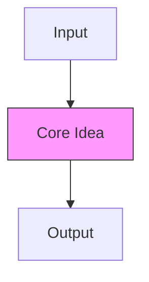

# <% tp.file.title.replace(/^\d+\s*-\s*/, "") %>

> Pattern #`<% tp.frontmatter.pattern %>` of [[README|20 DSA Patterns]] • `<% tp.file.folder(true) %>`

## Intent

One sentence: what problem does this pattern solve? Define the **key term** in **bold**.

## Why it Matters

- Where this appears in interviews (FAANG, senior vs. junior)
- Real-world analogies (caching, scheduling, indexing)
- Senior signal: recognizing the *disguised* form of this pattern

## Diagram



## Problems

> **Real problem statements are fetched from LeetCode.** After creating the note, run the "Fetch LeetCode Problems" script (or manually add) to populate this section with actual problem statements, examples, and tags.

<%*
const lc = tp.frontmatter.leetcode || [];
if (lc.length > 0) {
    for (const num of lc) {
        tR(`### ${num}. Problem Title (${tp.frontmatter.difficulty})`);
        tR(`> [LeetCode ${num}](https://leetcode.com/problems/${num.toLowerCase().replace(/ /g, "-")}/) • Tags: [auto-filled after fetch]`);
        tR(``);
        tR(`**Problem Statement:**`);
        tR(``);
        tR(`[Fetched from LeetCode GraphQL API]`);
        tR(``);
        tR(`**Examples:**`);
        tR(`[Fetched from LeetCode]`);
        tR(`---`);
        tR(``);
    }
} else {
    tR(`> No LeetCode problems linked yet. Add numbers to frontmatter \`leetcode\` array.`);
    tR(``);
}
_%>

> 📊 **Track progress:** Add solved problem numbers to `problems-solved` array in frontmatter with date in `problems-solved-dates`. Set `sr-due` for spaced repetition.
> 🎨 **Visual diagram:** Create Excalidraw drawing from template: `Cmd+P → Excalidraw: New from template → Pattern Diagram`

## Code / Example

```java
// Java 25: var, record, pattern matching for instanceof, SequencedCollection, virtual threads (if parallel), Compact Object Headers
// Core template for <% tp.file.title.replace(/^\d+\s*-\s*/, "") %>

record <% tp.file.title.replace(/^\d+\s*-\s*/, "").replace(/\s+/g, "") %>(/* params */) {
    // factory or builder
    static <% tp.file.title.replace(/^\d+\s*-\s*/, "").replace(/\s+/g, "") %> of(/* params */) {
        // build logic
        return new <% tp.file.title.replace(/^\d+\s*-\s*/, "").replace(/\s+/g, "") %>(/* args */);
    }
    
    // key operation
    /* returnType */ keyMethod(/* params */) {
        // O(1) or O(n) logic
    }
}

// Example usage
void example() {
    var instance = <% tp.file.title.replace(/^\d+\s*-\s*/, "").replace(/\s+/g, "") %>.of(/* args */);
    var result = instance.keyMethod(/* args */);
}
```

### Concrete Example

- **Input:** 
- **Output:** 
- **Explanation:** 

## When to Use / When NOT

| **Use When** | **Avoid When** |
|--------------|----------------|
| - Trigger keywords:  | - Data mutates frequently (use Segment Tree / Fenwick) |
| - Constraints: | - Single query (just loop) |
| - Pattern signature: | - Need min/max/gcd on range (use Sparse Table) |
| - Immutable data, repeated queries | - |

## Trade-offs

| Dimension | This Pattern | Alternative A | Alternative B |
|-----------|--------------|---------------|---------------|
| Build     |              |               |               |
| Query     |              |               |               |
| Update    |              |               |               |
| Space     |              |               |               |
| Pick when |              |               |               |

## Vs Table

| Aspect | This Pattern | Alternative A | Alternative B | Decision Rule |
|--------|--------------|---------------|---------------|---------------|
| Query type |              |               |               |               |
| Mutability |              |               |               |               |
| Implementation |            |               |               |               |

## Pitfalls

- Off-by-one errors (leading-zero convention, inclusive/exclusive bounds)
- Overflow: use `long` for sums/counts
- Missing base case in hashmap (e.g., `count.put(0, 1)` for prefix sums)
- 
## Interview Q&A (Senior Depth)

**Q1. What is the core insight of this pattern, and why does it work?**
**A:** In 2–3 sentences. Connect the *why* to the data structure invariant.

**Q2. When would you choose an alternative over this pattern?**
**A:** Cite concrete constraints (updates, query type, mutability) and name the alternative.

**Q3. How does this pattern change for streaming / mutable data?**
**A:** Explain the limitation and the exact data structure that replaces it (Fenwick, Segment Tree, etc.).

**Q4. Walk me through a non-obvious problem that reduces to this pattern.**
**A:** Describe the reduction step-by-step (e.g., "subarray sum = k → hashmap on prefix sums").

**Q5. What is the space optimization if the input is read-only and huge?**
**A:** Discuss in-place modification, bitset, or streaming variant.

## Flashcards (Spaced Repetition)

#flashcard
**Q:** What is the trigger keyword for <% tp.file.title.replace(/^\d+\s*-\s*/, "") %>? :: **A:** [trigger keywords] #flashcard

#flashcard
**Q:** Time/space complexity of <% tp.file.title.replace(/^\d+\s*-\s*/, "") %>? :: **A:** Time: O(), Space: O() #flashcard

#flashcard
**Q:** When do you NOT use <% tp.file.title.replace(/^\d+\s*-\s*/, "") %>? :: **A:** [mutating data / single query / need min-max] #flashcard

#flashcard
**Q:** Core Java 25 snippet for <% tp.file.title.replace(/^\d+\s*-\s*/, "") %>? :: **A:** `record ... { static of(...) {} keyMethod() {} }` #flashcard

## Related

- [[README|20 DSA Patterns]]
- [[<% tp.file.folder(true) %>/README|<% tp.file.folder(true).split("/").pop() %> Folder]]
<%*
const folder = tp.file.folder(true);
const files = app.vault.getMarkdownFiles().filter(f => f.path.startsWith(folder) && f.path !== tp.file.path);
for (const f of files.slice(0, 5)) {
    const name = f.basename;
    tR(`- [[${f.path.replace(/\.md$/, "")}|${name}]]`);
}
_%>

---

*Category: `<% tp.file.folder(true) %>` • Part of [[README|20 DSA Patterns]] • Java 25*