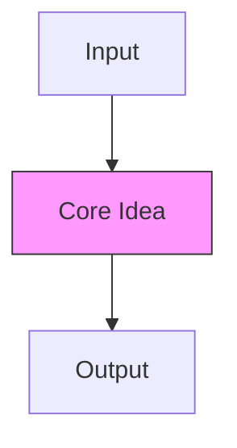

# {{title}}

> Pattern #`{{pattern}}` of [[README|20 DSA Patterns]] • `{{category}}`
> 🎨 **Visual diagram:** Create Excalidraw drawing from template: `Cmd+P → Excalidraw: New from template → Pattern Diagram`

## Intent
One sentence: what problem does this pattern solve? Define the **key term** in **bold**.

## Why it Matters
- Where this appears in interviews (FAANG, senior vs. junior)
- Real-world analogies (caching, scheduling, indexing)
- Senior signal: recognizing the *disguised* form of this pattern

## Diagram


## Problems
> **Real problem statements from LeetCode.** After creating the note, run the "Fetch LeetCode Problems" script to populate this section with actual problem statements, examples, and tags.

{{#each leetcode}}
### {{this}}. Problem Title ({{difficulty}})
> [LeetCode {{this}}](https://leetcode.com/problems/{{this.toLowerCase().replace(/ /g, '-')}}/) • Tags: [auto-filled after fetch]

**Problem Statement:**
[Fetched from LeetCode GraphQL API]

**Examples:**
[Fetched from LeetCode]
---
{{/each}}
> 📊 **Track progress:** Add solved problem numbers to `problems-solved` array in frontmatter with date in `problems-solved-dates`. Set `sr-due` for spaced repetition.

## Code / Example
```java
// Java 25: var, record, pattern matching for instanceof, SequencedCollection, virtual threads, Compact Object Headers
// Core template for {{title}}

record {{title.replace(/\s+/g, '').replace('-', '').replace('(', '').replace(')', '')}}(
    /* params */
) {
    // factory or builder
    static {{title.replace(/\s+/g, '').replace('-', '').replace('(', '').replace(')', '')}} of(/* params */) {
        // build logic
        return new {{title.replace(/\s+/g, '').replace('-', '').replace('(', '').replace(')', '')}}(/* args */);
    }
    
    // key operation
    /* returnType */ keyMethod(/* params */) {
        // O(1) or O(n) logic
    }
}

// Example usage
void example() {
    var instance = {{title.replace(/\s+/g, '').replace('-', '').replace('(', '').replace(')', '')}}.of(/* args */);
    var result = instance.keyMethod(/* args */);
}
```

### Concrete Example
- **Input:** 
- **Output:** 
- **Explanation:** 

## When to Use / When NOT
| **Use When** | **Avoid When** |
|--------------|----------------|
| - Trigger keywords: | - Data mutates frequently (use Segment Tree / Fenwick) |
| - Constraints: | - Single query (just loop) |
| - Pattern signature: | - Need min/max/gcd on range (use Sparse Table) |
| - Immutable data, repeated queries | - |

## Trade-offs
| Dimension | This Pattern | Alternative A | Alternative B |
|-----------|--------------|---------------|---------------|
| Build     |              |               |               |
| Query     |              |               |               |
| Update    |              |               |               |
| Space     |              |               |               |
| Pick when |              |               |               |

## Vs Table
| Aspect | This Pattern | Alternative A | Alternative B | Decision Rule |
|--------|--------------|---------------|---------------|---------------|
| Query type |              |               |               |               |
| Mutability |              |               |               |               |
| Implementation |            |               |               |               |

## Pitfalls
- Off-by-one errors (leading-zero convention, inclusive/exclusive bounds)
- Overflow: use `long` for sums/counts
- Missing base case in hashmap (e.g., `count.put(0, 1)` for prefix sums)

## Interview Q&A (Senior Depth)

**Q1. What is the core insight of this pattern, and why does it work?**
**A:** In 2–3 sentences. Connect the *why* to the data structure invariant.

**Q2. When would you choose an alternative over this pattern?**
**A:** Cite concrete constraints (updates, query type, mutability) and name the alternative.

**Q3. How does this pattern change for streaming / mutable data?**
**A:** Explain the limitation and the exact data structure that replaces it (Fenwick, Segment Tree, etc.).

**Q4. Walk me through a non-obvious problem that reduces to this pattern.**
**A:** Describe the reduction step-by-step (e.g., "subarray sum = k → hashmap on prefix sums").

**Q5. What is the space optimization if the input is read-only and huge?**
**A:** Discuss in-place modification, bitset, or streaming variant.

## Flashcards (Spaced Repetition)

#flashcard
**Q:** What is the trigger keyword for {{title}}? :: **A:** [trigger keywords for this pattern] #flashcard

#flashcard
**Q:** Time/space complexity of {{title}}? :: **A:** Time: O(), Space: O() #flashcard

#flashcard
**Q:** When do you NOT use {{title}}? :: **A:** [conditions to avoid this pattern] #flashcard

#flashcard
**Q:** Core Java 25 snippet for {{title}}? :: **A:** `// Java 25 snippet here` #flashcard

## Practice Tasks (Tasks Plugin)
- [ ] Restate the intent from memory 📅 {{date:YYYY-MM-DD, +1}}
- [ ] Code the snippet without looking 📅 {{date:YYYY-MM-DD, +3}}
- [ ] Answer all Interview Q&A aloud 📅 {{date:YYYY-MM-DD, +7}}
- [ ] Review flashcards (Spaced Repetition) 📅 {{date:YYYY-MM-DD, +1}}

```tasks
not done
path includes {{file.folder}} Patterns/_templates
sort by due
limit 10
```

## Related
- [[README|20 DSA Patterns]]
- [[Coding Patterns/_templates/README|{{file.folder.split('/').pop()}} Folder]]
---

*Category: {{category}} • Part of [[README|20 DSA Patterns]] • Java 25*