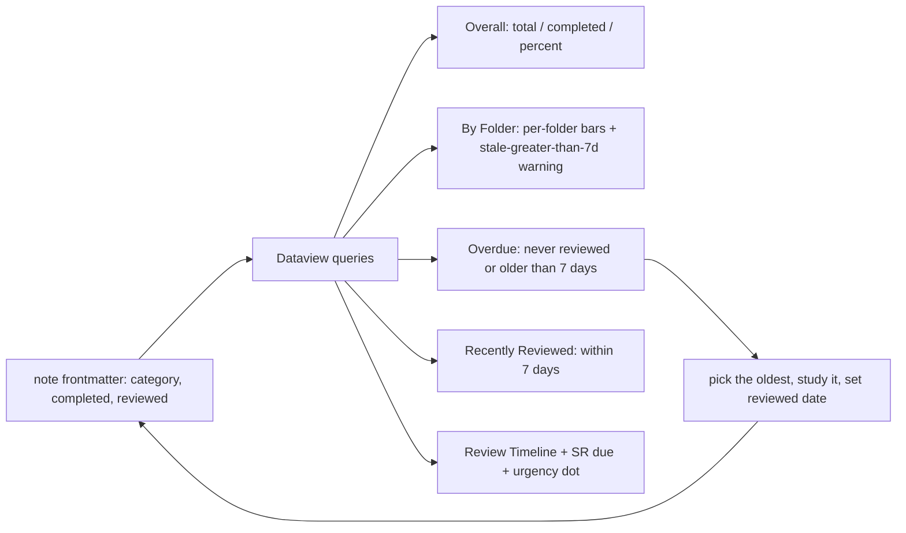

## Why it Matters

The **Dashboard is the feedback loop the rest of the vault runs on**. Every note carries `category`, `completed`, and `reviewed` frontmatter; this note renders those three fields as progress bars, per-folder completion, overdue review lists, and spaced-repetition timelines with Dataview. Without it, "am I ready?" is a guess, and the `reviewed` date has no consequence, so review discipline silently decays.

Core ideas:
- **Three fields drive everything**: `category` (groups a note), `completed: true` (learned once), `reviewed: YYYY-MM-DD` (last spaced-repetition pass). No other state exists.
- **Stale >7 days is the signal that matters**, a note you "completed" but never re-reviewed is not retained, so the By Folder table flags it with a warning.
- **Dataview is a hard dependency.** If the tables are empty, `Settings → Community plugins → Dataview` is not enabled; the note says so at the bottom.
- **Pin this tab.** It is the landing page, not a reference note; open it once and keep it open.

## Diagram



## Code

The dashboard renders three frontmatter fields, nothing else:
```yaml
---
category: overview # groups this note in the By Folder table
completed: false # set true when learned once
reviewed: 2026-09-17 # last spaced-repetition pass, YYYY-MM-DD
---
```
The queries behind the tables (Dataview must be enabled):
```dataviewjs
// Overall bar: percent of notes with completed == true
const pages = dv.pages('"Java"').where(p => p.category && p.file.name != "README");
const pct = Math.round(pages.where(p => p.completed).length / pages.length * 100);
dv.paragraph(`Completed ${pct}% of ${pages.length} notes`);
```
```dataview
TABLE WITHOUT ID file.link as "Note", reviewed as "Last Reviewed", date(now)-reviewed as "Ago"
FROM "Java"
WHERE category AND (!reviewed OR date(now)-reviewed > dur(7 days))
SORT reviewed ASC
```
No project needed, this is Obsidian plus the Dataview plugin.

## When to use / not

| Use | Avoid |
|-----|-------|
| Open it once and **pin the tab**, it is the landing page of the vault | Treating it as a reference note to read, it is a status screen |
| Act on the **Overdue** list: oldest `reviewed` date first | Admiring the progress bar and not studying the overdue notes |
| Set `reviewed: YYYY-MM-DD` *every* review session, it is what makes "stale" computable | Ticking `completed: true` and never setting `reviewed`, the note looks done but decays |
| Spot-check `completed` claims against unchecked `- [ ]` boxes in the note | Trusting the bar at 100%, a note with an "updated" API and no re-review is not done |

## Trade-offs

- **Three fields, no more**: the model is trivial to maintain and every note already has the frontmatter, but it cannot express partial progress or per-topic confidence.
- **Dataview queries are live**: tables update on reload with zero manual upkeep, but they make Dataview a hard dependency, disable the plugin and this note is empty.
- **`reviewed` plus 7-day staleness**: a simple, honest signal for spaced repetition, but self-reported, the date is only as trustworthy as the person who set it.
- **Vault-wide scope**: one view covers all of `Java/` and `99_Revision`, but with 169 notes the Overdue list can get long, which is itself useful information.

## Vs

**Progress tracking: Dashboard (Dataview) vs `99_Revision/Study Plan` tasks vs manual review**

| Aspect | Dashboard (this note) | Study Plan tasks | Manual / memory |
|--------|-----------------------|------------------|-----------------|
| Source of truth | note frontmatter | `- [ ]` checkboxes in a plan note | your recall |
| Live | yes, recomputed on open | yes, ticked as you go | no |
| Shows staleness | yes, `reviewed` older than 7 days | only if the task has a date | no |
| Best for | "what should I review today" | "what do I do this week" | nothing, it is the failure mode |

**`completed` vs `reviewed`**

| Field | Meaning | When set |
|-------|---------|----------|
| `completed: true` | learned once, concept understood | after the first pass + Q&A answered |
| `reviewed: YYYY-MM-DD` | last spaced-repetition pass | every time you re-answer the Q&A aloud |

## Pitfalls

- **Dataview not enabled** → every table is empty and the note looks broken. `Settings → Community plugins → Dataview → enable`, the note says so at the bottom.
- **`completed: true` with unchecked `- [ ]` boxes in the note** → the dashboard happily reports 100% while the practice tasks are undone; the Interview Strategy note calls this out as a trap.
- **Setting `reviewed` without actually answering the Q&A aloud** → the staleness signal becomes noise; the review rule is "answer the Q&A without looking".
- **Forgetting to pin the tab** → you stop opening it, staleness stops having consequences, and review discipline decays silently.
- **Notes missing `category` in frontmatter** → they vanish from every table here; the queries filter `WHERE category`.

## Interview q&a

**Q1. How do you track and maintain learning progress across a large study vault?**
Every note carries three frontmatter fields: `category` (which group it belongs to), `completed` (boolean, learned once), and `reviewed` (date of the last spaced-repetition pass). A Dataview dashboard renders those into a completion bar, per-folder progress, and an overdue list of anything not reviewed in the last seven days. The rule that makes it work: I only set `completed` after I can answer the note's Q&A aloud, and I set `reviewed` every time I do that again, so staleness is computed, not guessed.

**Q2. Why is "reviewed recently" a better signal than "completed"?**
`completed` is a one-time event, it tells you a concept was understood, not that it is still retained. Spaced repetition works on the decay of recall, so the useful signal is recency, how long ago I last successfully answered the questions. That is why the dashboard flags anything with `reviewed` older than seven days or never set, those are the notes where memory has decayed enough to be worth re-learning, whereas a completed note with a recent review date needs nothing.

How do you track learning progress across a large study vault?:: Three frontmatter fields per note: category, completed (boolean), reviewed (date). A Dataview dashboard renders them into a completion bar, per-folder progress, and an overdue list for anything not reviewed in 7 days. Set completed only after answering the Q&A aloud, and set reviewed on every re-review. #flashcard
Why is "reviewed recently" a better signal than "completed"?:: completed is a one-time event (understood once), but spaced repetition targets recall decay, so recency is the useful signal. Notes not reviewed in 7 days or never are where memory has decayed; a completed note reviewed recently needs nothing. #flashcard

## Related

- [[README|Java MOC]] and [[README|00 Overview]], progress bars and folder entry points
- [[Java 25 Roadmap]] and [[Realistic Roadmap]], *what* to study, in order
- [[Interview Strategy]], the four-part answer and the weekly mock loop this dashboard feeds
- [[Whats New in Java 25]], the goal state of the whole plan
- [[../99_Revision/Study Plan|Study Plan]], tasks with due dates, the other half of tracking
- [[../99_Revision/README|99 Revision MOC]], mocks and spaced-repetition review

# Dashboard , Java 25 Progress

> Live tracking for `Java/`, 00 to 10 plus 99_Revision. Tick `completed: true` in any note frontmatter or tick boxes in [[../99_Revision/Study Plan|Study Plan]]. Tables update on reload. Pin this tab.

## Overall
```
dataviewjsconst pages = dv.pages('"Java"').where(p => p.category && p.file.name != "README");
const total = pages.length;
const done = pages.where(p => p.completed).length;
const pct = total ? Math.round(done/total*100) : 0;
const bar = (p,w=20) => "█".repeat(Math.round(p/100*w)) + "░".repeat(w-Math.round(p/100*w));
dv.paragraph(`**Total: ${total} notes | Completed: ${done} | Remaining: ${total-done}** — \`${bar(pct)}\` **${pct}%**`);
```
```dataview

TABLE WITHOUT ID
 length(rows) as "Total",
 length(filter(rows, (r) => r.completed)) as "Completed",
 length(filter(rows, (r) => !r.completed)) as "Remaining"
FROM "Java"
WHERE category AND file.name != "README"
GROUP BY true
```

## By Folder

```dataviewjs

const folders = [
 ["00_Java-25-Overview","00 Overview (8→25)"],
 ["01_Core-Java","01 Core-Java"],
 ["02_OOP","02 OOP"],
 ["03_Collections","03 Collections"],
 ["04_Concurrency","04 Concurrency"],
 ["05_Spring","05 Spring"],
 ["06_Design-Patterns","06 Patterns"],
 ["07_DSA","07 DSA"],
 ["08_Modern-Java","08 Modern (8→25)"],
 ["09_Java-21-LTS","09 Java 21 LTS"],
 ["99_Revision","99 Revision"],
];
const bar = (p,w=14) => "█".repeat(Math.round(p/100*w)) + "░".repeat(w-Math.round(p/100*w));
const rows = folders.map(([f,label]) => {
 const pages = dv.pages(`"Java/${f}"`).where(p => p.category && p.file.name != "README");
 const tot = pages.length, don = pages.where(p=>p.completed).length;
 const pct = tot ? Math.round(don/tot*100) : 0;
 const stale = pages.where(p=> !p.reviewed || (dv.date("now")-dv.date(p.reviewed)).days > 7).length;
 return [`[[Java/${f}/README|${label}]]`, tot, don, `${pct}%`, `\`${bar(pct)}\` ${pct}%`, stale ? `⚠️ ${stale}` : "✅"];
});
dv.table(["Folder","Total","Done","%","Progress","Stale >7d"], rows);
const all = dv.pages('"Java"').where(p=>p.category && p.file.name!="README");
dv.paragraph(`\n**Overall:** \`${bar(all.where(p=>p.completed).length/all.length*100 || 0,28)}\` **${all.length?Math.round(all.where(p=>p.completed).length/all.length*100):0}%** — ${all.where(p=>p.completed).length}/${all.length}`);
```
```dataview
TABLE WITHOUT ID file.folder as "Folder", length(rows) as "Total", length(filter(rows, (r)=>r.completed)) as "Done"
FROM "Java"
WHERE category AND file.name != "README"
GROUP BY file.folder
SORT file.folder ASC
```
## Overdue (>7 Days or Never Reviewed)
```dataview
TABLE WITHOUT ID file.link as "Note", category as "Category", reviewed as "Last Reviewed", date(now)-reviewed as "Ago"
FROM "Java"
WHERE category AND file.name != "README" AND (!reviewed OR date(now)-reviewed > dur(7 days))
SORT reviewed ASC
LIMIT 20
```
## Recently Reviewed (≤7d)
```dataview
TABLE WITHOUT ID file.link as "Note", choice(completed,"✅","⬜") as "Done", reviewed as "Last Reviewed", date(now)-reviewed as "Ago"
FROM "Java"
WHERE category AND file.name != "README" AND reviewed AND date(now)-reviewed <= dur(7 days)
SORT reviewed DESC
```
## Remaining
```dataview
TABLE WITHOUT ID file.link as "Note", category as "Category", choice(completed,"✅","⬜") as "Done"
FROM "Java"
WHERE category AND file.name != "README" AND !completed
SORT category ASC, file.name ASC
```
## Review Timeline
```dataviewjs
const pages = dv.pages('"Java"').where(p=>p.category && p.file.name!="README");
const rows = pages.map(p=>{
 const days = p.reviewed ? Math.floor((dv.date("now")-dv.date(p.reviewed)).days) : null;
 const ago = days===null?"— never —": days===0?"today":`${days}d ago`;
 const due = p["sr-due"]||p.due;
 const dueStr = due? dv.date(due).toFormat("yyyy-MM-dd"):"—";
 const urgent = days===null?"":days>14?"":days>7?"":"";
 return [p.file.link, p.category, p.completed?"":"⬜", p.reviewed? p.reviewed.toFormat("yyyy-MM-dd"):"—", ago, dueStr, urgent];
}).sort(p=>p[4],'desc');
dv.table(["Note","Category","Done","Last Reviewed","Ago","SR Due","Urgency"], rows);
```
## Tasks, Study Plan
```dataview
TASK
FROM "Java/99_Revision/Study Plan"
GROUP BY file.link
```
## Quick Links

- [[Java/99_Revision/Study Plan|Study Plan]] (the only plan) • [[Java/00_Java-25-Overview/README|00 Overview]] • [[Java/00_Java-25-Overview/LTS Evolution 8 to 25|LTS Evolution 8 to 25]]
- [[Java/00_Java-25-Overview/Java 8 LTS Overview|Java 8]] • [[Java/00_Java-25-Overview/Java 11 LTS Overview|Java 11]] • [[Java/00_Java-25-Overview/Java 17 LTS Overview|Java 17]] • [[Java/09_Java-21-LTS/README|09 Java 21 LTS]] • [[Java/00_Java-25-Overview/Whats New in Java 25|Whats New 25]]
- [[Java/99_Revision/README|99 Revision]] • [[Java/99_Revision/Interview Questions|Interview Q Bank]] • [[Java/README|Java MOC]]

> **Links not opening?** In Obsidian: ensure `Settings → Community plugins → Dataview` is **enabled** (required for the tables above). Then `Ctrl/Cmd+O` → type `Dashboard` → pin it. For this Markdown Dashboard file, open via `Obsidian → File → Open vault → /Users/sukesh/documents/github/obsidian` then navigate to `Java/00_Java-25-Overview/Dashboard.md`.

---
*Category: overview • dashboard*
