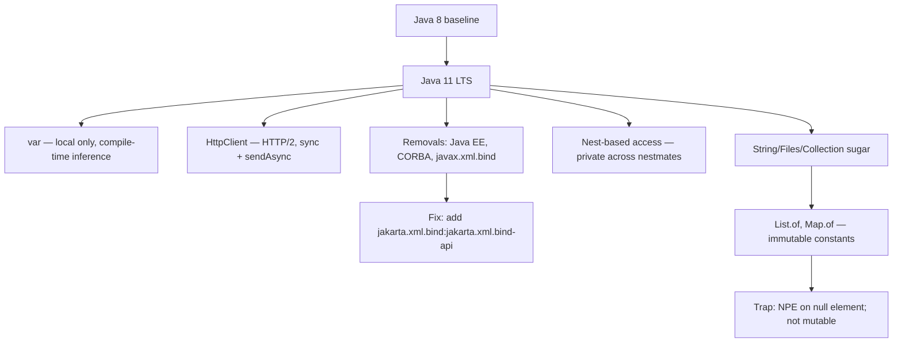

## Why it Matters

Java 11 is **the first LTS after 8** and the first version to break compatibility in ways you must name in interviews: **`var` (local-variable type inference), a standard `java.net.http.HttpClient`, `String`/`Files` convenience methods, single-file source launch, nest-based access, and the removal of Java EE and CORBA modules** (`javax.xml.bind`, `javax.activation`) from the JDK. It is also the "quiet" LTS, small language surface, big ecosystem effects (Jakarta EE migration, module-path enforcement).

Core ideas:
- **`var` = local only.** Inferred at compile time, needs an initializer, forbidden on fields, method params, `catch`, and `var x = null`.
- **Removals are the interview trap.** "What did 11 remove?" → Java EE/CORBA `javax.*` packages (now Jakarta artifacts) and `javac -source 8`.
- **No language features for productivity** beyond `var`, 11 is libraries + cleanup + a new HttpClient.

## Diagram



## Code

Runnable Java 11 (`javac --release 11`), the version that made `var` and `HttpClient` standard:
```java
import java.net.http.*;
import java.net.URI;
import java.nio.file.*;
import java.util.*;

void demoJava11() throws Exception {
 var name = " Ava "; // var — local only, inferred as String

 // String APIs that replaced hand-rolled loops
 System.out.println(name.strip().isBlank()); // true — Unicode-aware
 System.out.println("hi\nlo".lines().toList()); // [hi, lo]
 System.out.println("na".repeat(3)); // nanana

 // Immutable collection constants — no Arrays.asList null tolerance
 var list = List.of("a", "b");
 // list.add("c"); // UnsupportedOperationException
 // List.of((String) null); // NPE — no nulls allowed

 // Files convenience — reads whole file into heap
 Path p = Path.of("/tmp/demo.txt");
 // Files.writeString(p, "hello 11");
 // var content = Files.readString(p); // loads ENTIRE file, not a stream

 // Standard HttpClient — replaces HttpURLConnection
 var client = HttpClient.newHttpClient();
 var req = HttpRequest.newBuilder(URI.create("https://example.com"))
 .GET().build();
 // var body = client.send(req, HttpResponse.BodyHandlers.ofString());
 // var async = client.sendAsync(req, BodyHandlers.ofString()); // CompletableFuture
}

// Single-file launch: `java Demo.java` — no javac needed
```
> **Interview angle:** `var` is *pure* compile-time syntax, bytecode is identical to writing the explicit type. So the runtime answer to "is `var` slower?" is no; the caveat is readability, `var x = 1` hides whether you got `int` or `long`.

## When to use / not

| Use | Avoid |
|-----|-------|
| `var` for verbose generics `var m = new HashMap<String,List<Integer>>()` | `var` for primitives obscuring type `var x = 1` (is `int`? `long`?) , explicit better |
| `List.of` for constants | `List.of(null)` → NPE; mutable need `new ArrayList<>(List.of(...))` |
| `HttpClient` for new HTTP | `HttpURLConnection` for new code |

## Trade-offs

- **`var`**: removes visual noise on long generics (`var m = new HashMap<String, List<Integer>>()`), but erases readability when the initializer's type is unclear (`var x = 1`, `var result = process()`, `var x = null` which is illegal).
- **`List.of` / `Set.of` / `Map.of`**: true immutable constants with `null` rejection, but no mutability, no duplicates (a duplicate `Set.of` key throws `IllegalArgumentException`), and a different exception story than `Arrays.asList` (which allows mutation and `null`).
- **`HttpClient`**: HTTP/2 + async `sendAsync` returning `CompletableFuture`, clean API, but no connection-pool tuning knobs as obvious as third-party clients and no retry/circuit-breaker built in.
- **Single-file launch (`java Hello.java`)**: great for scripts and teaching, but compilation happens on every run, so it is not for production deployments.
- **Removal of Java EE modules**: smaller, more secure JDK, but forces a real migration, add `jakarta.xml.bind:jakarta.xml.bind-api` + `org.glassfish.jaxb` runtime, or the app breaks on upgrade.

## Vs

**`var` vs explicit type**

| Aspect | `var` (11+) | explicit type |
|--------|-------------|---------------|
| Compile time | identical, `var` is erased to the inferred type | — |
| Readability | wins on long generics, `var m = new HashMap<String, List<Integer>>()` | wins when the initializer's type is unclear |
| Failure mode | `var x = 1` hides int-vs-long intent | visual noise |
| Allowed | method locals with initializer, enhanced for, try-with-resources | everywhere |

**`List.of` vs `Arrays.asList` vs `new ArrayList`**

| Aspect | `List.of` | `Arrays.asList` | `new ArrayList<>(...)` |
|--------|-----------|-----------------|------------------------|
| Mutability | immutable, `add`/`set` throw | fixed size, `set` allowed, `add` throws | fully mutable |
| `null` | rejected with NPE | allowed | allowed |
| Use | constants | bridge to a fixed array | the general case |

**`HttpClient` (11) vs `HttpURLConnection`**

| Aspect | `java.net.http.HttpClient` | `HttpURLConnection` |
|--------|----------------------------|---------------------|
| Protocol | HTTP/2 (and HTTPS by default) | HTTP/1.1 |
| API style | builder + `send` / `sendAsync` (CompletableFuture) | verbose, single-threaded-feeling |
| Status | standard, recommended | legacy, avoid for new code |

## Pitfalls

- `var` with diamond: `var m = new ArrayList<>()` → `ArrayList<Object>` , specify `new ArrayList<String>()`.
- Assuming `Files.readString` streams large files , loads all into heap.

## Interview q&a

**Q1. Where can `var` NOT be used?**
Only inside methods (locals with an initializer, and in enhanced `for`/try-with-resources). Not on fields, not on method parameters, not on `catch` variables, not with `var x = null` (nothing to infer), and not `var r = () -> "x"` alone (ambiguous lambda target, needs a typed functional interface like `Supplier<String> s = () -> "x"`). `var` is also not a keyword, it is a *reserved type name*, so older code with a variable named `var` still compiles.

**Q2. `List.of(1, 2)` vs `Arrays.asList(1, 2)`, what is the difference?**
`List.of` returns a **truly immutable** list: `add`/`set` throw `UnsupportedOperationException` and `null` elements throw `NullPointerException` at creation. `Arrays.asList` is **fixed-size but mutable**, you can `set(i, x)` and it writes through to the backing array, and `null` is allowed. Use `List.of` for constants, `Arrays.asList` when you need to mutate contents in place, and `new ArrayList<>(List.of(...))` when you need a growable list.

Where can `var` NOT be used?:: Only method locals with an initializer. Not fields, params, `catch` vars, `var x = null` (nothing to infer), or a bare lambda (`var r = () -> "x"` needs a typed target). `var` is a reserved type name, not a keyword. #flashcard
`List.of(1,2)` vs `Arrays.asList(1,2)`?:: `List.of` is truly immutable (add/set throw, `null` rejected at creation); `Arrays.asList` is fixed-size but mutable (`set` writes to the backing array) and allows `null`. For a growable list use `new ArrayList<>(List.of(...))`. #flashcard

## Related

- [[Java 8 LTS Overview]] ← prev • [[Java 17 LTS Overview]] → next • [[LTS Evolution 8 to 25]] • [[Whats New in Java 25]]

---
*Category: overview • java11*

# Java 11 lts Overview (sep 2018) , the Quiet lts

> Part of [[README|00 Overview]] • `overview` • **First LTS after 8.** Interviews test **var, new String/HttpClient APIs, single-file launch, and what was removed (Java EE, `var` limits).**

## TL;DR for Interviews

> **Java 11 = Java 8 +** `var` (JEP 286), `String`/`Files`/`Collection` sugar, **`HttpClient` (standard)**, **single-file `java Hello.java`**, **nest-based access**, **ZGC/Epsilon (experimental)**, and **removals**: Java EE/CORBA (`javax.xml.bind` etc → Jakarta), `javac -source 8` no more.

## Must-Know Features

| Feature | JEP | 60-sec answer |
|---------|-----|---------------|
| **`var`** (LVTI) | 286 | `var x = List.of(1,2)` , **local only**, needs initializer, not field/param |
| **New String APIs** | , | `isBlank(), strip(), lines(), repeat(n)` |
| **`Collection`/`Files` sugar** | , | `List.of/CopyOf`, `Set.of`, `Map.of`, `Files.readString/writeString` |
| **`HttpClient`** (standard) | 321 | `HttpClient.newHttpClient().send(req, BodyHandlers.ofString())` , replaces `HttpURLConnection` |
| **Single-file launch** | 330 | `java Hello.java` , no `javac` |
| **Nest-based access** | 181 | `private` across nestmates without synthetic bridge , `String` ↔ inner |
| **ZGC / Epsilon (exp)** | 333/318 | Sub-ms GC introduced (prod in 21 as generational) |
| **Removals** | 320 | `javax.xml.bind` (JAXB), `javax.activation` → add Maven dep `jakarta.xml.bind` |

## Runnable Java 11 (`--release 11`)

```java
import java.net.http.*;
import java.net.URI;
import java.nio.file.*;
import java.util.*;

void demo11() throws Exception {
 var name = " Ava "; // var, local only, inferred String
 System.out.println(name.strip() + " blank? " + name.isBlank());
 System.out.println("hi\nlo".lines().toList());
 System.out.println("na".repeat(3));

 var list = List.of("a","b"); // immutable
 // Files sugar
 Path p = Path.of("/tmp/demo.txt");
 // Files.writeString(p, "hello 11"); String s = Files.readString(p);

 // HttpClient, standard in 11
 var client = HttpClient.newHttpClient();
 var req = HttpRequest.newBuilder(URI.create("https://example.com")).GET().build();
 // var resp = client.send(req, HttpResponse.BodyHandlers.ofString());
}
```

## How it Compares , Java 8 → 11

| Before (8) | Java 11 |
|------------|---------|
| `String.trim().isEmpty()` | `strip().isBlank()` (Unicode-aware) |
| `HttpURLConnection` | `HttpClient` (HTTP/2, async `sendAsync`) |
| `javac Hello.java; java Hello` | `java Hello.java` |
| `javax.xml.bind` on JDK | Add `jakarta.xml.bind:jakarta.xml.bind-api` |

## Quick Check

- [ ] Where can `var` NOT be used? (field, param, no initializer, `var x = null`)
- [ ] `strip()` vs `trim()`?
- [ ] How to replace `JAXB` after 11 removal?
- [ ] `List.of` vs `Arrays.asList`?
