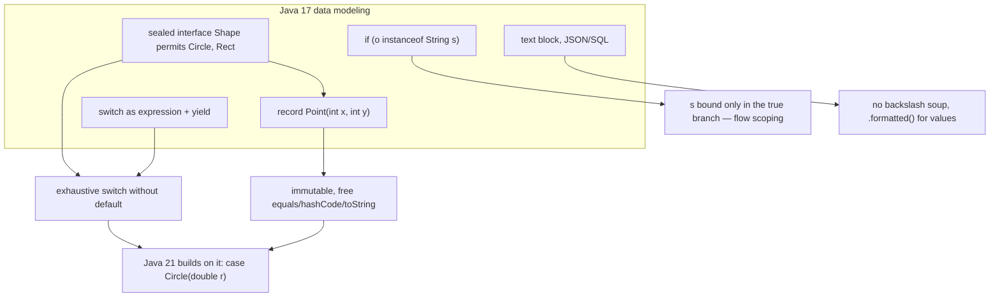

## Why it Matters

Java 17 is **the modern baseline that most new code targets** and the version where interview questions about "modern Java" actually begin: **`sealed` classes/interfaces (JEP 409, final), `record` classes (JEP 395, final), pattern matching for `instanceof` (JEP 394), `switch` expressions (JEP 361), text blocks (JEP 378), strong encapsulation of JDK internals (JEP 403), and `jpackage`**. Roughly 70% of "what's new since 8?" answers are really 17 answers, because that is where the data-modeling primitives changed.

Core ideas:
- **`record`** = immutable data carrier; the compiler generates `equals/hashCode/toString` and accessors.
- **`sealed`** = a *closed* hierarchy that lets the compiler prove a `switch` is exhaustive.
- **Pattern `instanceof`** = bind a variable *and* test, with flow-scoped availability.
- **Text block** = multi-line string with incidental whitespace stripped.
- **Strong encapsulation** = `--illegal-access=deny` is the default, so libraries doing `setAccessible` on JDK internals break.

## Diagram



## Code

Runnable Java 17 (`javac --release 17`), the four features interviewers expect you to whiteboard:
```java
import java.util.*;

// Sealed + record: closed, exhaustive data model
sealed interface Shape permits Circle, Rect {}
record Circle(double r) implements Shape {}
record Rect(double w, double h) implements Shape {}

// Text block + formatted — one call, no concatenation
String json = """{"name": "%s", "age": %d}""".formatted("Ava", 30);

// Pattern instanceof — bind + flow scoping, no cast
String describe(Object o) {
 if (o instanceof Circle c && c.r() > 0) return "circle r=" + c.r();
 return switch (o) { // switch EXPRESSION
 case String s when s.isBlank() -> "blank";
 case String s -> "str " + s;
 case Shape sh -> "shape";
 case null -> "null";
 default -> "other";
 };
}

// Exhaustiveness via sealed: no default needed once record patterns land in 21
double area(Shape s) {
 if (s instanceof Circle c) return Math.PI * c.r() * c.r();
 if (s instanceof Rect r) return r.w() * r.h();
 throw new IllegalArgumentException(s.toString());
}

record Point(int x, int y) {} // immutable DTO — one line
```
> **Java 25 note:** flexible constructor bodies (JEP 513) let you put statements *before* `super()`/`this()`, and primitive patterns (JEP 507) extend `case` to `int`/`long`/`double`. Both build directly on 17's `switch` expression and `sealed`/`record` model.

> **Interview trap:** in **17** you still write `if (s instanceof Circle c) ... else if (s instanceof Rect r)`. In **21** that collapses to `case Circle(double r)` via record patterns (JEP 440). Interviewers love this exact diff, and it is the strongest signal you actually wrote 17 code.

## When to use / not

| Use | Avoid |
|-----|-------|
| `record` for DTOs, events, keys | `record` for mutable entities/JPA entities |
| `sealed` for closed hierarchies (`Result`, `Shape`) | `sealed` for open extension , use `non-sealed` |
| Text blocks for JSON/SQL | Text blocks for single-line strings |

## Trade-offs

- **`record`**: boilerplate-free immutable data, ideal for DTOs/events/value keys, but cannot extend a class, is always final, fields are always final (no mutator), and JPA/Hibernate needs a no-arg constructor it cannot provide, so records are poor JPA entities.
- **`sealed`**: converts `default`/`else` branches into compile errors when a subtype is added, real bug prevention, but it opts you out of open extension, and `permits` types must be in the same package or module.
- **Text blocks**: readable SQL/JSON/HTML, but the incidental-whitespace rules (trailing-space stripping, `\s` escape to keep it) surprise people, and they are plain `String`, not interpolation (string templates are preview-only).
- **Strong encapsulation (JEP 403)**: real security and maintainability gain for the JDK, but breaks libraries that reflect into JDK internals (old Spring/Lombok/Mockito), the fix is library upgrades, not `--add-opens` as a habit.
- **`switch` expression**: expression form with `->` + `yield` is strictly more useful than statement switch, but type patterns in `switch` land later, so a 17 switch on types still needs `if instanceof` chains.

## Vs

**`record` vs class vs Lombok `@Value`**

| Aspect | `record` (17) | plain class | Lombok `@Value` |
|--------|---------------|-------------|------------------|
| Immutability | language-level, all fields final | manual, easy to break | generated, annotation-processed |
| Boilerplate | none, equals/hashCode/toString free | all hand-written | none, but a dependency + IDE plugin |
| Inheritance | cannot extend a class, is final | full inheritance | full inheritance |
| JPA entity | no (needs no-arg ctor + proxying) | yes | yes |
| Use | DTO, event, value key | mutable domain object | legacy brownfield without records |

**`sealed` vs `abstract`/interface open hierarchy**

| Aspect | `sealed` + `permits` | open `abstract class` |
|--------|----------------------|----------------------|
| Extension | closed, permitted subtypes only | open to any subclass |
| Exhaustive switch | yes, no `default` needed | no, `default`/`else` required |
| Use | closed domains (`Result`, `Shape`, `Event`) | plugin/open extension points |

**`switch` expression vs `switch` statement**

| Aspect | expression (361) | statement (pre-14) |
|--------|------------------|--------------------|
| Yields a value | yes, `var r = switch(x) {...}` | no, side effects only |
| Fall-through | no, `->` is non-sequential | yes, silent bugs |
| Exhaustiveness | enforced with `sealed` | not enforced |

## Pitfalls

- Forgetting `permits` list must be in same package/module , permits must be accessible.
- Using `record` with JPA/Hibernate , bytecode proxy needs no-arg constructor.

## Interview q&a

**Q1. When should you NOT use a record?**
When you need mutability (all fields are final), when the type must extend a class or be extended (records are implicitly final and cannot extend another class), when it is a JPA/Hibernate entity (Hibernate bytecode-proxies entities and requires a no-arg constructor, which a canonical record does not have), or when you need open subclass polymorphism instead of a closed set. Records also have a single fixed canonical constructor, so a variable "rest" of data does not fit.

**Q2. Why does a `switch` over a sealed type not need a `default`?**
The compiler checks **exhaustiveness**: `sealed interface Shape permits Circle, Rect` tells the compiler the complete set of permitted subtypes, so a `switch` covering `Circle` and `Rect` is provably total and `default` is unnecessary. If you later add `Triangle` to `permits` and forget the case, recompilation fails instead of silently falling through to `default` at runtime. Caveat: `null` is not covered by exhaustiveness, so `case null` must be handled explicitly.

When should you NOT use a record?:: When you need mutability (all fields final), extension (records are final, cannot extend a class), a JPA/Hibernate entity (needs no-arg constructor + proxying), or open subclass polymorphism. Records have one fixed canonical constructor. #flashcard
Why does a switch over a sealed type not need a default?:: The compiler proves exhaustiveness from the `permits` list, so covering all permitted subtypes makes the switch total and `default` dead code. Adding a subtype later is a compile error, not a silent fall-through. `null` is not covered. #flashcard

## Related

- [[Java 11 LTS Overview]] ← prev • [[../09_Java-21-LTS/00 Java 21 Overview|Java 21 Overview]] → next • [[LTS Evolution 8 to 25]] • [[../08_Modern-Java/01 Records|08 , Records]] • [[../08_Modern-Java/02 Sealed Classes|Sealed]]

---
*Category: overview • java17*

# Java 17 lts Overview (sep 2021) , the Modern Baseline

> Part of [[README|00 Overview]] • `overview` • **The LTS before 21.** Interviews test **sealed/record final, pattern `instanceof`, text blocks, switch expressions, strong encapsulation** , 70% of "what's new since 8?" answers are 17 answers.

## TL;DR for Interviews

> **Java 17 = Java 11 +** `sealed` (409 final) + `record` (395 final) + **pattern `instanceof`** (394) + **switch expressions** (361) + **text blocks** (378) + **records + sealed + patterns together** + `jpackage`, foreign linker incubator, strong encapsulation (JEP 403).

## Must-Know Features

| Feature | JEP | 60-sec answer |
|---------|-----|---------------|
| **`sealed` classes** | 409 | `sealed interface Shape permits Circle,Rect` , compiler enforces exhaustive `switch` |
| **`record`** (final) | 395 | `record Point(int x,int y)` , immutable, `equals/hashCode/toString`, compact constructor |
| **Pattern `instanceof`** | 394 | `if (o instanceof String s && !s.isBlank())` , binding + flow scoping |
| **Switch expressions** | 361 | `var r = switch(day){ case MON -> 1; default -> 0; }` , expression, `yield` in blocks |
| **Text blocks** | 378 | `""" hello {name} """` , JSON/SQL without `\"` soup |
| **New `instanceof` + `switch` synergy** | , | `sealed` + `record` + `switch` = exhaustive without `default` , preview of 21's record patterns |
| **Strong encapsulation** | 403 | `--illegal-access=deny` by default , `setAccessible` on JDK internals fails |
| **`jpackage`** | 343 | Native installer , `jpackage --type dmg` |

## Runnable Java 17 (`--release 17`)

```java
sealed interface Shape permits Circle, Rect {}
record Circle(double r) implements Shape {}
record Rect(double w,double h) implements Shape {}

// Pattern instanceof + switch expression + text block
String describe(Object o) {
 if (o instanceof Circle c && c.r() > 0) return "circle " + c.r();
 return switch (o) {
 case String s when s.isBlank() -> "blank";
 case String s -> "str " + s;
 case Shape sh -> "shape";
 case null -> "null";
 default -> "other";
 };
}
String json = """
 {"name": "%s", "age": %d}
 """.formatted("Ava", 30);

double area(Shape s) {
 if (s instanceof Circle c) return Math.PI * c.r() * c.r();
 if (s instanceof Rect r) return r.w() * r.h();
 throw new IllegalArgumentException(s.toString());
 // 21 simplifies this to case Circle(double r) (record patterns JEP 440)
}
```
> **17 vs 21 nuance:** In **17** you write `if (s instanceof Circle c) ... else if (s instanceof Rect r) ...`. In **21** you write `case Circle(double r)` (record patterns JEP 440) , interviewers love this diff.

## How it Compares , 11 → 17

| Before (11) | Java 17 |
|-------------|---------|
| `if (o instanceof String) { String s=(String)o; ...}` | `if (o instanceof String s)` |
| `switch` statement with fall-through | `switch` expression with `->` + `yield` |
| `"{\"name\":\"Ava\"}"` | `""" {"name": "%s"} """.formatted(name)` |
| `enum` for closed set | `sealed interface` + `record` |

## Quick Check

- [ ] `sealed` + `permits` vs `non-sealed`?
- [ ] `record` compact constructor vs canonical?
- [ ] Why `switch` expression needs exhaustive or `default`?
- [ ] When does `instanceof String s` binding go out of scope?
