## Why it Matters

This note is the **learning path through the vault**: which folder to open in which week, and which **LTS release each phase targets** (`8` → `11` → `17` → `21` → `25`). It matters because "I know Java 25" is not a single skill, it is five LTS dialects plus Spring, patterns, and DSA, and trying to learn them out of order wastes months. The plan is 10 weeks at 60-90 minutes a day, with every note compiled at its own `--release` flag.

Core ideas:
- **Every phase has one LTS focus** and one key outcome (e.g. P1 = Java 8 SE fundamentals, 90% of interview questions).
- **Build rule**: run one snippet per note at its `--release` flag, break it once, then move on.
- **Review rule**: mark `completed: true` and `reviewed: YYYY-MM-DD` when you can answer the note's Q&A without looking.
- **Paths by target level**: 8-only = P1, 17+ = P1→P3, 21+ = P3→P4, 25 = P5 alone for the delta, full = P0..P10.

## Diagram

```mermaid
flowchart LR
 P0[P0 orientation] --> P1[P1 Java 8 - core]
 P1 --> P2[P2 Java 11 - var/HTTP]
 P2 --> P3[P3 Java 17 - records/sealed]
 P3 --> P4[P4 Java 21 - virtual threads]
 P4 --> P5[P5 Java 25 - ScopedValue/headers]
 P5 --> P6[P6 concurrency deep dive]
 P6 --> P7[P7 Spring Boot 3.5]
 P7 --> P8[P8 design patterns]
 P8 --> P9[P9 DSA]
 P9 --> P10[P10 mocks + revision]
 P5 -. 10 weeks at 60-90 min/day .-> P10
```



## Code

Verify your toolchain before starting, then switch releases per phase with SDKMAN:
```bash
sdk install java 25-tem
sdk install java 21-tem
sdk install java 17-tem
sdk install java 11-tem
sdk install java 8-tem

sdk use java 21-tem # per phase
java --version # expect the phase LTS

```

## When to use / NOT

| Use | Avoid |
|-----|-------|
| Follow the phases **in order**, each one is the prerequisite for the next | Skipping to P5 (Java 25) without 8/17 fluency, the delta means nothing without the base |
| Set `maven.compiler.release` / IntelliJ Language Level to the phase LTS | Using "latest" language level in the IDE while targeting an older JDK, silent confusion |
| Run one snippet per note at its `--release`, break it once | Reading notes without compiling, interviewers ask you to write the code |
| P5 alone if you already know 8-21 and only need the 21→25 delta | Re-learning 8-21 you already know, skip P1-P4 if you can answer their Q&A sections |

## Trade-offs

**One vault, five LTS stops:** [[Java 8 LTS Overview|8]] → [[Java 11 LTS Overview|11]] → [[Java 17 LTS Overview|17]] → [[../09_Java-21-LTS/00 Java 21 Overview|21]] → [[Whats New in Java 25|25]]. You already have 7 SE folders (01-07) + `99_Revision`; `00` is the map, `08` + `09` are the LTS deep dives.

## Vs

**How to target Java 25: full adoption vs delta-only**

| Aspect | Full plan (P0-P10) | Delta-only (P5) |
|--------|--------------------|------------------|
| Assumes | 8/11/17/21 fluency | you already know 8-21 |
| Time | ~10 weeks at 60-90 min/day | half a day |
| Covers | SE + concurrency + Spring + patterns + DSA | only 21→25 features |
| Use | career-level preparation | refresh before a Java 25 screening |

**Tooling: SDKMAN vs IDE language level vs Maven `release`**

| Aspect | SDKMAN (`sdk use java 25-tem`) | IDE Language Level | `maven.compiler.release` |
|--------|-------------------------------|--------------------|---------------------------|
| Controls | which JDK runs | what the editor accepts | what the compiler enforces |
| Alone is enough | no, IDE can silently accept newer syntax | no | no |
| All three aligned | the only safe state, otherwise "works on my machine" | | |

## Pitfalls

- **Treating it as reading material.** The plan is build-first, 60% writing/running code, 25% reading, 15% flashcards. Without the build step the Q&A answers do not stick.
- **Using the wrong JDK for a phase.** A 17 snippet that silently compiles on 25 proves nothing. `java --version` before each session, and set `--release` explicitly.
- **Skipping the review loop.** Ticking `completed: true` without setting `reviewed: YYYY-MM-DD` and answering the Q&A aloud, the Dashboard and spaced-repetition tables track exactly that gap.
- **Trying to do two phases at once.** Phases are sequenced by dependency (concurrency before Spring, Spring before patterns-as-Spring-uses-them); parallel phases dilute both.
- **Forgetting P0.** Tooling setup (5 JDKs + Maven/Gradle + IDE language levels) takes a day and every later phase assumes it.

## Interview Q&A

**Q1. How would you ramp up on Java 25 for an interview?**
I would learn the LTS deltas in order rather than jumping to 25: Java 8 (lambdas, Streams, `java.time`, `Optional`, `CompletableFuture`) is still most Core Java questions, Java 11 adds `var` and `HttpClient`, Java 17 finalises records, sealed, pattern `instanceof` and text blocks, Java 21 adds virtual threads, and Java 25 adds `ScopedValue`, Structured Concurrency, compact headers, and the JEP 491 pinning fix. For each feature I run one snippet at its `--release` flag, then practise answering its Q&A aloud rather than reading more notes.

**Q2. How do you keep multiple JDK versions straight on one machine?**
With SDKMAN (`sdk install java <version>-tem`, `sdk use java 21-tem`) or jenv, plus an explicit compile target so the compiler cannot silently accept a newer API: `javac --release 17 Main.java`, or in Maven `<maven.compiler.release>17</maven.compiler.release>`, and matching IntelliJ Language Level per module. Preview-only features like `StructuredTaskScope` need `--enable-preview` on both `javac` and `java`, and CI must run the same command or the build passes locally and fails there.

How would you ramp up on Java 25 for an interview?:: Learn the LTS deltas in order: 8 (lambdas/Streams/java.time), 11 (var/HttpClient), 17 (record/sealed/patterns/text blocks), 21 (virtual threads), 25 (ScopedValue, structured concurrency, compact headers, JEP 491). Run one snippet per feature at its `--release` and practise Q&A aloud. #flashcard
How do you keep multiple JDK versions straight on one machine?:: SDKMAN (`sdk use java 21-tem`) or jenv plus an explicit compile target: `javac --release 17` or Maven `<maven.compiler.release>17</maven.compiler.release>`, matching IDE Language Level. Preview features need `--enable-preview` on both javac and java. #flashcard

## Related

- [[LTS Evolution 8 to 25]] • [[Java 8 LTS Overview]] • [[Java 11 LTS Overview]] • [[Java 17 LTS Overview]] • [[Whats New in Java 25]] • [[../99_Revision/Study Plan|Study Plan]] • [[Interview Strategy]] • [[../README|Java MOC]]

---
*Category: overview*

# Java LTS Roadmap , 8 → 25 Learning Path

> Part of [[README|00 Overview]] • `overview` • **Restructured 2026-09-03:** LTS evolution first, then SE → Modern → Concurrency → Spring → Patterns → DSA. Every note targets its LTS `--release` , search `Java 8/11/17/21/25` to audit.

# compile any note snippet at its own release

javac --release 17 Main.java
javac --release 25 Main.java

# Java 25 preview features (StructuredTaskScope, primitive patterns):

javac --enable-preview --release 25 Main.java
java --enable-preview Main
```
Maven equivalent, one line per module instead of per command: `<maven.compiler.release>21</maven.compiler.release>`.

```

## Phases at a Glance (Restructured)

| Phase | Folder(s) | Weeks | LTS Focus | Key Outcome | | | |
| ------- | ------------------------------ | --------------------------------------------- | ------------------------------------- | ------------------------------------------------------------- | ---------------------------------------------------------------------------------------- | ------------------------------------------------------------------------------- | ------------------------------- |
| **P0** | [[README \| 00 Overview]] | 0 | Tooling + [[LTS Evolution 8 to 25 \| LTS map]] | JDK 8→25 installed, plan pinned | |
| **P1** | [[Java 8 LTS Overview \| Java 8]] + [[../01_Core-Java/README \| 01 Core]] | 1-2 | **Java 8**: lambdas, Streams, `java.time`, `Optional`, `CompletableFuture` | SE fundamentals (90% interview Qs) | |
| **P2** | [[Java 11 LTS Overview \| Java 11]] + [[../01_Core-Java/README \| 01 Core]] | 3 | **Java 11**: `var`, `HttpClient`, String/Files sugar, JAXB removal | "What's new 8→11?" answered | |
| **P3** | [[Java 17 LTS Overview \| Java 17]] + [[../02_OOP/README \| 02 OOP]] + [[../08_Modern-Java/README \| 08 Modern]] (records/sealed) | 4-5 | **Java 17**: `record`, `sealed`, pattern `instanceof`, switch expr, text blocks | Modern baseline (interview 70%) |
| **P4** | [[../09_Java-21-LTS/README \| 09 Java 21 LTS]] + [[../03_Collections/README \| 03 Collections]] (Sequenced) | 6-7 | **Java 21 LTS**: virtual threads, Sequenced, record/switch patterns, ZGC gen, FFM | Concurrency leap | |
| **P5** | [[Whats New in Java 25 \| Whats New 25]] + [[../08_Modern-Java/README \| 08 Modern]] (ScopedValue, headers) | 8 | **Java 25**: ScopedValue final, Structured Concurrency preview, compact headers, JEP 491 | "Delta 21→25" crisply | |
| **P6** | [[../04_Concurrency/README \| 04 Concurrency]] | 8-9 | Loom deep dive (21→25 pinning fix) | Concurrency whiteboard | | |
| **P7** | [[../05_Spring/README \| 05 Spring]] | 9 | Boot 3.5 + virtual threads (`spring.threads.virtual.enabled`) | Backend interview | | |
| **P8** | [[../06_Design-Patterns/README \| 06 Patterns]] | 9-10 | 22 GoF as Spring uses them | Pattern whiteboard | | |
| **P9** | [[../07_DSA/README \| 07 DSA]] + [[../../Coding Patterns/README \| Coding Patterns]] | 10 | DSA + 20 patterns | Coding interview | |
| **P10** | [[../99_Revision/README \| 99 Revision]] | 10 | Mocks, SR, overdue sweep | Offer-ready | | |

> **Reading paths:** `8-only` = P1 • `17+` = P1→P3 • `21+` = P3→P4 • `25` = P5 alone for delta • **Full LTS** = P0..P10 in **10 weeks**

## Weekly Cadence (Each Study Day)

- **Build 60%** , run the runnable snippet at its `--release` (`8`/`11`/`17`/`21`/`25`), break it
- **Study 25%** , Why it matters → When/NOT → How it compares
- **Evaluate 15%** , answer 3-5 `## Interview Q&A` flashcards, mark `reviewed: YYYY-MM-DD`

## Tooling

| Tool | Version | Command |
|------|---------|---------|
| JDKs | **8, 11, 17, 21, 25 LTS** | `sdk install java 25-tem && sdk install java 21-tem && sdk install java 17-tem` , `sdk use java 21-tem` per note |
| Build | Maven 3.9+ / Gradle 8.10+ | `maven.compiler.release=17` (change per phase) |
| IDE | IntelliJ 2025.2+ | Per-module SDK = phase LTS, Language Level = same (preview for 25 `StructuredTaskScope`) |
| Verify | Any | `java --version` → expect phase LTS; `javac --release 21 Main.java` |
| Preview | 25 only | `javac --enable-preview --release 25` + `java --enable-preview` |

## Folder map (What to Open When)

```dataview
TABLE WITHOUT ID file.link as "Note", category as "Category"
FROM "Java"
WHERE file.name = "README"
SORT file.folder ASC
```