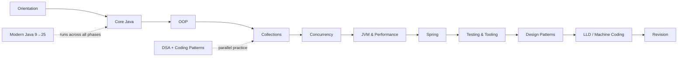

# Java 25 Roadmap

> This is the Java 25 feature and release reference. It is not a separate learning calendar; use [[Study Plan]] for scheduling.

## Principle

Do not learn Java by memorizing release notes.

For each feature:

**Why → API/language rule → smallest example → failure mode → production use → alternative**

Historical releases matter only when they explain code you are likely to encounter.

## Path



## 12-Week Study Path

| Weeks | Focus | Exit evidence |
|---|---|---|
| 1–2 | Core Java | generics/PECS, exceptions, strings, records vs classes, streams, I/O |
| 3 | OOP & SOLID | explain substitution, dependency inversion, composition vs inheritance |
| 4 | Collections | choose implementations from ordering, uniqueness, concurrency and complexity constraints |
| 5 | Concurrency | implement executor, CompletableFuture, locks, atomics and virtual-thread examples |
| 6 | JVM & performance | diagnose heap/GC/thread problems and explain what to measure before tuning |
| 7–8 | Spring | build controller → service → repository with validation, transactions and security |
| 9 | Testing & tooling | unit + integration tests, Testcontainers, build lifecycle and dependency hygiene |
| 10 | Design patterns | recognize patterns as consequences of change/variation, not as templates to force |
| 11 | LLD | model one system end-to-end with requirements, classes, state and concurrency |
| 12 | Revision | timed coding, DSA, concurrency, Spring and LLD mock sessions |

Run DSA practice alongside weeks 2–12 rather than creating a separate DSA-only phase.

## Java Release Strategy

### Java 8
Know the foundations that dominate existing enterprise code: lambdas and functional interfaces, Streams, Optional, java.time, default/static interface methods, and CompletableFuture.

### Java 11
Understand the compatibility delta: local-variable syntax with var, standard HttpClient, String and Files API additions, and Java EE/CORBA module removals.

### Java 17
Know records, sealed classes/interfaces, pattern matching for instanceof, text blocks, and strong encapsulation of JDK internals.

### Java 21
Treat virtual threads, sequenced collections, record patterns, pattern matching for switch, generational ZGC, and the FFM API as the major runtime/language milestone.

### Java 25 LTS

| Feature | Status in 25 | Engineering relevance |
|---|---|---|
| Scoped Values (JEP 506) | Final | scoped request/context propagation |
| Compact Object Headers (JEP 519) | Product feature | object-memory footprint |
| Flexible Constructor Bodies (JEP 513) | Final | validation/computation before superclass construction |
| Module Import Declarations (JEP 511) | Final | simpler small programs |
| Compact Source Files / Instance Main (JEP 512) | Final | simpler small programs and teaching |
| Primitive Types in Patterns (JEP 507) | Preview | pattern matching across primitive types |
| Structured Concurrency (JEP 505) | Preview | structured fan-out/fan-in and cancellation |
| Stable Values (JEP 502) | Preview | lazily initialized stable state |

Preview features are not production contracts. Mark them explicitly and compile/run with the matching preview flags.

## Toolchain Discipline

Use a JDK manager such as SDKMAN for local switching, but make the build authoritative:

```bash
sdk use java 25-tem
java --version
javac --release 25 Main.java

# Preview feature
javac --enable-preview --release 25 Main.java
java --enable-preview Main
```

For Maven/Gradle, pin the language level in the build so local IDE settings cannot silently change the target.

## Mastery Gate

Do not mark a phase complete until you can:
- write a minimal example without the note;
- explain one failure mode;
- compare it with one alternative;
- state the relevant complexity/performance constraint;
- connect it to a real backend problem.

## Related
- [[LTS Evolution 8 to 25]]
- [[Whats New in Java 25]]
- [[Realistic Roadmap]]
- [[../01_Core-Java/README|Core Java]]
- [[../04_Concurrency/README|Concurrency]]
- [[../11_JVM-Performance/README|JVM & Performance]]
- [[../12_Testing-Tooling/README|Testing & Tooling]]
- [[../99_Revision/Study-Plan|Study Plan]]