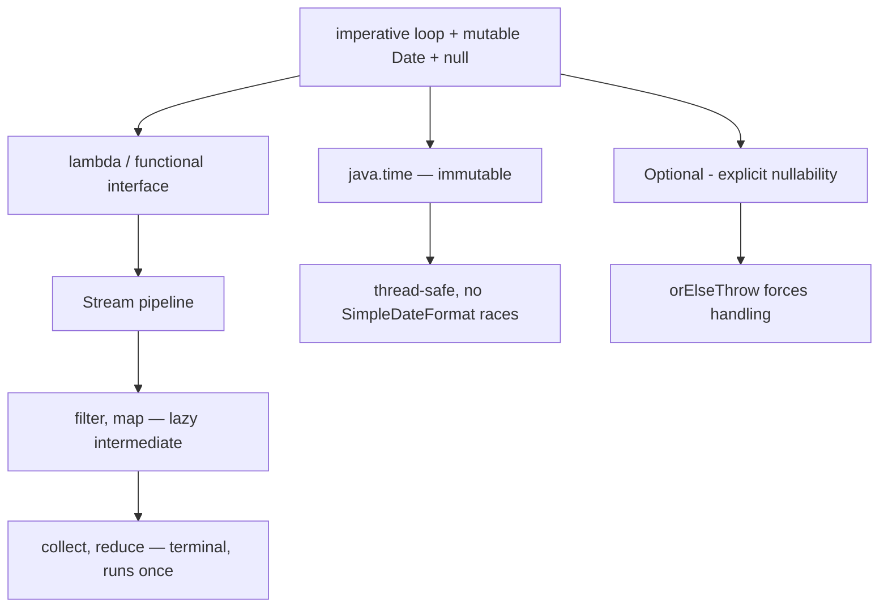

## Why it Matters

Java 8 is the **baseline dialect of Java** that nearly all production code and most interview questions are still written in: **lambdas + functional interfaces, Streams, `java.time`, `default` methods, `Optional`, `CompletableFuture`**. Every later LTS is a *delta* on 8, so if you can explain 8 precisely, "what's new since 8?" becomes a diff question instead of a rewrite.

Core ideas:
- **Lambda = instance of a functional interface (SAM)**, captures *effectively final* variables only.
- **Stream = lazy pipeline**, nothing runs until a terminal operation, and it is single-use.
- **`java.time` = immutable, thread-safe** replacement for mutable `Date`/`Calendar`.
- **`Optional<T>` = explicit nullability on return types**, not a field or parameter type.

## Diagram



## Code

Runnable Java 8 (`javac --release 8`), the dialect most production code still speaks:
```java
import java.time.*;
import java.util.*;
import java.util.stream.*;
import java.util.concurrent.CompletableFuture;

void demoJava8() {
 List<String> names = List.of("ava", "bob", "ava");

 // Stream: lazy intermediate, eager terminal, single-use
 Map<String, Long> freq = names.stream()
 .filter(s -> s.length() == 3)
 .collect(Collectors.groupingBy(s -> s, Collectors.counting())); // {ava=2, bob=1}

 // java.time — immutable, thread-safe
 ZonedDateTime z = LocalDate.of(2024, 3, 14).atStartOfDay(ZoneId.of("Asia/Kolkata"));

 // Optional as a RETURN type only — never field/param
 String name = Optional.ofNullable(findName()).orElse("anon");

 // CompletableFuture — async composition without raw Future.get()
 String result = CompletableFuture.supplyAsync(() -> "hello")
 .thenApply(String::toUpperCase)
 .join(); // HELLO
}

// Functional interface = exactly one abstract method
@FunctionalInterface
interface Mapper<A, R> { R map(A a); }
```
> **Interview angle:** Java 8 code compiles unchanged on Java 25. The 8→25 delta is *additive*, you get records, patterns, and virtual threads on top, never a replacement for lambdas/Streams.

## When to use / not

| Use | Avoid |
|-----|-------|
| Streams for filter/map/groupBy | `parallelStream()` blindly , fork-join overhead, non-threadsafe collectors |
| `Optional` as return type for nullable | `Optional` field/param or `Optional.get()` |
| `java.time` everywhere | `Date`/`Calendar`/`SimpleDateFormat` (not thread-safe) |

## Trade-offs

- **Lambdas**: concise + behavior-as-data, but no checked exceptions natively (wrap in a runtime exception or your own functional interface) and captures must be *effectively final*.
- **Streams**: declarative and parallelizable, but single-use, harder to debug (no stack frames for intermediate ops), and `parallelStream()` shares the JVM-wide fork-join pool so blocking IO inside it starves other tasks.
- **`Optional<T>`**: explicit nullability at API boundaries, but it is a heap allocation, not `Serializable`, and wrong as a field, parameter, or `Map` value.
- **`java.time`**: immutable and thread-safe, but verbose, and legacy libs still force `Date`/`Instant` conversions via `Date.from(instant)`.
- **Default methods**: interfaces evolve without breaking implementors, but two defaults with the same signature create a diamond conflict you must resolve with `Interface.super.method()`.

## Vs

**Stream vs Loop**

| | Loop | Stream |
|--|------|--------|
| Readability | imperative | declarative `filter/map/collect` |
| Laziness | eager | intermediate lazy, terminal triggers |
| Reuse | reusable | **single-use** , `stream.forEach(...); stream.filter(...)` throws |

**`Optional` vs `null`**

| | `null` | `Optional` |
|--|--------|------------|
| NPE risk | yes | `orElseThrow` forces handling |
| Overuse | , | Don't store as field , serialize cost |

## Pitfalls

- `parallelStream()` on small lists + blocking IO → slower.
- `Optional.of(null)` → NPE; use `ofNullable`.
- `Date` mutability + `SimpleDateFormat` shared static → race.

## Interview q&a

**Q1. Why must variables used inside a lambda be effectively final?**
A lambda captures variables from its enclosing scope by *value copy* stored in the generated class instance, not a live reference. If the captured variable could change, the copy and the original would diverge and the compiler could not guarantee the lambda runs the same code every time it is invoked. "Effectively final" (never reassigned after init) is enough, you never have to write `final` explicitly.

**Q2. What is the difference between intermediate and terminal stream operations?**
Intermediate ops (`filter`, `map`, `sorted`) are *lazy*, they fuse into the pipeline and do nothing until a terminal runs. Terminal ops (`collect`, `reduce`, `forEach`, `count`) trigger the whole pipeline once. Consequence: a stream is single-use, calling two terminals on the same stream throws `IllegalStateException`. Laziness also means side effects in `peek` may never execute.

Why must variables used inside a lambda be effectively final?:: A lambda captures enclosing variables by value copy, not live reference; if the value could change the copy and original would diverge. "Effectively final" (never reassigned) is enough, no explicit `final` needed. #flashcard
What is the difference between intermediate and terminal stream operations?:: Intermediate ops (`filter`, `map`) are lazy and fuse into the pipeline; terminal ops (`collect`, `forEach`) trigger the pipeline once. Streams are single-use, a second terminal throws `IllegalStateException`. #flashcard

## Related

- [[Java 11 LTS Overview]] → next delta • [[Whats New in Java 25]] (timeline) • [[../01_Core-Java/Streams API|Streams API]] • [[../01_Core-Java/JVM Memory Model|JVM - Metaspace]] • [[LTS Evolution 8 to 25]]

---
*Category: overview • java8*

# Java 8 lts Overview (mar 2014) , the Foundation

> Part of [[README|00 Overview]] • `overview` • **The LTS every interview assumes you know cold.** If you nail 8, everything else is a delta.

## TL;DR for Interviews

> **Java 8** brought **lambdas + functional interfaces, Streams, `java.time`, default methods, `Optional`, `CompletableFuture`, Nashorn + PermGen → Metaspace**. 90% of "Core Java" interview Qs are still Java 8 Qs.

## Must-Know Features (JEPs you Will be Asked)

| Feature | JEP / API | 60-sec answer |
|---------|-----------|---------------|
| **Lambdas & Functional Interfaces** | JEP 126 | `(a,b)->a+b`, `@FunctionalInterface` SAM, capture *effectively final* |
| **Streams** | JEP 107 | `filter/map/collect` , lazy intermediate vs eager terminal, **not reusable** |
| **`java.time` (JSR-310)** | JEP 150 | `Instant/LocalDate/ZonedDateTime` , **immutable, thread-safe** vs `Date/Calendar` |
| **Default + Static in Interfaces** | JEP 126 | `default void forEach` , evolve interfaces without breaking impls |
| **`Optional`** | JEP 122 | `map/flatMap/orElseThrow` , **not for fields/params**, never `get()` without check |
| **`CompletableFuture`** | | `supplyAsync/thenApply/thenCompose` , async without raw `Future.get()` |
| **Method References** | JEP 126 | `String::valueOf`, `this::handle`, `ArrayList::new` |
| **Metaspace** | JEP 122 | PermGen removed → Metaspace (`-XX:MaxMetaspaceSize`) , `OOM: Metaspace` now |

## Runnable Java 8 (`--release 8`)

```java
import java.time.*;
import java.util.*;
import java.util.stream.*;
import java.util.concurrent.CompletableFuture;

void demo8() {
 // Lambda + Stream: lazy vs terminal
 List<String> names = List.of("ava","bob","ava");
 Map<String,Long> freq = names.stream()
 .filter(s -> s.length()==3)
 .collect(Collectors.groupingBy(s->s, Collectors.counting())); // {ava=2, bob=1}

 // java.time, immutable
 LocalDate d = LocalDate.of(2024,3,14);
 ZonedDateTime z = d.atStartOfDay(ZoneId.of("Asia/Kolkata"));

 // CompletableFuture
 CompletableFuture<String> cf = CompletableFuture.supplyAsync(() -> "hello")
 .thenApply(String::toUpperCase);
 System.out.println(cf.join()); // HELLO

 // Optional, orElseThrow
 Optional<String> opt = Optional.ofNullable(null);
 System.out.println(opt.orElse("fallback"));
}

@FunctionalInterface interface TriFn<A,B,C,R>{ R apply(A a,B b,C c); }
default interface MyList<E> { default void forEachDo(java.util.function.Consumer<E> c){} }
```

## Quick Check , can you Answer?

- [ ] Why must lambda captures be *effectively final*?
- [ ] Intermediate vs terminal , when does stream execute?
- [ ] `map` vs `flatMap` on `Optional`/`Stream`?
- [ ] Why `SimpleDateFormat` is unsafe vs `DateTimeFormatter`?
- [ ] `CompletableFuture.thenApply` vs `thenCompose`?
