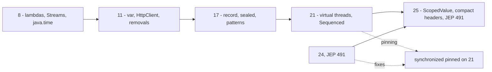

## Why it Matters

The **LTS releases 8, 11, 17, 21, 25** are the five versions any Java backend role actually targets, and interviewers almost never ask "list everything", they ask a **delta**: "what is new since 8?", "what changed between 17 and 21?", "what did 25 add?". This note answers every such question with the *cumulative story*, each LTS is a strict superset of the last, and each jump has one or two features you must be able to name instantly.

Core idea:
- **8 (2014)**, the functional baseline: lambdas, Streams, `java.time`, `Optional`, `CompletableFuture`. Still ~90% of Core Java questions.
- **11 (2018)**, the cleanup LTS: `var`, `HttpClient`, `String`/`Files` sugar, and the Java EE/CORBA removals.
- **17 (2021)**, the data-modeling LTS: `record`, `sealed`, pattern `instanceof`, switch expressions, text blocks. ~70% of "what is new since 8" answers.
- **21 (2023)**, the concurrency LTS: virtual threads, SequencedCollection, record/switch patterns, generational ZGC.
- **25 (2025)**, the Loom completion LTS: `ScopedValue` final, Structured Concurrency preview, compact headers, JEP 491.

## Diagram



## Code

Run each snippet at its own release flag to *feel* the delta, no dependency changes needed, only the JDK:
```java
// Java 8 -- lambdas, Streams, Optional, java.time
Map<String, Long> freq = names.stream()
 .collect(Collectors.groupingBy(s -> s, Collectors.counting()));
String v8 = Optional.ofNullable(getName()).orElse("anon");

// Java 11 -- var, String/Files sugar, HttpClient
var list = List.of("a", "b");
String v11 = " Ava ".strip().repeat(2); // strip is Unicode-aware

// Java 17 -- record, sealed, pattern instanceof, switch expression, text block
record Point(int x, int y) {}
sealed interface Shape permits Circle, Rect {}
String v17 = (o instanceof String s) ? s : "?";

// Java 21 -- virtual threads, SequencedCollection, record patterns
Thread.startVirtualThread(() -> System.out.println("loom"));
List<Integer> rev = seq.reversed();

// Java 25 -- ScopedValue, flexible constructors, primitive patterns
static final ScopedValue<String> REQ = ScopedValue.newInstance();
ScopedValue.where(REQ, "id-1").run(() -> log(REQ.get()));
```
Compile commands: `javac --release 8|11|17|21|25`, plus `--enable-preview` for `StructuredTaskScope` on 25.

## When to use / not

| Use | Avoid |
|-----|-------|
| Learn the LTS deltas in order (8 → 11 → 17 → 21 → 25); each one is a strict superset | Trying to learn non-LTS releases (9, 12-16, 18-20, 22-24) as "features" for interviews, they are cumulative stepping stones |
| Answering with 2-4 named features + a JEP number per LTS jump | Reciting every JEP; interviewers want the delta, not the release notes |
| Running each snippet at its `--release` flag to feel the difference | Reading notes only, you cannot answer "what changed" without having run the delta |
| Using 21/25 as the target for new services (virtual threads, ScopedValue) | Targeting 8/11 for new code unless a legacy platform forces it |

## Trade-offs

- **LTS cadence (every 2 years since 21)**: stability + long support (8 and 11 ran 8+ years), but you wait 2 years for a language feature that is already final in a non-LTS.
- **Non-LTS as a preview channel**: you can adopt `ScopedValue`/structured concurrency early (22/23/24), but those are preview APIs that can change between releases, so production adoption means accepting churn or waiting.
- **Adopting 25 for Loom**: virtual threads + `ScopedValue` + JEP 491 are a real scalability win, but Java 25 drops some legacy behaviour (e.g. further module encapsulation, final removal of `SecurityManager`-adjacent APIs) and needs driver/native-image validation.
- **Staying on 8/11 for stability**: zero migration risk and huge talent pool, but you write 2014-era code while the market moves to 21/25 and lose the interview talking points.

## Vs

**LTS vs non-LTS (feature) releases**

| Aspect | LTS (8, 11, 17, 21, 25) | Non-LTS (9, 12-16, 18-20, 22-24) |
|--------|------------------------|--------------------------------|
| Support | years (8 ran 8+) | 6 months |
| Stability | preview features become final here | preview APIs may change |
| Adoption | production | early access, feedback |
| Interview relevance | all questions target these | only as the origin of a feature |

**Per-LTS delta at a glance**

| LTS | One-line identity | Signature feature |
|-----|-------------------|-------------------|
| 8 | functional baseline | lambdas + Streams |
| 11 | cleanup LTS | `var` + `HttpClient` + removals |
| 17 | data-modeling LTS | `record` + `sealed` + pattern `instanceof` |
| 21 | concurrency LTS | virtual threads |
| 25 | Loom completion LTS | `ScopedValue` final + JEP 491 |

**LTS jump: incremental vs rewrite**

| Aspect | Each LTS is a superset | Rewriting to "use the new feature" |
|--------|------------------------|-----------------------------------|
| Migration cost | low, old code compiles | high, churn without benefit |
| Interview answer | "it is a delta, here is what 25 adds" | signals you do not know the baseline |

## Pitfalls

- **Mixing up which feature belongs to which LTS.** Virtual threads = **21**, not 25; `ScopedValue` final = **25**; `var` = **11** (10 was the preview); records/sealed final = **17** (14/16 were previews). Say the wrong release and the interviewer assumes you have not used it.
- **Saying `synchronized` pins a virtual thread.** It did on **21**; since **24** JEP 491 fixed it, so on 25 the answer is "no".
- **Calling `StructuredTaskScope` final.** It is a **preview** in 25; only `ScopedValue` (506) is final.
- **Assuming each LTS is a small delta.** 17 → 21 is the biggest jump in the list (concurrency model change), and 8 → 11 includes real removals (Java EE/CORBA, `javax.xml.bind`).
- **Claiming "I know Java 25" but cannot name a single 25 JEP.** The 506/505/450/507/513/511 list is the minimum vocabulary.

## Interview q&a

**Q1. What changed between Java 8 and Java 17?**
Java 11 added `var` (local-variable type inference), the standard `java.net.http.HttpClient`, `String`/`Files` convenience methods, single-file source launch, and removed the Java EE and CORBA modules (`javax.xml.bind` etc., now Jakarta). Java 17 then finalised `record` (395) and `sealed` (409), added pattern matching for `instanceof` (394), switch expressions (361), text blocks (378), and strong encapsulation of JDK internals (403). Together that is most of "modern Java" in one jump.

**Q2. Why is Java 21 considered the biggest LTS change since 8?**
Because it changed the concurrency model, not just syntax: **virtual threads (JEP 444)** make blocking IO cheap by parking the virtual thread instead of an OS thread, so a simple MVC app scales to tens of thousands of concurrent requests without reactive programming or thread-pool tuning. Alongside it, record patterns (440) and pattern switch (441) made data destructuring exhaustive with `sealed`, SequencedCollection (431) unified ordered collections, and generational ZGC (439) cut GC pause times. 21 is also the prerequisite for everything in 25.

What changed between Java 8 and Java 17?:: 11 added `var`, standard `HttpClient`, String/Files sugar, single-file launch, and removed Java EE/CORBA modules. 17 finalised `record` (395) and `sealed` (409), added pattern `instanceof` (394), switch expressions (361), text blocks (378), and strong encapsulation (403). #flashcard
Why is Java 21 the biggest LTS change since 8?:: It changed the concurrency model: virtual threads (JEP 444) park instead of blocking OS threads, so blocking IO scales without reactive code or pool tuning. Plus record/switch patterns (440/441), SequencedCollection (431), and generational ZGC (439). #flashcard

## Related

- [[README]] • [[Java 8 LTS Overview]] • [[Java 11 LTS Overview]] • [[Java 17 LTS Overview]] • [[../09_Java-21-LTS/README|09 Java 21 LTS]] • [[Whats New in Java 25]] • [[../99_Revision/Study Plan|Study Plan]]

---
*Category: overview • lts*

# LTS Evolution , 8 → 11 → 17 → 21 → 25

> Part of [[README|00 Overview]] • `overview` • **One page to answer every "What's new since 8/11/17?" question.** Each LTS builds on the last , interviewers test the **delta**.

## Visual , Interview Story

```mermaid
flowchart LR
    %% Java LTS Evolution
    N0[\"2014: Java 8, lambdas, Streams, java.time, Optional\"]
    N1[\"2018: Java 11, var, HttpClient, String sugar, module cleanup\"]
    N0 --> N1
    N2[\"2021: Java 17, sealed, records, pattern instanceof, text blocks, switch expr\"]
    N1 --> N2
    N3[\"2023: Java 21, virtual threads, Sequenced, record patterns, switch patterns, ZGC gen, FFM\"]
    N2 --> N3
    N4[\"2025: Java 25, ScopedValue final, Structured Concurrency preview, compact headers, JEP 491\"]
    N3 --> N4
```

## Table , What to say per lts Jump

| Jump | Must say | Interview Q | Link |
|------|----------|-------------|------|
| **8** (baseline) | lambdas/Streams/`java.time`/`Optional`/`CompletableFuture` | SAM? lazy vs terminal? | [[Java 8 LTS Overview]] |
| **8 → 11** | `var`, `String`/`Files` sugar, `HttpClient` standard, `java Hello.java`, JAXB removal | Where can't `var` go? | [[Java 11 LTS Overview]] |
| **11 → 17** | `record`, `sealed`, pattern `instanceof`, switch expr, text blocks, strong encapsulation | `sealed` permits? record vs class? | [[Java 17 LTS Overview]] |
| **17 → 21** | **Virtual threads (444)**, Sequenced (431), record patterns (440), switch patterns (441), generational ZGC (439); previews 430/443/445 | Does `synchronized` pin on 21? (yes) | [[../09_Java-21-LTS/00 Java 21 Overview\|09 , Java 21 Overview]] |
| **21 → 25** | **ScopedValue final (506)**, compact headers (450), Structured Concurrency preview (505), primitive patterns (507), flexible constructors (513), **JEP 491 no pinning** | ScopedValue vs ThreadLocal? | [[Whats New in Java 25]] |

## How to use this with the Study Plan

- **If interview is "Java 8+"** → [[Java 8 LTS Overview]] → [[Java 11 LTS Overview]] → [[Java 17 LTS Overview]] → done (21/25 as bonus).
- **If "Java 17+"** → Start at [[Java 17 LTS Overview]] → [[../09_Java-21-LTS/README|09 Java 21 LTS]] → [[Whats New in Java 25]].
- **If "Java 21/25"** → [[../09_Java-21-LTS/00 Java 21 Overview|09 Java 21 Overview]] + [[Whats New in Java 25]] + `08_Modern-Java` delta notes.

## Folder map after Restructure

| Folder | Holds | When |
|--------|-------|------|
| `00_Java-25-Overview` | **This note + 8/11/17 overviews + 21 overview pointer + Roadmap + Study Plan + Dashboard + Strategy** | **Start here , pick your LTS** |
| `01_Core-Java` | SE fundamentals (8-heavy) | W1-W2 |
| `02_OOP` | Pillars + sealed/records tie-in | W2 |
| `03_Collections` | Collections + Sequenced (21) | W3 |
| `08_Modern-Java` | 8→25 modern code patterns | W4 |
| `09_Java-21-LTS` | 21 LTS deep dives (10 notes) | W5 |
| `04_Concurrency` | Threads + Loom (21→25) | W5-W6 |
| `05_Spring` … `07_DSA` … `99_Revision` | Backend + DSA + mocks | W6-W10 |

> **Vault is now 156 notes** (00 grew 5→9). `find Java -name "*.md" | wc -l` to verify.
