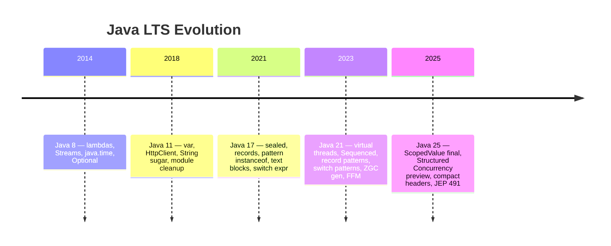

# LTS Evolution — 8 → 11 → 17 → 21 → 25

> Part of [[README|00 Overview]] • `overview` • **One page to answer every "What's new since 8/11/17?" question.** Each LTS builds on the last — interviewers test the **delta**.

## Visual — Interview Story

## Table — What to Say per LTS Jump

| Jump | Must say | Interview Q | Link |
|------|----------|-------------|------|
| **8** (baseline) | lambdas/Streams/`java.time`/`Optional`/`CompletableFuture` | SAM? lazy vs terminal? | [[Java 8 LTS Overview]] |
| **8 → 11** | `var`, `String`/`Files` sugar, `HttpClient` standard, `java Hello.java`, JAXB removal | Where can't `var` go? | [[Java 11 LTS Overview]] |
| **11 → 17** | `record`, `sealed`, pattern `instanceof`, switch expr, text blocks, strong encapsulation | `sealed` permits? record vs class? | [[Java 17 LTS Overview]] |
| **17 → 21** | **Virtual threads (444)**, Sequenced (431), record patterns (440), switch patterns (441), generational ZGC (439); previews 430/443/445 | Does `synchronized` pin on 21? (yes) | [[../09_Java-21-LTS/00 Java 21 Overview|09 — Java 21 Overview]] |
| **21 → 25** | **ScopedValue final (506)**, compact headers (450), Structured Concurrency preview (505), primitive patterns (507), flexible constructors (513), **JEP 491 no pinning** | ScopedValue vs ThreadLocal? | [[Whats New in Java 25]] |

## How to Use This with the Study Plan

- **If interview is "Java 8+"** → [[Java 8 LTS Overview]] → [[Java 11 LTS Overview]] → [[Java 17 LTS Overview]] → done (21/25 as bonus).
- **If "Java 17+"** → Start at [[Java 17 LTS Overview]] → [[../09_Java-21-LTS/README|09 Java 21 LTS]] → [[Whats New in Java 25]].
- **If "Java 21/25"** → [[../09_Java-21-LTS/00 Java 21 Overview|09 Java 21 Overview]] + [[Whats New in Java 25]] + `08_Modern-Java` delta notes.

## Folder Map After Restructure

| Folder | Holds | When |
|--------|-------|------|
| `00_Java-25-Overview` | **This note + 8/11/17 overviews + 21 overview pointer + Roadmap + Study Plan + Dashboard + Strategy** | **Start here — pick your LTS** |
| `01_Core-Java` | SE fundamentals (8-heavy) | W1–W2 |
| `02_OOP` | Pillars + sealed/records tie-in | W2 |
| `03_Collections` | Collections + Sequenced (21) | W3 |
| `08_Modern-Java` | 8→25 modern code patterns | W4 |
| `09_Java-21-LTS` | 21 LTS deep dives (10 notes) | W5 |
| `04_Concurrency` | Threads + Loom (21→25) | W5–W6 |
| `05_Spring` … `07_DSA` … `99_Revision` | Backend + DSA + mocks | W6–W10 |

> **Vault is now 156 notes** (00 grew 5→9). `find Java -name "*.md" | wc -l` to verify.

## Related

- [[README]] • [[Java 8 LTS Overview]] • [[Java 11 LTS Overview]] • [[Java 17 LTS Overview]] • [[../09_Java-21-LTS/README|09 Java 21 LTS]] • [[Whats New in Java 25]] • [[Study Plan - Java 25|Study Plan]]

---
*Category: overview • lts*
