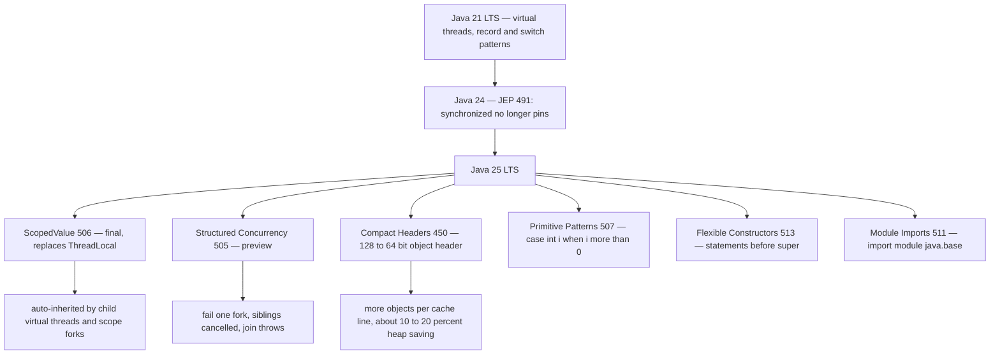
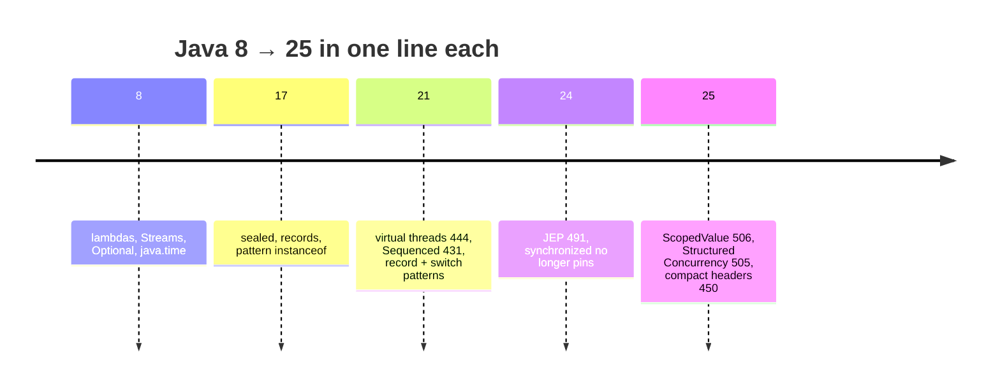

## Why it Matters

Java 25 (Sep 2025) is **the current LTS** and the release that finishes Project Loom: **`ScopedValue` (JEP 506, final)**, **Structured Concurrency (JEP 505, preview)**, **compact object headers (JEP 450)**, **primitive patterns (JEP 507)**, **flexible constructor bodies (JEP 513)**, and **module import declarations (JEP 511)**, on top of JEP 491 (since 24) making `synchronized` no longer pin virtual threads. This note is the one-page answer to "what is new in Java 25?", the single most-asked Java 25 question in backend interviews.

Core ideas:
- **`ScopedValue` replaces `ThreadLocal`** in Loom code: immutable, bound for the duration of a scope, inherited by child virtual threads, no `remove()` leak.
- **`StructuredTaskScope`** scopes concurrent fan-out so failures propagate and siblings are cancelled, replacing ad-hoc `ExecutorService` + `Future.get()` juggling.
- **JEP 491** is the quiet hero: `synchronized` stops pinning the carrier thread, so existing `synchronized` code runs correctly under virtual threads.
- **JEP 450** cuts heap usage by shrinking the object header from 128 to 64 bits.
- **JEP 513 / 507 / 511** are ergonomics: validate before `super()`, pattern-match primitives, `import module java.base`.

## Diagram



## Code

One file showing the four Java 25 features most likely to come up. Compile with `--release 25`; Structured Concurrency and primitive patterns still need `--enable-preview`:
```java
import java.util.concurrent.*;

// 1. ScopedValue (final, JEP 506) — immutable, scope-bound request context
static final ScopedValue<String> REQ_ID = ScopedValue.newInstance();

void handle(String id) {
 ScopedValue.where(REQ_ID, id).run(() -> {
 log(REQ_ID.get()); // visible to child virtual threads too
 });
 // outside the run: REQ_ID.isBound() == false — no leak, no remove()
}

// 2. Structured Concurrency (preview, JEP 505)
record UserOrder(String user, String order) {}

UserOrder load(long id) throws InterruptedException {
 try (var scope = new StructuredTaskScope.ShutdownOnFailure()) {
 var u = scope.fork(() -> fetchUser(id));
 var o = scope.fork(() -> fetchOrder(id));
 scope.join(); // wait for both forks
 scope.throwIfFailed(); // propagate first failure, cancels the sibling
 return new UserOrder(u.get(), o.get());
 }
}

// 3. Primitive patterns (JEP 507) — switch on int/long/double without boxing
String fmt(Object o) {
 return switch (o) {
 case int i when i > 0 -> "positive int " + i;
 case long l -> "long " + l;
 case double d -> "double " + d;
 default -> "other";
 };
}

// 4. Flexible constructor bodies (JEP 513) — validate before super()
class PositivePoint extends Point {
 PositivePoint(int x, int y) {
 if (x < 0 || y < 0) throw new IllegalArgumentException(); // allowed in 25
 super(x, y);
 }
}
```
Per-feature deep dives and the `Vs` tables (virtual vs platform threads, ScopedValue vs ThreadLocal) are in the sections below.

## When to use / not

| Use | Avoid |
|-----|-------|
| **`ScopedValue`** for per-request, immutable context (request id, tenant, principal) on virtual-thread servers | `ThreadLocal` with millions of virtual threads, it mutates and leaks |
| **`StructuredTaskScope`** for fan-out where failures must cancel siblings (multi-service aggregation) | Preview-gated APIs in product control flow until they finalise, `--enable-preview` is not a stability promise |
| **Virtual threads** for IO-bound MVC/JDBC/RestClient workloads | Virtual threads for CPU-bound compute, JNI, or long-held DB locks, they pin or gain nothing |
| **`synchronized` freely around IO** on 25 (JEP 491 fixed pinning) | Assuming old "synchronized pins" blog posts are current, they are stale since 24 |
| **`import module java.base`** for scripts, JShell, small programs | Module imports in large codebases, explicit imports keep them greppable |
| **`-XX:+UseCompactObjectHeaders`** on object-heavy heap-bound services | Flipping it without re-validating `Unsafe`/off-heap layout code and JNI |

## Trade-offs

- **ScopedValue (final) vs ThreadLocal**: immutable and scope-bound, no leaks and no `remove()` needed, but a binding is set once per scope and cannot be mutated and rebound inside it; migrating existing `ThreadLocal` code is a rewrite of every access site.
- **Structured Concurrency (still preview)**: correct fan-out with automatic cancellation, but it needs `--enable-preview` on `javac` and `java`, so mainstream library adoption lags. Do not build product control flow on a preview API yet.
- **Compact object headers (JEP 450)**: roughly 10 to 20 percent heap reduction on object-heavy workloads, but off by default (`-XX:+UseCompactObjectHeaders`) and it changes object layout, so hand-rolled `Unsafe` / off-heap layout code and some JNI libraries need re-validation.
- **Primitive patterns (JEP 507)**: removes boxing for `case int i`, but it is preview-gated and interacts subtly with `Number` and autoboxing in patterns, so verify the exact syntax against a real compiler before quoting it.
- **Flexible constructor bodies (JEP 513)**: validation before `super()` catches bad arguments before the parent is constructed, but statements before `super()` still cannot touch the instance's own fields (they do not exist yet), so it is validation, not initialization.
- **Module imports (JEP 511)**: terse scripts (`import module java.base`), but it erases the explicit-import discipline that keeps large codebases greppable, so reserve it for scripts and JShell.

## Vs

**Virtual Thread vs Platform Thread**

| | Platform | Virtual (Java 21/25) |
|--|----------|---------------------|
| Cost | OS thread (~1MB) | ~KBs, millions per JVM |
| Creation | `Thread.ofPlatform().start()` | `Thread.ofVirtual().start()` or `newVirtualThreadPerTaskExecutor()` |
| Blocking | Blocks OS thread | Parks virtual thread, carrier reused |
| Pinning (25) | N/A | `synchronized` no longer pins (JEP 491) |
| Use | CPU-bound, JNI | IO-bound servers (default on 25) |

**ScopedValue vs ThreadLocal**

| | ThreadLocal | ScopedValue (25) |
|--|-------------|------------------|
| Mutability | mutable `set/remove` | immutable binding per scope |
| Inheritance | manual `InheritableThreadLocal` | auto to child virtual/structured tasks |
| Leaks | yes without `remove()` | no , scope exit clears |
| Perf with Loom | expensive | cheap |

## Pitfalls

- **Answering "does `synchronized` pin a virtual thread?" with "yes"**, the correct answer is "not since Java 24, JEP 491". Before 491, `synchronized` plus blocking IO pinned the carrier and could collapse throughput; since 24 it unmounts like `ReentrantLock`.
- **Calling Structured Concurrency "final"**, JEP 505 is a **preview** feature in 25 and needs `--enable-preview`; only `ScopedValue` (506) is final.
- **Using `ThreadLocal` on a virtual-thread server**, it is mutable and leaks across a million threads; the scoped replacement is `ScopedValue`.
- **Treating `spring.threads.virtual.enabled=true` as a free lunch**, it does not fix CPU-bound work, long-held DB locks, or JNI/native frames that still pin, and `InheritableThreadLocal` does not propagate to `StructuredTaskScope` forks.
- **Enabling compact headers on code that assumes 128-bit headers**, re-validate `Unsafe` / off-heap layout code and JNI before flipping `-XX:+UseCompactObjectHeaders`.
- **Quoting "final" vs "preview" status from memory**, JEP status changes between releases; verify at openjdk.org before making a claim in an interview.

## Interview q&a

**Q1. What is new in Java 25 compared to 21?**
Java 25 = Java 21 LTS plus: **`ScopedValue` final (JEP 506)** as the ThreadLocal replacement, **Structured Concurrency preview (JEP 505)** via `StructuredTaskScope`, **compact object headers (JEP 450)** for roughly 10 to 20 percent heap savings, **primitive patterns (JEP 507)** so `case int i` works without boxing, **flexible constructor bodies (JEP 513)** allowing statements before `super()`, and **module imports (JEP 511)**. Plus, since Java 24, **JEP 491** made `synchronized` no longer pin virtual threads.

**Q2. Why does `synchronized` no longer pin a virtual thread in Java 24/25?**
JEP 491 improved the JVM so a virtual thread entering a `synchronized` block can unmount its carrier thread while blocked on the monitor, the same way it already could for `ReentrantLock` and blocking IO. Before 491 the monitor state was tied to the platform thread, so a blocking `synchronized` call held the carrier hostage and could starve the whole server. Practical note: `ReentrantLock` is still preferred when you need `tryLock` timeouts or interruptibility; `synchronized` is now safe but not more capable.

What is new in Java 25 compared to 21?:: ScopedValue final (506), Structured Concurrency preview (505), compact object headers (450), primitive patterns (507), flexible constructor bodies (513), module imports (511); plus since 24, JEP 491 makes `synchronized` no longer pin virtual threads. #flashcard
Why does `synchronized` no longer pin a virtual thread in Java 24/25?:: JEP 491 lets a virtual thread unmount its carrier while blocked on a monitor, like it already could for `ReentrantLock` and blocking IO. Before, the monitor state was tied to the platform thread. Prefer `ReentrantLock` for timeouts and interrupts. #flashcard

## Related

- [[Java 25 Roadmap]] • [[../08_Modern-Java/README|08 Modern Java]] • [[../04_Concurrency/Threads|Threads]] • [[Interview Strategy]]

---
*Category: overview • java25*

# Whats new in Java 25 , Interview Cheat Sheet

> Part of [[README|00 Overview]] • `overview` • Every LTS-relevant feature 8 → 25 with interview angle

## TL;DR for Interviews

> Java 25 = Java 21 LTS **plus**: **ScopedValue (final)**, **Structured Concurrency (preview JEP 505)**, **compact object headers (JEP 450)**, **primitive types in patterns (JEP 507)**, **flexible constructor bodies (JEP 513)**, **module import declarations (JEP 511)**, plus refinements to virtual threads (JEP 491 , `synchronized` no longer pins). Everything below 8→21 is still asked; 21→25 is the delta.

## Must-Know Timeline (8 → 25)


| Version | Feature | JEP | Interview Q |
|---------|---------|-----|-------------|
| **8** | Lambdas, Streams, Optional, Date/Time | 126,150 | SAM, intermediate vs terminal |
| **9** | Modules, `List.of`, `jshell` | 261 | Module vs package |
| **10** | `var` | 286 | `var` limits |
| **14-16** | `record`, `sealed`, pattern `instanceof` | 359,360,394,397 | `record` vs class vs Lombok |
| **17 LTS** | Sealed final, pattern switch (preview) | 409 | `sealed` permits |
| **21 LTS** | **Virtual threads**, **SequencedCollection**, pattern switch + record patterns (final), String Templates (preview) | 444,431,440,441,430 | virtual vs platform, pinning? |
| **22** | `ScopedValue` (preview), Stream Gatherers (preview), Class-File API | 464,461,447 | ScopedValue vs ThreadLocal |
| **23** | Markdown javadoc, primitive patterns (preview), `ScopedValue` 2nd preview | 467,455,464 | , |
| **24** | **JEP 491** `synchronized` no longer pins virtual threads | 491 | "Does synchronized pin?" → No since 24 |
| **25 LTS** | **ScopedValue final (506)**, **Structured Concurrency preview (505)**, **Compact Headers (450)**, **Primitive patterns (507)**, **Flexible constructors (513)**, **Module imports (511)** | 506,505,450,507,513,511 | See below |

## Java 25 , the 6 you Must Explain Whiteboard-Style

### 1. ScopedValue (jep 506, Final) , Replaces ThreadLocal

```java
static final ScopedValue<String> REQ_ID = ScopedValue.newInstance();
void handle(String id) {
 ScopedValue.where(REQ_ID, id).run(() -> {
 // visible to child virtual threads + StructuredTaskScope forks
 log(REQ_ID.get());
 });
 // outside: REQ_ID.isBound()==false — no leak, no remove()
}
```
**Vs:** `ThreadLocal` = mutable, leaks with millions of virtual threads, `remove()` required. `ScopedValue` = immutable, bounded by scope, inherited automatically, cheaper.

### 2. Structured Concurrency , StructuredTaskScope (jep 505, Preview)

```java
// javac --enable-preview --release 25
try (var scope = new StructuredTaskScope.ShutdownOnFailure()) {
 var u = scope.fork(() -> fetchUser(id));
 var o = scope.fork(() -> fetchOrder(id));
 scope.join(); scope.throwIfFailed();
 return u.get() + o.get();
}
```
Types: `ShutdownOnFailure` (all required) vs `ShutdownOnSuccess<T>` (first wins). Failures propagate, siblings cancelled, scope enforces structure (try-with-resources).

### 3. Flexible Constructor Bodies (jep 513) , Statements before`super()`/`this()`

```java
class PositivePoint extends Point {
 PositivePoint(int x, int y) {
 if (x < 0 || y < 0) throw new IllegalArgumentException(); // allowed in 25!
 super(x, y);
 }
}
```
Before 25: `super()`/`this()` had to be first statement , validation required static helpers. Now: validate/compute before super.

### 4. Primitive Types in Patterns (jep 507) ,`switch`Over Primitives with Patterns

```java
String fmt(Object o) {
 return switch (o) {
 case int i when i > 0 -> "pos " + i;
 case long l -> "long " + l;
 case double d -> "double " + d;
 default -> "other";
 };
}
```
No more boxing to use pattern matching over `int`/`long`/`double`.

### 5. Module Import Declarations (jep 511) ,`import module java.base`

```java
import module java.base; // imports all public types from java.base
// vs import java.util.* per package
```
Concise for small programs/scripts; interview: know it exists, not for large codebases (explicit imports preferred).

### 6. Compact Object Headers (jep 450) , 64-bit Lilliput

Shrinks object header 128→64 bits (`-XX:+UseCompactObjectHeaders`). More objects per cache line, ~10-20% heap saving on some workloads. Enabled via flag in 25 (default in future LTS). Interview: "How to reduce memory footprint on 25?" → compact headers + records.

### + jep 491 (Since 24, Essential for 25 Interviews)

`synchronized` **no longer pins** virtual thread carrier. Before 24: `synchronized` + blocking IO pinned carrier → throughput collapse. Since 24: unmounts like `ReentrantLock`. Still prefer `ReentrantLock` when you need timeouts/interrupts.

## Quick Check , can you Answer?

- [ ] Why does `synchronized` no longer pin in Java 25?
- [ ] ScopedValue vs ThreadLocal , when to use which?
- [ ] `record` vs `class` vs `record` with compact constructor?
- [ ] `SequencedCollection.getFirst()` vs `list.get(0)`?
- [ ] What does `-XX:+UseCompactObjectHeaders` do?
