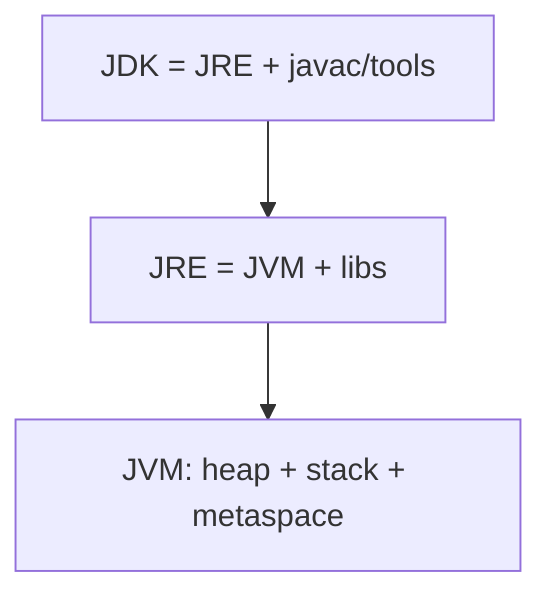

---
title: "Core Java Cheat Sheet"
category: "Core-Java"
tags: [java, cheat-sheet, core]
created: 2026-09-03
pattern: 0
difficulty: Easy
completed: false
reviewed: ""
sr-due: ""
problems-solved: []
problems-solved-dates: {}
excalidraw: ""
---## Why it Matters

One page that collapses the Core Java topics that interviewers probe most: JVM/JRE/JDK boundaries, primitive vs wrapper identity, `String` pool and mutability, generics variance, exceptions, and the Java 25 idioms (records, sealed, pattern matching, `Optional`, NIO). Use it as the *recall* layer after reading the topic notes, not a substitute for them.

## Diagram



## Code

```java
// The six idioms that decide most Core Java interview answers
record User(String name, int age) {} // Java 16+ data carrier

// String pool: == vs .equals
var a = "hi"; var b = new String("hi");
System.out.println(a == b.intern()); // => true, pool reuse

// Wrapper identity cache: -128..127
Integer x = 127, y = 127; System.out.println(x == y); // => true
Integer m = 128, n = 128; System.out.println(m == n); // => false, use equals

// try-with-resources for checked resources
try (var br = java.nio.file.Files.newBufferedReader(java.nio.file.Path.of("f.txt"))) {
 br.lines().toList();
}

// Optional: lazy default, never null
var v = java.util.Optional.ofNullable(name).orElseGet(() -> defaultName());

// Sequenced + pattern matching (Java 21+)
if (obj instanceof User(var n, var a) && a >= 18) System.out.println(n);
```

## When to use / not

| Use | NOT |
|-----|-----|
| `.equals()` for `String`/wrapper/logical equality | `==` on wrappers or interned-unknown strings |
| `StringBuilder` in loops | `+` concatenation inside a loop, O(n²) |
| `try-with-resources` for every `AutoCloseable` | manual `close()` in `finally` |
| `Optional` as return type only | `Optional` as field or method parameter |
| Records for immutable data carriers | Records as JPA entities |

## Trade-offs

- One page covers the six idioms interviewers probe: pool, cache, generics, exceptions, `Optional`, records.
- Depth lives in the topic notes; this page is recall, not learning.

## Vs

| | This cheat sheet | Topic notes (e.g. `String Handling`) |
|--|------------------|--------------------------------------|
| Depth | one line per concept | full canonical sections |
| Purpose | last-minute recall | learn and practice one topic |

## Pitfalls

- `==` on `String` literals can be true and on `new String` false , always `.equals()`.
- Autoboxing cache ends at 127; `128 == 128` is false for `Integer`, use `.equals()`.
- `orElse(default)` always evaluates the default; use `orElseGet` when it is expensive.
- `var` cannot be used for fields or method parameters, locals only.

## Interview q&a

**Q: `String` pool, `new String("a")` creates how many objects?** Two, the pool literal plus the heap object; `intern()` returns the pool one.

**Q: `Integer` cache range?** `-128` to `127`; beyond it, `==` compares references.

**Q: `==` vs `.equals()`?** `==` compares references (or primitives), `.equals()` compares logical state; override it consistently with `hashCode`.

**Q: Checked vs unchecked exceptions?** Checked are verified at compile time (`IOException`), unchecked extend `RuntimeException` (`NPE`, `IAE`).

`new String("a")` creates how many objects?:: Two, the pool literal plus the heap object. #flashcard
Integer cache range?:: -128 to 127; beyond it `==` compares references. #flashcard
Checked vs unchecked exception?:: Checked verified at compile time; unchecked extend RuntimeException. #flashcard

## Related

- [[01_Core-Java/README|Core Java MOC]] • [[Classes]] • [[Interface]] • [[Object Class]] • [[Wrapper Class]]
- [[String Handling]] • [[Generics]] • [[Optional]] • [[Streams API]] • [[JVM Memory Model]]
- [[Exception Handling]] • [[Serialization]] • [[Date and Time API]] • [[IO and NIO]]

# Core Java , Cheat Sheet

> Part of [[Java/01_Core-Java/README|Core Java]]

## JVM vs jdk vs jre | Primitives vs Wrappers | String vs StringBuilder vs StringBuffer

| Concept | A | B | Key Difference |
|---|---|---|---|
| **JVM / JRE / JDK** | JVM (runtime, interprets bytecode) | JRE = JVM + libs; JDK = JRE + javac/javadoc | JDK to build, JRE to run, JVM to execute |
| **Primitive vs Wrapper** | `int` (stack, no null) | `Integer` (heap, nullable, cached -128..127) | Use `Integer.valueOf()` not `new Integer()`; `==` compares refs for wrappers |
| **String vs StringBuilder vs StringBuffer** | `String` immutable, pool, thread-safe | `StringBuilder` mutable, not sync | `StringBuffer` mutable + synchronized → slower; prefer Builder |
| **== vs .equals()** | `==` ref equality | `.equals()` logical (override!) | For Strings always `.equals()`; for records auto-generated |
| **Checked vs Unchecked** | Checked: `IOException` (compile-time) | Unchecked: `NPE`, `IAE` (RuntimeException) | Don't catch `Error`; use try-with-resources for checked |
| **static vs instance** | `static` = class-level, 1 copy | instance = per-object | static can't access `this`; static blocks run once on class load |

## Core Concepts , Quick Table

| Topic | Must-Know | Interview Trap |
|---|---|---|
| **String Pool** | `new String("a")` creates 2 objects; `"a".intern()` reuses pool | `==` on literals true, on `new String` false |
| **Immutability** | `String`, `Integer`, `LocalDate` immutable; `final class + private final fields + no setters + defensive copy` | Returning mutable field breaks immutability |
| **Autoboxing** | `Integer i=127; i==127` → true (cache); `128==128` → false | Use `.equals()` for wrapper comparison |
| **Generics (PECS)** | `Producer Extends, Consumer Super` | `List<Integer>` ≠ `List<Number>`; use `? extends Number` |
| **Optional** | Never null; `ofNullable`, `orElse` vs `orElseGet` (lazy) | Don't use `Optional` as field/param; `orElse` always executes |
| **Records (Java 16+)** | `record Point(int x,int y){}` auto equals/hashCode | Compact constructor for validation |
| **Sealed Classes (17+)** | `sealed class Shape permits Circle, Square` | `switch` becomes exhaustive , no default needed |
| **Var (`var`)** | Local type inference, not keyword | Can't use for fields/params |

## Time / Space Notes

| Operation | Complexity | Note |
|---|---|---|
| String concat in loop (`+`) | O(n²) | Use `StringBuilder` → O(n) |
| `StringBuilder.append` | Amortized O(1) | Backed by resizable char[] |
| Autoboxing array `int[]` vs `Integer[]` | `Integer[]` 4× memory | Prefer primitives in hot loops |

## Java 25 One-liners

```java
// Modern Java idioms, records, sealed hierarchies, streams, NIO
record User(String name, int age) {}
if (obj instanceof User(var n, var a) && a >= 18) System.out.println(n);

sealed interface Shape permits Circle, Rect {}
String desc = switch(shape){ case Circle c -> "circle r="+c.r(); case Rect r -> "rect"; };

String json = """
 {"name": "%s", "age": %d}
 """.formatted(name, age);

// Optional and Streams, prefer lazy orElseGet and unmodifiable toList()
var val = Optional.ofNullable(mayBeNull).orElseGet(() -> expensiveDefault());
var evens = list.stream().filter(n -> n%2==0).toList();
var first = list.getFirst(); var last = list.getLast();

try (var br = Files.newBufferedReader(path)) { return br.lines().toList(); }

String hex = HexFormat.of().formatHex(bytes);
```
> **Memory:** Stack (primitives, refs) → Heap (objects) → Metaspace (class metadata) → PC Register + Native Stack. GC: G1 (default), ZGC/Shenandoah (low-latency, Java 21+ Generational ZGC).

*Category: CheatSheet*
