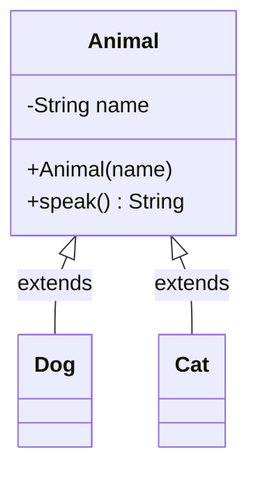

# Classes
> Part of [[Java/01_Core-Java/README|Core Java]]

> A class is a user-defined blueprint or prototype from which objects are created. It represents the set of properties and methods common to all objects of one type.

## Why it Matters

Define *what* an object knows (fields) and *what it can do* (methods) in one reusable blueprint. Classes are the foundation of OOP in Java. Every object is an instance of a class.

## Diagram



## Code

> **Java 25:** Compact Source Files & Instance Main Methods (JEP 512, finalized), simple demos can use `void main() { IO.println(...) }` without `public class`/`public static void main(String[])`; `import module java.base` implicit; `System.out.println` still valid but `IO.println` is idiomatic for compact sources.

Runnable Java 25, modeling a class with encapsulation and behavior:
```java
public class ClassesDemo {
 // Static nested class — no hidden outer reference (efficient, no leak)
 static class Car {
 // Encapsulated state — invariant: speed never < 0
 private String model; private int speed;
 Car(String m) { model = m; }
 // Domain behavior
 void accelerate(int d) { speed += d; }
 void brake(int d) { speed = Math.max(0, speed - d); }
 @Override public String toString() { return model + " @ " + speed + " km/h"; }
 }
 // Entry point — classic form; Java 25 also allows void main()
 public static void main(String[] args) {
 var c = new Car("Polo GT");
 c.accelerate(40); c.brake(10);
 System.out.println(c); // Polo GT @ 30 km/h
 }
}
// Tip: For immutable/thread-safe design prefer record (Java 17+):
// record Car(String model, int speed) {
// Car { if (speed < 0) throw new IllegalArgumentException(); }
// Car accelerate(int d) { return new Car(model, speed + d); }
// Car brake(int d) { return new Car(model, Math.max(0, speed - d)); }
// }
```

## When to use / not

| Use | Avoid |
|-----|-------|
| Modeling a domain entity (User, Order, Car) | Representing pure behavior with no state, prefer `interface` or `enum` |
| Need encapsulation + instance state | Single constant group, prefer `enum` or utility class |
| Need inheritance / polymorphism | Only grouping static helpers, use `final` utility class with private constructor |

## Trade-offs

- Encapsulation, reusability, testability.
- Enables inheritance and polymorphism.
- Natural domain modelling.

## Vs

| Concept | Class | Interface | Record (Java 16+) |
|---------|-------|-----------|-------------------|
| State | Yes (fields) | No (constants only pre-Java 8) | Yes (compact, immutable) |
| Instantiable | Yes | No | Yes |
| Multiple inheritance | Single class | Multiple interfaces | No |

## Pitfalls

- Exposing mutable fields without getters/setters breaks encapsulation.
- Forgetting a no-arg constructor when frameworks (Jackson, JPA) need it.
- Confusing `==` (reference) with `.equals()` (value) on class instances.

---
*Category: Core-Java • java25*

## Interview q&a

**Q1. Class vs Object?**
Class is the blueprint; object is an instance created with `new` that occupies heap memory.

**Q2. Can a Java file have multiple public classes?**
No, only one `public` top-level class per `.java` file, and its name must match the filename.
Class vs Object?:: Class is the blueprint; object is an instance created with `new` that occupies heap memory. #flashcard
Can a Java file have multiple public classes?:: No, only one `public` top-level class per `.java` file, and its name must match the filename. #flashcard

## Related

- [[Concrete Class]]
- [[Abstract Class]]
- [[POJO Class]]
- [[Object Class]]
- [[Interface]]
- [[Java/01_Core-Java/Types/Wrapper Class|Wrapper Class]]
- [[Java/01_Core-Java/Types/Singleton Class|Singleton Class]]
- [[Java/01_Core-Java/Types/Immutable Class|Immutable Class]]
