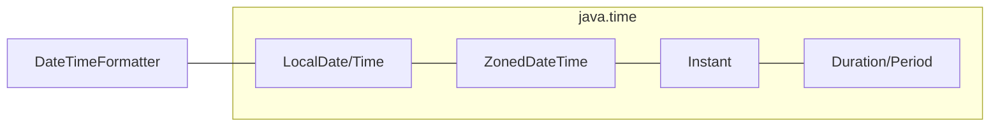

# Date and Time api
> Part of [[Java/01_Core-Java/README|Core Java]]

> Java 8 introduced `java.time` (JSR-310), an immutable, thread-safe, domain-driven replacement for the broken `Date`/`Calendar` model. `Instant`, `LocalDate`, `LocalDateTime`, and `ZonedDateTime` cover machine time vs human time, with `DateTimeFormatter`, `Period`, and `Duration` completing the model.

## Why it Matters

Replace `java.util.Date` and `Calendar`, which are mutable, not thread-safe, 0-indexed months, and timezone-confusing, with a clear separation of **machine timeline** (`Instant`, epoch seconds), **local human time** (`LocalDate`/`LocalTime`/`LocalDateTime`, no zone), and **zoned human time** (`ZonedDateTime`/`OffsetDateTime`, with zone/offset). Make date-time arithmetic explicit and safe via immutability and fluent APIs.

## Diagram



## Code

> **Java 25:** `java.time` unchanged since Java 8, still the standard. Java 25 idioms used below: `var`, `Path.of`, `Files.readString`/`writeString`, `IO.println`. Compact Object Headers (JEP 450) reduce header overhead for the many small `java.time` objects created in tight loops. No API change for `java.time` in Java 25.

Runnable Java 25, covers `Instant`/`LocalDate`/`ZonedDateTime`, formatting, `Period`/`Duration`, and `Files` round-trip:
```java
import java.time.*;
import java.time.format.DateTimeFormatter;
public class DateTimeApiDemo {
 public static void main(String[] args) {
 var now = Instant.now();
 var today = LocalDate.now();
 var zoned = ZonedDateTime.now(ZoneId.of("Asia/Kolkata"));
 System.out.println("instant: " + now);
 System.out.println("today: " + today.plusWeeks(1));
 var fmt = DateTimeFormatter.ofPattern("dd MMM yyyy");
 System.out.println(today.format(fmt));
 System.out.println("zoned: " + zoned);
 }
}
```
Compile & run (Java 25):
```bash
javac DateTimeApiDemo.java && java DateTimeApiDemo
```

## When to use / not

| Use | Avoid |
|-----|-------|
| `Instant` for timestamps, event ordering, logging, epoch millis, always UTC | `Date` / `Calendar` / `SimpleDateFormat` in new code, legacy, mutable, not thread-safe |
| `LocalDate` for birthdays, deadlines without time/zone; `LocalDateTime` for local schedules | `LocalDateTime` for absolute points in time, it has no zone, so instant is ambiguous |
| `ZonedDateTime` / `OffsetDateTime` for user-facing times, scheduling across zones | Storing zoned times as `String` without offset/zone, loses DST and offset info |

## Trade-offs

- Immutable & thread-safe, no defensive copies, safe to share `DateTimeFormatter` as `static final`.
- Domain clarity, `Instant` (machine) vs `LocalDate` (human without zone) vs `ZonedDateTime` (human with zone) prevents timezone bugs.
- Rich arithmetic, `plus`/`minus`/`with`/`between` with `Period`/`Duration`/`ChronoUnit`, DST-aware for zoned types.

## Vs

## Pitfalls

- Using `LocalDateTime` to represent an absolute instant, it has no zone, so the same value means different instants in different zones; use `Instant` or `ZonedDateTime`.
- Sharing `SimpleDateFormat` across threads, not thread-safe; use `DateTimeFormatter`.
- Confusing `Period` and `Duration`, `Period.ofDays(1)` on a `ZonedDateTime` across DST is not always 24 hours.
- Using `Date`/`Calendar` in new code or `Calendar.MONTH` 0-index, `java.time` months are 1-based.
- Parsing without strict resolver or locale, e.g., `MM/dd/yyyy` vs `dd/MM/yyyy` swapped silently; always specify `DateTimeFormatter` pattern and `Locale`.
- Forgetting `java.time` types are immutable, `date.plusDays(1)` returns a **new** object; must reassign: `date = date.plusDays(1)`.
- Storing zoned time as string without zone/offset, round-trip loses info; store as `Instant` (UTC) or ISO-8601 with offset.
- Using `Instant.now()` for user display without converting to `ZoneId`, shows UTC, not wall-clock time.

## Interview q&a

**Q1. Why was `java.time` introduced? What's wrong with `Date`/`Calendar`?**
`Date` is mutable, 0-indexed months, mixes date+time+zone in one class, and `SimpleDateFormat` is not thread-safe. `Calendar` is verbose and still mutable. `java.time` fixes all of this: immutable types, 1-based months, clear separation of machine vs human time, and `DateTimeFormatter` is thread-safe. It's the only choice for new code.

**Q2. When do you use `Instant` vs `LocalDate` vs `ZonedDateTime`?**
`Instant`, absolute point on UTC timeline; use for timestamps, DB storage, event ordering, `System.currentTimeMillis()` replacement. `LocalDate`/`LocalDateTime`, human calendar without zone; birthdays, local business hours where zone is implicit. `ZonedDateTime`, human time with zone rules including DST; scheduling, user display across timezones. Rule: **store as `Instant` (or UTC), display as `ZonedDateTime`**.
Why was `java.time` introduced? What's wrong with `Date`/`Calendar`?:: `Date` is mutable, 0-indexed months, mixes date+time+zone in one class, and `SimpleDateFormat` is not thread-safe. `Calendar` is verbose and still mutable. `java.time` fixes all of this: immutable types, 1-based months, clear separation of machine vs human time, and `DateTimeFormatter` is thread-safe. It's the only choice for new code. #flashcard
When do you use `Instant` vs `LocalDate` vs `ZonedDateTime`?:: `Instant`, absolute point on UTC timeline; use for timestamps, DB storage, event ordering, `System.currentTimeMillis()` replacement. `LocalDate`/`LocalDateTime`, human calendar without zone; birthdays, local business hours where zone is implicit. `ZonedDateTime`, human time with zone rules including DST; scheduling, user display across timezones. Rule: **store as `Instant` (or UTC), display as `ZonedDateTime`**. #flashcard

## Related

- [[Exception Handling]]
- [[String Handling]]
- [[Classes]]
- [[Serialization]]

---
*Category: Core-Java • Part of [[README|Java MOC]] • java25*

### 1. Date vs Calendar vs Java.time (Jsr-310)

| Aspect | `java.util.Date` | `java.util.Calendar` | `java.time` (Java 8+) |
|--------|------------------|-----------------------|------------------------|
| Mutability | Mutable | Mutable | Immutable |
| Thread-safety | No | No | Yes |
| Month indexing | 0-based (Jan=0), bug prone | 0-based | 1-based (`Month.JANUARY=1`) |

### 2. Period vs Duration

| Aspect | `Period` | `Duration` |
|--------|----------|------------|
| Measures | Date-based: years, months, days (calendar) | Time-based: seconds, nanos (exact) |
| Factory | `Period.ofDays(1)`, `Period.between(d1, d2)` | `Duration.ofHours(24)`, `Duration.between(t1, t2)` |
| DST aware | Yes, `Period.ofDays(1)` across DST may be 23h or 25h | No, `Duration.ofDays(1)` is always exactly 24h |

### 3. Localdatetime vs Zoneddatetime vs Offsetdatetime vs Instant

| Aspect | `LocalDateTime` | `ZonedDateTime` | `OffsetDateTime` | `Instant` |
|--------|-----------------|-----------------|------------------|-----------|
| Contains | Date + time, no zone | Date + time + ZoneId (rules/DST) | Date + time + offset | Epoch seconds + nanos (UTC) |
| Zone rules | None | Full (`Asia/Kolkata` with DST history) | Fixed offset (`+05:30`) | Always UTC |
| Use when | Local schedule without zone context | User-facing wall-clock time | Protocol/API with offset, no DST rules | Timestamps, storage, ordering |
