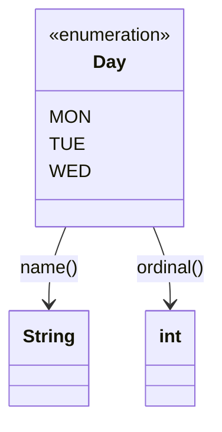

# Enums
> Part of [[Java/01_Core-Java/README|Core Java]]

> An `enum` is a special type-safe class that represents a fixed set of constants. Unlike `public static final` constants, enums are objects with type safety, behavior, and compiler enforcement, invalid values cannot be created or passed.

## Why it Matters

Model a closed set of named values (days, states, commands) where every valid value is known at compile time. Enums guarantee singleton identity per constant, enable exhaustive `switch`, and can carry fields and methods.

## Diagram



## Code

> **Java 25:** Enums gain exhaustive pattern-matching `switch` (JEP 441/445/488), compiler enforces covering all constants without `default` and supports `case Status.PENDING ->` with guards. `EnumSet`/`EnumMap` (bit-vector/array) unchanged; prefer them for enum collections. Persist `name()` not `ordinal()`.

Runnable Java 25, enum with fields, interface implementation, switch, and collections:
```java
import java.util.EnumMap;
import java.util.EnumSet;

interface Describable { String describe(); }

enum Status implements Describable {
 PENDING(0, "Awaiting action"),
 APPROVED(1, "Ready to proceed"),
 REJECTED(2, "Needs rework");

 private final int code;
 private final String label;

 }
}
```

## When to use / not

| Use | Avoid |
|-----|-------|
| Fixed, known set of values (Day, Direction, Status) | Open-ended or dynamic values from DB/config, use class or String |
| Need type safety over `String`/`int` constants | Single constant, use `static final` |
| Constant needs fields, behavior, or polymorphism | Values need to be extended at runtime, enums are final |

## Trade-offs

- Compile-time type safety, invalid values impossible.
- Singleton guarantee per constant; `==` comparison is safe and fast.
- Rich model: fields, methods, constructors, interface implementation.

## Vs

| Aspect | Enum | Class |
|--------|------|-------|
| Instantiation | Fixed constants only, no `new` | `new` any number of instances |
| Inheritance | Implicitly extends `Enum`, cannot extend another class; can implement interfaces | Can extend one class, implement multiple interfaces |
| Instances | Singleton per constant, `==` safe | New object per `new` |

## Pitfalls

- Persisting `ordinal()` instead of `name()`, breaks when enum order changes.
- Using `equals()` instead of `==`, both work but `==` is null-safe and idiomatic for enums.
- Adding mutable fields to an enum, enum constants are singletons; mutable state is shared globally.
- Using `valueOf()` without handling `IllegalArgumentException` for unknown names.
- Forgetting `EnumSet`/`EnumMap` and using `HashSet`/`HashMap`, slower and unordered for enums.

---
*Category: Core-Java • java25*

## Interview q&a

**Q1. Why use enum over `public static final String` constants?**
Type safety, namespace grouping, compiler-checked `switch`, ability to add behavior, and `==` identity. String constants accept any string, enums reject invalid values at compile time.

**Q2. Can an enum have a constructor, fields, and methods?**
Yes. Enum constructors are implicitly `private` and called once per constant. Enums can have fields, instance/static methods, and even abstract methods overridden per constant. They can implement interfaces.
Why use enum over `public static final String` constants?:: Type safety, namespace grouping, compiler-checked `switch`, ability to add behavior, and `==` identity. String constants accept any string, enums reject invalid values at compile time. #flashcard
Can an enum have a constructor, fields, and methods?:: Yes. Enum constructors are implicitly `private` and called once per constant. Enums can have fields, instance/static methods, and even abstract methods overridden per constant. They can implement interfaces. #flashcard

## Related

- [[Classes]]
- [[Java/01_Core-Java/Types/Abstract Class|Abstract Class]]
- [[Interface]]
- [[Java/01_Core-Java/Types/Singleton Class|Singleton Class]]
- [[Java/01_Core-Java/Types/Immutable Class|Immutable Class]]

### Enum vs Constants

| Aspect | `public static final` Constants | `enum` |
|--------|----------------------------------|--------|
| Type safety | No, any `String`/`int` accepted | Yes, only declared constants allowed |
| Namespace | Scattered, collision-prone | Grouped under one type |
| `switch` support | Limited (int/String only, no exhaustiveness) | Exhaustive check, compiler warning if case missing |

### Enum with Fields, Constructor & Methods

Enums can have private fields, a private constructor, and instance/static methods. Each constant calls the constructor.
```java
enum Planet {
 MERCURY(3.303e+23, 2.4397e6),
 EARTH (5.976e+24, 6.371e6),
 JUPITER(1.9e+27, 6.9911e7);

 private final double mass; // kg
 private final double radius; // m
 private final double G = 6.67300E-11;

 Planet(double mass, double radius) {
 this.mass = mass;
 this.radius = radius;
 }
}
```
> **Rules:** Constructor is implicitly `private` (cannot be `public`/`protected`). Enum implicitly extends `java.lang.Enum`, cannot extend another class but *can* implement interfaces.

### Enumset and Enummap

High-performance `Set`/`Map` implementations specialized for enums, internally backed by bit vectors / arrays.
```java
import java.util.EnumMap;
import java.util.EnumSet;

enum Day { MON, TUE, WED, THU, FRI, SAT, SUN }

public class EnumCollectionDemo {
 public static void main(String[] args) {
 // EnumSet, bit-vector, fastest Set for enums
 EnumSet<Day> weekend = EnumSet.of(Day.SAT, Day.SUN);
 EnumSet<Day> weekdays = EnumSet.range(Day.MON, Day.FRI);
 EnumSet<Day> all = EnumSet.allOf(Day.class);
 System.out.println("Weekend: " + weekend);
 System.out.println("Weekdays: " + weekdays);
 }
}
```
| Collection | Backing | Null keys? | Ordered? | Performance |
|------------|---------|------------|----------|-------------|
| `EnumSet` | Bit vector (`long`) | No | Declaration order | Fastest Set for enums |
| `EnumMap` | Array indexed by ordinal | No | Declaration order | Fastest Map for enum keys |
| `HashSet`/`HashMap` | Hash table | Yes | No | General purpose, slower for enums |
