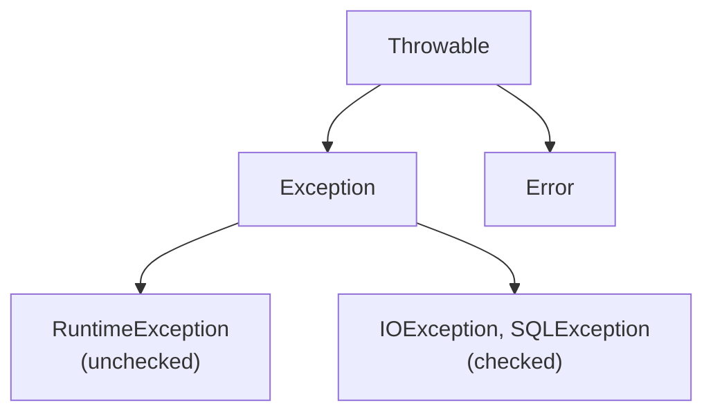

# Exception Handling
> Part of [[Java/01_Core-Java/README|Core Java]]

> Exception handling is Java's mechanism to handle runtime disruptions without crashing the program. It separates error-handling code from business logic using `try`, `catch`, `throw`, `throws`, and `finally`, with the JVM propagating exceptions up the call stack until handled.

## Why it Matters

Provide a structured, recoverable way to handle failures, missing files, network failures, invalid inputs, without using error codes or `System.exit()`. Exceptions make failure explicit, type-safe, and enforceable by the compiler (checked exceptions).

## Diagram



## Code

> **Java 25:** Exception handling unchanged, `try-with-resources`, `multi-catch`, and `ObjectInputFilter` remain. Use pattern-matching `instanceof` in `catch`/handlers (`if (e instanceof IOException io)`) and keep `catch` specific; `IO.println` available in compact sources.

Runnable Java 25, covers checked vs unchecked, try-with-resources, and custom exception:
```java
import java.io.*;

// Custom exception, checked (extends Exception) vs unchecked (extends RuntimeException)
class InsufficientFundsException extends Exception {
 InsufficientFundsException(String msg) { super(msg); }
}
class InvalidAccountException extends RuntimeException {
 InvalidAccountException(String msg) { super(msg); }
}

// Service showing checked vs unchecked + throws
class AccountService {
 private double balance = 1000;
 }
}
```
> **Key rules:**
> - **Checked** (`Exception` except `RuntimeException`): compiler enforces handling, `IOException`, `SQLException`, `InsufficientFundsException`.
> - **Unchecked** (`RuntimeException` + `Error`): compiler does NOT enforce, `NullPointerException`, `IllegalArgumentException`, `InvalidAccountException`.
> - **try-with-resources** requires `AutoCloseable`; resources closed in reverse declaration order; exceptions from `close()` are *suppressed*, not lost.
> - **Custom exceptions:** extend `Exception` for recoverable/checked, `RuntimeException` for programming errors; always provide `String msg` and `Throwable cause` constructors.

## When to use / not

| Use | Avoid |
|-----|-------|
| Recoverable error the caller *can* handle (file not found, timeout) | Normal control flow, don't use exceptions for `if/else` logic |
| Enforcing API contracts (throw `IllegalArgumentException` for bad args) | Throwing generic `Exception` / `Throwable`, be specific |
| Resource cleanup with `try-with-resources` | Swallowing exceptions with empty `catch` blocks |

## Trade-offs

- Separates error handling from happy-path logic, cleaner code.
- Checked exceptions enforce handling at compile time, fail-fast API design.
- Stack trace + cause chaining gives rich debugging context.

## Vs

## Pitfalls

- Catching `Exception` or `Throwable` broadly, masks bugs and `Error`s; catch the most specific type.
- Empty `catch` blocks, silent failures; at minimum log with context.
- Throwing/catching `Error` (e.g., `OutOfMemoryError`), JVM-level, rarely recoverable.
- Losing the cause: `catch (IOException e) { throw new RuntimeException("failed"); }`, always pass `e` as cause: `new RuntimeException("failed", e)`.
- Throwing from `finally`, hides the original exception; keep `finally` non-throwing.
- Using exceptions for control flow (e.g., breaking loops), expensive and obscures intent.
- Forgetting that `try-with-resources` closes in *reverse* order, order matters for dependent resources.
- Declaring `throws Exception` on methods, erodes the value of checked exceptions; declare specific types.
- Relying on `finalize()` for cleanup, non-deterministic, deprecated; use `try-with-resources` / `Cleaner`.

## Interview q&a

**Q1. What is the exception hierarchy in Java?**
`Throwable` → `Exception` and `Error`. `Exception` splits into checked (`IOException`) and unchecked (`RuntimeException`). `Error` (`OutOfMemoryError`, `StackOverflowError`) is unchecked and should not be caught.

**Q2. Why does Java have checked exceptions? Should you always use them?**
Checked exceptions force callers to acknowledge recoverable failures at compile time. Modern guidance: use checked for truly recoverable cases (file missing, retry possible); use unchecked for programming errors. Overusing checked leads to `throws` pollution, many frameworks (Spring, Hibernate) prefer unchecked.
What is the exception hierarchy in Java?:: `Throwable` → `Exception` and `Error`. `Exception` splits into checked (`IOException`) and unchecked (`RuntimeException`). `Error` (`OutOfMemoryError`, `StackOverflowError`) is unchecked and should not be caught. #flashcard
Why does Java have checked exceptions? Should you always use them?:: Checked exceptions force callers to acknowledge recoverable failures at compile time. Modern guidance: use checked for truly recoverable cases (file missing, retry possible); use unchecked for programming errors. Overusing checked leads to `throws` pollution, many frameworks (Spring, Hibernate) prefer unchecked. #flashcard

## Related

- [[Classes]]
- [[Interface]]
- [[Method Overload]]
- [[Java/01_Core-Java/Types/Abstract Class|Abstract Class]]
- [[Java/01_Core-Java/Types/Final Class|Final Class]]

---
*Category: Core-Java • java25*

### 1. Checked vs Unchecked

| Aspect | Checked Exception | Unchecked Exception |
|--------|-------------------|---------------------|
| Superclass | `Exception` (excluding `RuntimeException`) | `RuntimeException` / `Error` |
| Compiler enforcement | Must `catch` or declare `throws` | No enforcement |
| When to use | Recoverable, caller *should* handle (IO, business rule) | Programming bug / precondition violation |

### 2. Try-catch vs Throws

| Aspect | try-catch | throws |
|--------|-----------|--------|
| Purpose | *Handle* exception at this level | *Propagate* to caller |
| Where | Inside method body | On method signature |
| Effect | Recovers / logs / wraps | Delegates responsibility up the stack |

### 3. Final vs Finally vs Finalize

| Aspect | final | finally | finalize |
|--------|-------|---------|----------|
| What it is | Keyword, modifier | Block, cleanup | Method, `Object.finalize()` |
| Applies to | Variable (constant), method (no override), class (no subclass) | `try/catch`, always executes (except `System.exit()` / JVM crash) | Called by GC before reclaiming object |
| Purpose | Enforce immutability / prevent inheritance | Guaranteed cleanup (pre-Java 7) | Last-chance cleanup (deprecated since Java 9) |
