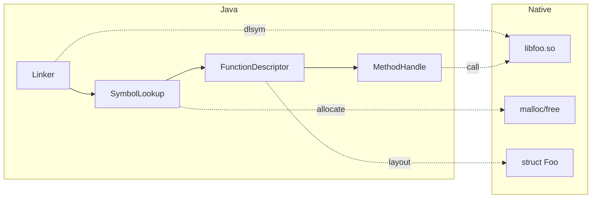

# FFM API (Foreign Function & Memory)

> Part of [[README|Java MOC]] • `Java/01_Core-Java`
> 🎨 **Visual diagram:** Create Excalidraw drawing from template: `Cmd+P → Excalidraw: New from template → Java Diagram`

## Intent

The **Foreign Function & Memory API (FFM)** (JEP 454, finalized in Java 22) replaces **JNI** with a pure-Java, safe, and performant way to call native code and manage off-heap memory. Part of Project Panama.

## Why it Matters

- **No JNI boilerplate**: no C headers, no `javah`, no native compilation
- **Memory safety**: spatial + temporal bounds checking; no segfaults from Java
- **Performance**: JIT-compiled native calls; vectorized memory access
- **Interop**: call C/C++/Rust/Go libraries directly; pass Java callbacks to native
- **Off-heap memory**: `MemorySegment` replaces `ByteBuffer`/`Unsafe` for large data

## Diagram



## Code / Example

```java
// Java 25: FFM API (java.lang.foreign.*)
// Calling C's strlen from Java

import java.lang.foreign.*;
import java.lang.invoke.MethodHandle;

public class StrlenFFM {
    public static void main(String[] args) throws Throwable {
        // 1. Find the native library
        SymbolLookup libc = SymbolLookup.loaderLookup()
            .or(() -> SymbolLookup.libraryLookup("c", Arena.global()));
        
        // 2. Look up the function
        MemorySegment strlenSym = libc.find("strlen")
            .orElseThrow(() -> new UnsatisfiedLinkError("strlen not found"));
        
        // 3. Describe the signature: (C string) -> size_t
        FunctionDescriptor desc = FunctionDescriptor.of(
            ValueLayout.JAVA_LONG,  // return: size_t
            ValueLayout.ADDRESS     // arg: const char*
        );
        
        // 4. Link to a MethodHandle
        Linker linker = Linker.nativeLinker();
        MethodHandle strlen = linker.downcallHandle(strlenSym, desc);
        
        // 5. Allocate off-heap string and call
        try (Arena arena = Arena.ofConfined()) {
            MemorySegment cStr = arena.allocateFrom("Hello, FFM!");
            long len = (long) strlen.invokeExact(cStr);
            System.out.println("Length: " + len); // => 12
        }
    }
}

// MemorySegment: safe off-heap memory
class MemoryExamples {
    void basics() {
        try (Arena arena = Arena.ofConfined()) {
            // Allocate 1KB off-heap
            MemorySegment seg = arena.allocate(1024);
            
            // Write/read primitives
            seg.setAtIndex(ValueLayout.JAVA_INT, 0, 42);
            int val = seg.getAtIndex(ValueLayout.JAVA_INT, 0);
            
            // Struct layout
            MemoryLayout structLayout = MemoryLayout.structLayout(
                ValueLayout.JAVA_INT.withName("id"),
                ValueLayout.JAVA_DOUBLE.withName("score"),
                MemoryLayout.sequenceLayout(10, ValueLayout.JAVA_BYTE).withName("tags")
            );
            MemorySegment struct = arena.allocate(structLayout);
            var idHandle = structLayout.varHandle(PathElement.groupElement("id"));
            idHandle.set(struct, 0, 123);
            
            // Slicing
            MemorySegment slice = seg.asSlice(0, 100);
            
            // Copy to/from heap
            byte[] heap = new byte[100];
            seg.copyTo(MemorySegment.ofArray(heap));
        }
    }
}

// Passing Java callback to native (qsort example)
class CallbackExample {
    static int qsortCompare(MemorySegment a, MemorySegment b) {
        return Integer.compare(
            a.getAtIndex(ValueLayout.JAVA_INT, 0),
            b.getAtIndex(ValueLayout.JAVA_INT, 0)
        );
    }
    
    void sortWithQsort() throws Throwable {
        SymbolLookup libc = SymbolLookup.libraryLookup("c", Arena.global());
        MemorySegment qsortSym = libc.find("qsort").orElseThrow();
        
        FunctionDescriptor qsortDesc = FunctionDescriptor.ofVoid(
            ValueLayout.ADDRESS,      // void* base
            ValueLayout.JAVA_LONG,    // size_t nmemb
            ValueLayout.JAVA_LONG,    // size_t size
            ValueLayout.ADDRESS       // int (*compar)(const void*, const void*)
        );
        
        Linker linker = Linker.nativeLinker();
        MethodHandle qsort = linker.downcallHandle(qsortSym, qsortDesc);
        
        // Create upcall stub for comparator
        MethodHandle cmpHandle = MethodHandles.lookup()
            .findStatic(CallbackExample.class, "qsortCompare",
                MethodType.methodType(int.class, MemorySegment.class, MemorySegment.class));
        
        try (Arena arena = Arena.ofConfined()) {
            MemorySegment cmpFunc = linker.upcallStub(cmpHandle, 
                FunctionDescriptor.of(ValueLayout.JAVA_INT, ValueLayout.ADDRESS, ValueLayout.ADDRESS), 
                arena);
            
            int[] data = {5, 2, 8, 1, 9};
            MemorySegment arr = arena.allocateFrom(ValueLayout.JAVA_INT, data);
            qsort.invokeExact(arr, data.length, Integer.BYTES, cmpFunc);
            // arr now sorted
        }
    }
}
```

### Concrete Example

- **Input:** Need to call `libzstd` compression from Java without JNI
- **Output:** Pure Java wrapper using `Linker`, `SymbolLookup`, `MemorySegment`, `Arena`
- **Explanation:** FFM handles memory lifetimes via `Arena` (confined, shared, global), provides `MethodHandle` for native calls, and `MemoryLayout` for struct mapping

## When to Use / When NOT

| **Use When** | **Avoid When** |
|--------------|----------------|
| - Calling C/C++/Rust libraries | - Pure Java alternatives exist |
| - High-performance off-heap data | - Small heap data (use heap) |
| - Interfacing with OS syscalls | - Simple `ProcessBuilder` suffices |
| - Replacing `Unsafe`/`ByteBuffer` | - JNI already working and stable |

## Trade-offs

| Dimension | FFM API | JNI | JNA | ByteBuffer/Unsafe |
|-----------|---------|-----|-----|-------------------|
| Safety | Spatial/temporal bounds | None | Some | Unsafe: none |
| Performance | JIT-compiled, vectorized | Fast (C) | Slow (reflection) | Fast but unsafe |
| Boilerplate | Low (pure Java) | High (C + Java) | Medium | Low |
| Memory mgmt | Arena (scoped) | Manual | Manual | Manual/GC |
| Callbacks | Upcall stubs | JNIEnv* | Callback interface | No |

## Vs Table

| Aspect | FFM | JNI | JNA |
|--------|-----|-----|-----|
| Compilation | None (runtime) | javac + C compiler | None (runtime) |
| Memory safety | Yes | No | Partial |
| Struct mapping | `MemoryLayout` | Manual | `Structure` class |
| Callback to native | `upcallStub` | Function pointer | `Callback` |
| Maturity | Java 22+ final | Decades | Mature |

## Pitfalls

- **Arena lifetime**: `Arena.ofConfined()` tied to thread; `Arena.ofShared()` for cross-thread; `Arena.global()` never closes
- **Segment access**: bounds checked on every access; use `varHandle` for bulk access
- **Calling convention**: `Linker.nativeLinker()` handles platform ABI; rare mismatches possible
- **Native resource leaks**: `Arena` try-with-resources mandatory for confined/shared
- **JNI interop**: `Linker.nativeLinker().defaultLookup()` finds JNI-registered symbols

## Interview Q&A (Senior Depth)

**Q1. What is the core insight of FFM, and why does it work?**
**A:** JNI requires C glue code compiled per platform. FFM moves the glue to Java: `Linker` dynamically resolves symbols, `MethodHandle` provides typed invocation, `MemorySegment` + `Arena` enforce spatial/temporal safety. The JIT compiles down to near-native call overhead.

**Q2. When would you choose FFM over JNI?**
**A:** New native integrations, when you want memory safety, when you want to avoid C build pipeline. JNI still wins for: existing large JNI codebases, unusual calling conventions, JVM internals access.

**Q3. How does `Arena` provide temporal safety?**
**A:** `Arena` owns a set of memory segments. `Arena.ofConfined()` binds lifetime to thread + scope (try-with-resources). Access after close throws `IllegalStateException`. `Arena.ofShared()` allows cross-thread access with same semantics. No `free()` calls — scope = lifetime.

**Q4. Walk me through a non-obvious problem that reduces to FFM.**
**A:** **Zero-copy serialization**: map a `MemorySegment` over a file (`FileChannel.map`), define struct layout for your protocol, read/write directly without heap copies. **Vectorized SIMD ops**: `MemorySegment` + `Vector API` (incubator) for native-speed numeric kernels.

**Q5. What is the memory/performance implication at scale?**
**A:** Off-heap avoids GC pressure for large buffers (GBs). `Arena` enables bulk allocation/free. JIT inlines `MethodHandle` → native call overhead ~5-10ns. `MemoryLayout` varHandles enable vectorized access patterns.

## Flashcards (Spaced Repetition)

#flashcard
**Q:** What replaces JNI in Java 22+? :: **A:** FFM API (Foreign Function & Memory) - pure Java, safe, performant. #flashcard

#flashcard
**Q:** What is an Arena in FFM? :: **A:** Scoped memory lifetime manager: confined (thread-local), shared (multi-thread), global (never closes). #flashcard

#flashcard
**Q:** How to call a C function from Java with FFM? :: **A:** SymbolLookup -> find symbol -> FunctionDescriptor -> Linker.downcallHandle -> MethodHandle.invokeExact. #flashcard

#flashcard
**Q:** What is MemorySegment? :: **A:** Safe off-heap memory region with spatial/temporal bounds checking, replaces ByteBuffer/Unsafe. #flashcard

#flashcard
**Q:** How to pass Java callback to native? :: **A:** Linker.upcallStub(MethodHandle, FunctionDescriptor, Arena) -> MemorySegment function pointer. #flashcard

## Practice Tasks (Tasks Plugin)

- [ ] Restate the intent from memory 📅 {{date:YYYY-MM-DD, +1}}
- [ ] Code the snippet without looking 📅 {{date:YYYY-MM-DD, +3}}
- [ ] Answer all Interview Q&A aloud 📅 {{date:YYYY-MM-DD, +7}}
- [ ] Review flashcards (Spaced Repetition) 📅 {{date:YYYY-MM-DD, +1}}

```tasks
not done
path includes Java/01_Core-Java
sort by due
limit 10
```

## Related

- [[README|Java MOC]]
- [[01_Core-Java/README|Core Java MOC]]
- [[Java/09_Java-21-LTS/09 Foreign Function and Memory API|FFM in Java 21]]
- [[Java/08_Modern-Java/07 Flexible Constructors and Module Imports|Module Imports]]

---

*Category: Java/01_Core-Java • Part of [[README|Java MOC]] • Java 25*

## Problem

JNI is unsafe, verbose, requires C compilation per platform, and provides no memory safety for off-heap access.

## Solution

FFM API: `Linker` for dynamic linking, `SymbolLookup` for finding symbols, `FunctionDescriptor` for signatures, `MethodHandle` for invocation, `MemorySegment` + `Arena` for safe off-heap memory.

## When not to use

| Instead | Use |
|---------|-----|
| Pure Java library exists | Use the Java library |
| Simple subprocess communication | `ProcessBuilder` |
| Existing stable JNI codebase | Keep JNI |
| JVM internals hacking | `--add-exports` / JNI |