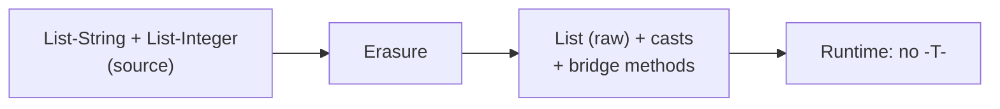

# Generics
> Part of [[Java/01_Core-Java/README|Core Java]]

> Generics let a class, interface, or method operate on *parameterized types*, deferring the choice of the actual type to the caller. The compiler verifies type safety at compile time and eliminates casts, while type erasure removes that information at runtime for backwards compatibility.

## Why it Matters

Write type-safe, reusable code once that works for many types without duplicating logic or sacrificing compile-time checks. Generics shift `ClassCastException` from runtime to a compile error.

Core ideas:
- **Parametric polymorphism**, `List<String>` vs `List<Integer>` share logic, differ in type argument.
- **Type erasure**, generic info is compiler-only; bytecode sees raw types + casts + bridge methods.
- **PECS (Producer Extends, Consumer Super)**, wildcards express covariance/contravariance safely.

## Diagram



## Code

> **Java 25:** Generics unchanged, type erasure, PECS (`? extends`/`? super`), and wildcard capture identical across LTS releases (erasure since Java 5). No reified generics. Use `var` for local inference (`var list = new ArrayList<String>()`) and pattern-matching `instanceof` with generic types; module imports (`import module java.base`) don't affect erasure.

Runnable Java 25, generic class, generic method, bounded types, and PECS wildcards:
```java
import java.util.*;

// Generic class with bounded type parameter
class Box<T> {
 private T value;
 Box(T value) { this.value = value; }
 T get() { return value; }
 void set(T value) { this.value = value; }
 @Override public String toString() { return "Box[" + value + "]"; }
}

// Bounded generic — only Number subtypes; T is usable across methods
class Stats<T extends Number> {
 private final List<T> values = new ArrayList<>();

 void add(T v) { values.add(v); }

 double average() {
 double sum = 0.0;
 for (T v : values) sum += v.doubleValue(); // bound gives Number API
 return values.isEmpty() ? 0.0 : sum / values.size();
 }
}

// PECS demo — producer extends, consumer super
class Pecs {
 static double sumOf(List<? extends Number> src) { // producer: read only
 double s = 0.0;
 for (Number n : src) s += n.doubleValue();
 return s;
 }

 static <T> void copyInto(List<? extends T> src, List<? super T> dest) {
 for (T e : src) dest.add(e); // dest consumes T
 }
}

void demo() {
 var stats = new Stats<Integer>();
 stats.add(10); stats.add(20); stats.add(30);
 System.out.println(stats.average()); // => 20.0

 var ints = List.of(1, 2, 3);
 System.out.println(Pecs.sumOf(ints)); // => 6.0

 var dest = new ArrayList<Number>();
 Pecs.copyInto(ints, dest);
 System.out.println(dest); // => [1, 2, 3]
}
```
> **Bounded Type Parameter vs Wildcard:** `<T extends Number>` declares a *named* type for use in the class/method; `List<? extends Number>` is an *unknown* subtype of Number for a single parameter position. Use a named `T` when you need to relate multiple parameters/returns; use wildcards for PECS variance.

> **Multiple Bounds:** `<T extends Number & Comparable<T> & Serializable>`, class must come first, then interfaces. `&` not `,`.

## When to use / not

| Use | Avoid |
|-----|-------|
| Collections, caches, wrappers that hold one or few type arguments (`Box<T>`, `Cache<K,V>`) | Heterogeneous collections with no common supertype, use `Object` + explicit checks or a sealed hierarchy |
| Utility methods that are type-agnostic (`<T> void swap`, `<T extends Comparable<T>> T max`) | Need runtime reified generics (e.g. `new T()`, `instanceof T`), erasure makes it impossible |
| APIs where compile-time safety prevents bugs (`Optional<T>`, `Function<T,R>`) | Primitive type arguments, generics require reference types (`List<int>` is illegal) |

## Trade-offs

- Compile-time type safety, catches mismatches before runtime.
- Eliminates explicit casts and `ClassCastException`.
- Code reuse without duplication, one `Box<T>`, `Collections.sort`, `Optional<T>` for all types.

## Vs

**Generics vs Object / Raw Types**

| Aspect | Generics (`List<String>`) | Object / Raw Type (`List` / `List<Object>`) |
|--------|---------------------------|---------------------------------------------|
| Type safety | Compile-time checked | Deferred to runtime, casts can fail |
| Casts needed | No | Yes, `(String) list.get(0)` |
| Fail-fast | Compile error on `list.add(42)` | `ClassCastException` at retrieval |
**`? extends T` vs `? super T` (PECS, Producer Extends, Consumer Super)**

| Aspect | `? extends T` (Producer) | `? super T` (Consumer) |
|--------|---------------------------|------------------------|
| Mnemonic | PE, Produces `T` for you to read | CS, Consumes `T` you write |
| Can read as | `T` (or its upper bound) | Only `Object` |
| Can write | Nothing (except `null`) | `T` and subtypes |
> **Invariance:** `List<String>` is not `List<Object>` even though `String` is an `Object`. Wildcards introduce use-site variance to work around this.

## Pitfalls

- **`new T()` / `T.class` / `instanceof T`, erased, won't compile.** Pass `Class<T>` or `Supplier<T>` instead: `T newInstance(Class<T> c){ return c.getDeclaredConstructor().newInstance(); }`.
- **Generic array creation `new T[n]` or `new List<String>[n]` forbidden.** Use `ArrayList<T>` or `Object[]` + cast with warning suppression.
- **Raw types hide errors**, `List raw = new ArrayList<String>(); raw.add(42);` compiles with warning, fails later. Never use raw types in new code; use `List<?>` if type is unknown.
- **Wildcard capture**, `void swap(List<?> l)` can't do `l.set(0, l.get(0))` because `?` is unknown. Fix with helper: `<T> void swapHelper(List<T> l){ ... }` and call it from the wildcard method (capture conversion).
- **Overloading on generic type erases to collision**, `void foo(List<String>)` and `void foo(List<Integer>)` don't overload. Rename or use different arities.
- **`equals` and `hashCode` must not use erased type**, `Box<String>.equals(Box<Integer>)` compares values, not type args. Don't branch on `T`.
- **Forgetting PECS direction**, `void fill(List<? extends Number> dest)` looks right but is backwards (dest is a consumer, needs `? super`). If you need both read and write, use invariant `List<T>`.
- **Autoboxing overhead and `null`**, `List<Integer>` can hold `null`; unboxing `int x = list.get(i)` can NPE. Prefer `OptionalInt`/`IntStream` for primitives.

## Interview q&a

**Q1. What is type erasure and why does Java have it?**
Erasure replaces all type parameters with their bounds (or `Object`) and inserts casts/bridge methods at compile time. Bytecode has no `<T>`. Java kept it for backward compatibility with pre-generics (Java 1.4) bytecode. Consequences: you can't do `new T()`, `instanceof T`, `T.class`, or overload `void foo(List<String>)` and `void foo(List<Integer>)`, they have the same erasure. Workarounds: pass `Class<T> clazz` token, use `Super Type Token` (`new TypeReference<List<String>>(){}`), or factory `Supplier<T>`.

**Q2. Explain PECS, when do you use `? extends` vs `? super`?**
*Producer Extends, Consumer Super*, from Effective Java. If a parameter *produces* `T` for you to consume (you read from it), use `? extends T` (covariant, read-only). If it *consumes* `T` you produce (you write into it), use `? super T` (contravariant, write-only). `copy(src, dest)` is canonical: `src` is `? extends T` (producer), `dest` is `? super T` (consumer). Use `? extends` for `max(Collection<? extends T>)`, `? super` for `sort(List<T>)` comparator as `Comparator<? super T>`.
What is type erasure and why does Java have it?:: Erasure replaces all type parameters with their bounds (or `Object`) and inserts casts/bridge methods at compile time. Bytecode has no `<T>`. Java kept it for backward compatibility with pre-generics (Java 1.4) bytecode. Consequences: you can't do `new T()`, `instanceof T`, `T.class`, or overload `void foo(List<String>)` and `void foo(List<Integer>)`, they have the same erasure. Workarounds: pass `Class<T> clazz` token, use `Super Type Token`... #flashcard
Explain PECS, when do you use `? extends` vs `? super`?:: *Producer Extends, Consumer Super*, from Effective Java. If a parameter *produces* `T` for you to consume (you read from it), use `? extends T` (covariant, read-only). If it *consumes* `T` you produce (you write into it), use `? super T` (contravariant, write-only). `copy(src, dest)` is canonical: `src` is `? extends T` (producer), `dest` is `? super T` (consumer). Use `? extends` for `max(Collection<? extends T>)`, `? super` for `sort(List<T>... #flashcard

## Related

- [[Classes]], generic classes build on class basics
- [[Interface]], generic interfaces (`Comparable<T>`, `Iterable<T>`, `Function<T,R>`)
- [[Java/01_Core-Java/Types/Wrapper Class|Wrapper Class]], why primitives need wrappers for generics
- [[Java/01_Core-Java/Types/Object Class|Object Class]], erasure bound defaults to `Object`
- [[Method Overload]], overloading vs generic erasure collisions
- [[Java/03_Collections/README|Collections]], primary consumer of generics (`List`, `Map`, `Set`)
- [[Exception Handling|Exceptions]], generics cannot extend `Throwable`

---
*Category: Core-Java • java25*
