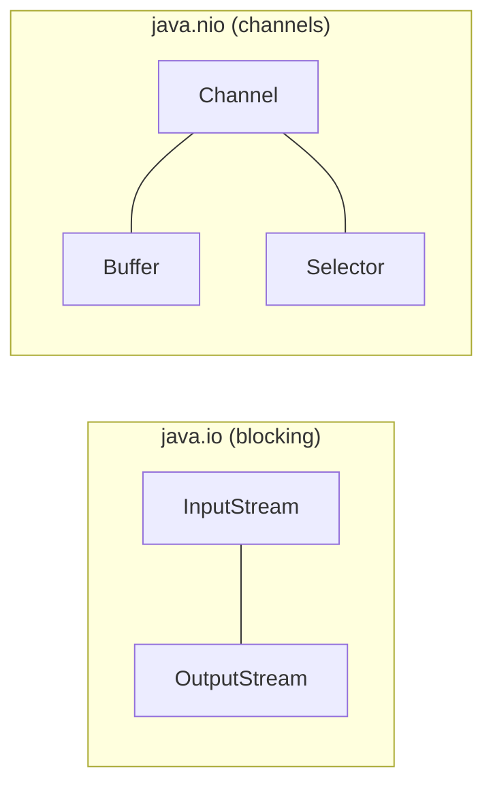

# IO and nio
> Part of [[Java/01_Core-Java/README|Core Java]]

> Java IO (`java.io`) provides blocking stream/reader-writer abstractions for bytes and characters; NIO (`java.nio`) adds buffers, channels, and selectors for high-throughput, non-blocking, and memory-mapped file operations. `java.nio.file.Files` + `Path` (NIO.2, Java 7+) is now the standard for file manipulation.

## Why it Matters

Move bytes and characters between files, network, console, and memory behind composable streams. Classic IO uses blocking `InputStream`/`OutputStream` (bytes) and `Reader`/`Writer` (chars) with decorator chaining (`BufferedInputStream`, `DataInputStream`). NIO introduces `Channel` + `Buffer` for bulk/block transfers, `Selector` for multiplexed non-blocking IO, and `Files`/`Path` to replace legacy `File` with a richer, exception-aware file API. `try-with-resources` guarantees resource closure.

## Diagram



## Code

> **Java 25:** NIO.2 `Files`/`Path` remain the standard. Java 25 idioms: `Path.of(...)` (preferred since Java 11 over `Paths.get`), `Files.readString`/`writeString` (Java 11+), `Files.newBufferedReader`/`newBufferedWriter`, `var`, `IO.println`. Compact Object Headers (JEP 450) reduce header overhead for buffer/stream objects. No IO/NIO API change in Java 25.

Runnable Java 25, covers `InputStream`/`Reader`, `Files`/`Path`, `try-with-resources`, `Channel`/`Buffer`:
```java
import java.io.*;
import java.nio.ByteBuffer;
import java.nio.channels.FileChannel;
import java.nio.charset.StandardCharsets;
import java.nio.file.*;
import java.util.stream.Stream;

// NIO.2 — Path/Files replace legacy File; Channel+Buffer for bulk transfers
public class IoNioDemo {
 public static void main(String[] args) throws IOException {
 var dir = Path.of("demo-io");
 Files.createDirectories(dir);
 }
}
```
Compile & run (Java 25):
```bash
javac IoNioDemo.java && java IoNioDemo
```
> **Key protocol:** `ByteBuffer` lifecycle is `put/write → flip → get/read → clear/compact → repeat`. Forgetting `flip()` before reading is the #1 NIO bug.

## When to use / not

| Use | Avoid |
|-----|-------|
| `InputStream`/`OutputStream` for binary data (images, PDFs, serialization) | `Reader`/`Writer` for binary, they decode bytes to chars and corrupt data |
| `Reader`/`Writer` (`FileReader`/`FileWriter`, `BufferedReader`/`BufferedWriter`) for text with charset | `FileReader`/`FileWriter` without charset, uses platform default; prefer `Files.newBufferedReader(path, StandardCharsets.UTF_8)` |
| `Files.readString` / `writeString` / `readAllLines` / `readAllBytes` for small-to-medium files (Java 11+) | `readAllLines` / `readString` on huge files (GBs), loads entire file into heap; stream with `Files.lines()` or `FileChannel` |

## Trade-offs

- `Files`/`Path` (NIO.2) give rich file ops, `copy`, `move`, `walk`, `find`, `readString`, `writeString`, with proper `IOException` instead of silent `false`.
- Decorator streams (`BufferedInputStream`, `GZIPInputStream`, `ObjectInputStream`) compose cleanly.
- `try-with-resources` + `AutoCloseable` eliminates leaks; suppressed exceptions preserved via `getSuppressed()`.

## Vs

## Pitfalls

- Using `FileReader`/`FileWriter` without charset, silently uses platform default; breaks on machines with different defaults; always use `Files.newBufferedReader(path, StandardCharsets.UTF_8)` or `Files.readString`.
- Forgetting `flip()` on `ByteBuffer` before reading/writing to channel, buffer appears empty or overwrites incorrectly.
- Loading huge files with `Files.readAllLines` / `readString`, causes `OutOfMemoryError`; stream with `Files.lines()` or `FileChannel`.
- Not closing streams, leaks file descriptors; always use `try-with-resources` (or `Files` one-shot methods that close internally).
- Using `java.io.File` `delete()` / `mkdir()` and ignoring the `boolean` return, failure is silent; `Files.delete(path)` throws with cause.
- Mixing byte and character streams, wrapping binary data in `Reader` corrupts bytes; wrapping text in `InputStream` without charset garbles encoding.
- Forgetting `Files.list` / `Files.walk` / `Files.lines` return a `Stream` that **must be closed**, use `try-with-resources` on the stream.
- Assuming `Path.of("a/b")` is absolute, it's relative; use `path.toAbsolutePath()` or `Path.of("/a/b")` when absolute is required.

## Interview q&a

**Q1. What is the difference between `InputStream`/`OutputStream` and `Reader`/`Writer`?**
Byte streams (`InputStream`/`OutputStream`) handle raw bytes, for binary data. Character streams (`Reader`/`Writer`) handle text, decoding bytes to `char` via a `Charset`. Never use a `Reader` for binary (corrupts data) or an `InputStream` for text without specifying charset. Bridge with `InputStreamReader`/`OutputStreamWriter`.

**Q2. How does `try-with-resources` work? What about suppressed exceptions?**
Resources must implement `AutoCloseable`. The compiler generates a `finally` that calls `close()` in reverse declaration order. If both the `try` body and `close()` throw, the `close()` exception is added as *suppressed* (`e.getSuppressed()`) rather than masking the primary exception. Supports multiple resources: `try (var in = ...; var out = ...)`.
What is the difference between `InputStream`/`OutputStream` and `Reader`/`Writer`?:: Byte streams (`InputStream`/`OutputStream`) handle raw bytes, for binary data. Character streams (`Reader`/`Writer`) handle text, decoding bytes to `char` via a `Charset`. Never use a `Reader` for binary (corrupts data) or an `InputStream` for text without specifying charset. Bridge with `InputStreamReader`/`OutputStreamWriter`. #flashcard
How does `try-with-resources` work? What about suppressed exceptions?:: Resources must implement `AutoCloseable`. The compiler generates a `finally` that calls `close()` in reverse declaration order. If both the `try` body and `close()` throw, the `close()` exception is added as *suppressed* (`e.getSuppressed()`) rather than masking the primary exception. Supports multiple resources: `try (var in = ...; var out = ...)`. #flashcard

## Related

- [[Exception Handling]]
- [[Serialization]]
- [[Classes]]
- [[String Handling]]

---
*Category: Core-Java • Part of [[README|Java MOC]] • java25*

### 1. io vs nio

| Aspect | IO (`java.io`) | NIO (`java.nio`) |
|--------|----------------|-------------------|
| Model | Stream-oriented, byte/char streams, blocking | Channel + Buffer, bulk transfers, supports non-blocking |
| Blocking | Blocking, thread waits for read/write | Non-blocking + blocking modes; `Selector` multiplexes many channels on one thread |
| Buffering | Explicit `BufferedInputStream` / `BufferedReader` wrappers | Built-in `ByteBuffer` / `CharBuffer` with `flip`/`clear` protocol |

### 2. Inputstream vs Reader

| Aspect | `InputStream` / `OutputStream` | `Reader` / `Writer` |
|--------|-------------------------------|---------------------|
| Unit | Bytes (`byte`) | Characters (`char`, decoded via `Charset`) |
| When | Binary data, images, PDFs, `.class`, serialization | Text, JSON, CSV, source code, logs |
| Example | `FileInputStream`, `ByteArrayInputStream`, `GZIPInputStream` | `FileReader`, `BufferedReader`, `InputStreamReader` |

### 3. File vs Path/files (Nio.2)

| Aspect | `java.io.File` (legacy) | `java.nio.file.Path` + `Files` (NIO.2) |
|--------|--------------------------|----------------------------------------|
| Creation | `new File("/tmp/a.txt")` | `Path.of("/tmp/a.txt")` / `Paths.get(...)` |
| Failure mode | Silent, `delete()` / `mkdir()` returns `false` | Throws `IOException` with reason |
| Features | Minimal, no walk, no symbolic-link handling | `walk`, `find`, `list`, `readString`, `writeString`, `copy`, `move`, attributes, links |
