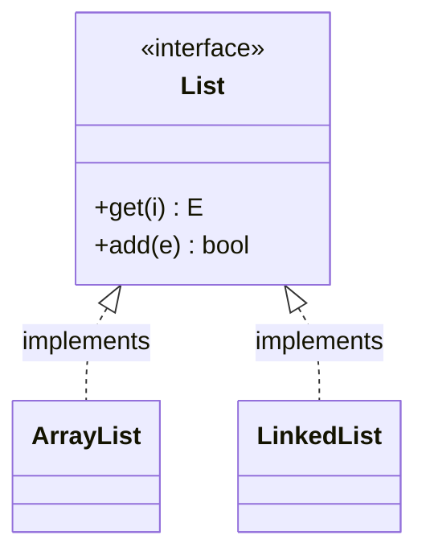

# Interface
> Part of [[Java/01_Core-Java/README|Core Java]]

> An interface declares *what* an object can do, not *how*. It forms a contract between a class and the outside world, enforced by the compiler at build time. Implementing classes provide the actual behavior.

## Why it Matters

Decouple *what* is required from *who* provides it. Interfaces enable polymorphism across unrelated class hierarchies and are the basis for multiple inheritance of type in Java.

## Diagram



## Code

> **Java 25:** Interfaces unchanged, `default`/`static`/`private` methods and `sealed` permits (JEP 409) for closed type hierarchies (`sealed interface Vehicle permits Car, Bike`). Use `sealed` + pattern-matching `switch` for exhaustive handling.

Runnable Java 25, interface with default, static, and functional usage:
```java
interface Vehicle {
 void changeGear(int g);
 void speedUp(int inc);
 void applyBrakes(int dec);

 default void printState(int speed, int gear) {
 System.out.println("speed:" + speed + " gear:" + gear);
 }
 static String type() { return "Vehicle"; }
}

class Car implements Vehicle {
 int speed = 0, gear = 1;
 }
}
```
> **Functional Interfaces:** Single-abstract-method interfaces (`Runnable`, `Consumer`, `Predicate`, `Supplier`) are lambda targets. `@FunctionalInterface` enforces the single-method rule but allows `default`/`static` methods.
>
> **Marker Interfaces:** Empty interfaces (`Serializable`, `Cloneable`) provide runtime type info. Modern code prefers annotations, marker interfaces blur "interface = behavior."

## When to use / not

| Use | Avoid |
|-----|-------|
| Unrelated classes share a capability (`Comparable`, `Cloneable`, `Vehicle`) | Need to share state / constructors, use abstract class |
| Need multiple inheritance of type | Single hierarchy with common state |
| Defining strategy / callback / lambda target | Overusing interfaces for every class (YAGNI), concrete + tests may be enough |

## Trade-offs

- Loose coupling, easy mocking/testing.
- Multiple inheritance of type.
- Clean API boundaries.

## Vs

| Aspect | Interface | Abstract Class | Concrete Class |
|--------|-----------|----------------|----------------|
| State | No (only `static final` constants) | Yes | Yes |
| Constructors | No | Yes | Yes |
| Multiple inheritance | Yes | No (single) | No |

## Pitfalls

- Forgetting `public` is implicit, all abstract methods are `public`; implementing class must declare them `public`.
- Adding methods to a published interface is a breaking change (use `default` methods to evolve safely).
- Using marker interfaces where an annotation (`@Serializable`) would be clearer.

---
*Category: Core-Java • java25*

## Interview q&a

**Q1. Why does a functional interface have exactly one abstract method?**
Because a lambda provides implementation for *one* method, the compiler needs an unambiguous target. Default/static methods don't count.

**Q2. Interface vs Abstract class, when to pick which?**
Interface for contracts across unrelated types; abstract class when subclasses share state, constructors, or non-trivial common code.
Why does a functional interface have exactly one abstract method?:: Because a lambda provides implementation for *one* method, the compiler needs an unambiguous target. Default/static methods don't count. #flashcard
Interface vs Abstract class, when to pick which?:: Interface for contracts across unrelated types; abstract class when subclasses share state, constructors, or non-trivial common code. #flashcard

## Related

- [[Classes]]
- [[Java/01_Core-Java/Types/Abstract Class|Abstract Class]]
- [[Java/01_Core-Java/Types/Anonymous Class|Anonymous Class]]
- [[Method Overload]]
