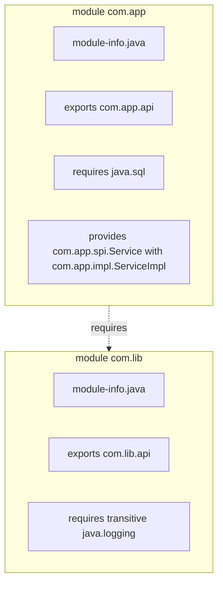

# JPMS (Java Platform Module System)

> Part of [[README|Java MOC]] • `Java/01_Core-Java`
> 🎨 **Visual diagram:** Create Excalidraw drawing from template: `Cmd+P → Excalidraw: New from template → Java Diagram`

## Intent

**JPMS (Java Platform Module System)** introduced in Java 9 provides **strong encapsulation** and **explicit dependencies** via `module-info.java`. Replaces classpath with module path, enabling reliable configuration and scalable platform.

## Why it Matters

- **Strong encapsulation**: `public` no longer means accessible to all; `exports` controls visibility
- **Explicit dependencies**: `requires` declares module dependencies; no more JAR hell
- **Services**: `provides`/`uses` for service discovery without `ServiceLoader` hacks
- **JLink**: create custom runtime images with only needed modules
- **Migration path**: automatic modules, unnamed module for classpath compatibility

## Diagram



## Code / Example

```java
// Java 25: module declarations, pattern matching for instanceof in module descriptors (future)

// module-info.java for application module
module com.myapp {
    requires java.sql;              // depends on JDK module
    requires transitive java.logging; // re-exports to consumers
    requires com.mylib;             // depends on library module
    
    exports com.myapp.api;          // public API
    exports com.myapp.internal to com.myapp.test; // qualified exports (whitebox testing)
    
    uses com.myapp.spi.PaymentProvider;           // consumes service
    provides com.myapp.spi.PaymentProvider        // provides service implementation
        with com.myapp.impl.StripeProvider,
             com.myapp.impl.PayPalProvider;
    
    opens com.myapp.model to java.base, com.fasterxml.jackson.databind; // reflection access
}

// module-info.java for library module
module com.mylib {
    requires java.base;             // implicit, but explicit is fine
    requires org.slf4j;             // third-party automatic module
    
    exports com.mylib.api;          // public API
    // com.mylib.internal not exported = strongly encapsulated
    
    provides com.mylib.spi.Formatter
        with com.mylib.impl.JsonFormatter;
}

// Command line: module path vs class path
// java --module-path mods -m com.myapp/com.myapp.Main
// java --module-path mods --add-modules com.mylib -m com.myapp/com.myapp.Main
// jlink --module-path mods --add-modules com.myapp --output myapp-runtime
```

### Concrete Example

- **Input:** Multi-module project: `com.myapp` (app), `com.mylib` (lib), `com.mydb` (db)
- **Output:** `jlink` produces 40MB runtime vs 200MB full JDK; `com.mylib.internal` inaccessible to `com.myapp`
- **Explanation:** Strong encapsulation prevents accidental dependency on internal classes

## When to Use / When NOT

| **Use When** | **Avoid When** |
|--------------|----------------|
| - Large applications needing clear boundaries | - Simple single-module projects |
| - Library authors wanting to hide internals | - Quick prototypes / scripts |
| - Building custom runtimes with jlink | - Heavy reflection on non-open modules |
| - Teams wanting explicit dependency graph | - Legacy classpath-only dependencies |

## Trade-offs

| Dimension | JPMS (Module Path) | Classpath |
|-----------|--------------------|-----------|
| Encapsulation | Strong (exports) | None (public = global) |
| Dependencies | Explicit (requires) | Implicit (JAR hell) |
| Startup | Faster (module graph) | Slower (scan all JARs) |
| Runtime size | jlink: minimal | Full JDK |
| Migration | Gradual (automatic modules) | None needed |

## Vs Table

| Aspect | JPMS | OSGi | Maven/Gradle |
|--------|------|------|--------------|
| Encapsulation | Compile + runtime | Runtime only | Build-time only |
| Versioning | No (single version) | Multiple versions | Multiple versions |
| Services | Built-in | Built-in | Manual |
| Dynamic install | No | Yes | No |

## Pitfalls

- **Split packages**: same package in multiple modules → compile error
- **Reflection on non-open modules**: `--add-opens` required for deep reflection
- **Automatic modules**: JARs on module path without module-info get name from JAR filename
- **Unnamed module**: classpath code sees all exports but modules can't see classpath
- **JavaFX / internal APIs**: `--add-exports java.base/jdk.internal.misc=ALL-UNNAMED`

## Interview Q&A (Senior Depth)

**Q1. What is the core insight of JPMS, and why does it work?**
**A:** Classpath treats all `public` classes as globally accessible, causing JAR conflicts and fragile encapsulation. Modules add a layer: `public` + `exports` = accessible. The module graph is resolved at startup, failing fast on missing/conflicting dependencies.

**Q2. When would you choose `requires transitive`?**
**A:** When your module's API *uses* types from another module in its public signature. Consumers then automatically read that dependency. Example: `requires transitive java.logging` if your API returns `java.util.logging.Logger`.

**Q3. How does JPMS handle services vs `ServiceLoader`?**
**A:** `ServiceLoader` still works but modules declare `provides ... with` and `uses` in `module-info.java`. This makes service contracts explicit and verifiable at compile time. The module system wires providers to consumers.

**Q4. Walk me through a non-obvious problem that reduces to JPMS.**
**A:** **Breaking a monolith into modules without runtime errors**: use `jdeps` to analyze dependencies, create `module-info.java` with `exports` for API, `opens` for reflection frameworks. Test with `--dry-run` on module path.

**Q5. What is the memory/performance implication at scale?**
**A:** Module graph resolution at startup is O(modules + edges). Custom runtime with `jlink` strips unused modules (e.g., no `java.corba`, `java.xml.ws` → 40-60MB vs 200MB). Class loading is faster due to module-bound search.

## Flashcards (Spaced Repetition)

#flashcard
**Q:** What does `exports` do in module-info.java? :: **A:** Makes a package accessible to other modules that `require` this module. #flashcard

#flashcard
**Q:** Difference between `requires` and `requires transitive`? :: **A:** `transitive` re-exports the dependency to modules that require this module. #flashcard

#flashcard
**Q:** How to allow reflection on private members? :: **A:** `opens com.pkg to moduleA, moduleB` or `--add-opens` at runtime. #flashcard

#flashcard
**Q:** What is an automatic module? :: **A:** A JAR on module path without module-info.java; name derived from JAR filename. #flashcard

#flashcard
**Q:** What is the unnamed module? :: **A:** Code on classpath; reads all modules but modules cannot read it. #flashcard

## Practice Tasks (Tasks Plugin)

- [ ] Restate the intent from memory 📅 {{date:YYYY-MM-DD, +1}}
- [ ] Code the snippet without looking 📅 {{date:YYYY-MM-DD, +3}}
- [ ] Answer all Interview Q&A aloud 📅 {{date:YYYY-MM-DD, +7}}
- [ ] Review flashcards (Spaced Repetition) 📅 {{date:YYYY-MM-DD, +1}}

```tasks
not done
path includes Java/01_Core-Java
sort by due
limit 10
```

## Related

- [[README|Java MOC]]
- Core Java MOC
- [[Java/09_Java-21-LTS/09 Foreign Function and Memory API|FFM API]]
- [[Java/08_Modern-Java/07 Flexible Constructors and Module Imports|Module Imports]]

---

*Category: Java/01_Core-Java • Part of [[README|Java MOC]] • Java 25*

## Problem

Classpath provides no encapsulation, leading to JAR conflicts, accidental internal API usage, and bloated deployments.

## Solution

Declare modules with `module-info.java`: `exports` for API, `requires` for dependencies, `provides`/`uses` for services. Use `jlink` to create minimal runtimes.

## When not to use

| Instead | Use |
|---------|-----|
| Simple scripts / single JAR | Classpath (no module-info) |
| Need multiple versions of same library | OSGi / classloader isolation |
| Heavy reflection on third-party libs | `--add-opens` / classpath |
| Rapid prototyping | Single-module or classpath |