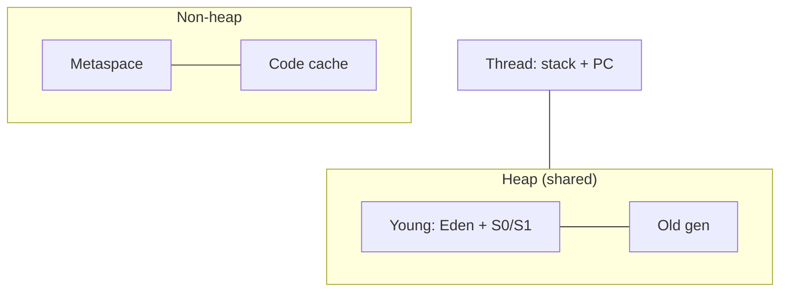

# JVM Memory Model
> Part of [[Java/01_Core-Java/README|Core Java]]

> How the JVM organizes runtime memory, Stack (per-thread call frames), Heap (objects), and Metaspace (class metadata), and how the Garbage Collector manages generations.

## Why it Matters

Know where Java data lives, who frees it, and what breaks when each area fills. The JVM Memory Model explains thread confinement (stack), shared object storage (heap), class metadata (metaspace), and generational GC, essential for diagnosing `StackOverflowError`, `OutOfMemoryError`, and GC tuning.

## Diagram



## Code

> **Java 25:** Compact Object Headers (JEP 450) shrink headers to 8 bytes (default in Java 25, `-XX:+UseCompactObjectHeaders`); Generational ZGC (JEP 439) and improved G1 reduce pause times. Heap layout (Eden/Survivor/Old) and `Stack` vs `Heap` vs `Metaspace` unchanged; measure header savings with `jcmd <pid> VM.info`.

Runnable Java 25, stack vs heap allocation, `StackOverflowError` via infinite recursion, `OutOfMemoryError` via heap exhaustion:
```java
import java.util.*;
public class JvmMemoryModelDemo {
 static class User { String name; int age;
 User(String n, int a) { name=n; age=a; } }
 static void stackVsHeapDemo() {
 int x = 42;
 var u = new User("Ava", 30); // ref on stack, object on heap
 System.out.println(x + " " + u.name);
 }
 public static void main(String[] args) {
 stackVsHeapDemo();
 var users = new ArrayList<User>();
 users.add(new User("Bob", 25));
 System.out.println("heap size: " + users.size());
 }
}
```
**Key flags to reproduce errors:**
```bash

## When to use / not

| Use / Need to know | Avoid / Not needed |
|-----|-------|
| Diagnosing `StackOverflowError` vs `OutOfMemoryError: Java heap space` vs `Metaspace` | Trivial scripts with no memory/performance concerns |
| Tuning heap (`-Xms`, `-Xmx`, `-Xss`, `-XX:MaxMetaspaceSize`) or GC (`G1`, `ZGC`) | When managed runtime hides memory (not interview/system-design) |
| Reasoning about object lifecycle, escape analysis, GC pauses | Premature micro-optimization before profiling |

## Trade-offs

- Automatic memory management, GC reclaims unreachable heap objects; no manual `free()`.
- Thread-confined stacks, no synchronization needed for local variables; fast allocation (pointer bump).
- Metaspace auto-resizes (native memory), no fixed PermGen limit; class unloading supported.

## Vs

## Pitfalls

- Confusing `StackOverflowError` (stack exhaustion, recursion) with `OutOfMemoryError: Java heap space` (heap exhaustion, leaks), diagnostics and fixes differ completely.
- Thinking primitives always live on stack, boxed primitives (`Integer`) and primitives inside objects (`class Foo { int x; }`) live on **heap**.
- Holding references in `static` collections / caches without eviction → heap leak that GC cannot reclaim; use `WeakHashMap` or bounded caches.
- Allocating large objects directly in Old Gen (humongous objects in G1) → premature Old GC; prefer streaming or reusing buffers.
- Ignoring Metaspace, unlimited by default can consume all native memory; always set `-XX:MaxMetaspaceSize` in containers and watch for classloader leaks on redeploys.
- Creating too many threads with default `-Xss1M` → `unable to create native thread` OOM; reduce `-Xss` or use thread pools/virtual threads (Java 21+).
- Calling `System.gc()` explicitly, forces Full GC, defeats generational optimization; remove in production.

## Interview q&a

**Q1. Stack vs Heap, what lives where and what errors do they throw?**
Stack is per-thread, stores call frames, local primitives, references, and return addresses. It is LIFO and freed on method return; deep recursion exhausts it → `StackOverflowError` (fix: increase `-Xss` or fix recursion). Heap is shared, stores all objects created with `new`; references on stack point to heap. Heap is GC-managed; when no contiguous space remains → `OutOfMemoryError: Java heap space` (fix: increase `-Xmx`, fix leak, or batch processing). Stack access is thread-safe by isolation; heap requires synchronization.

**Q2. How does generational GC work, Young vs Old?**
Heap is split by object age (weak generational hypothesis: most objects die young). New objects allocate in Eden; first Minor GC copies survivors to Survivor S0/S1 (copying, STW, fast). Objects surviving multiple Minor GCs (age > `MaxTenuringThreshold`) are promoted to Old Generation. Young GC is frequent and cheap; Old GC (Major/Full) is rare but costly, it marks, sweeps, and compacts tenured objects. Tuning: size Young (`-Xmn` / `-XX:NewRatio=2`) so short-lived objects never reach Old; monitor promotion rate and Old occupancy to avoid Full GC. Modern collectors (G1, ZGC, Shenandoah) partition heap into regions to bound pauses.
Stack vs Heap, what lives where and what errors do they throw?:: Stack is per-thread, stores call frames, local primitives, references, and return addresses. It is LIFO and freed on method return; deep recursion exhausts it → `StackOverflowError` (fix: increase `-Xss` or fix recursion). Heap is shared, stores all objects created with `new`; references on stack point to heap. Heap is GC-managed; when no contiguous space remains → `OutOfMemoryError: Java heap space` (fix: increase `-Xmx`, fix leak, or batch p... #flashcard
How does generational GC work, Young vs Old?:: Heap is split by object age (weak generational hypothesis: most objects die young). New objects allocate in Eden; first Minor GC copies survivors to Survivor S0/S1 (copying, STW, fast). Objects surviving multiple Minor GCs (age > `MaxTenuringThreshold`) are promoted to Old Generation. Young GC is frequent and cheap; Old GC (Major/Full) is rare but costly, it marks, sweeps, and compacts tenured objects. Tuning: size Young (`-Xmn` / `-XX:NewRati... #flashcard

## Related

- [[Classes]], objects that live on heap
- [[Object Class]], base of every heap object
- [[Java/01_Core-Java/Types/Wrapper Class|Wrapper Class]], boxing moves primitives to heap
- [[Java/01_Core-Java/Types/Immutable Class|Immutable Class]], GC-friendly, no synchronization on heap
- [[Java/04_Concurrency/Threads|Threads]], each thread gets its own stack + PC register

---
*Category: Core-Java • java25*

# StackOverflow, Shrink Stack

java -Xss256k JvmMemoryModelDemo

# Heap OOM, Shrink Heap

java -Xmx64m JvmMemoryModelDemo

# Metaspace OOM, cap Metaspace (Java 8+)

java -XX:MaxMetaspaceSize=16m JvmMemoryModelDemo
```
### Stack vs Heap vs Metaspace

| Aspect | Stack | Heap | Metaspace (Native) |
|--------|-------|------|---------------------|
| Scope | Per-thread, LIFO frames | Shared across threads | Shared, per-classloader |
| Stores | Primitives, references, call frames, `PC register` | All objects (`new`), arrays | Class metadata, method bytecode, constant pool, annotations |
| Lifecycle | Created/destroyed with method call/return | GC-managed (Young → Old) | GC-managed when classloader is GC'd (class unloading) |

### Young vs old Generation (Heap gc)

| Aspect | Young Generation | Old (Tenured) Generation |
|--------|------------------|--------------------------|
| Regions | Eden + 2 Survivor spaces (S0, S1) | Single tenured space |
| Objects | New allocations (short-lived) | Survivors after N Young GCs (`-XX:MaxTenuringThreshold`, default 15) |
| GC type | Minor GC (frequent, fast, often STW but short) | Major / Full GC (infrequent, slower; G1/ZGC reduce pauses) |
> **Beyond heap:** `PC Register` (per-thread program counter) and `Native Method Stack` (JNI calls) are small per-thread areas. `Direct / Off-heap` (`ByteBuffer.allocateDirect`) is native memory outside heap.
