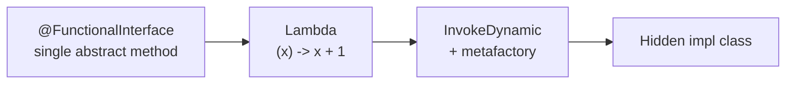

# Lambdas and Functional Interfaces
> Part of [[Java/01_Core-Java/README|Core Java]]

> A lambda is a concise anonymous function that implements a single-abstract-method interface. `@FunctionalInterface` marks that contract, method references shorthand it, and `default` methods let interfaces evolve without breaking implementors, together they are the foundation of functional programming in Java 8+.

## Why it Matters

Replace verbose anonymous classes with compact, composable behavior passed as data. Lambdas + functional interfaces enable declarative style (`filter`, `map`, `sort`) while `default` methods allow interfaces to add behaviour without forcing every implementor to change.

Core ideas:
- **Functional interface**, exactly one abstract method (SAM); lambda target via `@FunctionalInterface`.
- **Lambda syntax**, `(params) -> { body }` with type inference and capture of effectively-final variables.
- **Method references & default methods**, `Class::method` as lambda shorthand; `default`/`static`/`private` methods for interface evolution.

## Diagram



## Code

> **Java 25:** Lambdas unchanged since Java 8; use `var` for local inference, `record` as data carrier, `IO.println` (Java 25 `java.lang.IO`) for output, `List.of` + `SequencedCollection` (`getFirst`/`getLast`/`reversed`) for collections.

Runnable Java 25, lambda syntax, `@FunctionalInterface`, method refs, default methods:
```java
import java.util.*;
import java.util.function.*;

record Product(String name, double price) {}

// @FunctionalInterface, SAM + default/static helpers
@FunctionalInterface
interface Transformer<T, R> {
 R apply(T t);

 default Transformer<T, R> andThen(Function<R, R> after) {
 return t -> after.apply(apply(t));
 }
}
```
Compile & run (Java 25):
```bash
javac LambdasDemo.java && java LambdasDemo
```
> **Lambda vs Anonymous Class:** Anonymous class creates a new type with `this` referring to itself; lambda has no new scope, `this` is the enclosing instance, and it captures only effectively-final variables.

## When to use / not

| Use | Avoid |
|-----|-------|
| Passing behaviour to collections/streams (`filter`, `forEach`, `sort`, `CompletableFuture`) | Need named type with state, multiple methods, or identity, use class / anonymous class |
| Strategy / callback / event handler with single method (`Runnable`, `Comparator`, `Predicate`) | Overloading on functional type causes ambiguity, prefer explicit types or method names |
| Simplifying boilerplate: `(a,b) -> a.compareTo(b)` vs anonymous `Comparator` | Capturing mutable or non-effectively-final variables, won't compile |

## Trade-offs

- Drastically less boilerplate than anonymous classes, readable declarative pipelines.
- Enables Streams, `CompletableFuture`, and functional composition (`andThen`, `compose`).
- `@FunctionalInterface` gives compile-time safety, prevents accidental second abstract method.

## Vs

**Lambda vs Anonymous Class vs Method Reference**

| Aspect | Lambda `(x) -> x + 1` | Anonymous Class `new Function<>(){...}` | Method Reference `String::length` |
|--------|-----------------------|----------------------------------------|-----------------------------------|
| Verbosity | Concise, inferred types | Verbose boilerplate | Most concise when delegating |
| `this` | Enclosing instance | Anonymous instance itself | Same as lambda |
| State | No instance fields | Can hold fields | No |
**`@FunctionalInterface` vs Regular Interface vs Abstract Class**

| Aspect | `@FunctionalInterface` (SAM) | Regular Interface (multiple abstract) | Abstract Class |
|--------|------------------------------|---------------------------------------|----------------|
| Abstract methods | Exactly 1 (plus defaults/statics) | Any number | Any number |
| Lambda target | Yes | No | No |
| State / ctor | No | No | Yes |

## Pitfalls

- **Not effectively final**, `int n = 0; list.forEach(x -> n++)` won't compile. Use `AtomicInteger` or restructure, but prefer streams/collectors over mutable capture.
- **Overload ambiguity**, `void foo(Predicate<String> p)` and `void foo(Function<String, Boolean> f)` both match `s -> s.isEmpty()`, compiler error. Cast: `foo((Predicate<String>) s -> s.isEmpty())` or rename methods.
- **Default method diamond conflict**, class implements two interfaces with same `default void foo()` → must override and disambiguate: `InterfaceA.super.foo()`.
- **Using `default` for stateful logic**, interfaces can't hold instance fields; `default` methods that try to simulate state via maps/computation are fragile. Use abstract class for shared state.
- **Checked exceptions in lambdas**, `Function` doesn't declare `throws`; wrapping in `try/catch` inside lambda or using sneaky-throw / custom `@FunctionalInterface` that throws is needed.
- **Serialization of lambdas**, lambdas are not reliably serializable; avoid putting them in `Serializable` objects.
- **Confusing `==` on functional instances**, each lambda evaluation may create a new object; never use `==` to compare lambdas.

## Interview q&a

**Q1. What makes an interface functional and why does `@FunctionalInterface` matter?**
A functional interface has exactly one abstract method (SAM), `Runnable`, `Comparator`, `Predicate`, `Function`. Any interface with one abstract method is a lambda target, but `@FunctionalInterface` makes the compiler enforce it: adding a second abstract method fails to compile. `default`/`static`/`private` methods don't count toward the limit, and SAMs can still extend other interfaces if the total abstract count remains one (e.g. `Comparator` inherits `equals` from `Object` which is excluded).

**Q2. How do lambdas capture variables and how does `this` differ from anonymous classes?**
Lambdas capture only *effectively-final* variables (assigned once), by value, not by reference, so mutating the variable after capture is a compile error. Unlike anonymous classes, lambdas don't introduce a new scope: `this` inside a lambda is the enclosing object's `this`, not the lambda's. This avoids the `OuterClass.this` workaround but means you can't shadow `this` or define instance fields inside a lambda.
What makes an interface functional and why does `@FunctionalInterface` matter?:: A functional interface has exactly one abstract method (SAM), `Runnable`, `Comparator`, `Predicate`, `Function`. Any interface with one abstract method is a lambda target, but `@FunctionalInterface` makes the compiler enforce it: adding a second abstract method fails to compile. `default`/`static`/`private` methods don't count toward the limit, and SAMs can still extend other interfaces if the total abstract count remains one (e.g. `Comparator... #flashcard
How do lambdas capture variables and how does `this` differ from anonymous classes?:: Lambdas capture only *effectively-final* variables (assigned once), by value, not by reference, so mutating the variable after capture is a compile error. Unlike anonymous classes, lambdas don't introduce a new scope: `this` inside a lambda is the enclosing object's `this`, not the lambda's. This avoids the `OuterClass.this` workaround but means you can't shadow `this` or define instance fields inside a lambda. #flashcard

## Related

- [[Streams API]], primary consumer of lambdas and method refs
- [[Optional]], `map`/`filter`/`ifPresent` take functional arguments
- [[Interface]], `default`/`static`/`private` methods and `@FunctionalInterface`
- [[Classes]], anonymous vs lambda scoping
- [[Method Overload]], overload resolution with lambda targets

---
*Category: Core-Java*
