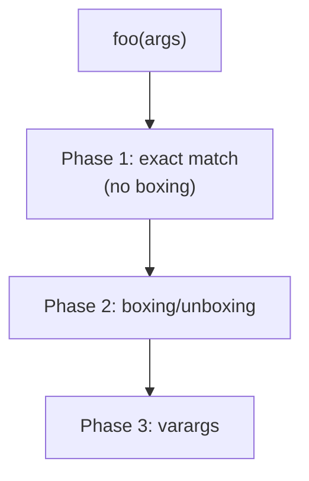

# Method Overload
> Part of [[Java/01_Core-Java/README|Core Java]]

> Method overloading is compile-time polymorphism: multiple methods in the same class share the same name but differ in parameter list (count, type, or order). Return type alone does NOT distinguish overloads.

## Why it Matters

Provide one intuitive name for operations that do conceptually the same thing on different inputs, `print(int)`, `print(String)`, `print(Object)`, letting the compiler pick the most specific applicable overload.

## Diagram



## Code

> **Java 25:** Overload resolution unchanged, most-specific selection, boxing/varargs, and `null` ambiguity rules identical. Use `var` for local type inference; overloads still cannot differ by return type alone.

Runnable Java 25, overload resolution including `null` ambiguity:
```java
public class MethodOverloadDemo {

 static void display(Object o) { System.out.println("Object: " + o); }
 static void display(String s) { System.out.println("String: " + s); }
 static void display(Integer i) { System.out.println("Integer: " + i); }

 // Overloads differing by arity
 static int add(int a, int b) { return a + b; }
 static double add(double a, double b) { return a + b; }
 static int add(int a, int b, int c) { return a + b + c; }

 public static void main(String[] args) {
 display("hello"); // picks String, most specific
 }
}
```
> **Rule for `null`:** `null` matches any reference type. Compiler picks the *most specific* common subtype. `null` with `Object`+`String` → `String`. With `String`+`Integer` (siblings) → **ambiguous → compile error**; disambiguate with a cast.

## When to use / not

| Use | Avoid |
|-----|-------|
| Same operation, varying input types/counts | Different semantics under same name, use distinct names |
| Builder-style convenience overloads | Excessive overloads that confuse callers, prefer varargs / builder |
| API ergonomics | When a single method with `Optional` / polymorphism handles it more cleanly |

## Trade-offs

- Cleaner, more discoverable API.
- Resolved at compile time, no runtime cost.
- Ambiguity with `null`, autoboxing, varargs can surprise.

## Vs

| Aspect | Overloading (compile-time) | Overriding (runtime) |
|--------|----------------------------|----------------------|
| Where | Same class | Subclass redefines superclass method |
| Signature | Must differ (params) | Must match exactly |
| Binding | Static (compiler) | Dynamic (JVM, virtual dispatch) |

## Pitfalls

- `null` ambiguity between sibling overloads.
- Autoboxing + widening interactions (`foo(long)` vs `foo(Integer)`).
- Varargs overloads can be accidentally selected, place varargs last and avoid mixing with same-arity overloads.
- Changing overload set in a library can silently change which overload callers bind to (binary compatibility risk).

---
*Category: Core-Java • java25*

## Interview q&a

**Q1. Can we overload by return type alone?**
No. `int foo()` and `String foo()` in same class is a compile error, parameters must differ.

**Q2. What happens when passing `null` to overloaded `foo(String)` and `foo(Integer)`?**
Compile error, ambiguous. Both are equally specific children of `Object`. Fix with `foo((String) null)` or `foo((Object) null)`.
Can we overload by return type alone?:: No. `int foo()` and `String foo()` in same class is a compile error, parameters must differ. #flashcard
What happens when passing `null` to overloaded `foo(String)` and `foo(Integer)`?:: Compile error, ambiguous. Both are equally specific children of `Object`. Fix with `foo((String) null)` or `foo((Object) null)`. #flashcard

## Related

- [[Classes]]
- [[Interface]]
- [[Java/01_Core-Java/Types/Abstract Class|Abstract Class]]
