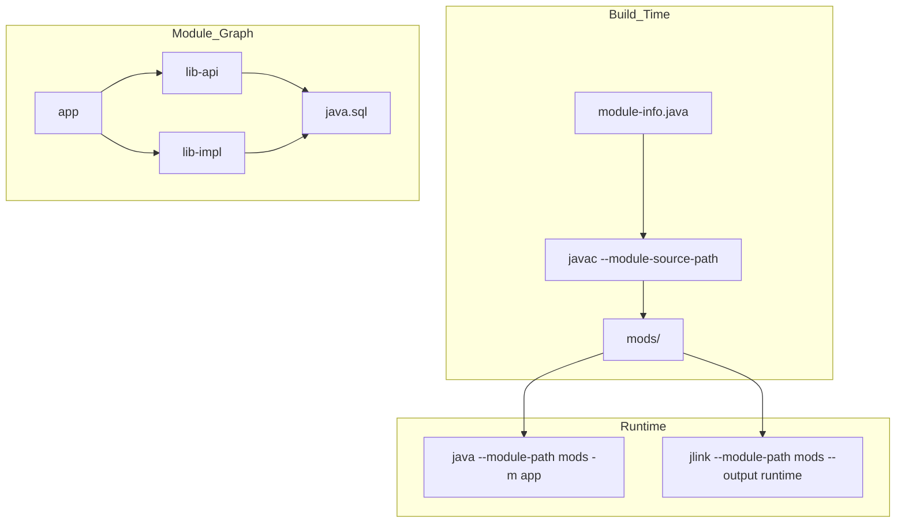

# Module System Deep Dive

> Part of [[README|Java MOC]] • `Java/01_Core-Java`
> 🎨 **Visual diagram:** Create Excalidraw drawing from template: `Cmd+P → Excalidraw: New from template → Java Diagram`

## Intent

The **Java Module System** (JPMS, JSR 376, Java 9+) provides **strong encapsulation**, **explicit dependency declaration**, and **configurable runtimes**. This note covers advanced module patterns, migration strategies, and tooling.

## Why it Matters

- **Encapsulation at scale**: `public` no longer means "visible to world"
- **Dependency hell solution**: explicit `requires` replaces classpath ambiguity
- **Custom runtimes**: `jlink` creates minimal images (40MB vs 200MB)
- **Service loading**: built-in `provides`/`uses` replaces `META-INF/services`
- **Migration path**: automatic modules, unnamed module, incremental adoption

## Diagram



## Code / Example

```java
// Java 25: Advanced module patterns

// 1. Qualified exports (whitebox testing)
module com.myapp {
    exports com.myapp.api;
    exports com.myapp.internal to com.myapp.test, com.myapp.integration;
    // com.myapp.internal visible ONLY to test modules
}

// 2. Open packages for reflection (Jackson, Hibernate, etc.)
module com.myapp {
    opens com.myapp.model to com.fasterxml.jackson.databind, org.hibernate.orm.core;
    // Deep reflection allowed ONLY for listed modules
}

// 3. Service provider interface (SPI)
module com.myapp.api {
    exports com.myapp.spi;
}

module com.myapp.impl {
    requires com.myapp.api;
    provides com.myapp.spi.PaymentProcessor
        with com.myapp.impl.StripeProcessor,
             com.myapp.impl.PayPalProcessor;
}

module com.myapp {
    requires com.myapp.api;
    uses com.myapp.spi.PaymentProcessor; // declares consumption
}

// 4. Multi-module project structure (Maven/Gradle)
// myapp/
//   pom.xml
//   api/
//     src/main/java/module-info.java
//     src/main/java/com/myapp/api/...
//   impl/
//     src/main/java/module-info.java
//     src/main/java/com/myapp/impl/...
//   app/
//     src/main/java/module-info.java
//     src/main/java/com/myapp/Main.java

// 5. Module resolution at runtime
// java --module-path mods -m com.myapp/com.myapp.Main
// java --module-path mods --add-modules com.myapp.api -m com.myapp/...

// 6. jlink custom runtime
// jlink --module-path mods --add-modules com.myapp --output myapp-runtime
// myapp-runtime/bin/java -m com.myapp/com.myapp.Main

// 7. Layered modules (advanced)
ModuleLayer.boot()
    .defineModulesWithOneLoader(cf -> cf.addModule("dynamic", ModuleFinder.of(modPath)),
        ModuleLayer.boot());
```

### Concrete Example

- **Input:** Monolithic Spring Boot app (200MB JDK + 50MB app)
- **Output:** `jlink` runtime 45MB; `com.myapp.internal` inaccessible to external modules
- **Explanation:** Module graph resolved at startup; missing `requires` = fast failure

## When to Use / When NOT

| **Use When** | **Avoid When** |
|--------------|----------------|
| - Large codebase needing clear boundaries | - Simple apps / microservices (single module) |
| - Library authors hiding implementation | - Heavy reflection on 3rd party libs |
| - Building minimal containers/images | - OSGi required (dynamic modules) |
| - Team wants compile-time dependency checks | - Rapid prototyping |

## Trade-offs

| Dimension | Explicit Modules | Automatic Modules | Unnamed Module (Classpath) |
|-----------|------------------|-------------------|---------------------------|
| Encapsulation | Full (`exports`) | None (all exported) | None |
| Dependencies | `requires` explicit | Auto from JAR name | Implicit |
| Reflection | `opens` controlled | All open | All open |
| jlink support | Yes | No | No |
| Migration effort | High | Low | None |

## Vs Table

| Aspect | JPMS | OSGi | Maven/Gradle | Classpath |
|--------|------|------|--------------|-----------|
| Versioning | Single version | Multi-version | Build-time | None |
| Dynamic install | No | Yes | No | No |
| Encapsulation | Compile+runtime | Runtime | Build | None |
| Tooling | `javac`/`java`/`jlink` | Bnd/Equinox | IDE/build | IDE |

## Pitfalls

- **Split packages**: same package in 2+ modules → compile error; fix: merge or rename
- **Reflection on internals**: `--add-opens java.base/java.lang=ALL-UNNAMED`
- **Automatic module naming**: JAR filename → module name; unstable if filename changes
- **Unnamed module reads all**: classpath code sees everything; modules can't see classpath
- **JavaFX/internal APIs**: `--add-exports java.desktop/com.sun.javafx=ALL-UNNAMED`

## Interview Q&A (Senior Depth)

**Q1. What is the core insight of the Module System, and why does it work?**
**A:** Classpath treats all `public` classes as globally visible, causing diamond dependencies and fragile encapsulation. Modules add a second dimension: `public` + `exports` = accessible. The module graph is a DAG resolved at startup, failing fast on cycles/missing deps.

**Q2. When would you choose `requires transitive`?**
**A:** When your public API *mentions* types from another module (return types, parameters, extends/implements). Consumers then implicitly read that dependency. Example: API returns `java.sql.Connection` → `requires transitive java.sql`.

**Q3. How does the module system handle services vs `ServiceLoader`?**
**A:** `ServiceLoader` still works but modules declare `provides X with Y` and `uses X` in `module-info.java`. This makes the contract explicit, verifiable at compile time, and the module system wires providers to consumers.

**Q4. Walk me through a non-obvious problem that reduces to the Module System.**
**A:** **Breaking a monolith incrementally**: use `jdeps --generate-module-info` to analyze, create modules bottom-up. `automatic modules` for 3rd party JARs. `opens` for Spring/Hibernate reflection. Test with `--dry-run` on module path before full switch.

**Q5. What is the memory/performance implication at scale?**
**A:** Module graph resolution: O(modules + edges) at startup. `jlink` strips unused modules (no `java.corba`, `java.xml.ws`, etc.) → 40-60MB runtime vs 200MB JDK. Class loading faster due to module-bound search (no classpath scan).

## Flashcards (Spaced Repetition)

#flashcard
**Q:** What does `exports` do in module-info.java? :: **A:** Makes a package accessible to modules that `require` this module. #flashcard

#flashcard
**Q:** Difference between `requires` and `requires transitive`? :: **A:** `transitive` re-exports the dependency to modules that require this module. #flashcard

#flashcard
**Q:** How to allow deep reflection on a package? :: **A:** `opens com.pkg to moduleA, moduleB` or `--add-opens` at runtime. #flashcard

#flashcard
**Q:** What is an automatic module? :: **A:** JAR on module path without module-info; name derived from JAR filename (e.g., `guava-32.0.jar` → `guava`). #flashcard

#flashcard
**Q:** What is the unnamed module? :: **A:** All classpath code; reads all modules but no module can read it. #flashcard

#flashcard
**Q:** How to create a custom runtime? :: **A:** `jlink --module-path mods --add-modules com.app --output runtime` #flashcard

## Practice Tasks (Tasks Plugin)

- [ ] Restate the intent from memory 📅 {{date:YYYY-MM-DD, +1}}
- [ ] Code the snippet without looking 📅 {{date:YYYY-MM-DD, +3}}
- [ ] Answer all Interview Q&A aloud 📅 {{date:YYYY-MM-DD, +7}}
- [ ] Review flashcards (Spaced Repetition) 📅 {{date:YYYY-MM-DD, +1}}

```tasks
not done
path includes Java/01_Core-Java
sort by due
limit 10
```

## Related

- [[README|Java MOC]]
- [[01_Core-Java/README|Core Java MOC]]
- [[Java/01_Core-Java/JPMS|JPMS Overview]]
- [[Java/09_Java-21-LTS/09 Foreign Function and Memory API|FFM API]]
- [[Java/08_Modern-Java/07 Flexible Constructors and Module Imports|Module Imports]]

---

*Category: Java/01_Core-Java • Part of [[README|Java MOC]] • Java 25*

## Problem

Classpath provides no encapsulation, leading to JAR conflicts, accidental internal API usage, and bloated deployments.

## Solution

Declare modules with `module-info.java`: `exports` for API, `requires` for dependencies, `opens` for reflection, `provides`/`uses` for services. Use `jlink` to create minimal runtimes.

## When not to use

| Instead | Use |
|---------|-----|
| Simple scripts / single JAR | Classpath (no module-info) |
| Need multiple versions of same library | OSGi / classloader isolation |
| Heavy reflection on third-party libs | `--add-opens` / classpath |
| Rapid prototyping | Single-module or classpath |