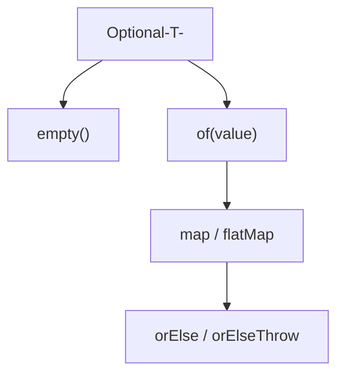

# Optional
> Part of [[Java/01_Core-Java/README|Core Java]]

> `Optional<T>` is a container that is either empty or holds one non-null `T`. It forces callers to handle absence explicitly, replacing `null` checks and `NullPointerException` risk with `map`/`flatMap`/`orElse` pipelines for null-safe composition.

## Why it Matters

Make absence explicit in the type system and eliminate `null`-related bugs. Instead of returning `null` and hoping the caller checks, return `Optional<T>` so the compiler and API guide the caller to `map`, `filter`, `orElse`/`orElseGet`, or `orElseThrow`.

Core ideas:
- **Creation**, `Optional.of` (non-null), `ofNullable` (nullable → empty), `empty()`.
- **Transformation**, `map`/`flatMap`/`filter` chain without unwrapping; `stream()` interop.
- **Unwrapping**, `orElse` vs `orElseGet` vs `orElseThrow` vs `ifPresentOrElse`, eager vs lazy, default vs exception.

## Diagram



## Code

> **Java 25:** Use `var`, `record`, `IO.println`, `List.of`, `toList()`, `SequencedCollection`, and `Optional` enhancements (`ifPresentOrElse` Java 9+, `orElseThrow()` no-arg, `stream()` Java 9+, `or` Java 9+).

Runnable Java 25, creation, `map`/`flatMap`, `orElse` vs `orElseGet`:
```java
import java.util.*;

record Address(String city, String zip) {}
record User(String name, Address address) {}

public class OptionalDemo {

 // Simulate repository, may return empty
 static Optional<User> findUser(String id) {
 var users = Map.of(
 "u1", new User("Asha", new Address("Bengaluru", "560001")),
 "u2", new User("Ben", null) // user with no address
 );
 }
}
```
Compile & run (Java 25):
```bash
javac OptionalDemo.java && java OptionalDemo
```
> **`orElse` vs `orElseGet`:** `orElse(value)` evaluates `value` eagerly (even when `Optional` is present); `orElseGet(supplier)` is lazy, supplier runs only if empty. Use `orElseGet` for expensive defaults or when the default has side effects.

## When to use / not

| Use | Avoid |
|-----|-------|
| Return type for methods that may have no result (`findById`, `parse`, `max`) | Fields, constructor/method parameters, or `List<Optional<T>>`, use nullable or separate type |
| Chaining null-safe transforms: `findUser(id).map(User::email).filter(...)` | `Optional` wrapping collections, return empty `List`/`Stream`, not `Optional<List>` |
| Stream pipelines: `stream.map(this::findById).flatMap(Optional::stream)` | Serialization / JPA entities / DTOs, `Optional` isn't `Serializable`-friendly and adds overhead |

## Trade-offs

- Forces handling of absence, API contract visible in return type, fewer `NullPointerException`s.
- Composable, `map`/`flatMap`/`filter`/`or` chain without nested `if (x != null)` ladders.
- Stream interop, `Optional.stream()` lets optionals participate in stream pipelines cleanly.

## Vs

**`Optional` Creation**

| Aspect | `Optional.of(value)` | `Optional.ofNullable(value)` | `Optional.empty()` |
|--------|----------------------|------------------------------|--------------------|
| Null input | Throws `NullPointerException` | Returns `empty()` | Always empty |
| Use | Value known non-null | Value may be null (map lookups, nullable fields) | Explicit empty return |
| Example | `Optional.of(user)` | `Optional.ofNullable(map.get(k))` | `return Optional.empty()` |
**Unwrapping: `orElse` vs `orElseGet` vs `orElseThrow`**

| Aspect | `orElse(defaultVal)` | `orElseGet(supplier)` | `orElseThrow(supplier)` / `orElseThrow()` |
|--------|----------------------|-----------------------|-------------------------------------------|
| Evaluation | Eager, default always created | Lazy, supplier only if empty | Lazy, exception only if empty |
| Performance | Wastes work if present and default is expensive | Efficient for expensive defaults | Fail-fast |
| Side effects | Always executes | Only on empty | Only on empty |
**`map` vs `flatMap`**

| Aspect | `map(Function<T,R>)` | `flatMap(Function<T, Optional<R>>)` |
|--------|----------------------|-------------------------------------|
| Mapper returns | Plain `R`, auto-wrapped to `Optional<R>` | Already `Optional<R>`, flattened |
| Nesting | `map` on `Optional`-returning fn gives `Optional<Optional<R>>` | Keeps single `Optional<R>` |
| Use | `opt.map(String::toUpperCase)` | `opt.flatMap(this::findAddress)` |

## Pitfalls

- **Calling `get()` without check**, `opt.get()` throws `NoSuchElementException` if empty. Use `orElseThrow(() -> new ...)` with a message, or `orElse`/`orElseGet`. Many codebases forbid `Optional.get()` via static analysis.
- **Using `orElse` with expensive default**, `opt.orElse(loadFromDB())` always hits DB. Use `orElseGet(() -> loadFromDB())` for laziness.
- **`Optional` fields / params / `List<Optional<T>>`**, anti-pattern; adds wrapper overhead, breaks serialization, complicates callers. Use nullable fields with `ofNullable` at return boundary, or empty collections instead of `Optional<List>`.
- **`Optional.of(null)` NPE**, wrapping a nullable value with `of` instead of `ofNullable` crashes. Default to `ofNullable` for uncertain inputs.
- **`isPresent()` + `get()` imperative style**, `if (opt.isPresent()) { opt.get().do() }` defeats the purpose. Prefer `ifPresent`, `ifPresentOrElse`, `map`, `orElse`, `or`.
- **Forgetting `map` auto-wraps null to empty**, `opt.map(x -> null)` returns `empty()`, not `Optional.of(null)`, can hide bugs where mapper unexpectedly returns null.
- **Assigning `null` to `Optional` variable**, `Optional<String> o = null` is legal Java but breaks every `Optional` guarantee. Never do it; return `Optional.empty()` instead.
- **Using `Optional` in `equals`/`hashCode` without `isPresent` care**, ensure consistent handling; often better to unwrap first.

## Interview q&a

**Q1. Why does `Optional.of(null)` throw but `ofNullable(null)` returns empty?**
`of` is a strict assertion, "I know this is non-null, fail fast if I'm wrong", so it throws `NPE` immediately to catch bugs. `ofNullable` is the lenient bridge from nullable legacy code: it converts `null` to `empty()` so callers can chain safely. Use `of` for invariants, `ofNullable` for values from maps, nullable fields, or external APIs.

**Q2. When do you need `flatMap` instead of `map` on an `Optional`?**
When the mapping function itself returns an `Optional`. `map` would wrap that result again → `Optional<Optional<R>>`. `flatMap` flattens it to `Optional<R>`. Example: `findUser(id)` returns `Optional<User>`, `findAddress(user)` returns `Optional<Address>`, so `findUser(id).map(this::findAddress)` nests, while `.flatMap(this::findAddress)` is correct. Same intuition as `Stream.flatMap`.
Why does `Optional.of(null)` throw but `ofNullable(null)` returns empty?:: `of` is a strict assertion, "I know this is non-null, fail fast if I'm wrong", so it throws `NPE` immediately to catch bugs. `ofNullable` is the lenient bridge from nullable legacy code: it converts `null` to `empty()` so callers can chain safely. Use `of` for invariants, `ofNullable` for values from maps, nullable fields, or external APIs. #flashcard
When do you need `flatMap` instead of `map` on an `Optional`?:: When the mapping function itself returns an `Optional`. `map` would wrap that result again → `Optional<Optional<R>>`. `flatMap` flattens it to `Optional<R>`. Example: `findUser(id)` returns `Optional<User>`, `findAddress(user)` returns `Optional<Address>`, so `findUser(id).map(this::findAddress)` nests, while `.flatMap(this::findAddress)` is correct. Same intuition as `Stream.flatMap`. #flashcard

## Related

- [[Lambdas and Functional Interfaces]], `map`/`flatMap`/`filter` take functional arguments
- [[Streams API]], `Optional.stream()`, `findFirst`/`findAny` return `Optional`
- [[Generics]], `Optional<T>` generics and variance
- [[Exception Handling]], `orElseThrow` vs checked exceptions
- [[Java/03_Collections/README|Collections]], prefer empty `List` over `Optional<List>`

---
*Category: Core-Java*
