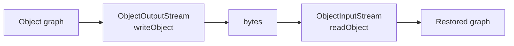

# Serialization
> Part of [[Java/01_Core-Java/README|Core Java]]

> Serialization converts a Java object's state into a byte stream (via `ObjectOutputStream`) so it can be persisted to disk, sent over the network, or cached, and later reconstructed via `ObjectInputStream` (deserialization). It is the foundation for RMI, HTTP session replication, and deep-copy via bytes.

## Why it Matters

Provide object persistence and transport without manual field-by-field marshalling. The JVM flattens an object graph (including nested objects and `transient`-filtered fields) to bytes and rebuilds it identically on the same or another JVM, preserving identity, types, and graph structure.

Core mechanisms:
- **Serializable**, marker interface; JVM handles serialization automatically via reflection.
- **serialVersionUID**, version fingerprint; checked on deserialization to ensure class compatibility.
- **transient**, field-level opt-out; excluded from the byte stream.
- **Custom `writeObject` / `readObject`**, hooks to control/encrypt/validate the stream.
- **Externalizable**, manual alternative; class controls the entire binary format via `writeExternal` / `readExternal`.

## Diagram



## Code

> **Java 25:** Compact Object Headers (JEP 450, enabled by default) reduce heap size of deserialized object graphs (~15-20% smaller headers, 8 bytes vs 12-16). Serialized **stream format unchanged**, `serialVersionUID`/`transient`/`Externalizable` rules identical. Harden deserialization with `ObjectInputFilter` (JEP 290); prefer JSON/Protobuf for cross-language.

Runnable Java 25, covers `Serializable` + `serialVersionUID` + `transient` + custom `writeObject`/`readObject` + `Externalizable`:
```java
import java.io.*;

// Serializable — controls what gets persisted (transient/static excluded)
class User implements Serializable {
 private static final long serialVersionUID = 1L;
 private String username;
 private transient String password; // not serialized — sensitive
 static String ORIGIN = "WEB"; // class state, never serialized
 private int age;
}
```
> **Rules enforced by the spec:**
> - `writeObject`/`readObject` must be `private` with exact signatures, otherwise they are ignored (treated as normal methods).
> - `Externalizable` needs a `public` no-arg constructor, deserialization calls it before `readExternal`.
> - Only non-`static`, non-`transient` fields participate by default; `transient` and `static` are skipped. `final` fields *are* serialized (value at serialization time).
> - Parent class fields are serialized only if the parent is `Serializable`; otherwise the parent's no-arg constructor runs on deserialization.
> - `serialVersionUID` defaults to a hash of class structure if not declared, any field/method change breaks compatibility with `InvalidClassException`.

## When to use / not

| Use | Avoid |
|-----|-------|
| Persisting objects to file / DB BLOB / cache (HttpSession, Redis) | Modern wire formats, prefer JSON (Jackson), Protobuf, Avro for APIs (smaller, cross-language, version-tolerant) |
| RMI / JMS `ObjectMessage` / EJB passivation / Spark shuffles | Security-sensitive deserialization of untrusted bytes, Java serialization is a known attack vector (gadget chains) |
| Deep-clone via `serialize → deserialize` | Large or frequently-changing DTOs, brittle without explicit `serialVersionUID` |

## Trade-offs

- Zero boilerplate for simple persistence, just `implements Serializable`.
- Preserves full object graph including cycles and polymorphism.
- Custom hooks (`writeObject`/`readObject`, `writeReplace`/`readResolve`) allow encryption, validation, and singleton protection.

## Vs

## Pitfalls

- **Missing `serialVersionUID`**, adding a method breaks old `.ser` files with `InvalidClassException`; always declare it explicitly.
- **`writeObject` not `private`**, wrong visibility/signature means it is silently ignored; default serialization runs and invariants break.
- **Forgetting `transient` on sensitive or non-serializable fields**, leaks passwords, or throws `NotSerializableException` for `Socket`/`Thread`/`Stream`.
- **Assuming `static` is serialized**, mutating `static` after serialization gives surprising restored values; never rely on it.
- **Deserializing untrusted input**, critical RCE vector; validate with `ObjectInputFilter` (`ObjectInputFilter.Config.createFilter`) or avoid Java serialization entirely on network boundaries.
- **Parent not `Serializable`**, parent fields are reset via its no-arg constructor on deserialization; if it lacks one → `InvalidClassException`.
- **Wrong order in `Externalizable`**, `writeExternal` / `readExternal` must be symmetric; mismatched order corrupts the stream silently.
- **Breaking singleton / enum via serialization**, deserialization creates a new instance; fix with `readResolve()` returning the singleton, or prefer `enum` (serialization-safe by design).
- **Forgetting `transient` but writing manually and not reading symmetrically**, stream corruption / `EOFException`.
- **Serializing large graphs**, entire reachable graph is written; accidental reference to a big cache can blow up payload size.

## Interview q&a

**Q1. Why is `serialVersionUID` needed? What happens if you don't declare it?**
Without an explicit `serialVersionUID`, the JVM computes one from class structure (fields, methods, modifiers, interfaces) via `SHA`. Any change, adding a field, changing a modifier, yields a different hash, and deserialization of old bytes throws `InvalidClassException`. Declaring `private static final long serialVersionUID = 1L;` freezes the version; you control compatibility. Bump it only for breaking changes. Tools like `serialver` generate it.

**Q2. What does `transient` do? Is `transient` vs `static` the same?**
`transient` excludes an instance field from serialization; `static` fields are never serialized because they belong to the class, not the object. Both are skipped, but differently: `transient` is per-field opt-out you can still serialize manually in `writeObject`; `static` reflects the class's current state at deserialization time. They are not interchangeable.
Why is `serialVersionUID` needed? What happens if you don't declare it?:: Without an explicit `serialVersionUID`, the JVM computes one from class structure (fields, methods, modifiers, interfaces) via `SHA`. Any change, adding a field, changing a modifier, yields a different hash, and deserialization of old bytes throws `InvalidClassException`. Declaring `private static final long serialVersionUID = 1L;` freezes the version; you control compatibility. Bump it only for breaking changes. Tools like `serialver` generat... #flashcard
What does `transient` do? Is `transient` vs `static` the same?:: `transient` excludes an instance field from serialization; `static` fields are never serialized because they belong to the class, not the object. Both are skipped, but differently: `transient` is per-field opt-out you can still serialize manually in `writeObject`; `static` reflects the class's current state at deserialization time. They are not interchangeable. #flashcard

## Related

- [[Classes]], class basics; where `implements Serializable` is declared
- [[Interface]], `Serializable` and `Externalizable` are interfaces (marker vs contract)
- [[Inheritance]], serialization walks the inheritance chain; non-serializable parent constructor behavior
- [[Java/01_Core-Java/Types/Singleton Class|Singleton Class]], `readResolve()` to preserve singleton on deserialization
- [[JVM Memory Model]], why static state is not part of object bytes
- [[Exception Handling]], `NotSerializableException`, `InvalidClassException`, `InvalidObjectException`

---
*Category: Core-Java • java25*

### 1. Serializable vs Externalizable

| Aspect | Serializable (marker) | Externalizable (`extends Serializable`) |
|--------|----------------------|----------------------------------------|
| Interface | `Serializable`, no methods | `Externalizable`, `writeExternal(ObjectOutput)` + `readExternal(ObjectInput)` |
| Control | Automatic, JVM writes all non-transient/non-static fields via reflection | Manual, class writes every field explicitly, in order |
| Constructor | No-arg constructor not required / not called | Requires `public` no-arg constructor (called on deserialization) |

### 2. Transient vs Static (Serialization Behavior)

| Aspect | `transient` | `static` |
|--------|-------------|----------|
| Belongs to | Instance field | Class (one copy per ClassLoader) |
| Serialized? | No, explicitly excluded from stream | No, never part of object state |
| Restored on deserialization | Default value (`null`/`0`/`false`); re-init in `readObject` if needed | Retains current JVM value (whatever `Class` holds at that time) |
> **Final fields** are serialized (they are instance state). `transient final` is allowed but deserialized to default, rarely useful.
