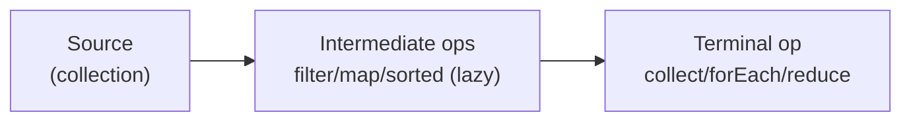

# Streams api
> Part of [[Java/01_Core-Java/README|Core Java]]

> The Streams API processes sequences of elements declaratively, `filter`/`map`/`reduce` pipelines that describe *what* to compute, not *how* to loop. Streams are lazy, non-mutating, and one-shot; collectors materialize results and parallel streams split work via ForkJoin.

## Why it Matters

Turn imperative loops (`for` + `if` + accumulator) into composable, readable pipelines with lazy evaluation and easy parallelism. Streams separate *data source* → *intermediate ops* (lazy) → *terminal op* (eager) so transformations fuse and short-circuit without mutating the source.

Core ideas:
- **Lazy intermediate ops** (`filter`, `map`, `sorted`, `distinct`) build the pipeline; nothing runs until a terminal op.
- **Eager terminal ops** (`collect`, `forEach`, `reduce`, `count`, `findFirst`) trigger execution and consume the stream (one-shot).
- **Collectors & parallelism**, `Collectors` materialize results; `parallelStream()`/`parallel()` splits work but requires stateless, non-interfering functions.

## Diagram



## Code

> **Java 25:** Use `var`, `record`, `IO.println`, `List.of`, `toList()` (unmodifiable, Java 16+), and `SequencedCollection` (`reversed()`, `getFirst`/`getLast`) where relevant. `Stream.toList()` replaces `collect(toList())` for simple lists.

Runnable Java 25, creation, intermediate/terminal ops, collectors, parallel:
```java
import java.util.*;
import java.util.stream.*;

record Employee(String name, String dept, int salary) {}

public class StreamsDemo {
 public static void main(String[] args) {
 var employees = List.of(
 new Employee("Asha", "Eng", 120_000),
 new Employee("Ben", "Eng", 110_000),
 new Employee("Cara", "HR", 90_000),
 new Employee("Dan", "HR", 95_000),
 new Employee("Eva", "Eng", 130_000)
 }
}
```
Compile & run (Java 25):
```bash
javac StreamsDemo.java && java StreamsDemo
```
> **Primitive streams** (`IntStream`, `LongStream`, `DoubleStream`) avoid boxing, prefer `mapToInt`/`sum`/`average` over `Stream<Integer>` for numeric work. Use `boxed()` only at boundaries.

## When to use / not

| Use | Avoid |
|-----|-------|
| Transforming/filtering/aggregating collections declaratively (`map`, `filter`, `groupingBy`) | Simple single `for` loop with side effects, imperative is clearer |
| Chaining operations: filter → map → sort → collect | Mutating source inside pipeline (`forEach(list::add)`), use `collect` or explicit loop |
| Aggregations: count, sum, grouping, partitioning, joining | Checked-exception-heavy logic, lambdas don't throw checked; wrapping is ugly |

## Trade-offs

- Declarative and composable, pipeline reads as intent, not loop mechanics.
- Lazy fusion, multiple intermediate ops execute in a single pass; short-circuiting (`findFirst`, `limit`, `anyMatch`) avoids full traversal.
- Easy parallelism, `parallelStream()` with no structural code change (when stateless).

## Vs

**Stream vs Loop vs Collector**

| Aspect | Stream pipeline | Imperative loop | Collector |
|--------|----------------|-----------------|-----------|
| Style | Declarative, what to compute | Imperative, how to iterate | Materialization strategy |
| Laziness | Lazy intermediates, fused | Eager per iteration | Eager (terminal) |
| Mutation | Non-mutating, source untouched | Often mutates accumulator/list | Produces new collection/value |
**Intermediate vs Terminal Operations**

| Aspect | Intermediate (`filter`, `map`, `sorted`, `distinct`, `flatMap`, `peek`, `limit`) | Terminal (`collect`, `forEach`, `reduce`, `count`, `findFirst`, `anyMatch`, `toList`) |
|--------|--------------------------------------------------------------------------------------|------------------------------------------------------------------------------------------|
| Returns | New `Stream` (lazy) | Non-stream result or void (eager) |
| Execution | Deferred until terminal | Triggers pipeline |
| Short-circuiting | `limit`, `skip` can short-circuit | `findFirst`, `anyMatch` short-circuit |
**Sequential vs Parallel Streams**

| Aspect | Sequential (`stream()`) | Parallel (`parallelStream()` / `stream().parallel()`) |
|--------|------------------------|------------------------------------------------------|
| Thread | Single thread | ForkJoinPool.commonPool() |
| Order | Preserves encounter order | Unordered unless `forEachOrdered` / ordered collector |
| When to use | Default; small data, IO, ordered | Large (10k+), CPU-bound, stateless ops |

## Pitfalls

- **Reusing a stream**, `var s = list.stream(); s.count(); s.filter(...).toList()` throws `IllegalStateException: stream has already been operated upon`. Always call `list.stream()` fresh.
- **Mutating source inside pipeline**, `list.stream().forEach(list::add)` or modifying `employees` during stream causes `ConcurrentModificationException` or undefined results. Use `collect` / `toList()` to produce new collections.
- **Stateful lambda in parallel**, `List<Integer> seen = new ArrayList<>(); list.parallelStream().peek(seen::add)...` races. Lambdas must be stateless and side-effect-free (except `forEach` as terminal side effect).
- **Forgetting `toList()` is unmodifiable**, `stream.toList().add(x)` throws `UnsupportedOperationException`. Wrap with `new ArrayList<>(stream.toList())` or `collect(Collectors.toList())` if mutation needed.
- **Boxing via `Stream<Integer>`**, `list.stream().mapToInt(Integer::intValue).sum()` not `Stream<Integer>` reduce; use `IntStream`/`LongStream` for numerics.
- **`peek` as logic**, `peek` is for debugging only; don't rely on it for business logic, it may be elided if no terminal, and is intermediate not terminal.
- **Infinite streams without short-circuit**, `Stream.generate(...).filter(...).toList()` never terminates without `limit`/`findFirst`.
- **Ordering assumptions in parallel**, `parallelStream().forEach(System.out::println)` is unordered; use `forEachOrdered` if order matters, at a performance cost.

## Interview q&a

**Q1. Why are streams one-shot and what does laziness buy you?**
A stream holds a pipeline, not data. Intermediate ops just compose; no element flows until a terminal op pulls, so `filter→map→limit` fuses into a single pass and `findFirst` stops after the first match (`limit(10)` on infinite `iterate` doesn't hang). After a terminal op the stream is consumed, calling another terminal throws `IllegalStateException`. Keep the source (`List`) and call `list.stream()` again instead of storing the stream.

**Q2. What makes a stream pipeline safe for `parallel()` and when does parallel hurt?**
Parallel splits via Spliterator + ForkJoin; ops must be *non-interfering* (don't modify source), *stateless* (lambda result depends only on input, no shared mutable state), and *associative* for `reduce`. Use parallel for large, CPU-bound, statically-sized sources (`ArrayList`, arrays, `IntStream.range`). Avoid for small n (split overhead dominates), IO-bound, ordered-sensitive (`findFirst` serializes), or boxing-heavy pipelines. Measure, parallel is often slower.
Why are streams one-shot and what does laziness buy you?:: A stream holds a pipeline, not data. Intermediate ops just compose; no element flows until a terminal op pulls, so `filter→map→limit` fuses into a single pass and `findFirst` stops after the first match (`limit(10)` on infinite `iterate` doesn't hang). After a terminal op the stream is consumed, calling another terminal throws `IllegalStateException`. Keep the source (`List`) and call `list.stream()` again instead of storing the stream. #flashcard
What makes a stream pipeline safe for `parallel()` and when does parallel hurt?:: Parallel splits via Spliterator + ForkJoin; ops must be *non-interfering* (don't modify source), *stateless* (lambda result depends only on input, no shared mutable state), and *associative* for `reduce`. Use parallel for large, CPU-bound, statically-sized sources (`ArrayList`, arrays, `IntStream.range`). Avoid for small n (split overhead dominates), IO-bound, ordered-sensitive (`findFirst` serializes), or boxing-heavy pipelines. Measure, para... #flashcard

## Related

- [[Lambdas and Functional Interfaces]], lambdas/method refs that feed streams
- [[Optional]], `Optional.stream()` interop and `findFirst` returns `Optional`
- [[Java/03_Collections/README|Collections]], `List.of`, `SequencedCollection`, source of streams
- [[Generics]], `Stream<T>`, `Collector<T,A,R>` generics and PECS
- [[Exception Handling]], checked exceptions in stream lambdas

---
*Category: Core-Java*
