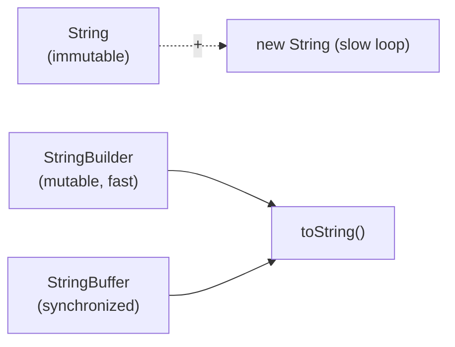

# String Handling
> Part of [[Java/01_Core-Java/README|Core Java]]

> Strings in Java are immutable sequences of characters backed by `java.lang.String`. `StringBuilder` and `StringBuffer` provide mutable alternatives for efficient string manipulation.

## Why it Matters

Provide efficient, safe text manipulation in Java. `String` guarantees immutability for security, thread-safety, and string-pool sharing; `StringBuilder`/`StringBuffer` allow in-place mutation to avoid excessive object creation in loops and concatenations.

## Diagram



## Code

> **Java 25:** Compact Strings (Java 9+) retained, `String` still `byte[] + coder`; Compact Object Headers (JEP 450) shrink object header from 12, 16 bytes to 8 bytes, so each `String`/`StringBuilder` is ~15-20% smaller in heap. No API change; `STR.` String Templates remain preview, prefer `String.formatted()` / `StringBuilder` in production.

Runnable Java 25, shows immutability, string pool, and `StringBuilder` vs `StringBuffer`:
```java
public class StringHandlingDemo {
 public static void main(String[] args) {
 // Immutability and pool — Strings share literals, methods return new objects
 String s1 = "hello";
 String s2 = s1.concat(" world");
 System.out.println("s1 = " + s1);
 System.out.println("s2 = " + s2);
 System.out.println("s1 == s2 ? " + (s1 == s2)); // false — different refs

 String a = "java";
 String b = "java";
 String c = new String("java");
 }
}
```
Compile & run (Java 25):
```bash
javac StringHandlingDemo.java && java StringHandlingDemo
```

## When to use / not

| Use | Avoid |
|-----|-------|
| `String` for fixed text, keys, constants, and when immutability/thread-safety matters | `String` concatenation in tight loops (`for` + `+=` creates O(n²) objects), use `StringBuilder` |
| `StringBuilder` for single-threaded dynamic building (loops, SQL/JSON assembly) | `StringBuffer` when no cross-thread sharing, its `synchronized` overhead is unnecessary |
| `StringBuffer` for mutable strings shared across threads (legacy) | `StringBuffer` as default builder, prefer `StringBuilder` |

## Trade-offs

- `String` immutability enables string-pool sharing, safe `HashMap`/`HashSet` keys, and thread-safety without synchronization.
- `String` is `final`, cannot be subclassed; security-sensitive (class names, passwords handled safely).
- `StringBuilder` avoids O(n²) copies on repeated concatenation; O(n) amortized.

## Vs

| Aspect | String | StringBuilder | StringBuffer |
|--------|--------|---------------|--------------|
| Mutability | Immutable, every change creates new object | Mutable, in-place append/insert/delete | Mutable, in-place |
| Thread-safety | Yes (immutable, implicitly safe) | No (not synchronized) | Yes (all methods `synchronized`) |
| Performance | Slow for repeated concat in loops | Fast (no sync overhead) | Slower than Builder due to synchronization |

## Pitfalls

- Using `==` instead of `.equals()` for string comparison, breaks for non-pooled strings.
- Concatenating with `+` / `+=` inside loops, use `StringBuilder` explicitly.
- Calling `new String("literal")` unnecessarily, defeats pooling; just use the literal.
- Forgetting `String` methods don't mutate: `s.toUpperCase();` without assignment does nothing, `s = s.toUpperCase();` is required.
- Using `StringBuffer` by default, `StringBuilder` is faster and preferred unless sharing across threads.
- Overusing `intern()` on unbounded input, can cause `OutOfMemoryError` or long GC pauses (pool is a GC root).
- Comparing strings with `equals` without null guard, use `"constant".equals(variable)` or `Objects.equals(a, b)`.

## Interview q&a

**Q1. Why is String immutable in Java?**
Immutability enables (1) **string pool** sharing, literals reuse the same object safely; (2) **security**, class names, file paths, and network params passed as `String` cannot be altered by callee; (3) **thread-safety** without synchronization; (4) **hashCode caching**, computed once and cached, making `String` ideal for `HashMap` keys; (5) **class-loading safety**, `String` is `final` so it cannot be subclassed to break invariants. Internally (Java 9+ compact strings) it stores a `final byte[]` + `coder`.

**Q2. What is the String Constant Pool and how does `intern()` work?**
The pool is a special heap area (part of heap since Java 7) that stores one copy of each distinct string literal and interned string. Literals (`"java"`) are auto-interned at class loading. `new String("java")` creates a separate heap object; calling `intern()` returns the canonical pool reference (adding it if absent). `a == b` is `true` for pool-shared literals but `false` vs a `new String` until `intern()` is used. Use `intern()` sparingly, it trades memory savings for pool-lookup cost.
Why is String immutable in Java?:: Immutability enables (1) **string pool** sharing, literals reuse the same object safely; (2) **security**, class names, file paths, and network params passed as `String` cannot be altered by callee; (3) **thread-safety** without synchronization; (4) **hashCode caching**, computed once and cached, making `String` ideal for `HashMap` keys; (5) **class-loading safety**, `String` is `final` so it cannot be subclassed to break invariants. Internall... #flashcard
What is the String Constant Pool and how does `intern()` work?:: The pool is a special heap area (part of heap since Java 7) that stores one copy of each distinct string literal and interned string. Literals (`"java"`) are auto-interned at class loading. `new String("java")` creates a separate heap object; calling `intern()` returns the canonical pool reference (adding it if absent). `a == b` is `true` for pool-shared literals but `false` vs a `new String` until `intern()` is used. Use `intern()` sparingly,... #flashcard

## Related

- [[Classes]]
- [[Interface]]
- [[Java/01_Core-Java/Types/Immutable Class|Immutable Class]]
- [[Java/01_Core-Java/Types/Wrapper Class|Wrapper Class]]
- [[Method Overload]]

---
*Category: Core-Java • Part of [[README|Java MOC]] • java25*
